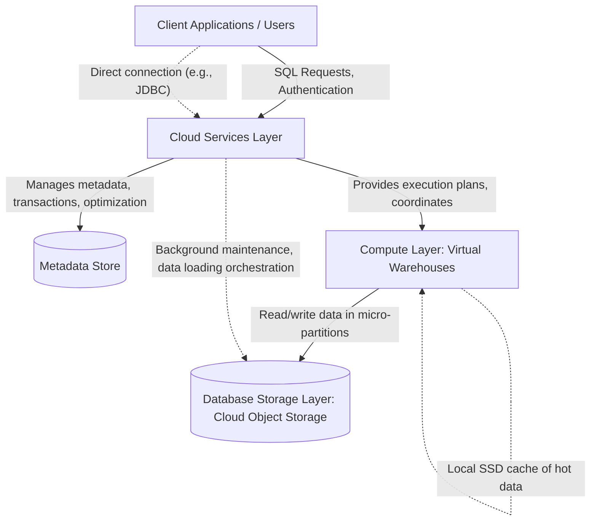
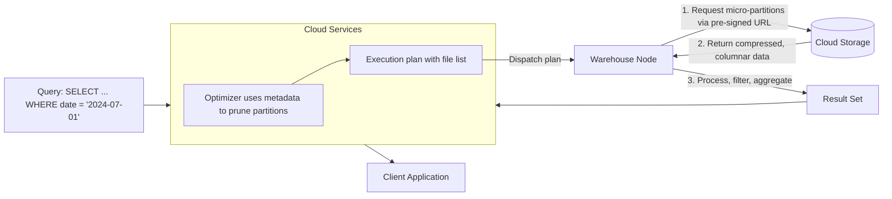

# Architecture Layers

In this section we are going to look at the architecture layers of snowflake

## Overview
  - Snowflake’s architecture is built on three distinct, decoupled layers: Cloud Services, Compute, and Database Storage
  - Each layer scales independently, ensuring elasticity, cost efficiency, and workload isolation
  - This separation of concerns allows users to pay only for storage used and compute consumed, with the intelligence of the platform centralized in the Cloud Services layer
  - The architecture is consistent across Amazon Web Services, Microsoft Azure, and Google Cloud Platform

## Cloud Services Layer
  - Core role: The central nervous system that coordinates every operation across the platform
  - Key functions
    - Authentication and access control (MFA, SSO, OAuth, RBAC)
    - Query parsing, semantic analysis, and cost-based optimization
    - Metadata management for all objects (databases, schemas, tables, views, stages, etc.)
    - Transaction coordination with ACID compliance and MVCC
    - Infrastructure orchestration (warehouse provisioning, auto-scaling, Snowpipe, background maintenance)
    - Security and governance policy enforcement (data masking, row access, object tagging)
  - Managed entirely by Snowflake; always on, stateless compute instances fronting a durable metadata store
  - Enables zero-copy cloning, time travel, and data sharing purely through metadata operations without copying data
  - Result cache: Reused identical queries served directly from this layer, bypassing compute
  - Metering: Mostly free; serverless features (automatic clustering, materialized view maintenance, etc.) consume credits

## Compute Layer
  - Core role: The execution engine consisting of one or more virtual warehouses
  - Virtual warehouses are clusters of compute nodes that process queries, data loading, and DML
  - Key characteristics
    - Sized from X-Small (1 node) to 6X-Large (512 nodes); doubling size generally halves linear query time for same cost
    - Per-second billing with 60-second minimum; auto-suspend stops credits after idle period
    - Auto-resume starts warehouse automatically on query submission
    - Multi-cluster warehouses scale out automatically to handle concurrency spikes without queue buildup
  - Caching
    - Local SSD cache holds micro-partitions fetched from storage, drastically speeding up repeated scans on the same warehouse
    - Cache is invalidated when underlying data changes; cleared on warehouse suspension
  - Isolation: Each warehouse is an independent compute pool; workloads are separated to prevent interference (ETL vs. reporting)
  - Serverless compute: Background operations like Snowpipe and clustering use serverless credits without a user-managed warehouse

## Database Storage Layer
  - Core role: Persistent, durable repository for all table data
  - Data is stored as immutable, compressed, columnar micro-partitions in cloud object storage (S3, Azure Blob, GCS)
  - Key features
    - Automatic AES-256 encryption at rest and TLS in transit
    - High compression ratios tailored per column
    - 11 nines durability via internal replication across fault domains
    - Billed monthly based on compressed data size; no capacity management needed
  - Micro-partition metadata (min/max values, distinct counts) enables partition pruning without scanning files
  - Supports time travel (user-configurable up to 90 days) and fail-safe (additional 7 days) for data recovery
  - Zero-copy cloning creates instant, metadata-only copies sharing the same underlying micro-partitions
  - Automatic clustering and background compaction optimize physical layout transparently
  - Storage access: Only via Snowflake compute, never direct file system access; passes pre-signed URLs to warehouse nodes

## How the Layers Interact (Query Lifecycle)
  1. User submits SQL to the Cloud Services endpoint
  2. Cloud Services authenticates, parses, resolves objects, and generates an optimized execution plan using metadata
  3. Plan is dispatched to an active virtual warehouse (Compute layer)
  4. Warehouse nodes fetch only required micro-partitions from cloud storage, applying pruning based on metadata
  5. Data is processed in parallel using local caches; intermediate results are shuffled between nodes
  6. Results are returned to Cloud Services, which may cache them (result cache) and sends final output to the client
  7. DDL, cloning, and show commands execute entirely within Cloud Services without a warehouse

### Diagram: Complete Three-Layer Architecture

### Diagram: Micro-Partition Data Flow During Query

## Design Principles Beneath the Layers
  - Full separation of storage and compute: data persists without compute; multiple independent compute clusters can share same data
  - Centralized metadata enables instant operations (clone, time travel, shares) and global optimization
  - Stateless compute nodes with local caching allow suspend/resume and elastic scaling without data loss
  - Immutable micro-partitions guarantee data consistency and simplify concurrency control

## Summary
  - The Cloud Services layer provides intelligence and coordination
  - The Compute layer provides elastic, isolated processing power via virtual warehouses
  - The Database Storage layer provides durable, highly optimized data persistence
  - Together, they form the foundation of Snowflake’s AI Data Cloud, enabling secure, scalable, and near-zero maintenance analytics
