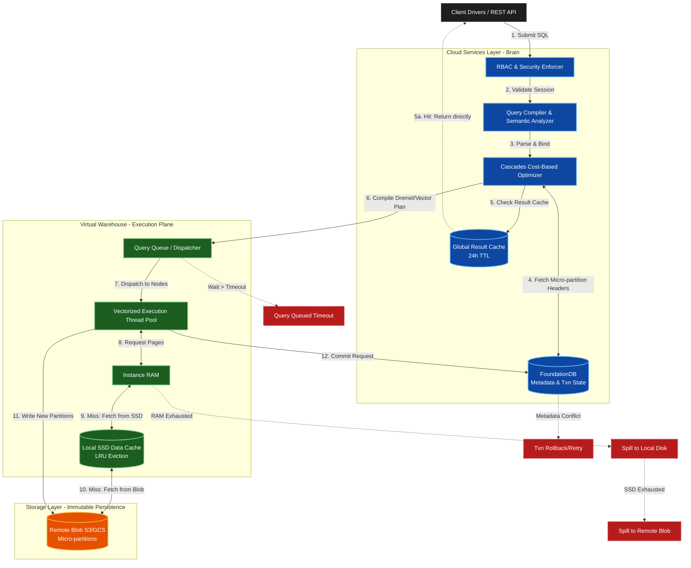

# Snowflake Architecture Deep Dive: Internals, Execution, and Reliability

This document provides a production-grade, expert-level technical analysis of the Snowflake Data Cloud architecture. It strictly focuses on distributed execution internals, transactional boundaries, memory/I/O mechanics, and platform reliability engineering.

## 1. Execution Flow, Component Interactions, and Failure Paths

The following Mermaid diagram maps the end-to-end execution lifecycle of a query, detailing metadata consensus, vectorized execution, cache hit/miss paths, and memory exhaustion failovers.



## 2. Execution Internals & Transactional Boundaries


### 2.1 Metadata Consensus and Transaction Control (FoundationDB)
Snowflake does not use locking on actual data files. It employs Multi-Version Concurrency Control (MVCC) with **Snapshot Isolation (SI)** via FoundationDB (a globally distributed, ACID-compliant key-value store).
*   **Micro-Partition Immutability**: All DML operations (INSERT, UPDATE, DELETE, MERGE) write entirely *new* micro-partitions (immutable 16MB–64MB uncompressed columnar files). 
*   **The Commit Protocol**: A "commit" is strictly a metadata pointer swap in FoundationDB. FDB operates as the single source of truth. When a transaction commits, the active table version pointer is atomically updated to include the new micro-partitions and exclude the old ones. 
*   **Failure Recovery**: If a compute node dies mid-query, the uncommitted micro-partitions written to cloud storage are orphaned and eventually garbage-collected by a background CSL process. There is zero risk of dirty reads.

### 2.2 Query Compilation and Optimizer Mechanics
The Cost-Based Optimizer (CBO) relies exclusively on micro-partition metadata (Min/Max values, NULL counts, distinct counts). 
*   **Pruning**: Pushed-down predicates (e.g., `WHERE date = '2026-05-02'`) eliminate partition scans entirely at the CSL layer before compute nodes are even engaged.
*   **Join Reordering**: The CBO utilizes Cascades optimization to determine join order based on table cardinalities cached in FDB.

### 2.3 Compute Thread Allocation and Memory Model
Snowflake virtual warehouses consist of clusters of homogenous EC2/VM instances. Execution is **vectorized** and **columnar**.
*   **Thread Pools**: A standard query uses multiple threads. However, Snowflake caps thread allocation per query to prevent noisy neighbor monopolization within the warehouse. By default, a warehouse runs up to 8 concurrent queries (`MAX_CONCURRENCY_LEVEL`).
*   **I/O Pipeline**: Data is stream-read from remote blob storage $\rightarrow$ buffered to local ephemeral NVMe SSDs (Data Cache) $\rightarrow$ loaded into RAM for thread execution. 


## 3. Parameter/Configuration Deep Dive

Modifying execution parameters must be done with precision. The following table details the core platform configurations.

| Parameter | Internal Behavior | Performance & Reliability Impact | Production Default / Best Practice |
| :--- | :--- | :--- | :--- |
| `MAX_CONCURRENCY_LEVEL` | Dictates the max number of concurrent executing statements per cluster. Once reached, queries queue. | **Scale-Out Trigger**: Impacts when a Multi-Cluster Warehouse (MCW) spins up a new cluster. Lowering it forces earlier scale-out (higher cost, lower latency). | Default: `8`. Keep at 8 unless dealing with massive parallel singleton inserts (consider increasing to 12) or highly complex ML inferences (decrease to 4). |
| `STATEMENT_TIMEOUT_IN_SECONDS` | Hard kill switch for query execution. CSL actively monitors and sends SIGKILL to compute threads. | Prevents runaway Cartesian joins from burning credits. Setting too low breaks large DAGs in dbt/Airflow. | Default: `172800` (48 hours). **SRE Override: `3600` (1 hour)** for standard ad-hoc warehouses; `14400` (4 hours) for heavy ETL. |
| `STATEMENT_QUEUED_TIMEOUT_IN_SECONDS` | Time a query can sit in the warehouse queue before aborting. | Crucial for SLA enforcement. Fails fast rather than executing a report 5 hours late. | Default: `0` (Inherits statement timeout). **SRE Override: `900` (15 mins)** for user-facing BI warehouses. |
| `CLIENT_PREFETCH_THREADS` | Number of concurrent threads fetching result sets to the client driver. | High numbers accelerate large `SELECT *` extractions but consume high client-side CPU/memory. | Default: `4`. Increase to `10` strictly for massive data exfiltration/Python ML dataframe loads. |
| `ENABLE_UNLOAD_PHYSICAL_TYPE_OPTIMIZATION` | Allows Parquet/ORC unloads to bypass memory deserialization if physical types match. | Reduces CPU overhead and memory footprint by up to 60% during bulk `COPY INTO <location>` operations. | Default: `False`. **SRE Override: `True`** for massive data lake hydration pipelines. |

## 4. Performance & Resource Implications

### 4.1 Memory Exhaustion and Spill-to-Disk Mechanics
Snowflake does not OOM (Out of Memory) crash typical queries; it *spills*. Spilling is the primary cause of non-linear performance degradation.
*   **Local SSD Spill (`BYTES_SPILLED_TO_LOCAL_STORAGE`)**: Occurs when thread-allocated RAM is exhausted (typical in large Hash Joins or `ORDER BY` without `LIMIT`). Memory is swapped to the instance's ephemeral NVMe SSD.
    *   *Latency Impact*: ~1.5x - 2.5x query duration increase.
*   **Remote Blob Spill (`BYTES_SPILLED_TO_REMOTE_STORAGE`)**: Occurs when both RAM *and* Local SSD are exhausted. Data is swapped back to S3/GCS.
    *   *Latency Impact*: ~5x - 10x query duration increase. I/O wait becomes the dominant bottleneck.
    *   *Resolution*: Scale *UP* the warehouse (e.g., M to L) to double the RAM and SSD per node, or rewrite the query to utilize window functions and bloom filters to reduce join explosion.

### 4.2 Multi-Cluster Warehouse (MCW) Scaling & Queuing
*   **Standard vs. Economy Policies**: 
    *   `STANDARD`: Starts a new cluster immediately when a query queues or the system estimates queue time > 1 second.
    *   `ECONOMY`: Will *only* start a new cluster if the system calculates there is enough queued work to keep the new cluster busy for a full **6 minutes**. Use *only* for asynchronous background batch processing where strict SLAs do not exist.

#### 4.3 Credit Calculation Math and Attribution
*   **Compute Minimums**: When a warehouse resumes, it bills a **minimum of 60 seconds**. Afterward, it bills per second. 
    *   *Anti-pattern*: Setting `AUTO_SUSPEND = 10`. If a warehouse starts, runs for 2s, suspends, and starts 5s later, you are billed 60s + 60s = 120s of compute for 4s of work. Minimum recommended `AUTO_SUSPEND` is `60`.
*   **Cloud Services Layer (CSL) Billing**: CSL operations (compilation, metadata queries, result cache hits) cost credits. However, Snowflake waives CSL credits up to **10% of your daily compute credits**.
    *   *SRE Math*: If compute costs 100 credits/day, and CSL costs 8 credits, CSL billed = 0. If CSL costs 15 credits, CSL billed = 5. High CSL overhead usually indicates excessive micro-batching (`INSERT` single rows) or massive metadata queries.


## 5. Monitoring, Observability & Troubleshooting

### 5.1 System-Wide Resource Bottleneck Identification
Deploy this query to `SNOWFLAKE.ACCOUNT_USAGE` to identify warehouse pressure, spill, and queueing across the enterprise.

```sql
-- Production SQL: Identify Warehouse Bottlenecks and Spill Ratios
WITH warehouse_metrics AS (
    SELECT 
        warehouse_name,
        COUNT(query_id) AS total_queries,
        SUM(execution_time) / 1000 AS total_execution_sec,
        SUM(queued_provisioning_time + queued_overload_time) / 1000 AS total_queued_sec,
        SUM(bytes_spilled_to_local_storage) / 1024 / 1024 / 1024 AS local_spill_gb,
        SUM(bytes_spilled_to_remote_storage) / 1024 / 1024 / 1024 AS remote_spill_gb
    FROM snowflake.account_usage.query_history
    WHERE start_time >= DATEADD(day, -7, CURRENT_TIMESTAMP())
      AND warehouse_size IS NOT NULL
    GROUP BY 1
)
SELECT 
    warehouse_name,
    total_queries,
    ROUND(total_queued_sec / NULLIF(total_execution_sec, 0) * 100, 2) AS queue_to_exec_ratio_pct,
    ROUND(local_spill_gb, 2) AS local_spill_gb,
    ROUND(remote_spill_gb, 2) AS remote_spill_gb,
    CASE 
        WHEN remote_spill_gb > 0 THEN 'SCALE_UP_REQUIRED'
        WHEN total_queued_sec / NULLIF(total_execution_sec, 0) > 0.1 THEN 'SCALE_OUT_REQUIRED'
        ELSE 'HEALTHY'
    END AS sre_recommendation
FROM warehouse_metrics
ORDER BY remote_spill_gb DESC, queue_to_exec_ratio_pct DESC;
```

### 5.2 Incident Runbook: Remote Storage Spill Degradation
**Symptom**: P95 query latencies spike by >500%; `remote_spill_gb` alerts fire.
**Root Cause**: Memory pressure pushing intermediate data structures (hash tables, sort states) out of RAM and SSD into Blob.
**Mitigation Steps**:
1.  Identify the exact query hash/pattern in `QUERY_HISTORY`.
2.  Check for Cartesian joins (`JOIN` without `ON` or exploding 1-to-many relationships).
3.  *Immediate fix*: Route the specific query to a larger warehouse size (e.g., L $\rightarrow$ XL) using session-level `ALTER SESSION SET USE_CACHED_RESULT = FALSE; USE WAREHOUSE <larger_wh>;` to validate memory threshold.
4.  *Long-term fix*: Introduce `CLUSTER BY` on the underlying tables to reduce the number of micro-partitions scanned, reducing the working set size in memory.

## 6. Advanced Production Patterns

### 6.1 Idempotency & Concurrency: MERGE vs. INSERT OVERWRITE
To ensure exact-once execution semantics in CI/CD (dbt, Airflow) and avoid race conditions:
*   **`INSERT OVERWRITE`**: Completely drops and replaces the table/partition. Under the hood, FDB swaps the entire metadata pointer array. High performance, zero concurrency issues, but removes historical state.
*   **`MERGE`**: FDB locks the target micro-partitions for writing. If two concurrent jobs attempt to `MERGE` into the same target micro-partitions, Snowflake throws a `ConcurrentModificationException` to prevent data corruption. 
*   **SRE Pattern**: For concurrent micro-batch ingestion (e.g., Kafka to Snowflake), always land data into append-only raw tables (`INSERT`), then run a scheduled asynchronous `MERGE` using a `STREAM` and `TASK` to aggregate into the final modeled table.

### 6.2 Dead Letter Queue (DLQ) Routing via Snowpipe
When utilizing Snowpipe for continuous ingestion, standard `COPY INTO` errors fail the entire batch.
*   **Implementation**: Use `ON_ERROR = CONTINUE` coupled with the metadata functions.
```sql
-- Pattern: Capture failed records without halting the pipeline
CREATE OR REPLACE TABLE raw_dlq AS
SELECT 
    METADATA$FILENAME AS source_file,
    METADATA$FILE_ROW_NUMBER AS row_id,
    $1 AS raw_payload,
    CURRENT_TIMESTAMP() AS rejected_at
FROM @raw_s3_stage
WHERE ... -- validation logic
```
Query `VALIDATE(<table_name>, JOB_ID => '<query_id>')` immediately post-ingestion to route malformed rows to a DLQ table asynchronously.

### 6.3 Security: Tri-Secret Secure
For strictly regulated environments (HIPAA/FedRAMP), utilize **Tri-Secret Secure**. 
*   **Internals**: Snowflake encrypts all micro-partitions with AES-256-GCM using key rotation (every 30 days). In Tri-Secret Secure, the final encryption key is a composite of a Snowflake-managed key and a Customer-Managed Key (CMK) residing in AWS KMS / Azure Key Vault.
*   **Impact**: If the KMS key is revoked, the entire Snowflake account instantly cryptographically shreds—the CSL cannot decrypt the FDB metadata, effectively bricking the data until the key is restored.

## 7. Decision Matrix / Quick Reference Flowchart

| Objective | Architectural Decision | Execution Impact |
| :--- | :--- | :--- |
| **High Concurrency (100+ concurrent BI queries)** | Scale **OUT** (Increase `MAX_CLUSTER_COUNT`) | Distributes queuing across ephemeral clusters. Costs scale linearly per cluster spun up. |
| **Complex Workloads (Massive Joins/Aggregations causing Spill)** | Scale **UP** (Increase Warehouse Size) | Doubles RAM/SSD per node. Reduces remote spill. Cost doubles per tier. |
| **Sub-minute Continuous Ingestion** | Use **Snowpipe (Serverless)** | Bypasses fixed warehouse compute. Billed purely on per-second CPU time used by the ingestion compute pool. |
| **Zero-Copy Cloning** | Snapshot Isolation Metadata Clone | $0 compute cost. Instantly duplicates pointers in FoundationDB. Data storage billed only on delta changes. |
| **Sub-second Point Lookups** | Query Acceleration Service / Search Optimization | FDB creates heavy background indexes (bloom filters/skip lists). Increases storage/compute costs during index build but drops lookup latency to <100ms. |

## 8. Key Engineering Principles & Bottom Line

1.  **Metadata is the Bottleneck, Storage is Cheap**: Operations that manipulate large numbers of objects (e.g., creating 10,000 tables, micro-batching 1 row per transaction) will overload the Cloud Services Layer and trigger 10% penalty billing. **Batch heavy, batch often.**
2.  **Concurrency vs. Complexity Decoupling**: Never run heavy ETL (`dbt run`) and ad-hoc BI on the same warehouse. They compete for local SSD cache. Decouple into `WH_ETL_PROD` (Scaled UP) and `WH_BI_PROD` (Scaled OUT).
3.  **Spill is the Enemy of Predictability**: Monitor remote spill religiously. A query that spills to S3 consumes compute credits while threads sit idle waiting on network I/O. 
4.  **Immutability Dictates Strategy**: Because updates write new 16MB files, updating a single row in a 10TB table is wildly inefficient. Rely on partition-aware append-only patterns and batch aggregations for maximum architectural harmony with Snowflake's execution plane.
