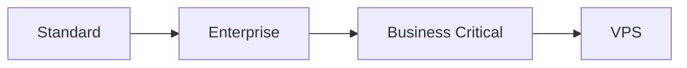
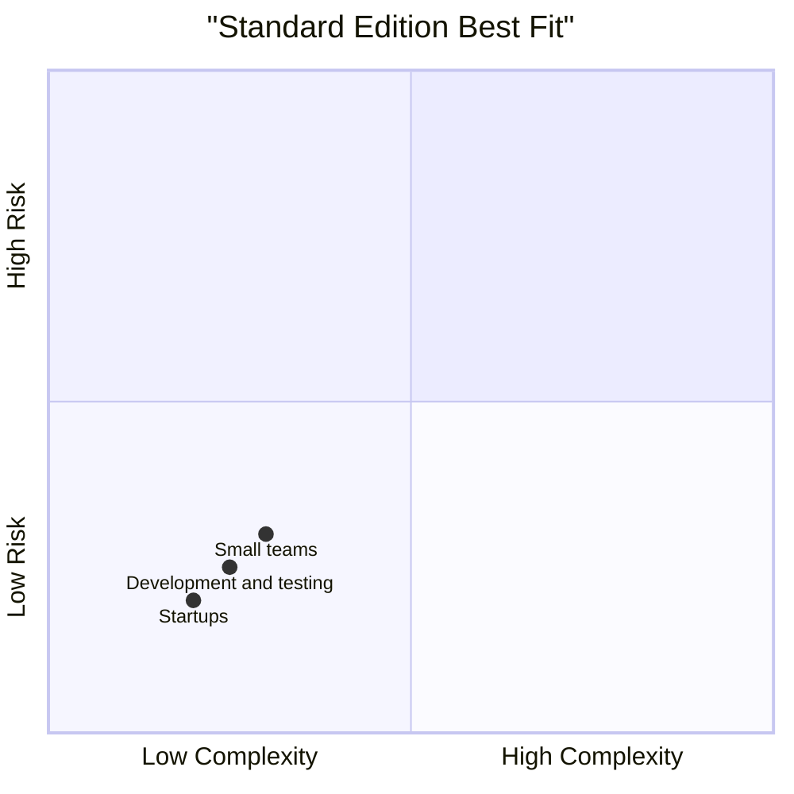
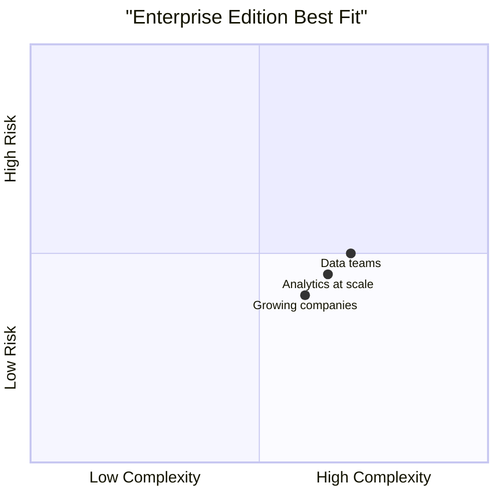
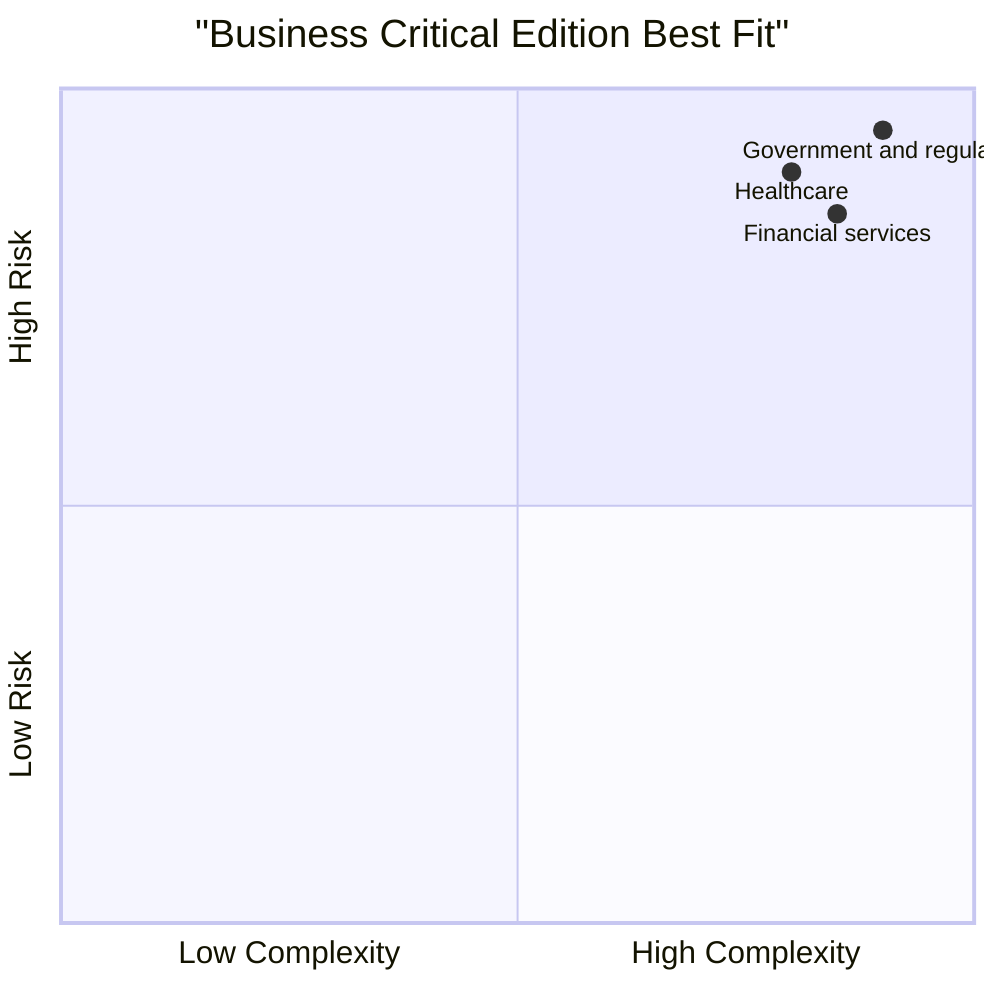
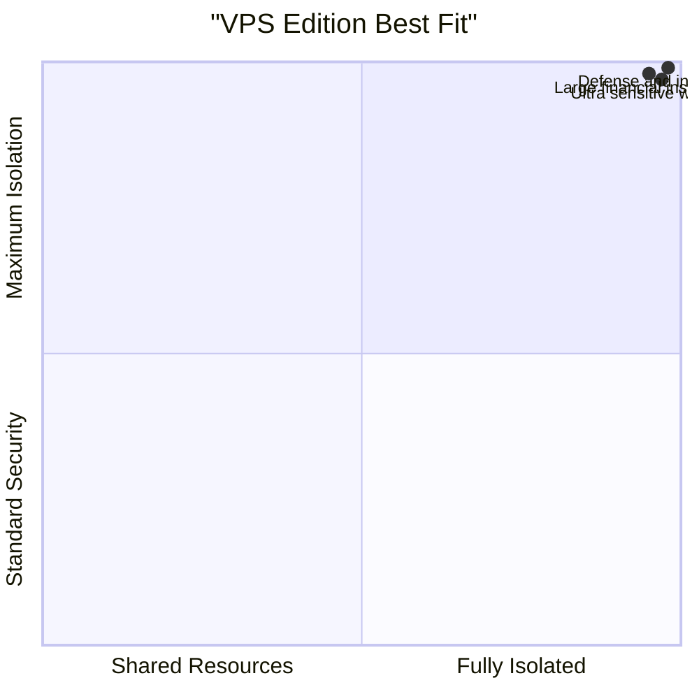
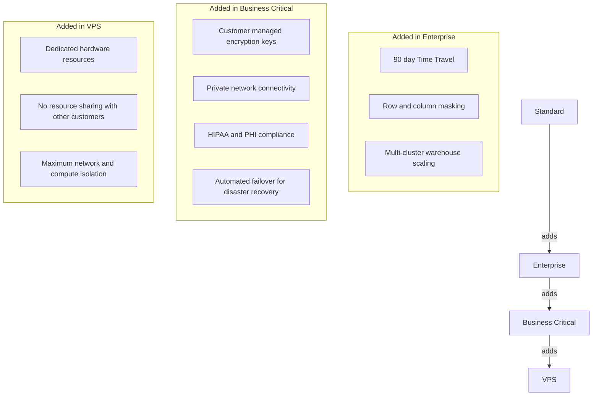
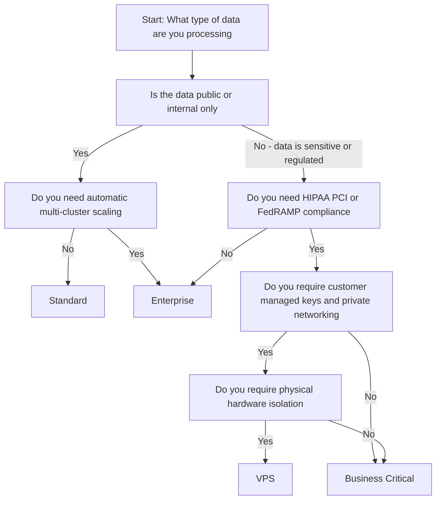

# Compare and Contrast Snowflake Editions

# Snowflake Editions Simple Comparison

## Architecture Overview

Each edition includes everything from the edition below it plus additional features.

## Feature Comparison Table

| Feature | Standard | Enterprise | Business Critical | VPS |
|---------|----------|------------|-------------------|-----|
| Core SQL and data loading | Yes | Yes | Yes | Yes |
| Basic encryption and security | Yes | Yes | Yes | Yes |
| Time Travel data recovery | 1 day | 90 days | 90 days | 90 days |
| Multi-cluster warehouses | No | Yes | Yes | Yes |
| Row and column level security | No | Yes | Yes | Yes |
| Customer managed encryption keys | No | No | Yes | Yes |
| Private network connectivity | No | No | Yes | Yes |
| HIPAA and PHI compliance support | No | No | Yes | Yes |
| Dedicated isolated hardware | No | No | No | Yes |
| Automated disaster recovery failover | No | No | Yes | Yes |

## Edition Use Cases

### Standard Edition

- You are evaluating or learning Snowflake
- Small team with straightforward data needs
- No regulatory or compliance requirements
- Cost efficiency is a priority

### Enterprise Edition

- Multiple teams or workloads running concurrently
- Need longer data recovery window (90 days)
- Require fine grained access controls
- Want automatic scaling for variable demand

### Business Critical Edition

- Handling sensitive data like health records or financial information
- Must comply with HIPAA, PCI DSS, FedRAMP or similar
- Need to manage your own encryption keys
- Require high availability with automatic failover

### VPS Edition

- Require physical separation from other Snowflake customers
- Highest level of security and compliance needed
- Budget is secondary to isolation and control
- Typically large organizations with strict governance

## Pricing Overview (US East, AWS)

| Edition | Approximate Price Per Credit | Typical Use Case |
|---------|-----------------------------|------------------|
| Standard | 2.00 USD | Learning, small projects, proof of concept |
| Enterprise | 3.00 USD | Most production workloads and growing teams |
| Business Critical | 4.00 USD | Regulated industries and sensitive data |
| VPS | Contact sales | Maximum isolation requirements |

Note: Credits represent compute resources. You are charged only for what you use.

## What Changes Between Editions

### Security and Control Progression

### Performance and Scaling

- Standard: Single warehouse execution. Suitable for predictable, simple workloads.
- Enterprise and above: Support multiple warehouses that can scale automatically based on demand.
- All editions use the same underlying query engine. Performance is not throttled on lower tiers.

### Data Recovery Capabilities

| Edition | Time Travel Recovery Window |
|---------|----------------------------|
| Standard | 24 hours |
| Enterprise and above | Up to 90 days |
| All editions | Additional 7 days in Fail-safe mode (emergency recovery only, read only) |

## Common Selection Errors

- Assuming you can easily switch editions later without planning. While upgrading is simple, moving sensitive data into a compliant environment after the fact can create complications.
- Treating Business Critical as just a premium version of Enterprise. If your data falls under HIPAA, PCI, or similar regulations, the additional controls are not optional.
- Dismissing VPS as unnecessary without consulting compliance or legal teams. If your policy requires physical isolation, VPS is the only valid option.
- Focusing only on compute costs. Storage is billed separately at approximately 23 USD per TB per month. Regularly review and clean up unused data.

## Edition Selection Flowchart

## Key Takeaways

- Begin with the simplest edition that meets your current needs. Standard is sufficient for learning and small scale projects.
- Upgrade when your workload or compliance requirements demand it, not in anticipation of future needs.
- Let regulatory requirements drive your edition choice. If a rule mandates isolation or specific controls, that requirement overrides cost considerations.
- VPS is designed for a narrow set of use cases. Unless you operate in banking, healthcare, government, or similar high compliance environments, you likely do not need it.

Think of editions like transportation options:
- Standard gets you where you need to go reliably
- Enterprise adds capacity and flexibility for growing demands
- Business Critical adds protection and controls for sensitive cargo
- VPS provides a private, dedicated route with no external exposure

Choose based on your actual requirements, not on hypothetical future scenarios.
