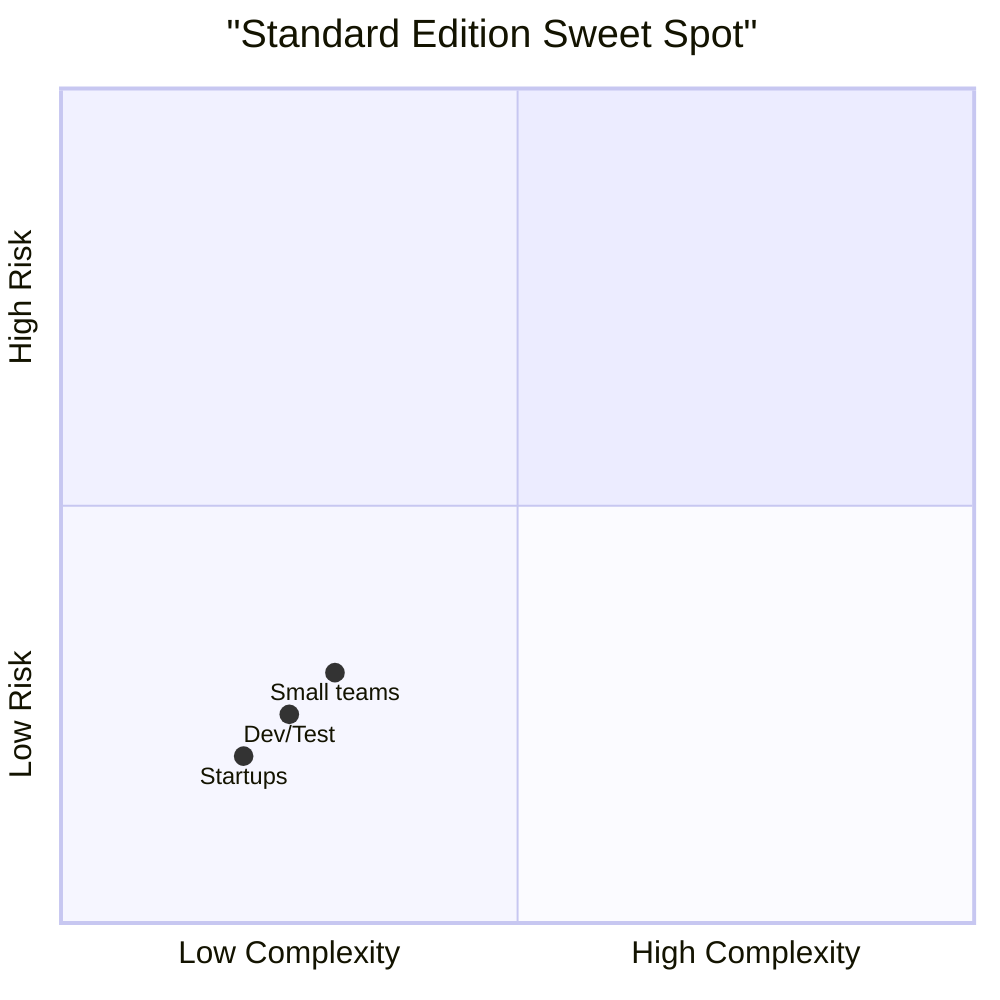
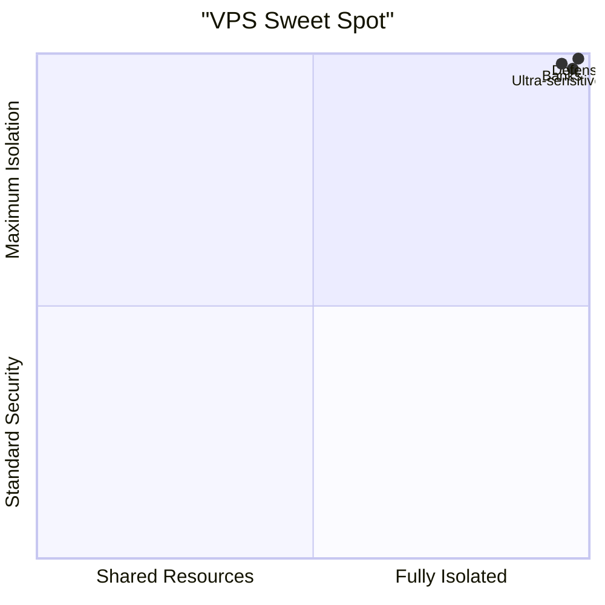
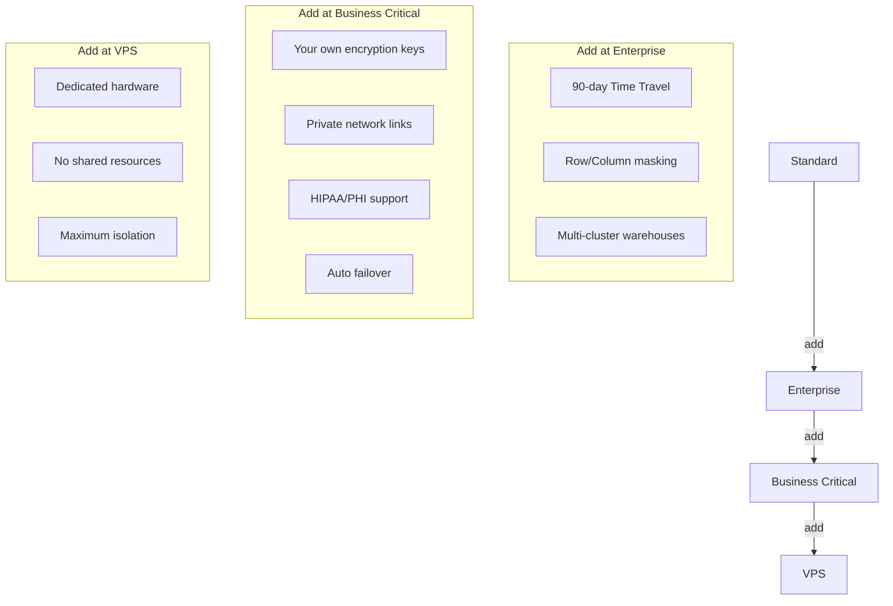
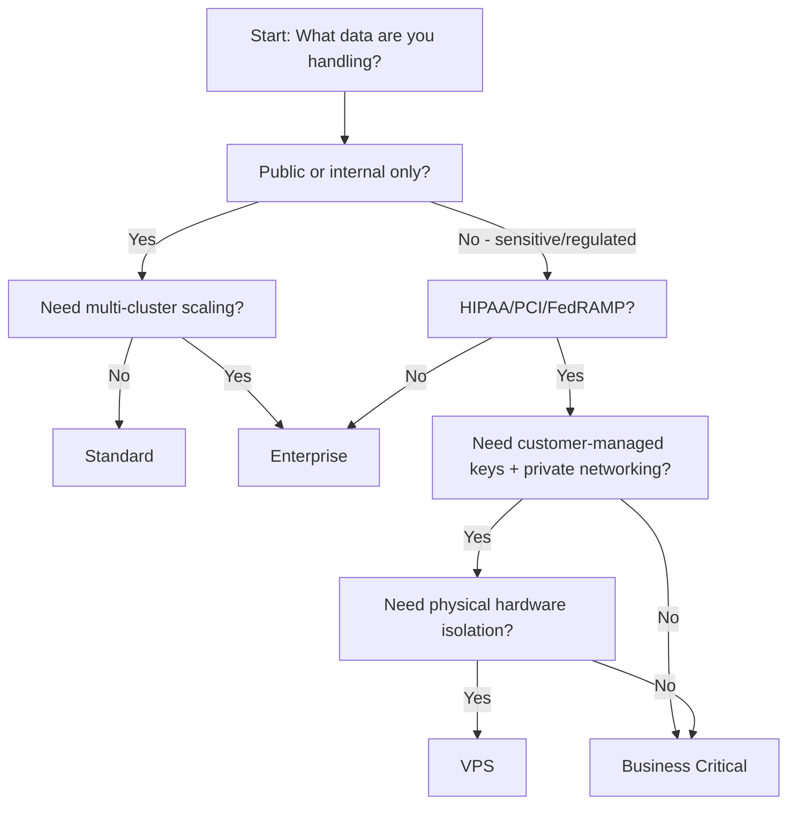

# Compare and Contrast Snowflake Editions

# Snowflake Editions: Simple Comparison

## The Big Picture

Each level = everything below it + extra stuff.

---

## Quick Feature Table

| What you get | Standard | Enterprise | Business Critical | VPS |
|-------------|----------|------------|-------------------|-----|
| Core SQL + data loading | ✅ | ✅ | ✅ | ✅ |
| Basic security + encryption | ✅ | ✅ | ✅ | ✅ |
| Time Travel (undo mistakes) | 1 day | 90 days | 90 days | 90 days |
| Multi-cluster warehouses | ❌ | ✅ | ✅ | ✅ |
| Row/column level security | ❌ | ✅ | ✅ | ✅ |
| Customer-managed keys | ❌ | ❌ | ✅ | ✅ |
| Private network connections | ❌ | ❌ | ✅ | ✅ |
| HIPAA/PHI support | ❌ | ❌ | ✅ | ✅ |
| Fully isolated hardware | ❌ | ❌ | ❌ | ✅ |
| Disaster recovery failover | ❌ | ❌ | ✅ | ✅ |

---

## Who Should Pick What?

### Standard

- You're testing Snowflake
- Small team, simple data
- No strict compliance rules
- Budget matters most

### Enterprise

- You need more power + control
- Multiple teams running queries
- Want to keep deleted data longer (90 days)
- Need fine-grained access rules

### Business Critical

- You handle sensitive data (health, finance, gov)
- Must meet HIPAA, PCI, FedRAMP
- Need your own encryption keys
- Can't afford downtime → need failover

### VPS (Virtual Private Snowflake)

- You need physical separation from other customers
- Highest security + compliance bar
- Budget is not the main constraint
- You're a large institution with strict rules

---

## Cost per Credit (US East, AWS) [[19]]

| Edition | Price/Credit | Best for |
|---------|-------------|----------|
| Standard | ~$2.00 | Learning, small projects |
| Enterprise | ~$3.00 | Most companies [[21]] |
| Business Critical | ~$4.00 | Regulated data |
| VPS | Custom pricing | Talk to sales |

> 💡 Credits = compute power. You pay for what you use, when you use it [[3]].

---

## What Actually Changes Between Editions?

### 🔐 Security & Control

### ⚡ Performance & Scale
- **Standard**: One warehouse at a time. Good for simple workloads.
- **Enterprise+**: Spin up multiple warehouses automatically when traffic spikes.
- All editions get the same query engine — no "slow mode" on lower tiers.

### 🔄 Data Recovery
| Edition | How far back can you "undo"? |
|---------|-----------------------------|
| Standard | 24 hours |
| Enterprise+ | Up to 90 days |
| All editions | +7 days in Fail-safe (read-only, emergency only) |

---

## Common Mistakes to Avoid

- ❌ "We'll start with Standard and upgrade later" → Upgrading is easy, but migrating sensitive data later can be messy. Plan ahead.
- ❌ "Business Critical is just Enterprise with a fancy name" → No. If you handle PHI or financial data, you *need* the extra controls. It's not optional.
- ❌ "VPS is overkill" → Maybe. But if your legal/compliance team says "isolated infrastructure", VPS is the only answer.
- ❌ Ignoring storage costs → Compute credits get attention, but storage is $23/TB/month [[19]]. Clean up old data.

---

## Decision Flowchart

---

## Bottom Line

- **Start simple**. Standard is fine for learning and small projects.
- **Upgrade when you hit a wall** — not before. Enterprise unlocks real team workflows.
- **Compliance drives edition**, not features. If the law says "isolate this", you don't get to pick cheap.
- **VPS is rare**. If you're not a bank, hospital, or government, you probably don't need it.

> Think of it like a car:  
> Standard = reliable sedan  
> Enterprise = SUV with extra seats  
> Business Critical = armored vehicle  
> VPS = private convoy on a closed road  

Pick the one that matches your actual risk — not your fear of missing out.
