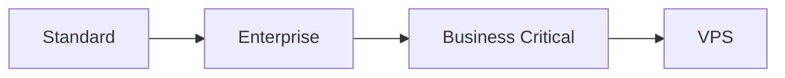
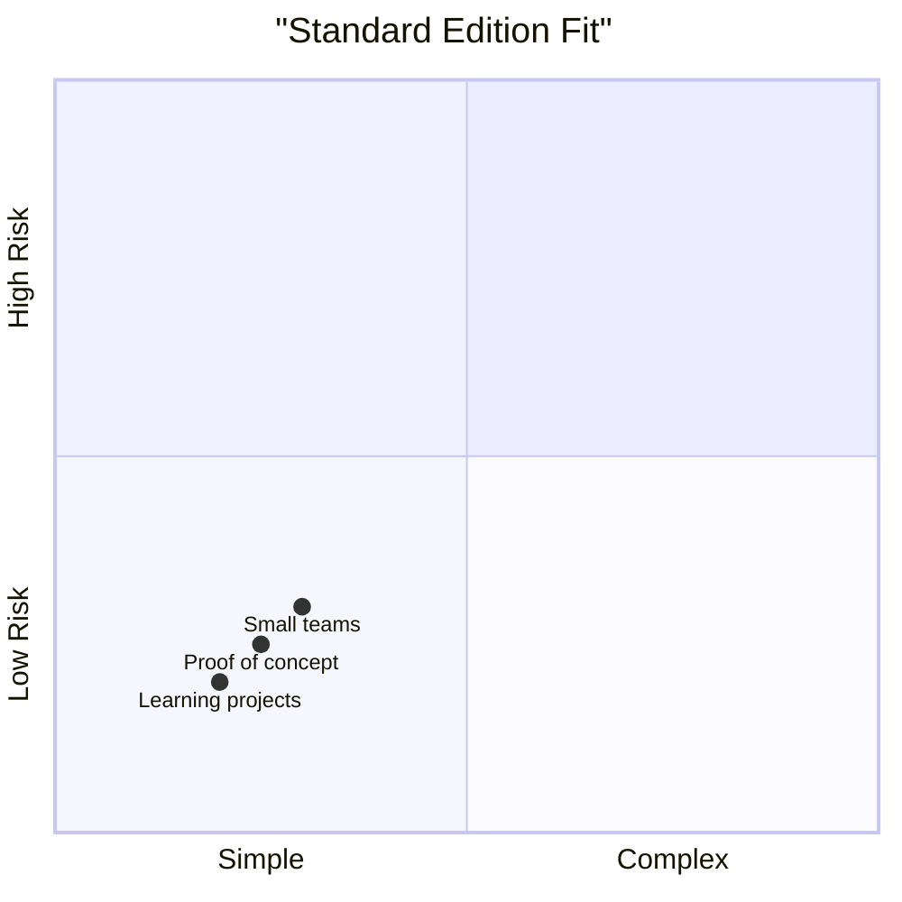
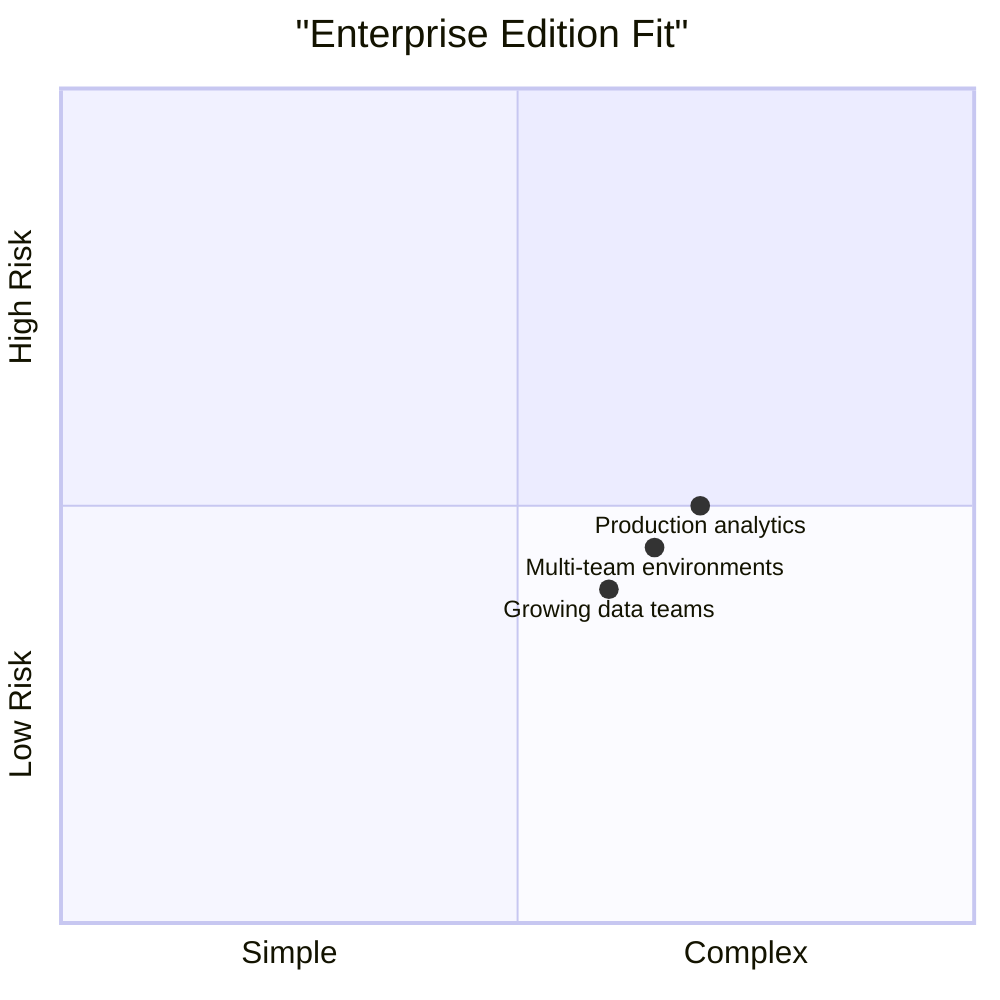
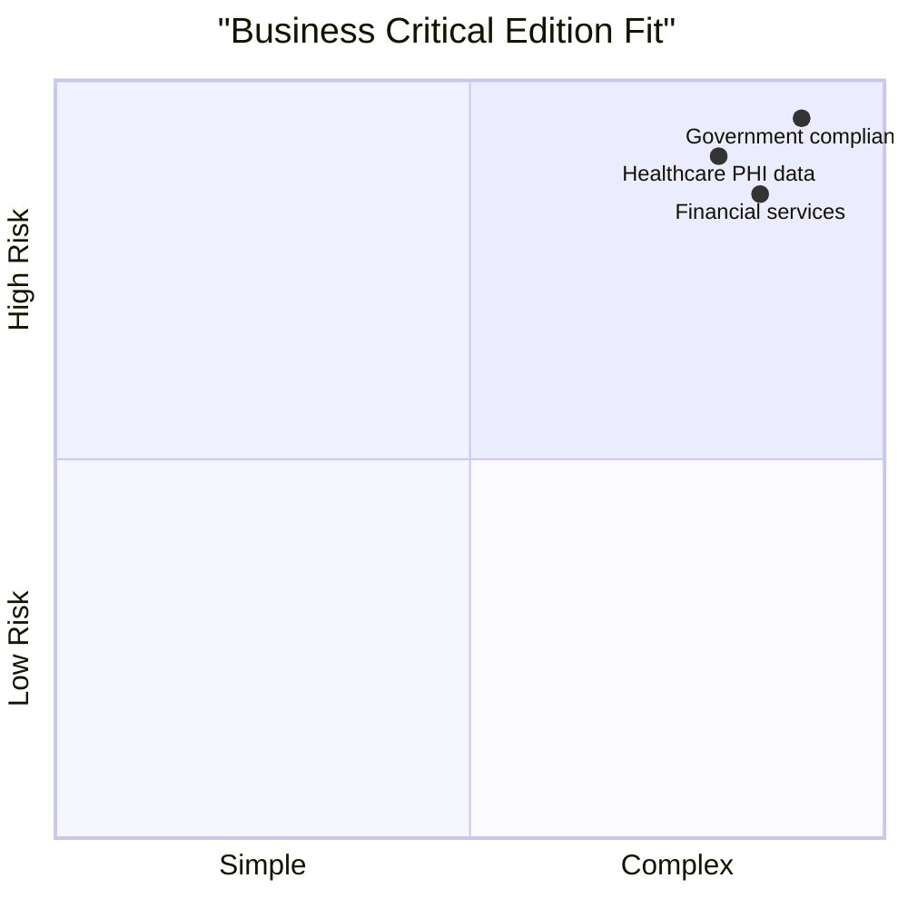
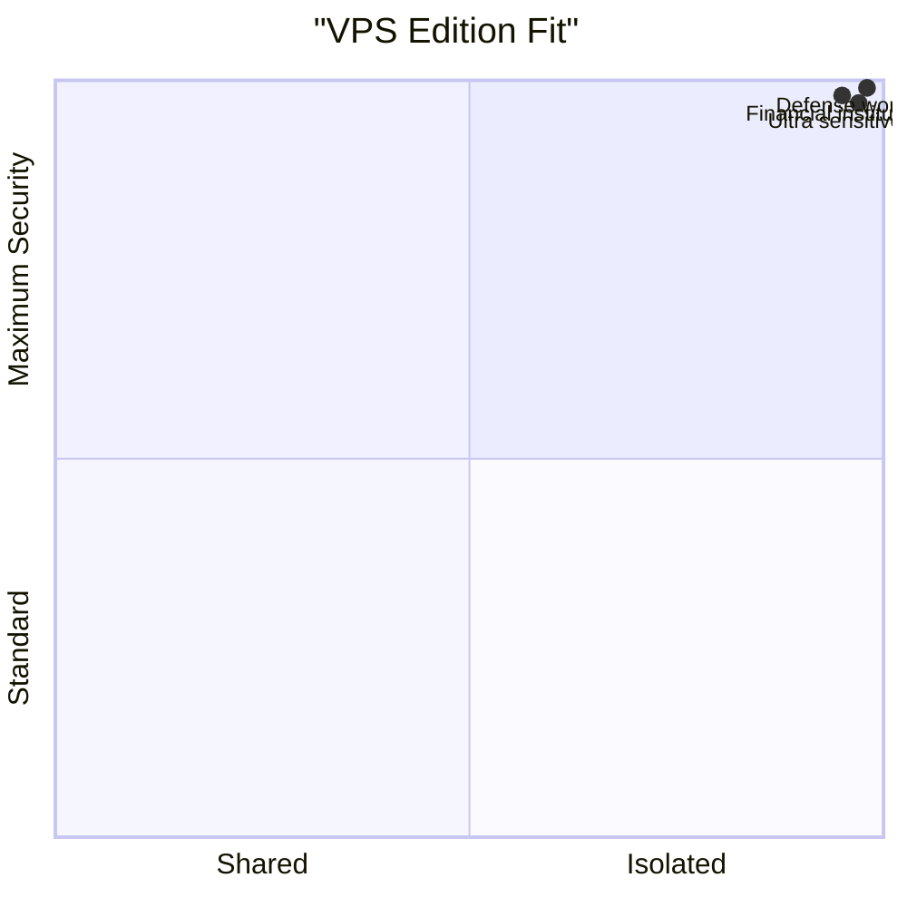
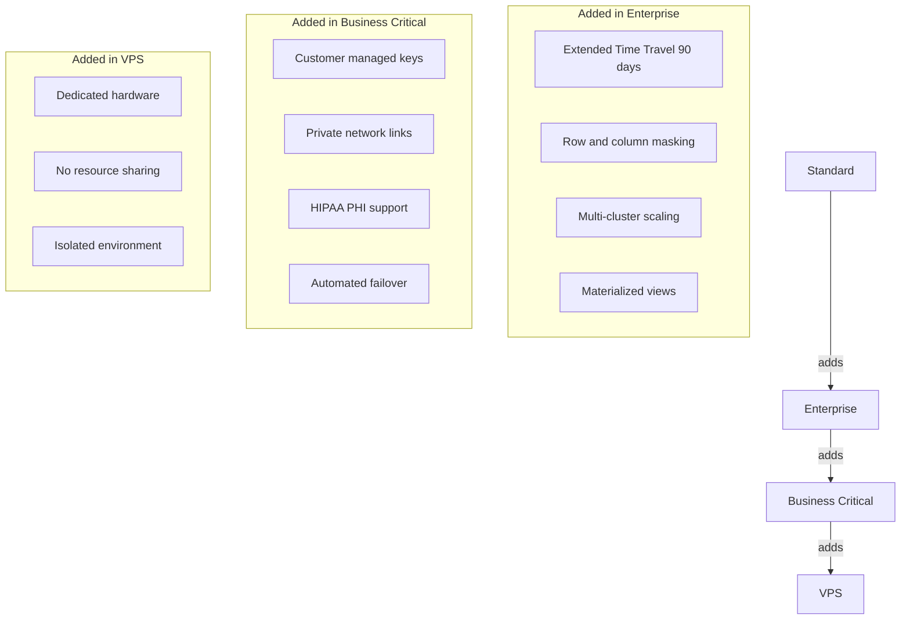
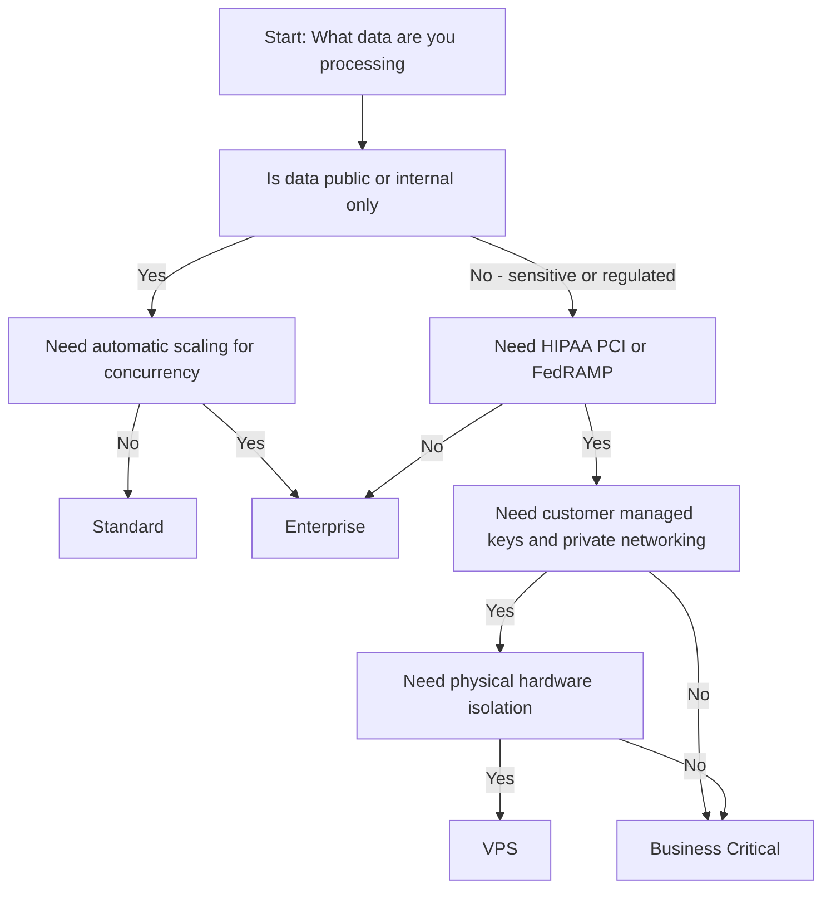

# Snowflake Editions Overview

## Edition Hierarchy

Each edition includes all features from the edition below it plus additional capabilities [[5]].

---

## Feature Comparison Table

| Feature Category | Standard | Enterprise | Business Critical | VPS |
|-----------------|----------|------------|-------------------|-----|
| Core SQL and data operations | Yes | Yes | Yes | Yes |
| Automatic data encryption | Yes | Yes | Yes | Yes |
| Standard Time Travel (1 day) | Yes | Yes | Yes | Yes |
| Extended Time Travel (up to 90 days) | No | Yes | Yes | Yes |
| Multi-cluster warehouses | No | Yes | Yes | Yes |
| Row and column level security | No | Yes | Yes | Yes |
| Customer managed encryption keys | No | No | Yes | Yes |
| Private network connectivity | No | No | Yes | Yes |
| HIPAA and PHI compliance support | No | No | Yes | Yes |
| Automated failover and failback | No | No | Yes | Yes |
| Dedicated isolated hardware | No | No | No | Yes |
| Marketplace access | Yes | Yes | Yes | No |

Sources: [[5]][[2]]

---

## Edition Details

### Standard Edition

- Entry level access to core Snowflake functionality [[5]]
- Full SQL support with standard data types
- Automatic encryption for all data
- 1 day Time Travel for data recovery
- Best for teams evaluating Snowflake or running simple workloads

### Enterprise Edition

- Includes all Standard features plus [[5]]
- Extended Time Travel up to 90 days
- Multi-cluster warehouses for handling concurrency
- Row and column level security controls
- Materialized views and query acceleration
- Best for organizations with multiple teams or variable workloads

### Business Critical Edition

- Includes all Enterprise features plus [[5]]
- Customer managed encryption keys via Tri-Secret Secure
- Private connectivity options for network isolation
- Support for HIPAA, PCI DSS, FedRAMP compliance
- Automated failover and failback for disaster recovery
- Best for regulated industries handling sensitive data

### Virtual Private Snowflake VPS

- Includes all Business Critical features [[5]]
- Runs in a completely separate Snowflake environment
- No hardware or resource sharing with other customers
- Dedicated metadata store and compute pool
- Best for organizations requiring maximum isolation

## Pricing Overview (US East AWS On Demand)

| Edition | Price Per Credit | Storage Cost |
|---------|-----------------|--------------|
| Standard | 2.00 USD | 23.00 USD per TB per month |
| Enterprise | 3.00 USD | 23.00 USD per TB per month |
| Business Critical | 4.00 USD | 23.00 USD per TB per month |
| VPS | Contact sales | Contact sales |

Source: [[2]]

Note: Credits are consumed by compute operations. You pay only for what you use [[6]].

## Security Feature Progression

## Time Travel and Data Recovery

| Edition | Time Travel Window | Fail-safe |
|---------|-------------------|-----------|
| Standard | 1 day | 7 days read only |
| Enterprise | Up to 90 days configurable | 7 days read only |
| Business Critical | Up to 90 days configurable | 7 days read only |
| VPS | Up to 90 days configurable | 7 days read only |

Source: [[23]][[26]]

Note: Fail-safe is automatic and cannot be disabled. It provides emergency recovery only [[26]].

## Selection Decision Flow

## Common Selection Mistakes

- Choosing Standard for production workloads that need scaling. Multi-cluster warehouses require Enterprise or higher [[5]].
- Assuming Business Critical is optional for regulated data. If HIPAA or PCI applies, the additional controls are required not optional [[5]].
- Overlooking storage costs. Compute credits get attention but storage is billed separately at 23 USD per TB per month [[2]].
- Selecting VPS without confirming isolation requirements. VPS is for physical separation. If policy does not require it, Business Critical is usually sufficient [[5]].

## Key Points

- Start with the edition that matches your current requirements. You can change editions later as needs evolve [[5]].
- Compliance requirements should drive edition choice. If regulations mandate specific controls, select the edition that provides them [[5]].
- All editions use the same query engine. Performance is not reduced on lower tiers [[5]].
- VPS is designed for a narrow set of use cases. Unless you require physical isolation, you likely do not need it [[5]].

Think of editions as layers of capability:
- Standard provides the foundation
- Enterprise adds scale and governance
- Business Critical adds compliance and protection
- VPS adds physical isolation

Choose based on your actual data, risk, and regulatory requirements.
