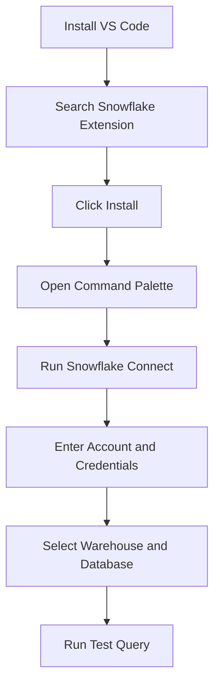
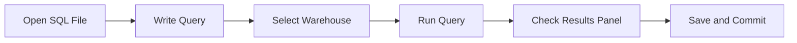
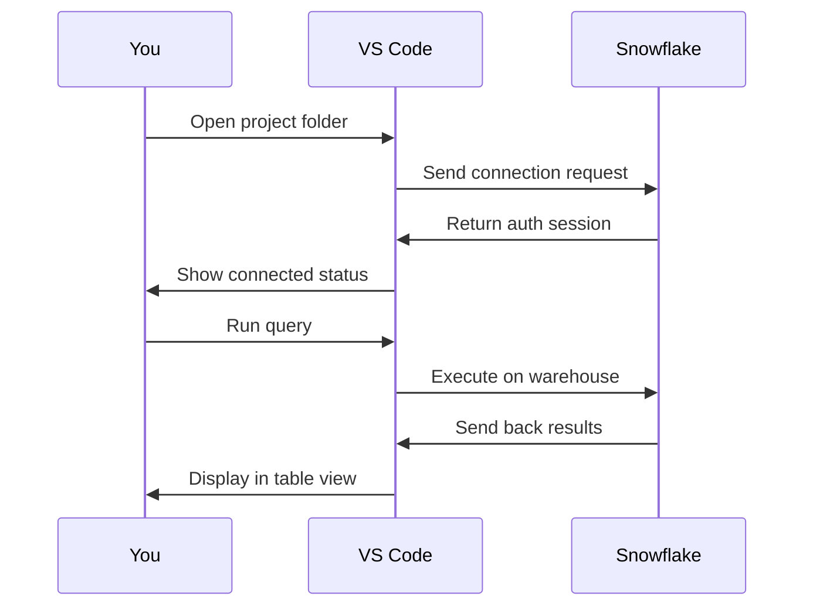

# IDE Integrations Visual Studio Code

**Core Features Table**
| Feature | What It Does |
|---------|--------------|
| SQL Editor | Syntax highlighting for Snowflake SQL |
| Query Runner | Execute lines, blocks, or full files |
| Result Grid | View output tables inside VS Code |
| Object Browser | Navigate databases, schemas, tables |
| Git Sync | Track script changes with version control |
| CLI Bridge | Run snowsql commands from terminal |
| Parameter Files | Swap environments without rewriting code |

**Setup Steps**
- Open VS Code and go to Extensions
- Search for Snowflake and install the official extension
- Open the command palette with Ctrl+Shift+P
- Type Snowflake Connect and hit enter
- Pick your auth method (password, key pair, or OAuth)
- Fill in account identifier, username, and role
- Set default warehouse, database, and schema
- Save the config and run a quick select statement

**Workflow Flow**

**Tool Comparison Table**
| Tool | Best For | Where It Falls Short |
|------|----------|----------------------|
| VS Code Extension | Scripting, git workflows, team dev | Not built for dashboarding or admin UI |
| Snowsight | Quick queries, data browsing, settings | Poor offline support, weak git integration |
| SnowSQL CLI | CI/CD, automation, headless servers | Hard to write long scripts, no visual results |
| DBT + VS Code | Data transforms, testing, pipelines | Needs extra config, not for raw querying |

**Connection & Auth Flow**

**Troubleshooting Table**
| Issue | Why It Happens | How To Fix |
|-------|----------------|------------|
| Connection drops | Auth token expired | Switch to key pair or OAuth for longer sessions |
| Slow queries | Wrong warehouse size | Check extension settings and pick a larger warehouse |
| No autocomplete | Metadata cache stale | Run Refresh Snowflake Metadata command |
| Git conflicts | Local config tracked | Add .vscode and local yaml files to gitignore |
| Permission denied | Role mismatch | Update default role in connection profile |

**Config & Usage Tips**
- Keep all SQL files in one dedicated folder
- Use yaml config files for dev, staging, and prod
- Turn on auto suspend in warehouse settings to save credits
- Run explain before heavy joins to check performance
- Use parameterized scripts instead of hardcoding values
- Commit early and write clear change messages
- Test every script in dev before pointing to prod warehouse
