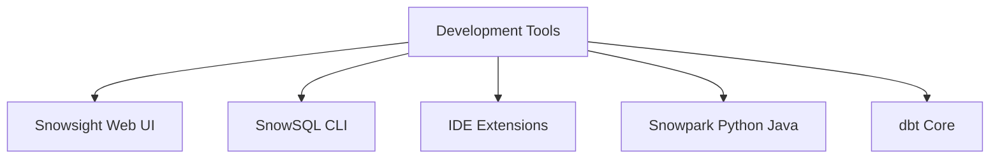
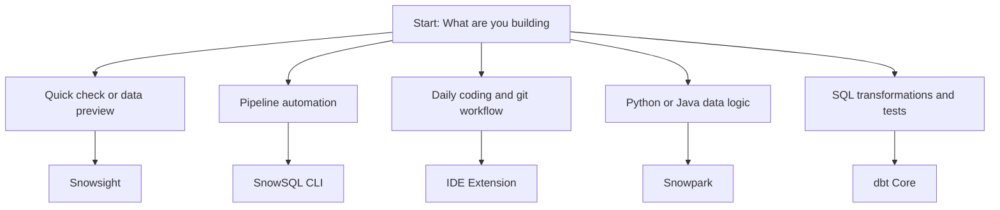

# Snowflake Development Tools Overview

| Tool | Primary Use Case | Where It Struggles |
|------|------------------|-------------------|
| Snowsight Web UI | Quick queries, data preview, account settings | Poor offline work, weak git tracking |
| SnowSQL CLI | Automation, CI/CD pipelines, server scripts | No visual editor, hard to debug large files |
| IDE Extensions VS Code JetBrains | Daily coding, version control, debugging | Requires local config, depends on API limits |
| Snowpark | Custom data apps, UDFs, lightweight ML | Needs programming knowledge, extra setup |
| dbt Core | Data transformations, testing, documentation | SQL only, not for raw ingestion or admin tasks |

- Install the tool that matches your daily task. Do not force one tool to do everything.
- Keep connection files out of git. Add local config folders to gitignore.
- Use separate warehouses for dev and prod. Dev can run small. Prod runs at scale.
- Store SQL and Python files in a single repo. Track every change.
- Switch to key pair or OAuth auth. Password sessions expire and break automation.
- Run explain before heavy joins. Check execution plan to avoid wasted credits.
- Test role permissions in dev first. Wrong role blocks queries in prod.

| Issue | Root Cause | Fix |
|-------|------------|-----|
| Query stalls | Warehouse too small or suspended | Increase size or disable auto suspend for testing |
| Auth fails mid run | Short lived token | Switch to key pair or configure OAuth refresh |
| Missing columns in autocomplete | Metadata cache outdated | Run metadata refresh command in IDE |
| dbt models fail | Target database mismatch | Update profiles yaml to point to correct schema |
| Snowpark package error | Missing dependencies | List required packages in session configuration |

- Match the tool to the job. Web UI for quick looks, CLI for scripts, IDE for code, Snowpark for apps, dbt for transforms.
- Never hardcode credentials. Use environment variables or secure vaults.
- Keep warehouses on auto suspend. Turn them on only when running tasks.
- Version control every script. Local files break when machines change.
- Start small. Test logic on sample data before running full pipelines.
