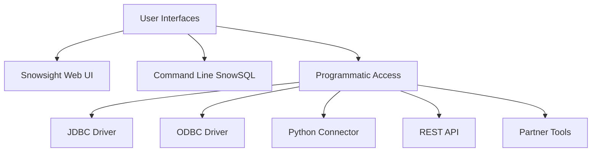
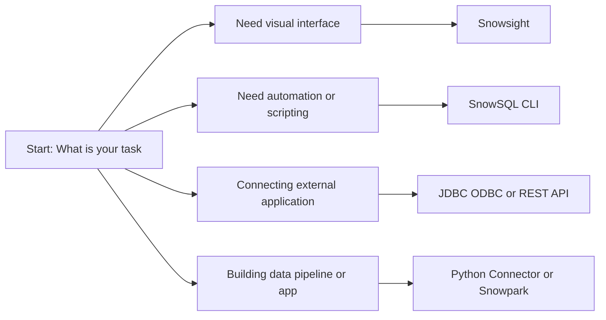
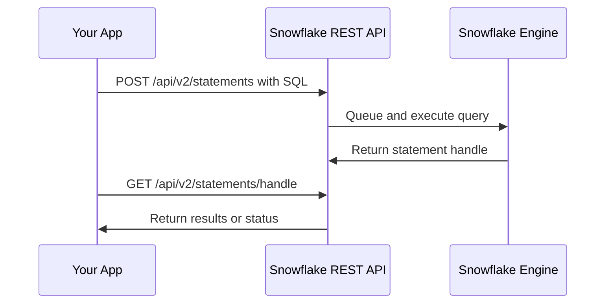
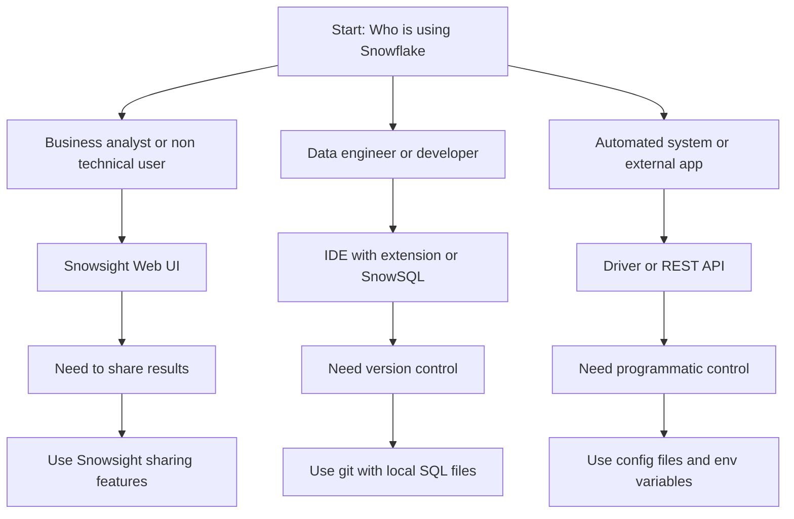

# Snowflake Interfaces Overview

| Interface | Best For | Not Ideal For |
|-----------|----------|---------------|
| Snowsight Web UI | Quick queries, browsing data, admin tasks, sharing dashboards | Offline work, complex scripting, version control |
| SnowSQL CLI | Automation, scheduled jobs, server scripts, CI/CD | Visual exploration, team collaboration on queries |
| JDBC ODBC Drivers | BI tools like Tableau, Power BI, Excel, legacy apps | Direct interactive querying, script development |
| Python Connector | Data science, ETL scripts, Snowpark development, automation | Simple ad hoc queries, non technical users |
| REST API | Custom integrations, serverless functions, external apps | Interactive use, complex multi step workflows |
| Partner Connect | One click setup for Fivetran, dbt, Looker, other tools | Custom configurations, advanced tuning |

**Snowsight Web UI**
- Browser based interface, no installation needed
- Query editor with syntax highlighting and history
- Data preview with sorting, filtering, export options
- Dashboard and worksheet sharing with team members
- Account admin panel for users, roles, warehouses
- Monitor query history, credit usage, and performance
- Works on any device with modern browser

**SnowSQL Command Line**
- Install once, run anywhere with terminal access
- Execute SQL files, schedule with cron or task scheduler
- Script connection setup with config files
- Output results as CSV, JSON, or plain text for downstream tools
- Ideal for deployment scripts and automated testing
- Supports variables and parameter substitution

**Driver Based Connections**

| Driver | Language Platform | Typical Use |
|--------|------------------|-------------|
| JDBC | Java, Scala, Kotlin | Enterprise apps, Spark integration |
| ODBC | Windows apps, Excel, legacy BI | Desktop reporting tools |
| Python | Python scripts, Jupyter, Airflow | Data science, ETL, Snowpark |
| Node.js | JavaScript, TypeScript | Web apps, serverless functions |
| Go | Go applications | Microservices, cloud native tools |

**REST API Capabilities**
- Authentication via key pair or OAuth token
- Submit SQL statements and fetch results asynchronously
- Manage warehouse, database, and user objects programmatically
- Integrate with serverless platforms like AWS Lambda or Azure Functions
- Build custom admin dashboards or monitoring tools

**Connection Setup Patterns**

| Method | When To Use | Example |
|--------|-------------|---------|
| Username and password | Quick testing, personal use | snowsql -a myaccount -u myuser |
| Key pair authentication | Automation, production scripts | Private key file referenced in config |
| OAuth token | Enterprise SSO, short lived access | Token from identity provider passed to connector |
| External browser | MFA enabled accounts, interactive login | Snowsight redirects to IdP for auth |

**Interface Selection Guide**

**Common Setup Issues**

| Problem | Likely Cause | Resolution |
|---------|--------------|------------|
| Connection timeout | Firewall blocking port 443 | Allow outbound HTTPS to Snowflake domains |
| Auth failed repeatedly | Wrong account identifier format | Use full account locator including region and cloud |
| Query hangs in BI tool | Warehouse not resumed or too small | Set warehouse size in connection string or UI |
| Python connector import error | Missing dependencies or SSL libs | Install with pip and ensure system SSL certs are current |
| ODBC driver not found | Driver not installed or path not set | Download from Snowflake docs and update system path |

**Key Practices**
- Store connection details in environment variables or secure vaults, never in code
- Use separate warehouses for dev, test, and prod to isolate cost and performance
- Enable query tagging to track which interface or app generated each query
- Test connection strings in a small script before deploying to production
- Monitor credit usage per interface to identify inefficient patterns
- Keep drivers and connectors updated to avoid compatibility issues

**Interface Comparison Summary**

| Criteria | Snowsight | SnowSQL | Drivers | REST API |
|----------|-----------|---------|---------|----------|
| Setup effort | None | Low | Medium | High |
| Learning curve | Low | Medium | Medium | High |
| Automation friendly | No | Yes | Yes | Yes |
| Visual feedback | Yes | No | Depends on app | No |
| Version control | No | Yes | Yes | Yes |
| Best for collaboration | Yes | No | No | No |

Choose the interface that matches your workflow, not the one with the most features. Start simple, add complexity only when your task requires it.
