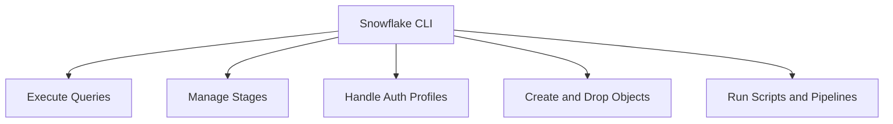
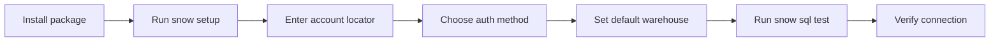
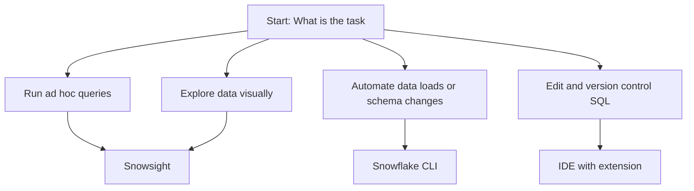

# Snowflake CLI

| Feature | What It Does |
|---------|--------------|
| Interactive SQL mode | Type and run queries directly in terminal |
| Batch execution | Pass a SQL file and let CLI run it start to finish |
| Profile management | Store multiple accounts, roles, and warehouses |
| Stage operations | Upload, download, and list files in internal stages |
| Variable substitution | Inject runtime values into SQL without editing files |
| Output formatting | Return results as table, CSV, JSON, or TSV |
| CI/CD ready | Works with git hooks, cron, GitHub Actions, and Azure DevOps |

| Command Pattern | Example | When To Use |
|-----------------|---------|-------------|
| Single query | snow sql -q "select current_timestamp();" | Quick check without opening files |
| File run | snow sql -f migration.sql | Apply schema changes or batch transforms |
| Stage upload | snow stage put ./data.csv @raw_stage | Push flat files for COPY INTO |
| Stage list | snow stage list @raw_stage | Verify files landed before loading |
| Profile switch | snow sql --profile prod | Run same script against different environments |
| Export data | snow sql -q "select * from t" --format csv > export.csv | Pull data for local analysis or reporting |
| Variable run | snow sql -q "select * from users where region = &region" -v region=US | Parameterize scripts for reuse |

| Tool | CLI Advantage | CLI Limitation |
|------|---------------|----------------|
| Snowsight | Faster for scripts, version control friendly, automatable | No visual editor, harder for beginners |
| IDE Extensions | Lighter footprint, terminal native, better for servers | Lacks GUI features like data preview |
| SnowSQL Legacy | Modern CLI is faster, cleaner syntax, actively updated | Legacy commands may not map 1:1 to new CLI |
| Python Connector | No code needed, works out of the box for SQL tasks | Less flexible for complex app logic |

| Issue | Root Cause | Fix |
|-------|------------|-----|
| snow command not found | CLI not added to system PATH | Reinstall or export bin directory to PATH |
| Auth error 390100 | Wrong account format or expired session | Use full account URL and rotate to key pair |
| Query hangs | Warehouse suspended or undersized | Set auto_resume in profile or scale up warehouse |
| Stage permission denied | Role lacks stage access | Grant USAGE and WRITE on target stage to role |
| Config clash | Multiple profiles with same name | Rename profiles or use explicit --profile flag |

- Store credentials in a local config file or environment variables, never in scripts
- Add config files to gitignore so secrets do not leak to repos
- Use named profiles to switch between dev, staging, and prod without editing commands
- Enable warehouse auto resume for automated runs so jobs do not fail on cold start
- Test queries on small sample data before running full production loads
- Add query tags in SQL so you can trace CLI runs back to specific scripts or users
- Update the CLI regularly to catch security patches and new command support
- Prefer batch mode over interactive mode for repeatable tasks to ensure consistency

