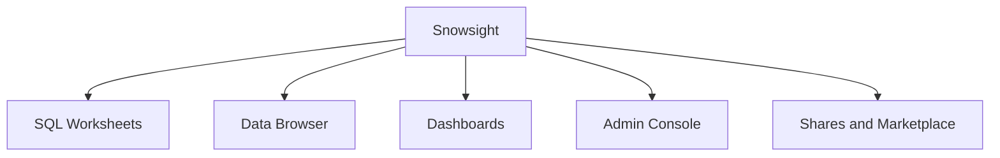
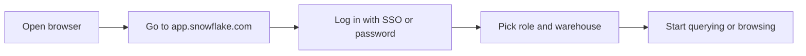
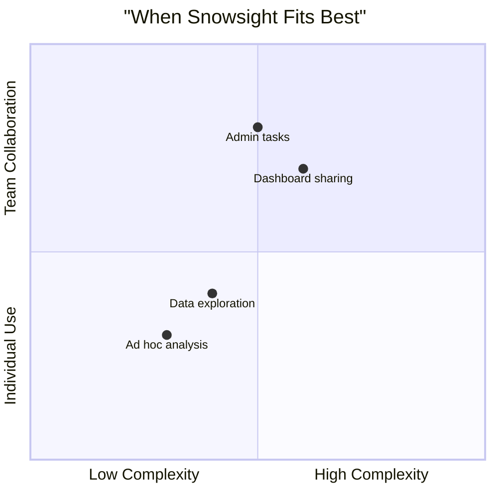
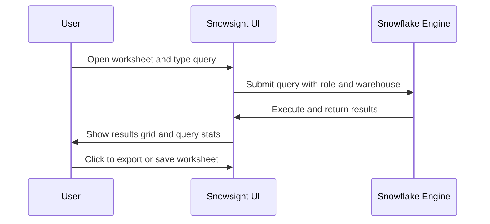
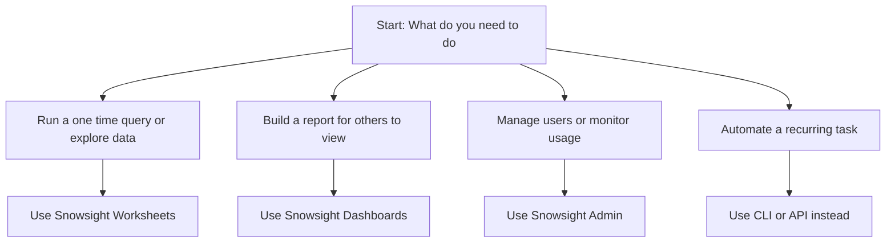

# Snowsight

# Snowsight Web Interface Overview

| Feature | What It Does |
|---------|--------------|
| SQL Worksheets | Write and run queries with syntax highlighting and history |
| Data Browser | Explore databases, schemas, tables, and views in a tree view |
| Query History | See past queries, check performance, and rerun successful ones |
| Dashboards | Build visual reports with charts and filters for sharing |
| Admin Panel | Manage users, roles, warehouses, and monitor credit usage |
| Data Sharing | Create secure shares for internal teams or external partners |
| Marketplace Access | Browse and query third party data without moving it |

| Task | How To Do It in Snowsight |
|------|---------------------------|
| Run a quick query | Open Worksheet, type SQL, press Ctrl+Enter |
| Browse table data | Navigate in Data Browser, click table, preview rows |
| Export results | Run query, click Download, pick CSV or JSON |
| Share a dashboard | Build dashboard, click Share, add users or roles |
| Check query cost | Open Query History, view credits used column |
| Create a new table | Use Worksheet with CREATE TABLE statement |
| Monitor warehouse load | Go to Admin, select Warehouses, view active queries |

| Use Case | Snowsight Strength | Snowsight Weakness |
|----------|-------------------|-------------------|
| Quick data check | Fast access, no install needed | Limited to browser performance |
| Team query sharing | Easy worksheet and dashboard sharing | No built in version control |
| Account administration | Centralized UI for users, roles, warehouses | Bulk changes still need SQL or API |
| Learning Snowflake | Visual feedback, guided navigation | Can hide underlying SQL complexity |
| Production automation | Not designed for this | Use CLI or API instead |
| Complex script development | Basic editor with snippets | No advanced debugging or git integration |

| Problem | Likely Cause | How To Fix |
|---------|--------------|------------|
| Worksheet will not run | No warehouse selected or warehouse suspended | Select active warehouse or enable auto resume |
| Query returns no rows | Wrong database or schema context | Check current context bar and switch if needed |
| Dashboard not loading | Large dataset or complex chart | Filter data source or simplify visualization |
| Cannot see certain tables | Role lacks privileges on object | Switch to a role with proper access or request grant |
| Session expires quickly | Short token lifetime or inactivity | Stay active or configure longer session timeout if allowed |
| Slow UI response | Browser cache or network latency | Clear cache, try incognito, or check network |

- Snowsight runs in your browser. Keep it updated for best performance
- Always check your current role and warehouse before running queries
- Save worksheets with clear names so teammates can find them later
- Use query tags to label work for cost tracking and debugging
- Export large results in chunks to avoid browser memory issues
- Do not store sensitive data in worksheet comments or titles
- Use the Explain feature before running expensive joins to check the plan
- Bookmark your most used worksheets for faster access

| Interface | Best Paired With | Why |
|-----------|-----------------|-----|
| Snowsight + SnowSQL | Quick exploration plus automated runs | Use Snowsight to test, SnowSQL to schedule |
| Snowsight + IDE | Visual browsing plus version controlled scripts | Browse in browser, develop in local editor |
| Snowsight + Partner Tools | Dashboarding plus advanced transforms | Build logic in dbt, visualize in Snowsight |

Snowsight is your front door to Snowflake. It works well for getting started, checking data, and sharing results. It is not built for heavy automation or complex development workflows. Use it for what it does best, and switch to CLI or API when you need more control.
