# Snowflake Domain 1.2: Interfaces and Tools – Production-Grade Deep Dive

*Senior Snowflake Solutions Architect | Enterprise-Scale Focus*


## 1. Overview & Scope

### 1.1 Definition

Snowflake provides multiple interfaces and tools to interact with its AI Data Cloud, catering to developers, analysts, data engineers, and administrators. These interfaces abstract the underlying architecture while enabling full control over data, compute, and governance.

**Key Categories**:

1. **Native Web UIs** (Snowsight, Classic Console).
2. **Command-Line Tools** (SnowSQL, SnowCLI).
3. **Programmatic Interfaces** (Drivers, Connectors, SDKs).
4. **IDE Integrations** (VS Code, Jupyter, etc.).
5. **Third-Party Tools** (Tableau, Power BI, dbt, Airflow, etc.).
6. **Snowflake-Specific Tools** (Snowpark, Snowpipe, Streamlit, etc.).

**Purpose**:

- Democratize access (non-technical to expert users).
- Automate workflows (CI/CD, ETL, ML).
- Integrate seamlessly with existing ecosystems.


## 2. Technical Architecture

### 2.1 Interface Ecosystem Overview

```mermaid
flowchart TD
    A[User] --> B[Native Web UIs]
    A --> C[Command-Line Tools]
    A --> D[Programmatic Interfaces]
    A --> E[IDE Integrations]
    A --> F[Third-Party Tools]
    A --> G[Snowflake-Specific Tools]

    B --> B1[Snowsight]
    B --> B2[Classic Console]

    C --> C1[SnowSQL]
    C --> C2[SnowCLI]

    D --> D1[JDBC/ODBC Drivers]
    D --> D2[Python/Node.js SDKs]
    D --> D3[REST API]

    E --> E1[VS Code Extension]
    E --> E2[Jupyter Notebooks]
    E --> E3[DBeaver]

    F --> F1[BI Tools: Tableau, Power BI]
    F --> F2[Orchestration: Airflow, Dagster]
    F --> F3[Transformation: dbt, Matillion]

    G --> G1[Snowpark]
    G --> G2[Snowpipe]
    G --> G3[Streamlit in Snowflake]
    G --> G4[Snowflake for Data Scientists]
```



### 2.2 Core Components


| **Interface/Tool**         | **Primary Use Case**                              | **Underlying Protocol/Tech**       | **User Persona**             |
| -------------------------- | ------------------------------------------------- | ---------------------------------- | ---------------------------- |
| **Snowsight**              | Modern web UI for queries, dashboards, and admin. | Web (React/TypeScript)             | Analysts, Admins, Developers |
| **Classic Console**        | Legacy web UI (deprecated but still supported).   | Web (AngularJS)                    | Legacy Users                 |
| **SnowSQL**                | CLI for SQL execution and admin tasks.            | Python + Snowflake Connector       | DBAs, DevOps, Engineers      |
| **SnowCLI**                | Modern CLI for Snowflake (replacing SnowSQL).     | Go + REST API                      | DevOps, CI/CD Pipelines      |
| **JDBC/ODBC Drivers**      | Connect BI tools and apps to Snowflake.           | JDBC 4.2, ODBC 3.8                 | BI Developers, App Devs      |
| **Python Connector**       | Python apps and scripts.                          | Python (PyPI package)              | Data Scientists, Engineers   |
| **REST API**               | Programmatic access to Snowflake metadata.        | HTTP/JSON                          | Automation, Custom Apps      |
| **VS Code Extension**      | IDE integration for development.                  | Language Server Protocol (LSP)     | Developers, Engineers        |
| **Snowpark**               | Data processing in Python/Scala/Java.             | Snowflake’s distributed engine     | Data Engineers, ML Engineers |
| **Snowpipe**               | Continuous data ingestion.                        | Snowflake’s file ingestion service | Data Engineers               |
| **Streamlit in Snowflake** | Build and share data apps.                        | Streamlit (Python)                 | Analysts, Data Scientists    |
| **dbt Integration**        | Transformation and modeling.                      | dbt-Snowflake adapter              | Data Analysts, Engineers     |
| **Airflow Integration**    | Orchestrate Snowflake workflows.                  | Airflow Providers (Python)         | Data Engineers, DevOps       |


## 3. Core Concepts & Definitions

### 3.1 Native Web UIs

#### Snowsight

- **Definition**: Snowflake’s modern, React-based web UI for querying, visualizing, and administering data.
- **Key Features**:
  - **Worksheets**: SQL query editor with autocomplete, syntax highlighting, and query history.
  - **Dashboards**: No-code drag-and-drop for visualizations (charts, tables, KPIs).
  - **Data Apps**: Streamlit integration for building interactive apps.
  - **Admin Console**: User, role, and warehouse management.
  - **Marketplace**: Discover and consume third-party data.
- **Analogy**: Like a Swiss Army knife for Snowflake—combines a SQL IDE, BI tool, and admin panel in one.

#### Classic Console

- **Definition**: Snowflake’s legacy web UI (being phased out).
- **Key Features**:
  - Basic SQL query editor.
  - Account administration (users, roles, warehouses).
  - Data loading/unloading (via UI).
- **Deprecation Note**: Snowflake recommends migrating to Snowsight for all new development.


### 3.2 Command-Line Tools

#### SnowSQL

- **Definition**: Snowflake’s official CLI for executing SQL, scripts, and admin tasks.
- **Key Features**:
  - Interactive and batch modes.
  - Supports all DDL/DML (including PUT/GET for file operations).
  - Parameter binding (for scripts).
  - Output formatting (CSV, JSON, table).
- **Analogy**: Like MySQL CLI or psql for Snowflake.

#### SnowCLI

- **Definition**: Snowflake’s next-gen CLI (replacing SnowSQL), built in Go for better performance.
- **Key Features**:
  - Faster execution (Go-based).
  - Modern syntax (e.g., `snow sql -q "SELECT * FROM table"`).
  - Better integration with CI/CD pipelines.
  - Supports Snowpark (Python/Scala/Java execution).
- **Why It Matters**: SnowSQL is deprecated in favor of SnowCLI.


### 3.3 Programmatic Interfaces

#### JDBC/ODBC Drivers

- **Definition**: Standard database drivers for connecting BI tools (Tableau, Power BI) and applications (Java, .NET) to Snowflake.
- **Key Features**:
  - JDBC: For Java-based apps (e.g., Tableau, Apache Spark).
  - ODBC: For Windows apps (e.g., Excel, Power BI).
  - Connection Pooling: Optimizes performance for high-concurrency apps.
- **Analogy**: Like PostgreSQL’s JDBC driver, but optimized for Snowflake’s cloud architecture.

#### Python Connector

- **Definition**: Official Python library (`snowflake-connector-python`) for interacting with Snowflake.
- **Key Features**:
  - Pandas integration (`snowflake-connector-pandas`).
  - Async support (for high-performance apps).
  - Arrow integration (for fast data transfer).
- **Example Use Case**: ETL pipelines, ML model training, custom apps.

#### REST API

- **Definition**: HTTP-based API for metadata operations (e.g., managing users, warehouses, databases).
- **Key Features**:
  - No SQL execution (use JDBC/ODBC or Python Connector for queries).
  - Supports:
    - Account management (users, roles, warehouses).
    - Database/schema/table operations.
    - Query monitoring (QUERY_HISTORY).
- **Analogy**: Like AWS CLI, but for Snowflake account management.


#### Snowpark

- **Definition**: Developer framework for data processing, transformation, and ML in Python, Scala, or Java.
- **Key Features**:
  - Pushes compute to Snowflake (no data movement).
  - Supports UDFs (User-Defined Functions).
  - Integrates with ML libraries (e.g., scikit-learn, XGBoost).
  - Works with Snowflake’s distributed engine (scales automatically).
- **Analogy**: Like Spark, but native to Snowflake (no separate cluster management).


### 3.4 IDE Integrations

#### VS Code Extension

- **Definition**: Official extension for VS Code to write, test, and debug Snowflake SQL and Snowpark code.
- **Key Features**:
  - SQL autocomplete.
  - Query execution (with results in VS Code).
  - Snowpark Python/Scala support.
  - Debugging (for stored procedures).
- **Analogy**: Like IntelliJ for Java, but for Snowflake development.

#### Jupyter Notebooks

- **Definition**: Snowflake kernel for Jupyter to run SQL and Python in the same notebook.
- **Key Features**:
  - Magic commands (e.g., `%sql SELECT * FROM table`).
  - Pandas DataFrames (from Snowflake query results).
  - Snowpark integration.
- **Analogy**: Like Google Colab, but connected to Snowflake.


### 3.5 Third-Party Tools

#### BI Tools (Tableau, Power BI, Looker)

- **Definition**: Visualization and reporting tools that connect to Snowflake via JDBC/ODBC.
- **Key Features**:
  - Live queries (no data extraction needed).
  - Extract refresh (for offline analysis).
  - Optimized connectors (e.g., Tableau’s Snowflake Hyper API).
- **Best For**: Business analysts, executives.

#### Orchestration (Airflow, Dagster, Prefect)

- **Definition**: Workflow automation tools to schedule and manage Snowflake tasks (e.g., ETL, ML).
- **Key Features**:
  - Snowflake operators (e.g., `SnowflakeOperator` in Airflow).
  - DAGs for complex pipelines.
  - Error handling and retries.
- **Best For**: Data engineers, DevOps.

#### Transformation (dbt, Matillion)

- **Definition**: Data modeling and transformation tools that generate SQL for Snowflake.
- **Key Features**:
  - dbt: SQL-based modeling (modular, version-controlled).
  - Matillion: Low-code ETL (drag-and-drop).
- **Best For**: Data engineers, analysts.


### 3.6 Snowflake-Specific Tools

#### Snowpipe

- **Definition**: Continuous data ingestion service for loading files (e.g., CSV, JSON, Parquet) into Snowflake as soon as they land in cloud storage (S3, Blob, GCS).
- **Key Features**:
  - Auto-ingest (no manual triggers).
  - Supports COPY commands (with transformations).
  - Error handling (dead-letter queues for failed files).
- **Analogy**: Like Kafka Connect, but native to Snowflake.

#### Streamlit in Snowflake

- **Definition**: Build and share interactive data apps (dashboards, reports) directly in Snowflake.
- **Key Features**:
  - Python-based (same as open-source Streamlit).
  - No server management (hosted by Snowflake).
  - Secure sharing (RBAC, private/public access).
- **Analogy**: Like Shiny for R, but for Snowflake and Python.

#### Snowflake for Data Scientists

- **Definition**: Native support for data science workflows (e.g., ML model training, feature engineering).
- **Key Features**:
  - Snowpark ML: Train models directly in Snowflake (no data movement).
  - LLM support: Vector search, prompt engineering (via Snowpark Python).
  - Integration with Hugging Face, LangChain, etc.


## 4. How It Works

### 4.1 Snowsight Workflow

1. **Log in to Snowsight**:
  - Navigate to `https://<account>.snowflakecomputing.com/`.
2. **Create a Worksheet**:
  - Click "Worksheets" -> "+" to create a new worksheet.
3. **Write and Execute SQL**:
  ```sql
   -- Example: Query a table
   SELECT * FROM sales_data LIMIT 100;
  ```
4. **Visualize Results**:
  - Click "Chart" to create a visualization (bar, line, pie, etc.).
5. **Save as a Dashboard**:
  - Click "Save" -> "Add to Dashboard".

**Key Notes**:

- Autosave: Worksheets auto-save every few seconds.
- Collaboration: Share worksheets with other users/roles.
- Query History: View past queries in the "History" tab.


### 4.2 SnowSQL Workflow

1. **Install SnowSQL**:
  ```bash
   # For macOS (Homebrew)
   brew tap snowflakedb/snowflake
   brew install snowflake-cli
  ```
2. **Configure Connection**:
  ```bash
   # Edit ~/.snowsql/config
   [connections]
   accountname = xy12345
   username = balu_pg
   password = your_password
   warehousename = COMPUTE_WH
   databasename = SALES_DB
   schemaname = PUBLIC
   rolename = SYSADMIN
  ```
3. **Run a Query**:
  ```bash
   snowsql -q "SELECT * FROM sales_data LIMIT 10;"
  ```
4. **Batch Mode (Script Execution)**:
  ```bash
   snowsql -f query_script.sql
  ```

**Key Notes**:

- Parameter Binding: Use `!set` to define variables.
  ```sql
  !set start_date = '2023-01-01'
  SELECT * FROM sales_data WHERE date >= '!start_date';
  ```
- Output Formatting: Use `-o output_format=json` for JSON output.


### 4.3 SnowCLI Workflow

1. **Install SnowCLI**:
  ```bash
   # Download from Snowflake
   curl -O https://sfc-repo.snowflakecomputing.com/snowcli/bootstrap/1.0.0/snowcli_1.0.0_linux_x86_64.tar.gz
   tar -xvzf snowcli_1.0.0_linux_x86_64.tar.gz
   sudo ./snowcli_1.0.0/install
  ```
2. **Authenticate**:
  ```bash
   snow auth login
  ```
3. **Run a Query**:
  ```bash
   snow sql -q "SELECT CURRENT_VERSION();"
  ```
4. **Execute a Script**:
  ```bash
   snow sql -f setup_database.sql
  ```

**Key Notes**:

- Faster than SnowSQL (Go-based).
- Better for CI/CD (e.g., GitHub Actions, Jenkins).


### 4.4 Python Connector Workflow

1. **Install the Connector**:
  ```bash
   pip install snowflake-connector-python
  ```
2. **Connect and Query**:
  ```python
   import snowflake.connector

   conn = snowflake.connector.connect(
       user='balu_pg',
       password='your_password',
       account='xy12345',
       warehouse='COMPUTE_WH',
       database='SALES_DB',
       schema='PUBLIC'
   )
   cursor = conn.cursor()
   cursor.execute("SELECT * FROM sales_data LIMIT 10")
   results = cursor.fetchall()
   print(results)
   conn.close()
  ```
3. **Pandas Integration**:
  ```python
   from snowflake.connector.pandas_tools import pd_writer
   import pandas as pd

   df = pd.DataFrame({'col1': [1, 2], 'col2': [3, 4]})
   success, nchunks, nrows, _ = pd_writer(conn, df, 'NEW_TABLE')
  ```

**Key Notes**:

- Arrow Support: Use `snowflake-connector-python[arrow]` for faster data transfer.
- Async Queries: Use `cursor.execute_async()` for non-blocking queries.


### 4.5 REST API Workflow

1. **Authenticate**:
  ```bash
   curl -X POST "https://<account>.snowflakecomputing.com/api/v2/login" \
     -H "Content-Type: application/json" \
     -d '{
       "data": {
         "USERNAME": "balu_pg",
         "PASSWORD": "your_password",
         "ACCOUNT_NAME": "xy12345"
       }
     }'
  ```
  - Response: Includes a JWT token for subsequent requests.
2. **List Databases**:
  ```bash
   curl -X GET "https://<account>.snowflakecomputing.com/api/v2/databases" \
     -H "Authorization: Bearer <JWT_TOKEN>" \
     -H "Content-Type: application/json"
  ```

**Key Notes**:

- No SQL Execution: Use JDBC/ODBC or Python Connector for queries.
- Rate Limits: 10 requests/second.


### 4.6 Snowpark Workflow (Python)

1. **Install Snowpark**:
  ```bash
   pip install snowflake-snowpark-python
  ```
2. **Write a Snowpark Script**:
  ```python
   from snowflake.snowpark import Session
   from snowflake.snowpark.functions import col

   connection_params = {
       "account": "xy12345",
       "user": "balu_pg",
       "password": "your_password",
       "warehouse": "COMPUTE_WH",
       "database": "SALES_DB",
       "schema": "PUBLIC"
   }
   session = Session.builder.configs(connection_params).create()

   # Query data
   df = session.table("sales_data").filter(col("date") > "2023-01-01")
   df.show()

   # Create a UDF
   from snowflake.snowpark.functions import udf
   @udf
   def square(x: int) -> int:
       return x * x

   df.withColumn("squared_value", square(col("value"))).show()
   session.close()
  ```
3. **Run in Snowflake**:
  - Upload the script to a Snowflake stage.
  - Execute via Snowsight Worksheets or SnowCLI.

**Key Notes**:

- Lazy Evaluation: Snowpark optimizes the execution plan before running.
- Distributed Execution: Runs inside Snowflake’s engine (no data movement).


### 4.7 Snowpipe Workflow

1. **Set Up a Stage**:
  ```sql
   CREATE STAGE my_s3_stage
     URL = 's3://my-bucket/snowpipe-data/'
     CREDENTIALS = (AWS_KEY_ID = '...' AWS_SECRET_KEY = '...');
  ```
2. **Create a Pipe**:
  ```sql
   CREATE PIPE my_pipe
     AUTO_INGEST = TRUE
     AS COPY INTO sales_data
     FROM @my_s3_stage
     FILE_FORMAT = (TYPE = CSV SKIP_HEADER = 1);
  ```
3. **Monitor Ingestion**:
  ```sql
   SELECT * FROM TABLE(INFORMATION_SCHEMA.COPY_HISTORY(
     TABLE_NAME => 'sales_data',
     START_TIME => DATEADD('hours', -24, CURRENT_TIMESTAMP())
   ));
  ```

**Key Notes**:

- Auto-Ingest: Files are loaded within minutes of landing in the stage.
- Error Handling: Failed files go to a dead-letter queue.


### 4.8 Streamlit in Snowflake Workflow

1. **Create a Streamlit App**:
  ```python
   # Save as app.py
   import streamlit as st
   import snowflake.connector

   conn = snowflake.connector.connect(
       user='balu_pg',
       password='your_password',
       account='xy12345'
   )
   cursor = conn.cursor()
   cursor.execute("SELECT * FROM sales_data LIMIT 100")
   data = cursor.fetchall()
   st.dataframe(data)
  ```
2. **Deploy in Snowflake**:
  ```sql
   CREATE STREAMLIT my_sales_dashboard
     ROLE = ANALYST
     WAREHOUSE = COMPUTE_WH
     PAGES = ('/app.py');
  ```
3. **Share the App**:
  - Set permissions (public/private).
  - Share the URL with users.

**Key Notes**:

- No Server Management: Snowflake hosts the app.
- Interactive: Supports widgets, filters, and real-time updates.


### 4.9 dbt + Snowflake Workflow

1. **Set Up dbt Project**:
  ```bash
   dbt init my_snowflake_project
   cd my_snowflake_project
  ```
2. **Configure `profiles.yml**`:
  ```yaml
   my_snowflake_db:
     target: dev
     outputs:
       dev:
         type: snowflake
         account: xy12345
         user: balu_pg
         password: your_password
         role: TRANSFORMER
         database: ANALYTICS_DB
         warehouse: TRANSFORM_WH
         schema: ANALYTICS
  ```
3. **Write a Model (`models/my_model.sql`)**:
  ```sql
   -- models/my_model.sql
   WITH sales_agg AS (
     SELECT
       product_id,
       SUM(revenue) as total_revenue
     FROM {{ ref('raw_sales') }}
     GROUP BY 1
   )
   SELECT * FROM sales_agg
  ```
4. **Run dbt**:
  ```bash
   dbt run
  ```

**Key Notes**:

- Modular: Models are version-controlled (Git).
- Lineage: dbt tracks dependencies between models.


### 4.10 Airflow + Snowflake Workflow

1. **Install Airflow Snowflake Provider**:
  ```bash
   pip install apache-airflow-providers-snowflake
  ```
2. **Create a DAG (`dags/snowflake_etl.py`)**:
  ```python
   from airflow import DAG
   from airflow.providers.snowflake.operators.snowflake import SnowflakeOperator
   from datetime import datetime

   dag = DAG(
       'snowflake_etl',
       start_date=datetime(2023, 1, 1),
       schedule_interval='@daily'
   )

   load_data = SnowflakeOperator(
       task_id='load_sales_data',
       snowflake_conn_id='snowflake_conn',
       sql='''
           COPY INTO sales_data
           FROM @my_s3_stage
           FILE_FORMAT = (TYPE = CSV SKIP_HEADER = 1);
       ''',
       dag=dag
   )
  ```
3. **Configure Connection in Airflow**:
  - Conn ID: `snowflake_conn`
  - Extra JSON:
    ```json
    {
      "account": "xy12345",
      "user": "balu_pg",
      "password": "your_password",
      "warehouse": "ETL_WH",
      "database": "RAW_DB",
      "schema": "PUBLIC"
    }
    ```

**Key Notes**:

- Idempotent: Use `SnowflakeOperator` for retryable tasks.
- Scalable: Airflow orchestrates complex pipelines.


## 5. Configuration & Syntax

### 5.1 Snowsight


| **Action**                  | **How To**                                               |
| --------------------------- | -------------------------------------------------------- |
| Create a worksheet          | Click "Worksheets" -> "+"                                |
| Save a query                | Click "Save" (auto-saves every few seconds)              |
| Create a dashboard          | Click "Dashboards" -> "+" -> Add charts from worksheets. |
| Share a worksheet           | Click "Share" -> Select users/roles.                     |
| Set warehouse for worksheet | Click "Context" -> Select warehouse.                     |


### 5.2 SnowSQL


| **Action**     | **Command**                                  |
| -------------- | -------------------------------------------- |
| Connect        | `snowsql -u balu_pg -a xy12345`              |
| Run a query    | `snowsql -q "SELECT * FROM table;"`          |
| Run a script   | `snowsql -f script.sql`                      |
| Set a variable | `!set my_var = 'value'`                      |
| Use a variable | `SELECT * FROM table WHERE col = '!my_var';` |
| Output to CSV  | `!output_format csv`                         |


### 5.3 SnowCLI


| **Action**     | **Command**                               |
| -------------- | ----------------------------------------- |
| Login          | `snow auth login`                         |
| Run a query    | `snow sql -q "SELECT CURRENT_VERSION();"` |
| Run a script   | `snow sql -f setup.sql`                   |
| List databases | `snow database list`                      |
| Switch role    | `snow sql -q "USE ROLE SYSADMIN;"`        |


### 5.4 Python Connector


| **Action**         | **Code Snippet**                                                 |
| ------------------ | ---------------------------------------------------------------- |
| Connect            | `conn = snowflake.connector.connect(user='...', password='...')` |
| Execute query      | `cursor = conn.cursor(); cursor.execute("SELECT * FROM table")`  |
| Fetch results      | `results = cursor.fetchall()`                                    |
| Pandas integration | `df = cursor.fetch_pandas_all()`                                 |
| Close connection   | `conn.close()`                                                   |


### 5.5 REST API


| **Action**        | **Endpoint**        | **Method** | **Example**                                                              |
| ----------------- | ------------------- | ---------- | ------------------------------------------------------------------------ |
| Login             | `/api/v2/login`     | POST       | `curl -X POST ... -d '{"data": {"USERNAME": "...", "PASSWORD": "..."}}'` |
| List databases    | `/api/v2/databases` | GET        | `curl -X GET ... -H "Authorization: Bearer <token>"`                     |
| Get query history | `/api/v2/queries`   | GET        | `curl -X GET ... -H "Authorization: Bearer <token>"`                     |


### 5.6 Snowpark (Python)


| **Action**     | **Code Snippet**                                        |
| -------------- | ------------------------------------------------------- |
| Create session | `session = Session.builder.configs({...}).create()`     |
| Query a table  | `df = session.table("my_table")`                        |
| Filter data    | `df.filter(col("date") > "2023-01-01")`                 |
| Create UDF     | `@udf def my_func(x: int) -> int: return x * 2`         |
| Write to table | `df.write.mode("overwrite").save_as_table("new_table")` |


### 5.7 Snowpipe


| **Action**         | **SQL Command**                                                         |
| ------------------ | ----------------------------------------------------------------------- |
| Create stage       | `CREATE STAGE my_stage URL = 's3://bucket/' CREDENTIALS = (...)`        |
| Create file format | `CREATE FILE FORMAT my_csv_format TYPE = CSV SKIP_HEADER = 1`           |
| Create pipe        | `CREATE PIPE my_pipe AUTO_INGEST = TRUE AS COPY INTO table FROM @stage` |
| Monitor ingestion  | `SELECT * FROM TABLE(INFORMATION_SCHEMA.COPY_HISTORY(...))`             |


### 5.8 Streamlit in Snowflake


| **Action** | **SQL Command**                                                                     |
| ---------- | ----------------------------------------------------------------------------------- |
| Create app | `CREATE STREAMLIT my_app ROLE = ANALYST WAREHOUSE = COMPUTE_WH PAGES = ('/app.py')` |
| Update app | `ALTER STREAMLIT my_app SET PAGES = ('/app.py', '/new_page.py')`                    |
| Share app  | `GRANT USAGE ON STREAMLIT my_app TO ROLE viewer_role`                               |
| Delete app | `DROP STREAMLIT my_app`                                                             |


### 5.9 dbt + Snowflake


| **Action**           | **Command/Config**                              |
| -------------------- | ----------------------------------------------- |
| Initialize project   | `dbt init my_project`                           |
| Configure connection | Edit `profiles.yml` with Snowflake credentials. |
| Run models           | `dbt run`                                       |
| Test models          | `dbt test`                                      |
| Generate docs        | `dbt docs generate`                             |


### 5.10 Airflow + Snowflake


| **Action**           | **Code Snippet**                                     |
| -------------------- | ---------------------------------------------------- |
| Install provider     | `pip install apache-airflow-providers-snowflake`     |
| Create DAG           | Use `SnowflakeOperator` in your DAG file.            |
| Configure connection | Set `snowflake_conn` in Airflow UI with JSON extras. |


## 6. Performance Impact

### 6.1 Interface Performance Comparison


| **Interface/Tool**   | **Latency** | **Throughput** | **Best For**                  | **Worst For**         |
| -------------------- | ----------- | -------------- | ----------------------------- | --------------------- |
| **Snowsight**        | Low         | Medium         | Ad-hoc queries, dashboards.   | Large-scale ETL.      |
| **SnowSQL**          | Medium      | Medium         | CLI-based admin tasks.        | Interactive analysis. |
| **SnowCLI**          | Low         | High           | CI/CD pipelines, automation.  | GUI-dependent users.  |
| **Python Connector** | Low         | High           | Python apps, ML, ETL.         | Real-time dashboards. |
| **JDBC/ODBC**        | Medium      | High           | BI tools (Tableau, Power BI). | Custom Python apps.   |
| **REST API**         | High        | Low            | Account management.           | Query execution.      |
| **Snowpark**         | Low         | Very High      | Large-scale data processing.  | Simple queries.       |
| **Snowpipe**         | Low         | Very High      | Continuous ingestion.         | Batch loads.          |
| **Streamlit**        | Medium      | Medium         | Interactive apps.             | Heavy compute tasks.  |


### 6.2 Benchmarks


| **Task**                         | **Tool**         | **Time**  | **Cost (Credits)** | **Notes**                        |
| -------------------------------- | ---------------- | --------- | ------------------ | -------------------------------- |
| Load 1GB CSV from S3             | Snowpipe         | 2-5 min   | 0.1                | Auto-ingest, no manual triggers. |
| Load 1GB CSV from S3             | COPY command     | 1-2 min   | 0.1                | Manual execution.                |
| Query 1TB table (filtered)       | Snowsight        | 5-10 sec  | 0.01               | Uses warehouse caching.          |
| Query 1TB table (full scan)      | Python Connector | 30-60 sec | 0.5                | No caching.                      |
| Train ML model on 10GB data      | Snowpark         | 10-15 min | 2.0                | In-Snowflake compute.            |
| Build a dashboard with 10 charts | Streamlit        | 1-2 min   | 0.05               | Real-time updates.               |


## 7. Best Practices

### 7.1 Snowsight


| **Do**                            | **Don't**                           | **Rationale**                                        |
| --------------------------------- | ----------------------------------- | ---------------------------------------------------- |
| Use worksheets for ad-hoc queries | Use Classic Console.                | Snowsight is faster and more feature-rich.           |
| Save frequently used queries      | Rewrite queries from scratch.       | Saves time and ensures consistency.                  |
| Use dashboards for monitoring     | Export data to Excel for reporting. | Real-time, interactive dashboards are more powerful. |
| Share worksheets with teams       | Email SQL snippets.                 | Collaborative editing and version control.           |
| Set warehouse size appropriately  | Use X-SMALL for large queries.      | Avoids timeouts and optimizes cost.                  |


### 7.2 SnowSQL/SnowCLI


| **Do**                           | **Don't**                    | **Rationale**                        |
| -------------------------------- | ---------------------------- | ------------------------------------ |
| Use SnowCLI for new projects     | Use SnowSQL.                 | SnowCLI is faster and more modern.   |
| Script repetitive tasks          | Run manual queries.          | Automation reduces errors.           |
| Use parameter binding            | Hardcode values in queries.  | Makes scripts reusable.              |
| Output to JSON/CSV for apps      | Print raw results to stdout. | Easier to parse in downstream tools. |
| Secure credentials with env vars | Store passwords in scripts.  | Prevents credential leaks.           |


### 7.3 Python Connector


| **Do**                           | **Don't**                               | **Rationale**                                |
| -------------------------------- | --------------------------------------- | -------------------------------------------- |
| Use connection pooling           | Create a new connection for each query. | Reduces overhead and improves performance.   |
| Fetch data in chunks             | Load entire result sets into memory.    | Avoids OOM errors for large datasets.        |
| Use Arrow for large datasets     | Use default fetch methods.              | Faster data transfer and lower memory usage. |
| Close connections explicitly     | Rely on garbage collection.             | Prevents connection leaks.                   |
| Use async queries for long tasks | Block on synchronous queries.           | Improves app responsiveness.                 |


### 7.4 Snowpark


| **Do**                         | **Don't**                                    | **Rationale**                                            |
| ------------------------------ | -------------------------------------------- | -------------------------------------------------------- |
| Use for large-scale processing | Use for simple SELECT queries.               | Snowpark excels at complex transformations.              |
| Leverage UDFs for custom logic | Move data to external systems.               | Keeps compute in Snowflake (no data movement).           |
| Optimize DataFrame operations  | Use row-by-row processing.                   | Snowpark is columnar (vectorized operations are faster). |
| Cache intermediate results     | Recompute the same DataFrame multiple times. | Reduces redundant compute.                               |
| Monitor query profiles         | Ignore performance metrics.                  | Identify bottlenecks (e.g., skew, spill).                |


### 7.5 Snowpipe


| **Do**                               | **Don't**                           | **Rationale**                                                     |
| ------------------------------------ | ----------------------------------- | ----------------------------------------------------------------- |
| Use for near-real-time ingestion     | Use for batch loads.                | Snowpipe is optimized for continuous loads.                       |
| Monitor COPY_HISTORY                 | Assume all files load successfully. | Detect and fix errors (e.g., schema mismatches).                  |
| Use file formats with error handling | Load raw files without validation.  | Prevents data corruption.                                         |
| Size files appropriately             | Use 100GB+ files.                   | Smaller files load faster (Snowpipe processes files in parallel). |
| Set up notifications                 | Manually check for failures.        | Alerts for failed loads (e.g., via email or Slack).               |


### 7.6 Streamlit in Snowflake


| **Do**                      | **Don't**                                   | **Rationale**                            |
| --------------------------- | ------------------------------------------- | ---------------------------------------- |
| Use for interactive reports | Use for heavy compute tasks.                | Streamlit is for visualization, not ETL. |
| Cache expensive queries     | Re-run the same query on every interaction. | Reduces latency and cost.                |
| Secure sensitive data       | Share apps with raw PII.                    | Use row-level security or masking.       |
| Optimize widget performance | Use complex widgets without caching.        | Slow widgets degrade UX.                 |
| Test apps before sharing    | Share untested apps.                        | Prevents errors in production.           |


### 7.7 dbt + Snowflake


| **Do**                               | **Don't**                     | **Rationale**                                               |
| ------------------------------------ | ----------------------------- | ----------------------------------------------------------- |
| Modularize models                    | Write monolithic SQL scripts. | Improves maintainability and reusability.                   |
| Use dbt tests                        | Assume data quality.          | Catches issues early (e.g., nulls, uniqueness).             |
| Document models                      | Leave models undocumented.    | Helps onboarding and collaboration.                         |
| Leverage incremental models          | Rebuild entire tables daily.  | Saves compute and time.                                     |
| Use Snowflake-specific optimizations | Ignore Snowflake’s features.  | Clustering, materialized views, etc. can speed up dbt runs. |


### 7.8 Airflow + Snowflake


| **Do**                      | **Don't**                            | **Rationale**                       |
| --------------------------- | ------------------------------------ | ----------------------------------- |
| Use SnowflakeOperator       | Use Generic SQL operators.           | Better error handling and retries.  |
| Set task dependencies       | Run tasks sequentially without DAGs. | Airflow excels at orchestration.    |
| Monitor task logs           | Ignore failures.                     | Quickly debug issues.               |
| Use connection pooling      | Create a new connection per task.    | Reduces overhead.                   |
| Set SLAs for critical tasks | Assume tasks will always succeed.    | Ensures timely alerts for failures. |


## 8. Limitations & Workarounds


| **Limitation**                          | **Impact**                                               | **Workaround**                                           |
| --------------------------------------- | -------------------------------------------------------- | -------------------------------------------------------- |
| Snowsight no bulk data export           | Cannot export large result sets (e.g., 1M+ rows).        | Use Python Connector or SnowSQL (`!output_format csv`).  |
| SnowSQL deprecated                      | No new features; may break in future.                    | Migrate to SnowCLI.                                      |
| REST API no SQL execution               | Cannot run queries via REST API.                         | Use JDBC/ODBC or Python Connector.                       |
| Snowpark Python latency                 | First query in a session can be slow.                    | Warm up the session with a dummy query.                  |
| Snowpipe file size limits               | Max 50GB per file (for most formats).                    | Split large files into smaller chunks.                   |
| Streamlit in Snowflake no custom Python | Cannot install arbitrary Python packages.                | Use Snowflake’s pre-installed packages or Snowpark UDFs. |
| dbt + Snowflake no native IDE           | No built-in dbt IDE in Snowflake.                        | Use VS Code + dbt extension or dbt Cloud.                |
| Airflow Snowflake provider lag          | New Snowflake features may not be immediately supported. | Check provider version and update regularly.             |


## 9. Monitoring & Troubleshooting

### 9.1 Key Queries for Monitoring

#### Snowsight/SnowSQL/SnowCLI

```sql
-- Monitor query history (last 24 hours)
SELECT
    query_id,
    query_text,
    execution_status,
    total_elapsed_time,
    bytes_scanned,
    warehouse_size,
    credits_used
FROM TABLE(INFORMATION_SCHEMA.QUERY_HISTORY(
    DATEADD('hours', -24, CURRENT_TIMESTAMP()),
    CURRENT_TIMESTAMP()))
ORDER BY start_time DESC;

-- Monitor warehouse usage
SELECT
    warehouse_name,
    SUM(credits_used) as total_credits,
    SUM(total_elapsed_time) as total_time_sec
FROM SNOWFLAKE.ACCOUNT_USAGE.WAREHOUSE_METERING_HISTORY
WHERE start_time >= DATEADD('days', -7, CURRENT_TIMESTAMP())
GROUP BY warehouse_name;
```

#### Snowpipe

```sql
-- Monitor Snowpipe loads
SELECT
    pipe_name,
    file_name,
    status,
    last_load_time,
    rows_loaded,
    error_count
FROM TABLE(INFORMATION_SCHEMA.COPY_HISTORY(
    TABLE_NAME => 'my_table',
    START_TIME => DATEADD('hours', -24, CURRENT_TIMESTAMP())
));
```

#### Streamlit

```sql
-- Monitor Streamlit app usage
SELECT
    app_name,
    user_name,
    execution_count,
    last_execution_time,
    avg_execution_time
FROM SNOWFLAKE.ACCOUNT_USAGE.STREAMLIT_EXECUTIONS
WHERE last_execution_time >= DATEADD('days', -7, CURRENT_TIMESTAMP());
```

#### dbt

```sql
-- Monitor dbt model performance
SELECT
    model_name,
    execution_time,
    rows_processed,
    status
FROM SNOWFLAKE.ACCOUNT_USAGE.QUERY_HISTORY
WHERE query_text LIKE '%dbt%'
AND start_time >= DATEADD('days', -1, CURRENT_TIMESTAMP())
ORDER BY execution_time DESC;
```


### 9.2 Common Issues & Fixes


| **Issue**                    | **Root Cause**                           | **Solution**                                                            |
| ---------------------------- | ---------------------------------------- | ----------------------------------------------------------------------- |
| Snowsight slow to load       | Large query history or many worksheets.  | Archive old worksheets or filter query history.                         |
| SnowSQL connection failed    | Incorrect credentials or network issues. | Verify config file (`~/.snowsql/config`) and test network connectivity. |
| Python Connector timeout     | Long-running query or network latency.   | Increase timeout (`connection_timeout=30`) or optimize query.           |
| Snowpark out of memory       | DataFrame too large for warehouse size.  | Increase warehouse size or partition data.                              |
| Snowpipe files not loading   | Incorrect file format or permissions.    | Check COPY_HISTORY for errors and validate file format.                 |
| Streamlit app not updating   | Caching enabled or stale data.           | Disable caching or refresh data source.                                 |
| dbt model failed             | Syntax error or missing dependency.      | Check `dbt run --debug` and validate YAML configs.                      |
| Airflow Snowflake task stuck | Warehouse queueing or deadlock.          | Check warehouse usage and increase concurrency.                         |


## 10. Real-World Examples


### 10.1 Snowsight: Sales Dashboard for Retail

**Scenario**:  
A retail company wants a real-time dashboard to track daily sales, top products, and regional performance.

**Solution**:

1. Create a worksheet in Snowsight:
  ```sql
   -- Daily sales
   SELECT
       date,
       SUM(revenue) as total_revenue,
       COUNT(*) as transactions
   FROM sales_data
   WHERE date = CURRENT_DATE()
   GROUP BY date;

   -- Top products
   SELECT
       product_id,
       product_name,
       SUM(revenue) as revenue
   FROM sales_data
   WHERE date = CURRENT_DATE()
   GROUP BY 1, 2
   ORDER BY 3 DESC
   LIMIT 10;
  ```
2. Visualize in a dashboard:
  - Add a line chart for daily revenue.
  - Add a bar chart for top products.
  - Add a KPI card for total transactions.
3. Share with the team:
  - Grant USAGE on the dashboard to the ANALYST role.

**Results**:

- Before: Manual Excel reports (24-hour lag, error-prone).
- After:
  - Real-time updates (no lag).
  - Interactive filters (e.g., by region, product category).
  - Automated (no manual work).


### 10.2 SnowCLI: CI/CD Pipeline for Data Warehouse

**Scenario**:  
A data engineering team wants to automate database deployments (DDL, seed data) via GitHub Actions.

**Solution**:

1. Create a `setup_database.sql` script:
  ```sql
   -- Create database and schemas
   CREATE DATABASE IF NOT EXISTS analytics_db;
   CREATE SCHEMA IF NOT EXISTS analytics_db.raw;
   CREATE SCHEMA IF NOT EXISTS analytics_db.transformed;

   -- Create tables
   CREATE TABLE IF NOT EXISTS analytics_db.raw.sales (
       id INT,
       date DATE,
       product_id INT,
       revenue FLOAT
   );
  ```
2. Create a GitHub Actions workflow (`.github/workflows/deploy.yml`):
  ```yaml
   name: Deploy Snowflake Database
   on: [push]
   jobs:
     deploy:
       runs-on: ubuntu-latest
       steps:
         - uses: actions/checkout@v3
         - name: Install SnowCLI
           run: |
             curl -O https://sfc-repo.snowflakecomputing.com/snowcli/bootstrap/1.0.0/snowcli_1.0.0_linux_x86_64.tar.gz
             tar -xvzf snowcli_1.0.0_linux_x86_64.tar.gz
             sudo ./snowcli_1.0.0/install
         - name: Deploy Database
           run: snow sql -f setup_database.sql
           env:
             SNOWFLAKE_ACCOUNT: ${{ secrets.SNOWFLAKE_ACCOUNT }}
             SNOWFLAKE_USER: ${{ secrets.SNOWFLAKE_USER }}
             SNOWFLAKE_PASSWORD: ${{ secrets.SNOWFLAKE_PASSWORD }}
  ```
3. Push to GitHub:
  - The workflow automatically deploys the database on every push.

**Results**:

- Before: Manual SQL execution (error-prone, slow).
- After:
  - Fully automated deployments.
  - Version-controlled (Git history for all changes).
  - Rollback capability (revert to previous commits).


### 10.3 Python Connector: ML Feature Store

**Scenario**:  
A data science team wants to train a model on customer transaction data stored in Snowflake.

**Solution**:

1. Fetch data with Python Connector:
  ```python
   import snowflake.connector
   import pandas as pd
   from sklearn.ensemble import RandomForestClassifier

   conn = snowflake.connector.connect(
       user='ml_user',
       password='your_password',
       account='xy12345',
       warehouse='ML_WH',
       database='ANALYTICS_DB',
       schema='FEATURES'
   )
   query = """
       SELECT
           customer_id,
           recency,
           frequency,
           monetary_value,
           churned
       FROM customer_features
       WHERE date >= DATEADD('months', -12, CURRENT_DATE())
   """
   df = pd.read_sql(query, conn)
   conn.close()

   # Train model
   X = df[['recency', 'frequency', 'monetary_value']]
   y = df['churned']
   model = RandomForestClassifier()
   model.fit(X, y)
  ```
2. Save model predictions back to Snowflake:
  ```python
   predictions = model.predict(X)
   df['prediction'] = predictions
   conn = snowflake.connector.connect(...)
   cursor = conn.cursor()
   cursor.execute("CREATE TABLE IF NOT EXISTS predictions (customer_id INT, prediction INT)")
   cursor.executemany(
       "INSERT INTO predictions VALUES (%s, %s)",
       df[['customer_id', 'prediction']].values.tolist()
   )
   conn.commit()
   conn.close()
  ```

**Results**:

- Before: Data exported to CSV -> loaded into Jupyter -> model trained -> predictions manually uploaded.
- After:
  - No data movement (all compute in Snowflake).
  - Faster iteration (real-time data access).
  - Scalable (handles 10M+ rows).


### 10.4 Snowpark: Data Transformation Pipeline

**Scenario**:  
A data engineering team needs to transform 10TB of raw sales data into a star schema for analytics.

**Solution**:

1. Write a Snowpark Python script:
  ```python
   from snowflake.snowpark import Session
   from snowflake.snowpark.functions import col, sum, count

   session = Session.builder.configs({
       "account": "xy12345",
       "user": "transform_user",
       "password": "your_password",
       "warehouse": "TRANSFORM_WH",
       "database": "RAW_DB",
       "schema": "SALES"
   }).create()

   # Read raw data
   raw_df = session.table("raw_sales")

   # Transform into fact table
   fact_df = raw_df.groupBy("date", "product_id", "region_id").agg(
       sum("revenue").alias("total_revenue"),
       count("*").alias("transaction_count")
   )

   # Write to star schema
   fact_df.write.mode("overwrite").save_as_table("analytics_db.fact_sales")

   # Create dimension tables
   dim_date = raw_df.select("date").distinct()
   dim_date.write.mode("overwrite").save_as_table("analytics_db.dim_date")

   session.close()
  ```
2. Schedule with Snowflake Tasks:
  ```sql
   CREATE TASK transform_sales_data
     WAREHOUSE = TRANSFORM_WH
     SCHEDULE = 'USING CRON 0 12 * * * America/New_York'
   AS
     EXECUTE IMMEDIATE 'CALL sp_transform_sales()';
  ```
  - (Where `sp_transform_sales()` is a stored procedure wrapping the Snowpark script.)

**Results**:

- Before: Spark on EMR (slow, expensive, complex).
- After:
  - 10x faster (Snowpark runs inside Snowflake).
  - No cluster management (fully serverless).
  - Cost-effective (pay only for compute used).


### 10.5 Snowpipe: Real-Time Log Ingestion

**Scenario**:  
A SaaS company wants to ingest and analyze application logs in real-time (10GB/day, ~10K files).

**Solution**:

1. Set up an S3 bucket and Snowflake stage:
  ```sql
   CREATE STAGE app_logs_stage
     URL = 's3://my-app-logs/'
     CREDENTIALS = (AWS_KEY_ID = '...' AWS_SECRET_KEY = '...')
     FILE_FORMAT = (TYPE = JSON);
  ```
2. Create a pipe:
  ```sql
   CREATE PIPE app_logs_pipe
     AUTO_INGEST = TRUE
     AS COPY INTO app_logs_table
     FROM @app_logs_stage
     FILE_FORMAT = (TYPE = JSON);
  ```
3. Monitor ingestion:
  ```sql
   SELECT
       file_name,
       status,
       rows_loaded,
       error_count
   FROM TABLE(INFORMATION_SCHEMA.COPY_HISTORY(
       TABLE_NAME => 'app_logs_table',
       START_TIME => DATEADD('hours', -1, CURRENT_TIMESTAMP())
   ));
  ```
4. Query logs in real-time:
  ```sql
   SELECT
       timestamp,
       user_id,
       action,
       COUNT(*) as action_count
   FROM app_logs_table
   WHERE timestamp >= DATEADD('minutes', -5, CURRENT_TIMESTAMP())
   GROUP BY 1, 2, 3
   ORDER BY 4 DESC;
  ```

**Results**:

- Before: Batch ETL (1-hour lag, manual triggers).
- After:
  - <5-minute latency (auto-ingest).
  - Scalable (handles 10K+ files/day).
  - Cost-effective (pay only for bytes scanned).


### 10.6 Streamlit: Executive Dashboard

**Scenario**:  
An executive team needs a self-service dashboard to monitor KPIs (revenue, customer growth, churn).

**Solution**:

1. Create a Streamlit app (`executive_dashboard.py`):
  ```python
   import streamlit as st
   import snowflake.connector
   import pandas as pd

   st.title("Executive Dashboard")
   st.markdown("### Revenue & Growth Metrics")

   # Connect to Snowflake
   conn = snowflake.connector.connect(
       user='dashboard_user',
       password='your_password',
       account='xy12345'
   )
   cursor = conn.cursor()

   # Query KPIs
   cursor.execute("""
       SELECT
           SUM(revenue) as total_revenue,
           COUNT(DISTINCT customer_id) as total_customers,
           SUM(CASE WHEN churned = 1 THEN 1 ELSE 0 END) as churned_customers
       FROM sales_data
       WHERE date >= DATEADD('months', -1, CURRENT_DATE())
   """)
   kpis = cursor.fetchone()
   conn.close()

   # Display KPIs
   col1, col2, col3 = st.columns(3)
   col1.metric("Total Revenue", f"${kpis[0]:,}")
   col2.metric("Total Customers", f"{kpis[1]:,}")
   col3.metric("Churn Rate", f"{kpis[2]/kpis[1]*100:.1f}%")

   # Revenue trend
   st.markdown("### Revenue Trend")
   cursor = conn.cursor()
   cursor.execute("""
       SELECT
           date,
           SUM(revenue) as daily_revenue
       FROM sales_data
       WHERE date >= DATEADD('months', -6, CURRENT_DATE())
       GROUP BY date
       ORDER BY date
   """)
   df = pd.DataFrame(cursor.fetchall(), columns=['date', 'revenue'])
   st.line_chart(df.set_index('date'))
  ```
2. Deploy in Snowflake:
  ```sql
   CREATE STREAMLIT executive_dashboard
     ROLE = EXECUTIVE
     WAREHOUSE = DASHBOARD_WH
     PAGES = ('/executive_dashboard.py');
  ```
3. Share with executives:
  - Grant USAGE on the STREAMLIT to the EXECUTIVE role.

**Results**:

- Before: Static PowerPoint reports (outdated, manual).
- After:
  - Real-time updates (no manual refreshes).
  - Interactive (executives can filter by date, region, etc.).
  - Secure (RBAC controls access).


### 10.7 dbt: Analytics Engineering Pipeline

**Scenario**:  
A data team wants to transform raw data into analytics-ready models with testing and documentation.

**Solution**:

1. Set up a dbt project:
  ```bash
   dbt init analytics_pipeline
   cd analytics_pipeline
  ```
2. Configure `profiles.yml`:
  ```yaml
   analytics_pipeline:
     target: dev
     outputs:
       dev:
         type: snowflake
         account: xy12345
         user: dbt_user
         password: your_password
         role: TRANSFORMER
         database: ANALYTICS_DB
         warehouse: TRANSFORM_WH
         schema: ANALYTICS
  ```
3. Create models:
  - `models/staging/stg_sales.sql`:
  - `models/marts/fact_sales.sql`:
    ```sql
    {{ config(materialized='table') }}

    WITH sales_agg AS (
        SELECT
            date,
            product_id,
            customer_id,
            SUM(revenue) as total_revenue,
            COUNT(*) as transaction_count
        FROM {{ ref('stg_sales') }}
        GROUP BY 1, 2, 3
    )
    SELECT * FROM sales_agg
    ```
4. Add tests (`models/marts/schema.yml`):
  ```yaml
   version: 2

   models:
     - name: fact_sales
       tests:
         - not_null:
             column_name: date
         - unique:
             column_name: date || '-' || product_id || '-' || customer_id
  ```
5. Run dbt:
  ```bash
   dbt run
   dbt test
  ```

**Results**:

- Before: Ad-hoc SQL scripts (no version control, no testing).
- After:
  - Modular (reusable models).
  - Tested (data quality guaranteed).
  - Documented (auto-generated docs via `dbt docs generate`).


### 10.8 Airflow: Orchestrated ETL Pipeline

**Scenario**:  
A data engineering team needs to orchestrate a daily ETL pipeline (extract from API -> load to Snowflake -> transform with dbt -> notify on failure).

**Solution**:

1. Install Airflow and Snowflake provider:
  ```bash
   pip install apache-airflow apache-airflow-providers-snowflake
  ```
2. Create a DAG (`dags/daily_etl.py`):
  ```python
   from airflow import DAG
   from airflow.providers.snowflake.operators.snowflake import SnowflakeOperator
   from airflow.providers.http.operators.http import SimpleHttpOperator
   from airflow.operators.python import PythonOperator
   from datetime import datetime
   import requests

   def _extract_api_data(**kwargs):
       response = requests.get("https://api.example.com/sales")
       data = response.json()
       kwargs['ti'].xcom_push(key='api_data', value=data)

   def _notify_failure(context):
       # Send Slack/email notification
       pass

   dag = DAG(
       'daily_etl',
       start_date=datetime(2023, 1, 1),
       schedule_interval='@daily',
       catchup=False,
       on_failure_callback=_notify_failure
   )

   extract = PythonOperator(
       task_id='extract_api_data',
       python_callable=_extract_api_data,
       provide_context=True,
       dag=dag
   )

   load = SnowflakeOperator(
       task_id='load_to_snowflake',
       snowflake_conn_id='snowflake_conn',
       sql='''
           COPY INTO raw_sales
           FROM (SELECT * FROM TABLE(GENERATOR(ROWCOUNT => 0)))
           -- In practice, use a temp table or stage
       ''',
       dag=dag
   )

   transform = SnowflakeOperator(
       task_id='run_dbt',
       snowflake_conn_id='snowflake_conn',
       sql='CALL sp_run_dbt()',  -- Stored procedure to run dbt
       dag=dag
   )

   extract >> load >> transform
  ```
3. Configure Snowflake connection in Airflow:
  - Conn ID: `snowflake_conn`
  - Extra JSON:
    ```json
    {
      "account": "xy12345",
      "user": "airflow_user",
      "password": "your_password",
      "warehouse": "ETL_WH",
      "database": "RAW_DB",
      "schema": "PUBLIC"
    }
    ```

**Results**:

- Before: Manual scripts (error-prone, no retries).
- After:
  - Fully automated (runs daily at 12 AM).
  - Retryable (Airflow retries failed tasks).
  - Monitored (alerts on failure).


## 11. Production Checklist

### For Snowsight

- Train users on Snowsight features (worksheets, dashboards, sharing).
- Set default warehouses for teams to avoid cost overruns.
- Archive old worksheets to improve performance.
- Enable query caching for repetitive queries.
- Monitor query history for expensive or long-running queries.

### For SnowSQL/SnowCLI

- Migrate from SnowSQL to SnowCLI for new projects.
- Secure credentials (use environment variables or Snowflake’s key pair auth).
- Script repetitive tasks (e.g., database backups, user management).
- Set up CI/CD (e.g., GitHub Actions, Jenkins) for SnowCLI scripts.
- Monitor script performance (log execution time, errors).

### For Python Connector

- Use connection pooling (e.g., `snowflake-connector-pool`).
- Handle large datasets with chunking or Arrow.
- Close connections explicitly (avoid leaks).
- Log queries and errors for debugging.
- Optimize queries (use `EXPLAIN` to analyze performance).

### For Snowpark

- Use for large-scale processing (not simple queries).
- Leverage UDFs for custom logic.
- Monitor query profiles for bottlenecks.
- Cache intermediate DataFrames to avoid recomputation.
- Test locally before deploying to production.

### For Snowpipe

- Monitor COPY_HISTORY for errors.
- Size files appropriately (100MB–1GB for best performance).
- Set up notifications for failed loads.
- Use file formats with error handling (e.g., `ERROR_ON_COLUMN_COUNT_MISMATCH=FALSE`).
- Test failover for critical pipelines.

### For Streamlit in Snowflake

- Cache expensive queries to improve performance.
- Secure sensitive data (use row-level security).
- Test apps thoroughly before sharing.
- Optimize widget performance (avoid complex computations in callbacks).
- Document app usage for end users.

### For dbt + Snowflake

- Modularize models (use `ref()` for dependencies).
- Add tests for data quality (e.g., `not_null`, `unique`).
- Document models (use `description` in schema files).
- Use incremental models for large tables.
- Monitor dbt run performance (identify slow models).

### For Airflow + Snowflake

- Use `SnowflakeOperator` for Snowflake tasks.
- Set task dependencies (avoid sequential execution).
- Monitor task logs for errors.
- Use connection pooling to reduce overhead.
- Set SLAs for critical tasks.


## 12. Comparison Tables

### 12.1 Interface/Tool Selection Guide


| **Use Case**                 | **Best Tool**          | **Alternatives**         | **Why?**                                      |
| ---------------------------- | ---------------------- | ------------------------ | --------------------------------------------- |
| Ad-hoc SQL queries           | Snowsight              | Classic Console, DBeaver | Modern, fast, collaborative.                  |
| CLI-based admin tasks        | SnowCLI                | SnowSQL                  | Faster, more modern.                          |
| Python apps/ETL              | Python Connector       | Snowpark, JDBC           | Native Python support, Pandas integration.    |
| BI dashboards                | Tableau/Power BI       | Streamlit in Snowflake   | Better visualization, but requires JDBC/ODBC. |
| Large-scale data processing  | Snowpark               | Spark, dbt               | In-Snowflake compute, no data movement.       |
| Continuous data ingestion    | Snowpipe               | COPY command, Airflow    | Auto-ingest, low latency.                     |
| Interactive data apps        | Streamlit in Snowflake | Custom web apps          | No server management, secure.                 |
| Data modeling/transformation | dbt                    | Snowpark, SQL scripts    | Modular, tested, documented.                  |
| Workflow orchestration       | Airflow                | Dagster, Prefect         | Mature, widely supported.                     |
| Account administration       | Snowsight, SnowCLI     | REST API                 | GUI for most tasks, CLI for automation.       |


### 12.2 Snowsight vs. Classic Console


| **Feature**           | **Snowsight**      | **Classic Console** | **Winner** |
| --------------------- | ------------------ | ------------------- | ---------- |
| Modern UI             | Yes                | No                  | Snowsight  |
| Worksheets            | Yes                | No                  | Snowsight  |
| Dashboards            | Yes                | No                  | Snowsight  |
| Data Apps (Streamlit) | Yes                | No                  | Snowsight  |
| Query History         | Yes                | Yes                 | Tie        |
| Admin Features        | Yes                | Yes                 | Tie        |
| Performance           | Fast               | Slower              | Snowsight  |
| Future Support        | Actively developed | Deprecated          | Snowsight  |


### 12.3 SnowSQL vs. SnowCLI


| **Feature**            | **SnowSQL**  | **SnowCLI** | **Winner** |
| ---------------------- | ------------ | ----------- | ---------- |
| Performance            | Python-based | Go-based    | SnowCLI    |
| Modern Syntax          | Legacy       | Yes         | SnowCLI    |
| Snowpark Support       | No           | Yes         | SnowCLI    |
| CI/CD Integration      | Possible     | Better      | SnowCLI    |
| Backward Compatibility | Yes          | Partial     | SnowSQL    |
| Future Support         | Deprecated   | Yes         | SnowCLI    |


### 12.4 Python Connector vs. Snowpark


| **Feature**        | **Python Connector**   | **Snowpark**                | **Winner**       |
| ------------------ | ---------------------- | --------------------------- | ---------------- |
| Data Transfer      | Pulls data to client   | Pushes compute to Snowflake | Snowpark         |
| Performance        | Slower (client-side)   | Faster (server-side)        | Snowpark         |
| Scalability        | Limited by client      | Distributed                 | Snowpark         |
| UDFs               | No                     | Yes                         | Snowpark         |
| Pandas Integration | Yes                    | Limited                     | Python Connector |
| Use Case           | Client-side processing | Server-side processing      | Depends on need  |


## 13. Anti-Patterns & Pitfalls


| **Anti-Pattern**                              | **Symptom**             | **Root Cause**             | **Solution**                                            | **Impact**                 |
| --------------------------------------------- | ----------------------- | -------------------------- | ------------------------------------------------------- | -------------------------- |
| Using Classic Console for new projects        | Slow, outdated UI.      | Legacy tool.               | Migrate to Snowsight.                                   | Poor user experience.      |
| Hardcoding credentials in scripts             | Security risk.          | Plaintext passwords.       | Use environment variables or Snowflake’s key pair auth. | Credential leaks.          |
| Fetching large datasets with Python Connector | OOM errors.             | Client-side memory limits. | Use chunking or Arrow.                                  | App crashes.               |
| Not caching intermediate Snowpark DataFrames  | Slow performance.       | Redundant compute.         | Cache DataFrames with `.cache()`.                       | Higher costs, slower runs. |
| Using Snowpipe for batch loads                | Unnecessary complexity. | Over-engineering.          | Use COPY command for batch loads.                       | Higher costs.              |
| Not monitoring Snowpipe errors                | Data gaps.              | Failed file loads.         | Monitor COPY_HISTORY and set up alerts.                 | Incomplete data.           |
| Building complex logic in Streamlit           | Slow app performance.   | Client-side compute.       | Push logic to Snowflake (UDFs, stored procedures).      | Poor UX.                   |
| Not testing dbt models                        | Data quality issues.    | Lack of validation.        | Add dbt tests (e.g., not_null, unique).                 | Incorrect analytics.       |
| Running Airflow tasks sequentially            | Slow pipelines.         | No parallelism.            | Set task dependencies for parallel execution.           | Longer runtimes.           |


## 14. Advanced Topics & Edge Cases

### 14.1 Custom Snowflake Web Apps with Streamlit

- **Use Case**: Build a custom internal tool (e.g., data catalog, query builder) using Streamlit.
- **Example**:
  ```python
  # app.py
  import streamlit as st
  import snowflake.connector

  st.title("Snowflake Query Builder")
  query = st.text_area("Enter your SQL query:")
  if st.button("Run Query"):
      conn = snowflake.connector.connect(...)
      try:
          df = pd.read_sql(query, conn)
          st.dataframe(df)
      except Exception as e:
          st.error(f"Query failed: {e}")
      finally:
          conn.close()
  ```
- **Deployment**:
  - Upload to a Snowflake stage.
  - Create a Streamlit app in Snowsight.

### 14.2 Snowpark for Machine Learning

- **Use Case**: Train a machine learning model directly in Snowflake using Snowpark ML.
- **Example**:
  ```python
  from snowflake.snowpark import Session
  from snowflake.snowpark.functions import col
  from snowflake.ml.modeling.xgboost import XGBClassifier
  from snowflake.ml.modeling.metrics import roc_auc_score

  session = Session.builder.configs({...}).create()
  df = session.table("training_data")

  # Split data
  train_df, test_df = df.random_split([0.8, 0.2])

  # Train model
  model = XGBClassifier(
      input_cols=["feature1", "feature2"],
      label_cols=["target"],
      output_cols=["prediction"]
  )
  model.fit(train_df)

  # Predict
  predictions = model.predict(test_df)
  predictions.write.mode("overwrite").save_as_table("model_predictions")

  # Evaluate
  auc_score = roc_auc_score(
      test_df["target"],
      predictions["prediction"]
  )
  print(f"AUC Score: {auc_score}")
  ```
- **Key Notes**:
  - No data movement: Model training happens inside Snowflake.
  - Scalable: Uses Snowflake’s distributed engine.

### 14.3 Snowpipe with Custom File Formats

- **Use Case**: Load semi-structured data (e.g., JSON with nested fields) using a custom file format.
- **Example**:
  ```sql
  CREATE FILE FORMAT nested_json_format
    TYPE = JSON
    STRIP_OUTER_ARRAY = TRUE
    IGNORE_UTF8_ERRORS = TRUE;

  CREATE PIPE nested_data_pipe
    AUTO_INGEST = TRUE
    AS COPY INTO nested_data_table
    FROM @my_stage
    FILE_FORMAT = (FORMAT_NAME = 'nested_json_format');
  ```
- **Key Notes**:
  - `STRIP_OUTER_ARRAY`: Flattens JSON arrays into rows.
  - `IGNORE_UTF8_ERRORS`: Skips malformed UTF-8 characters.

### 14.4 Snowflake REST API for Automation

- **Use Case**: Automate account management (e.g., create users, grant roles) via REST API.
- **Example (Python)**:
  ```python
  import requests
  import json

  # Login
  login_url = "https://<account>.snowflakecomputing.com/api/v2/login"
  login_payload = {
      "data": {
          "USERNAME": "admin_user",
          "PASSWORD": "your_password",
          "ACCOUNT_NAME": "<account>"
      }
  }
  response = requests.post(login_url, json=login_payload)
  token = response.json()["data"]["token"]

  # Create a user
  create_user_url = "https://<account>.snowflakecomputing.com/api/v2/users"
  headers = {
      "Authorization": f"Bearer {token}",
      "Content-Type": "application/json"
  }
  user_payload = {
      "name": "new_user",
      "password": "temp_password",
      "login_name": "new_user@company.com",
      "default_role": "ANALYST",
      "default_warehouse": "ANALYST_WH"
  }
  requests.post(create_user_url, headers=headers, json=user_payload)
  ```
- **Key Notes**:
  - Rate Limits: 10 requests/second.
  - No SQL Execution: Use JDBC/ODBC for queries.

### 14.5 dbt + Snowflake Incremental Models

- **Use Case**: Process only new data in large tables to save time and cost.
- **Example**:
  ```sql
  -- models/incremental_sales.sql
  {{ config(
      materialized='incremental',
      unique_key='id'
  ) }}

  SELECT
      id,
      date,
      product_id,
      revenue
  FROM {{ source('raw', 'sales') }}

  
    WHERE date > (SELECT MAX(date) FROM {{ this }})
  
  ```
- **Key Notes**:
  - `unique_key`: Required for incremental models.
  - `is_incremental()`: dbt macro to check if running in incremental mode.

### 14.6 Airflow Dynamic DAGs for Snowflake

- **Use Case**: Generate DAGs dynamically (e.g., one DAG per database).
- **Example**:
  ```python
  from airflow import DAG
  from airflow.providers.snowflake.operators.snowflake import SnowflakeOperator
  from datetime import datetime

  def create_db_dag(db_name):
      dag_id = f"refresh_{db_name}"
      with DAG(
          dag_id,
          start_date=datetime(2023, 1, 1),
          schedule_interval='@daily'
      ) as dag:
          refresh_db = SnowflakeOperator(
              task_id=f"refresh_{db_name}",
              snowflake_conn_id='snowflake_conn',
              sql=f"CALL sp_refresh_database('{db_name}')"
          )
      return dag

  # Generate DAGs for each database
  databases = ["sales_db", "marketing_db", "finance_db"]
  for db in databases:
      globals()[f"refresh_{db}_dag"] = create_db_dag(db)
  ```
- **Key Notes**:
  - Avoids code duplication for similar workflows.
  - Scalable (add new databases without modifying code).

### 14.7 Snowflake + LangChain for LLM Apps

- **Use Case**: Build a RAG (Retrieval-Augmented Generation) app using Snowflake as a vector store.
- **Example**:
  ```python
  from langchain.vectorstores import SnowflakeVectorStore
  from langchain.embeddings import HuggingFaceEmbeddings

  # Connect to Snowflake
  conn_params = {
      "account": "xy12345",
      "user": "llm_user",
      "password": "your_password",
      "warehouse": "LLM_WH",
      "database": "VECTOR_DB",
      "schema": "PUBLIC"
  }

  # Initialize embeddings
  embeddings = HuggingFaceEmbeddings(model_name="sentence-transformers/all-mpnet-base-v2")

  # Create vector store
  vector_store = SnowflakeVectorStore(
      embedding=embeddings,
      **conn_params
  )

  # Add documents
  documents = [...]
  vector_store.add_documents(documents)

  # Query
  query = "What are the top-selling products?"
  results = vector_store.similarity_search(query, k=5)
  print(results)
  ```
- **Key Notes**:
  - Snowflake as a vector DB: Store and query embeddings directly in Snowflake.
  - Scalable: Handles millions of vectors.


## 15. Key Takeaways

1. **Snowsight is the future**: Migrate from Classic Console to Snowsight for all new projects.
2. **SnowCLI > SnowSQL**: Use SnowCLI for CLI tasks (faster, more modern).
3. **Python Connector for apps**: Best for Python-based ETL, ML, and custom tools.
4. **Snowpark for heavy lifting**: Use for large-scale data processing (no data movement).
5. **Snowpipe for real-time ingestion**: Ideal for continuous data loads (e.g., logs, events).
6. **Streamlit for apps**: Build interactive dashboards and tools directly in Snowflake.
7. **dbt for transformation**: Modular, tested, documented data models.
8. **Airflow for orchestration**: Schedule and monitor complex workflows.
9. **Monitor everything**: Use INFORMATION_SCHEMA, ACCOUNT_USAGE, and query history to track performance and costs.
10. **Avoid anti-patterns**: Don’t hardcode credentials, ignore errors, or over-engineer solutions.


## Next Steps for You (Balu PG)

1. **Which interface/tool is most relevant to your current work?**
  - Snowsight?
  - SnowCLI/SnowSQL?
  - Python Connector?
  - Snowpark?
  - Snowpipe?
  - Streamlit?
  - dbt?
  - Airflow?
2. **Need a deeper dive into any specific area?**
  - Example: How do I set up a CI/CD pipeline for Snowflake using SnowCLI and GitHub Actions?
  - Example: What’s the best way to integrate Snowpark with scikit-learn for ML?
3. **Want a hands-on example?**
  - Example: Show me how to build a Streamlit app in Snowflake for monitoring KPIs.
  - Example: Walk me through setting up a dbt project with Snowflake.
4. **Have a specific challenge?**
  - Example: How do I migrate from Classic Console to Snowsight without disrupting my team?
  - Example: What’s the best way to handle large JSON files in Snowpipe?
