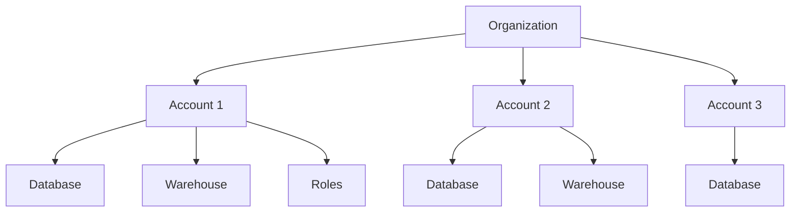
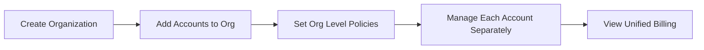
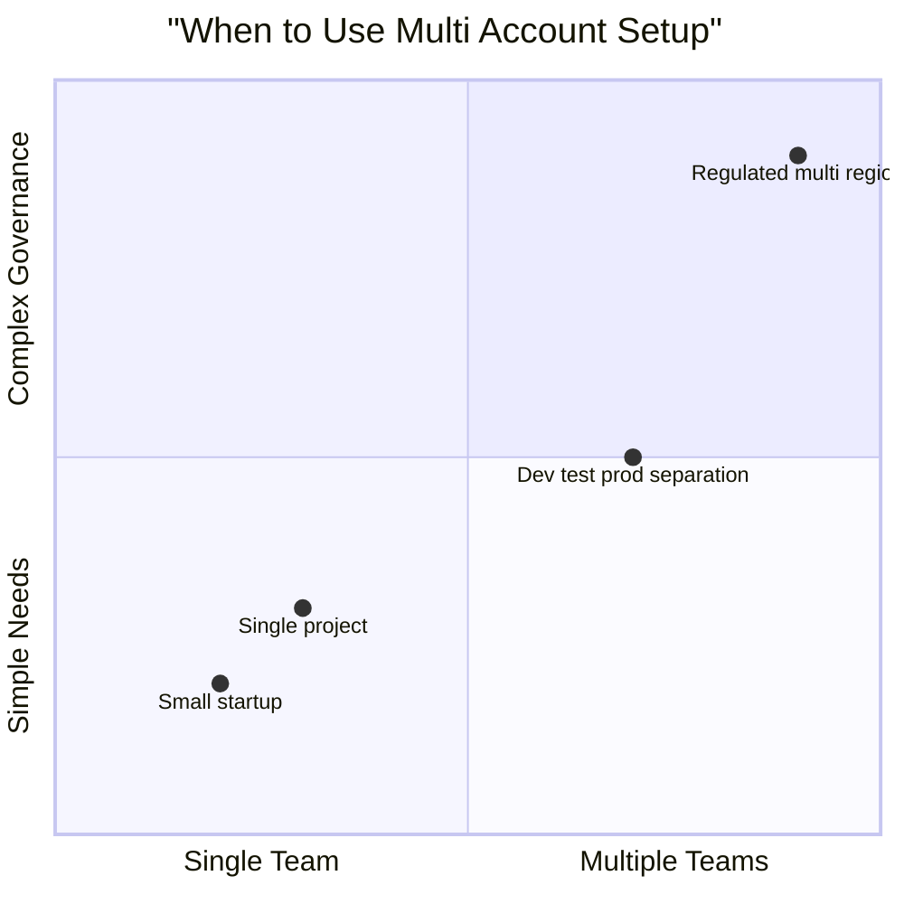
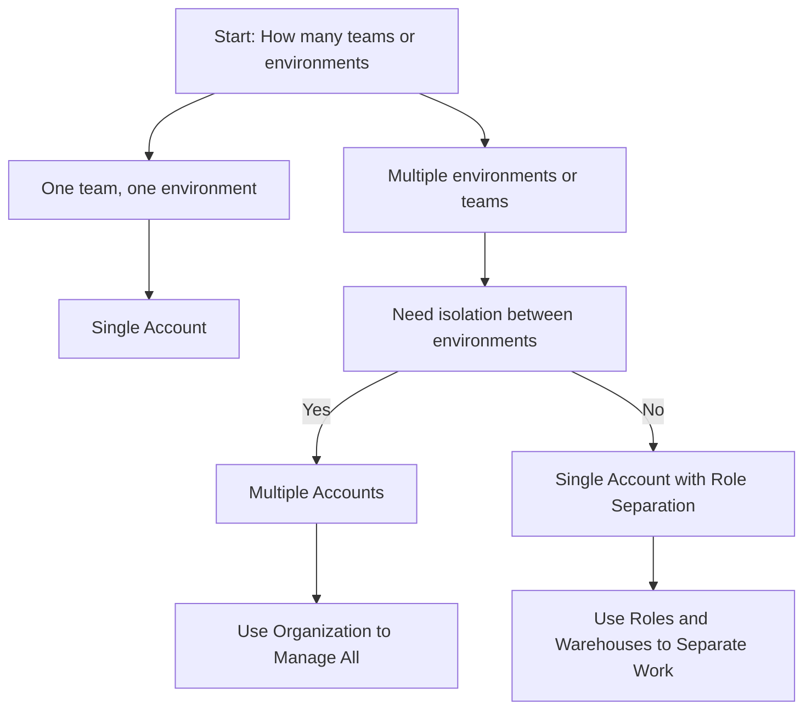
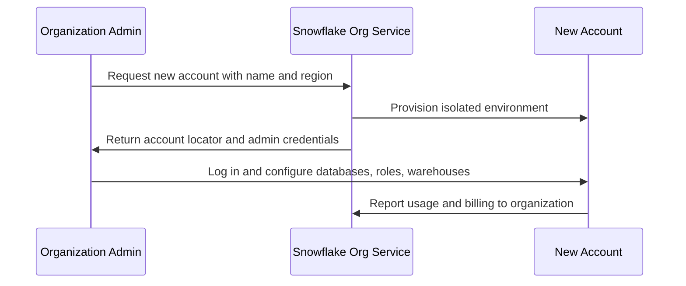
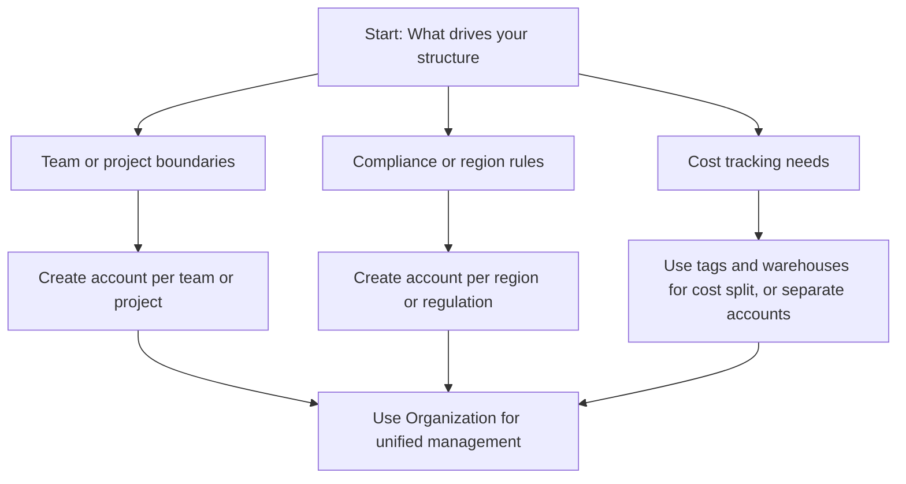

# Organization and Account Objects in Snowflake

| Level | What It Is | What You Manage Here |
|-------|-----------|---------------------|
| Organization | Top level container for multiple accounts | Organization wide policies, account provisioning, SSO setup, billing aggregation |
| Account | Isolated Snowflake environment | Databases, warehouses, users, roles, shares, tasks |

## Organization Level Objects

- Organization account is The master account that creates and manages other accounts
- Account listings: View all accounts under the organization with status and region
- Organization roles: Roles that span multiple accounts for cross account administration
- Policy templates: Define security, network, or data policies to apply across accounts
- Billing view: Consolidated credit usage and cost reporting for all accounts

## Account Level Objects

- Users: Individual people or service accounts that log in
- Roles: Collections of privileges assigned to users or other roles
- Warehouses: Compute clusters that run queries and load data
- Databases: Logical containers for schemas and tables
- Integrations: Connections to external systems like S3, Azure Blob, or OAuth providers
- Shares: Secure data sharing configurations for internal or external consumers

| Scenario | Recommended Setup | Why |
|----------|------------------|-----|
| One team, one project | Single account | Less overhead, simpler management |
| Dev, test, prod environments | Separate accounts per environment | Isolate risk, control costs, prevent accidental changes |
| Multiple business units | One account per unit | Clear ownership, separate billing, independent scaling |
| Compliance boundaries | Separate accounts per regulation | Enforce different policies, limit data exposure |
| Multi region deployment | Accounts in each region | Reduce latency, meet data residency rules |

## Account Creation and Management

| Action | Where You Do It | What Happens |
|--------|----------------|--------------|
| Create new account | Organization admin console | New isolated Snowflake account with admin user |
| Suspend account | Organization console or API | Account becomes read only, no new queries allowed |
| Resume account | Organization console | Account returns to full operation |
| Delete account | Organization console with confirmation | Account and all data permanently removed after retention period |
| Transfer account | Organization admin | Move account from one organization to another |

## Security and Governance Boundaries

- Users and roles exist inside one account only. They do not automatically work in other accounts
- Data sharing can cross account boundaries using secure shares, but objects stay in source account
- Warehouses cannot be shared. Each account manages its own compute resources
- Organization level policies can enforce rules like MFA or IP allow lists across all accounts
- Audit logs are per account. Organization view aggregates but does not merge detailed logs

## Common Setup Patterns

| Pattern | Structure | Best For |
|---------|-----------|----------|
| Environment isolation | dev_account, test_account, prod_account | Teams that need safe promotion pipelines |
| Business unit separation | finance_account, marketing_account, ops_account | Large organizations with independent budgets |
| Regional compliance | us_east_account, eu_west_account, ap_south_account | Data residency requirements or latency optimization |
| Project based | project_alpha_account, project_beta_account | Short term initiatives with clear end dates |
| Hybrid | prod_account + shared_dev_account | Balance isolation with resource efficiency |

## Things to Watch For

- Account locators are permanent. Choose naming carefully before creation
- Changing an account name does not change its locator. Applications connect via locator
- Cross account queries require secure shares or replication. They do not work automatically
- Billing rolls up to organization, but cost allocation tags must be set per account
- Organization admins can access any account. Limit this role to trusted personnel only
- Replication and failover work between accounts but require explicit setup and permissions

## Key Points

- Organization is for management. Account is for work. Keep that separation clear
- Start with one account if you are small. Split later when isolation becomes valuable
- Use roles and warehouses to separate work inside an account before adding more accounts
- Document your account naming convention early. It is hard to change later
- Test cross account sharing before you depend on it in production
- Monitor credit usage at both account and organization level to catch surprises early

Think of organization and accounts like a company and its departments:
- Organization sets the rules and pays the bills
- Each account runs its own work with its own tools
- Departments can share information when needed, but stay independent
- Adding a new department is easy. Merging them later is hard

Design your structure for how you work today, with room to grow tomorrow.
