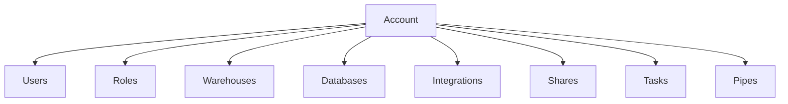
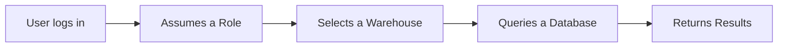
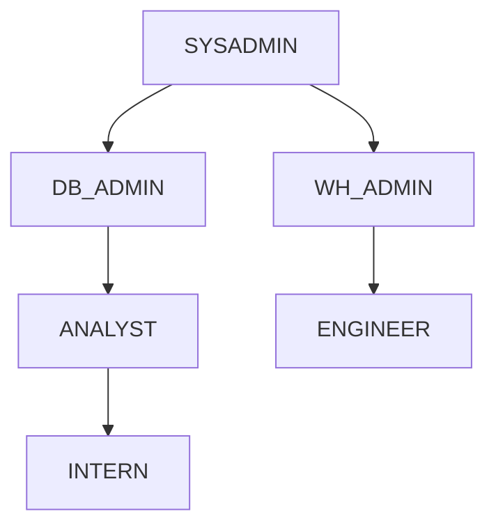
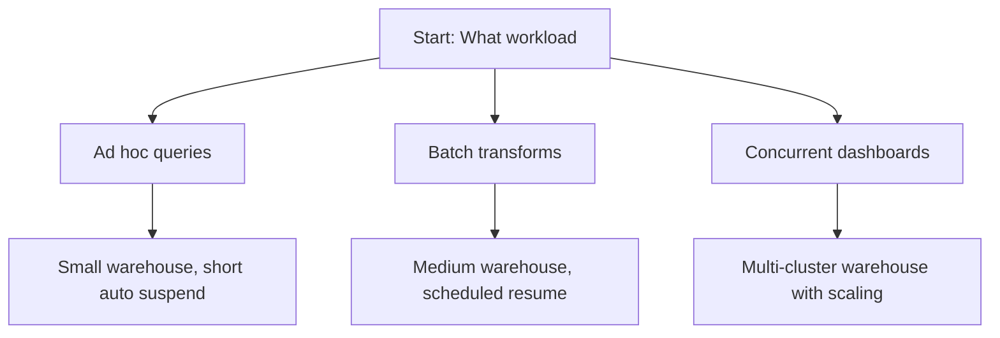
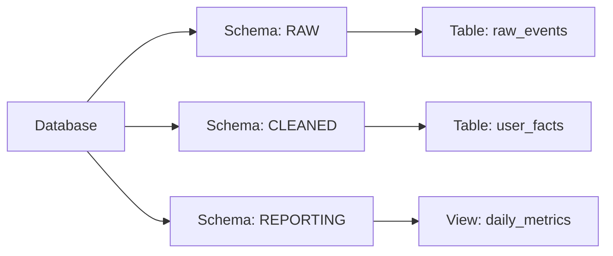
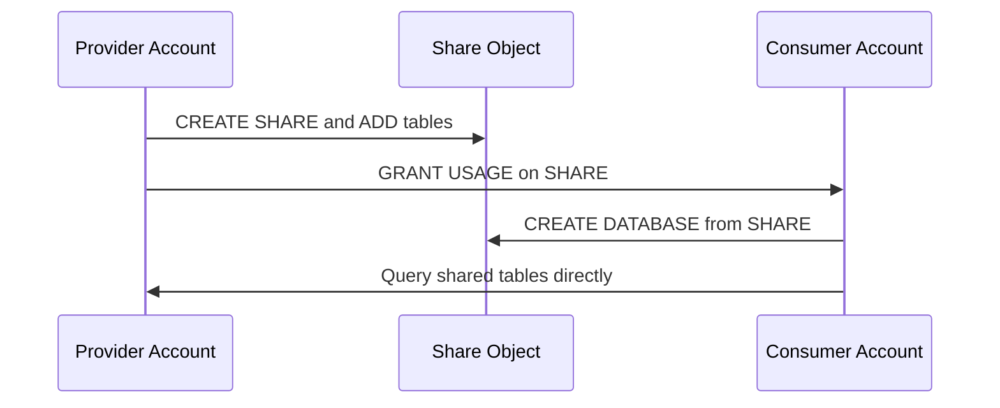
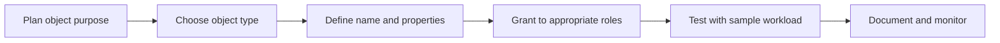
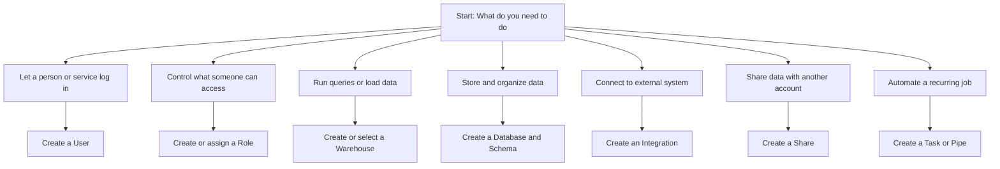

# Snowflake Account Objects Overview
Let us deep dive into Account objects most commonly used in Snowflake

## Overview
| Object Type | Purpose | Key Properties |
|-------------|---------|---------------|
| Users | People or services that log in | Username, auth method, default role, status |
| Roles | Collections of privileges | Role name, parent roles, granted privileges |
| Warehouses | Compute clusters for running queries | Size, auto suspend, auto resume, scaling policy |
| Databases | Top level containers for data | Name, retention period, replication config |
| Integrations | Connections to external systems | Type (storage, notification, api), auth config |
| Shares | Secure data sharing setups | Provider account, consumer list, included objects |
| Tasks | Scheduled SQL or script execution | Schedule, warehouse, dependencies, state |
| Pipes | Automated data loading from stages | Source stage, COPY command, error handling |

## Users

- Represent individual people or automated services
- Each user has a login name and authentication method
- Authentication options: password, key pair, OAuth, SSO
- Users are assigned default roles and warehouses
- Users can be suspended without deleting their history

| User Property | Example Value | Why It Matters |
|---------------|---------------|----------------|
| Login name | analyst_jane | How the user identifies at login |
| Default role | ANALYST_ROLE | Determines initial permissions |
| Default warehouse | SMALL_WH | Controls compute cost for ad hoc queries |
| Auth type | KEY_PAIR | More secure than password for automation |
| Status | ACTIVE or DISABLED | Controls whether login is allowed |

## Roles

- Roles group privileges and can be assigned to users or other roles
- Role hierarchy allows inheritance: parent roles pass privileges to children
- Every privilege in Snowflake is granted to a role, never directly to a user

### Role Patterns
| Role Pattern | When To Use | Example |
|--------------|-------------|---------|
| Functional roles | Team based access | ANALYST_ROLE, ENGINEER_ROLE |
| Environment roles | Separate dev and prod | DEV_ROLE, PROD_ROLE |
| Project roles | Short term initiatives | PROJECT_ALPHA_ROLE |
| Service roles | Automation and pipelines | ETL_SERVICE_ROLE |

## Warehouses

- Virtual compute clusters that execute queries and load data
- Sized from XSmall to 6XLarge, each step doubles compute power
- Auto suspend stops billing when idle, auto resume starts on demand

| Warehouse Setting | Recommended Value | Reason |
|-------------------|-------------------|--------|
| Auto suspend | 60 seconds for dev, 300 for prod | Save credits without interrupting work |
| Auto resume | True for interactive, False for scheduled | Prevent unexpected charges from stray queries |
| Initial size | Match to workload complexity | Small for testing, larger for heavy transforms |
| Max cluster count | 1 for simple, 2+ for variable load | Handle concurrency without manual intervention |
| Statement timeout | 300 seconds default | Kill runaway queries before they waste credits |

## Databases and Schemas

>[!Tip]
>In the Snowflake architecture, a database is the top level logical container within an account. It functions as the primary namespace and administrative boundary used to manage and organize one or more schemas. The database level establishes the broadest domain for role based access control, data sharing capabilities, and replication policies across the Snowflake environment.

>[!Tip]
>In Snowflake, a schema is a secondary logical container nested directly within a parent database. It serves as a specialized directory that groups and organizes specific data objects such as tables, views, stored procedures, and external stages. Schemas provide a mechanism for granular data categorization and precise security management, ensuring that users and roles only interact with the exact data objects they are authorized to access.

- Database: Top level logical container for related data
- Schema: Sub container inside a database for organizing tables and views
- Both support Time Travel and failover configuration

| Object | Scope | Typical Use |
|--------|-------|-------------|
| Database | Account wide | Separate business domains: FINANCE_DB, MARKETING_DB |
| Schema | Inside one database | Separate data types: RAW, CLEANED, REPORTING |

Below you can find a table of differences between a database and a schema for deeper comprehension
| Feature | Database | Schema |
| :--- | :--- | :--- |
| Hierarchy Level | Highest logical container within a Snowflake account. | Subordinate logical container residing within a Database. |
| Namespace Role | First tier of the namespace structure. | Second tier of the namespace structure. |
| Contained Elements | Holds one or multiple schemas. | Holds tables, views, stages, sequences, and functions. |
| Default Creation | When created, Snowflake automatically generates two default schemas: PUBLIC and INFORMATION_SCHEMA. | When created, it contains no default tables or views. |
| Fully Qualified Name | DATABASE_NAME | DATABASE_NAME.SCHEMA_NAME |
| Cloning Scope | Cloning a database clones all of its underlying schemas and their objects. | Cloning a schema only clones the objects within that specific schema. |
| Data Sharing | Shares are created and configured at the database level. | Specific schemas are granted to shares, but the share itself belongs to the database. |
| Security Granularity | Broad level access control (granting usage on the entire database). | Fine grained access control (granting usage on specific groupings of tables). |

## Integrations

- Define secure connections to external systems
- Types: storage (S3, Azure, GCS), notification (SNS, Event Grid), API, OAuth

| Integration Type | Use Case | Key Config |
|-----------------|----------|------------|
| Storage | Load data from cloud storage | Bucket URL, credentials or IAM role |
| Notification | Trigger pipelines on new files | Queue ARN or topic name |
| OAuth | Connect to external identity provider | Client ID, secret, token endpoint |
| API | Call external services from Snowflake | Endpoint URL, auth method |

## Shares

- Enable secure data sharing without copying data
- Provider creates share, adds objects, grants to consumer accounts
- Consumer queries shared data as if it were local

## Tasks and Pipes

>[!Note]
>In the Snowflake architecture, a task is a database object designed to schedule and automate the execution of a single SQL statement, a stored procedure, or procedural logic. Tasks enable the orchestration of recurring data pipelines and administrative operations by executing either on a predefined time based schedule or sequentially as a dependent node within a directed acyclic graph triggered by the successful completion of a predecessor task.

>[!Note]
>In Snowflake, a pipe is a specialized database object that facilitates continuous, automated data ingestion through the Snowpipe service. A pipe encapsulates a specific COPY INTO command that loads structured or semi structured data from an internal or external stage into a designated target table. The execution of a pipe is typically triggered by cloud storage event notifications or invoked via REST API calls, enabling near real time micro batch processing.

- Tasks: Schedule SQL statements or stored procedures
- Pipes: Automate COPY INTO from stages when new files arrive

| Feature | Tasks | Pipes |
|---------|-------|-------|
| Trigger | Time based schedule or after another task | File arrival in stage |
| Use case | Daily aggregates, cleanup jobs | Continuous data ingestion |
| Error handling | Retry logic, alerting via integrations | Dead letter queue, error table |
| Monitoring | Task history view, system functions | Pipe status, load history |

## Object Creation Flow

## Common Object Patterns

| Pattern | Objects Involved | Why It Works |
|---------|-----------------|--------------|
| Dev test prod isolation | Separate databases or accounts per environment | Prevent accidental changes to production data |
| Role based access | Functional roles with least privilege | Users get only what they need, easier audits |
| Auto scaling warehouses | Multi-cluster warehouse with min max size | Handle traffic spikes without manual intervention |
| Secure sharing | Share object with consumer accounts | Share data without duplication or movement |
| Automated ingestion | Stage plus pipe plus notification integration | Load new files as soon as they arrive |

## Troubleshooting Table

| Issue | Likely Cause | Fix |
|-------|--------------|-----|
| User cannot see table | Role lacks privilege on object | Grant SELECT on table to user role |
| Query runs slowly | Warehouse too small or suspended | Increase size or enable auto resume |
| Task does not fire | Warehouse not set or task suspended | Assign warehouse and resume task |
| Pipe not loading files | Notification integration misconfigured | Verify queue permissions and event mapping |
| Share query fails | Consumer lacks role on shared database | Grant USAGE on database to consumer role |

Key Practices

- Name objects clearly and consistently. Avoid generic names like test_db
- Grant privileges to roles, not directly to users. Makes audits and changes easier
- Use tags on objects to track ownership, cost center, or environment
- Set auto suspend on all warehouses. Prevents billing for idle compute
- Test object permissions with a non admin role before deploying
- Document the purpose of each role and warehouse in a central location
- Monitor object usage with ACCOUNT_USAGE views to find unused resources

### Object Selection Guide

## Bottom Line

- Account objects are the building blocks of your Snowflake work
- Start with the minimum you need. Add complexity only when your workflow requires it
- Every object has a purpose. If you cannot explain why it exists, reconsider creating it
- Permissions flow through roles. Design your role hierarchy before adding many users
- Compute costs live in warehouses. Size and suspend settings matter more than you think
- Data lives in databases and schemas. Organize them to match how your team thinks about the business
- Automation lives in tasks and pipes. Use them to reduce manual work, but monitor them closely

Think of account objects like tools in a workshop:
- Users are the people who use the tools
- Roles are the permissions that say which tools each person can touch
- Warehouses are the power sources that run the tools
- Databases and schemas are the shelves where you store your materials
- Integrations are the doors that connect your workshop to the outside
- Shares are the windows that let others see your work without entering
- Tasks and pipes are the timers and conveyors that keep things moving

Pick the right tool for the job. Use each one for what it does best.
