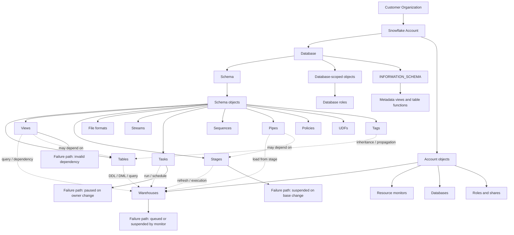

# Snowflake Object Hierarchy and Types

Snowflake’s documented object model is a containment hierarchy: the customer organization sits at the top, all databases in an account sit under the account object, and securable objects such as tables, views, functions, and stages live inside schemas. A database is a logical grouping of schemas, and a schema is a logical grouping of database objects. Snowflake also creates an `INFORMATION_SCHEMA` schema in every database, which exposes metadata for both in-database objects and selected account-level objects. ([Snowflake Docs][1])

## 1) Object hierarchy, operationally

The diagram reflects the documented container hierarchy, managed access behavior, object dependency tracking, and the fact that warehouses are the compute boundary for queries and DML, including loading data into tables. Snowpipe, tasks, and materialized views all have documented object relationships that can fail or suspend when dependencies or ownership change. ([Snowflake Docs][1])

## 2) Object type taxonomy

| Scope              | Representative object types                                                                 | Behavior that matters in production                                                                        | Edge case or failure mode                                                                                                                                                                                                            |
| ------------------ | ------------------------------------------------------------------------------------------- | ---------------------------------------------------------------------------------------------------------- | ------------------------------------------------------------------------------------------------------------------------------------------------------------------------------------------------------------------------------------ |
| Account object     | Databases, warehouses, resource monitors, shares, roles                                     | Controls global namespace and compute entry points                                                         | Warehouse credit use is metered independently; resource monitors can suspend warehouses on quota breach. ([Snowflake Docs][2])                                                                                                       |
| Database           | Schemas, database roles, database replication targets                                       | Namespace boundary for contained objects; database creation auto-creates `PUBLIC` and `INFORMATION_SCHEMA` | Databases created from shares do not get `PUBLIC` or `INFORMATION_SCHEMA` unless explicitly granted, and `TRANSIENT` and `DATA_RETENTION_TIME_IN_DAYS` do not apply. ([Snowflake Docs][3])                                           |
| Schema             | Tables, views, stages, file formats, sequences, streams, tasks, pipes, policies, UDFs, tags | Main securable container for data and logic objects                                                        | Managed access schemas centralize privilege management in the schema owner or a role with `MANAGE GRANTS`. ([Snowflake Docs][4])                                                                                                     |
| Table family       | Permanent, temporary, transient, external, dynamic, materialized, event, Iceberg, hybrid    | Table semantics drive durability, refresh, read-only behavior, and billing                                 | Temporary tables are session-scoped. Transient tables have lower protection than permanent tables. Hybrid tables cannot be temporary or transient. External tables are read-only. Dynamic tables auto-refresh. ([Snowflake Docs][5]) |
| Governance objects | Tags, policies, masking, row access, privacy policies                                       | Shape access and lineage without moving data                                                               | Tags can inherit down the hierarchy and can be propagated automatically. Cloning can preserve or omit policies depending on the source and clone scope. ([Snowflake Docs][6])                                                        |
| Metadata surfaces  | `INFORMATION_SCHEMA`, `ACCOUNT_USAGE`, `READER_ACCOUNT_USAGE`                               | Inventory, lineage, usage, and incident response                                                           | `ACCOUNT_USAGE` includes dropped objects, has longer retention, and has latency from 45 minutes to 3 hours. `INFORMATION_SCHEMA` is read-only and has no such latency. ([Snowflake Docs][7])                                         |

## 3) Execution internals and transactional boundaries

Snowflake does not publish a full internal engine blueprint for object DDL, thread scheduling, or memory allocation at the object-layer level. What it does publish is the behavioral contract that matters operationally: namespace resolution is database plus schema, `CREATE OR REPLACE` is atomic, object ownership defaults to the creating role, managed access schemas centralize grants, and dependencies are tracked by object name, ID, or both. That is the contract you can safely design around. ([Snowflake Docs][8])

Operationally, object creation and replacement are metadata transactions. For `CREATE OR REPLACE`, Snowflake says the old object is deleted and the new object is created in a single transaction, so concurrent readers see either the old version or the new version, not a half-built state. For tables, that replacement also drops change data, so streams can become stale. For databases, `CREATE OR REPLACE` is also atomic, and database creation automatically creates `PUBLIC` and `INFORMATION_SCHEMA`. ([Snowflake Docs][5])

The transactional boundary is different from data movement. Snowflake’s `OBJECT_DEPENDENCIES` view records references where one object points to another without materializing or copying data, such as a view referencing a table. It explicitly does not include data-movement operations such as CTAS, INSERT, or MERGE. That distinction is crucial when you are building impact analysis or clone-safe promotion pipelines. ([Snowflake Docs][9])

For access control, object ownership is singular. The role that creates the object owns it by default, and ownership can be transferred. In a regular schema, the object owner can grant privileges. In a managed access schema, only the schema owner or a role with `MANAGE GRANTS` can grant privileges on contained objects. That matters because a schema is not just a namespace, it is also a governance boundary. ([Snowflake Docs][1])

## 4) Parameter and configuration deep dive

| Setting or object property            | Internal behavior                                                                                                                                                                  | Performance impact                                                                          | Compliance / edge cases                                                                                      | Production default or recommendation                                                       |
| ------------------------------------- | ---------------------------------------------------------------------------------------------------------------------------------------------------------------------------------- | ------------------------------------------------------------------------------------------- | ------------------------------------------------------------------------------------------------------------ | ------------------------------------------------------------------------------------------ |
| Account, session, object parameters   | Snowflake has three parameter levels, and lower scopes can override higher ones. Object parameters can apply to warehouses, databases, schemas, and tables. ([Snowflake Docs][10]) | Object-scoped tuning lets you localize behavior instead of changing an entire account.      | Mis-scoping a parameter can create hard-to-diagnose drift between environments.                              | Keep account defaults conservative, override only at the lowest safe scope.                |
| Managed access schema                 | Centralizes grant control in the schema owner or `MANAGE GRANTS` roles. ([Snowflake Docs][11])                                                                                     | No direct compute cost, but it reduces privilege sprawl and grant churn.                    | Object owners lose grant authority, which can break legacy promotion scripts.                                | Use for curated production schemas, especially where multiple teams publish objects.       |
| Temporary table                       | Session-scoped, dropped at session end. ([Snowflake Docs][5])                                                                                                                      | Avoids long-lived storage and Fail-safe overhead, but cannot be used for durable pipelines. | Same-name collisions shadow permanent objects in the session.                                                | Use for scratch, staging, and idempotent batch intermediates.                              |
| Transient table or schema or database | No Fail-safe after Time Travel; lower protection than permanent. ([Snowflake Docs][5])                                                                                             | Lower storage overhead than permanent equivalents.                                          | Data can be lost in system failure after Time Travel expires.                                                | Use only for data that can be recreated externally.                                        |
| External table                        | Reads from an external stage and is read-only. ([Snowflake Docs][12])                                                                                                              | Querying may be slower than native tables; materialized views can improve it.               | Stage is outside Snowflake; security depends on external storage and connectivity setup.                     | Use for lake-style access and immutable source data.                                       |
| Dynamic table                         | Auto-refreshes from a defined query and target freshness. ([Snowflake Docs][13])                                                                                                   | Moves refresh cost into background maintenance, reducing custom orchestration.              | Freshness lag and refresh cost depend on upstream change volume.                                             | Use when you want managed incremental transformations without task chaining.               |
| Materialized view                     | Pre-computes query results and maintains them in background. ([Snowflake Docs][14])                                                                                                | Faster reads on frequently reused or expensive logic, but refresh adds write overhead.      | Base table changes can suspend the view. Session-variable dependence can make queries fail if values change. | Use for selective, high-read workloads with stable base schemas.                           |
| Warehouse size                        | Credit rate doubles by size step for Gen1, with per-second billing and a 60-second minimum on each start. ([Snowflake Docs][15])                                                   | Larger warehouse can improve query latency, especially for larger or more complex queries.  | Bigger is not always faster for small queries.                                                               | Start small, scale only after observing queueing and elapsed time.                         |
| Multi-cluster warehouse               | Adds clusters to handle concurrency. Credits are size multiplied by clusters that run in the billing interval. ([Snowflake Docs][15])                                              | Best tool for concurrency and queue reduction.                                              | Enterprise Edition feature.                                                                                  | Prefer this over warehouse sprawl when the bottleneck is concurrent demand.                |
| Resource monitor                      | Monitors warehouse credit usage and can suspend warehouses at thresholds. ([Snowflake Docs][16])                                                                                   | Prevents runaway spend, but can interrupt workloads.                                        | Must be aligned with business SLOs to avoid self-inflicted outages.                                          | Set thresholds, notifications, and suspend behavior intentionally, not as an afterthought. |

## 5) Performance and resource implications

For compute-backed object activity, the primary gating factor is the warehouse. Snowflake says warehouses are required for queries and all DML, including loading data into tables. Snowflake also says a warehouse calculates and reserves resources per query, and queues work when capacity is insufficient. Multi-cluster warehouses are the supported way to automate concurrency scaling. ([Snowflake Docs][15])

Credit math is transparent enough to engineer around. On Gen1 standard warehouses, the credit rate doubles by size step, billing is per second with a 60-second minimum each time the warehouse starts, and multi-cluster billing is the sum of running clusters across the interval. That means short-lived spiky workloads can be surprisingly expensive if you repeatedly cold-start larger warehouses, while small warehouses with good auto-suspend often win on cost. ([Snowflake Docs][15])

For storage-heavy object types, durability choice is a cost lever. Permanent tables carry the stronger protection model. Transient tables and transient schemas remove Fail-safe, which lowers protection after Time Travel but also lowers storage overhead. Temporary tables expire with the session. Snowflake explicitly recommends transient or temporary only when data can be recreated externally or is short-lived. ([Snowflake Docs][5])

For object relationships, dependency drift matters more than raw DDL speed. A materialized view can be suspended if the base table changes shape or is renamed or swapped. A table replacement can stale dependent streams. Cloning inherits object parameters and can preserve or omit policy objects depending on what is cloned. These are the failure modes that tend to surprise teams in production. ([Snowflake Docs][14])

What Snowflake publishes does not include a fixed per-query memory threshold or thread allocation model for object DDL. The actionable signals are warehouse load, queuing, query history, metering, and the behavior of the dependent object types. In practice, use load and metering data to infer whether you are CPU-bound, queue-bound, or spend-bound rather than expecting a public “spill threshold” number. That is an inference from the published telemetry surface, not a stated engine contract. ([Snowflake Docs][17])

[1]: https://docs.snowflake.com/en/user-guide/security-access-control-overview "Overview of Access Control | Snowflake Documentation"
[2]: https://docs.snowflake.com/en/sql-reference/sql/show-warehouses "SHOW WAREHOUSES | Snowflake Documentation"
[3]: https://docs.snowflake.com/en/sql-reference/sql/create-database "CREATE DATABASE | Snowflake Documentation"
[4]: https://docs.snowflake.com/en/sql-reference/functions/get_ddl?utm_source=chatgpt.com "GET_DDL | Snowflake Documentation"
[5]: https://docs.snowflake.com/en/sql-reference/sql/create-table "CREATE TABLE | Snowflake Documentation"
[6]: https://docs.snowflake.com/en/user-guide/object-tagging/introduction "Introduction to object tagging | Snowflake Documentation"
[7]: https://docs.snowflake.com/en/sql-reference/account-usage "Account Usage | Snowflake Documentation"
[8]: https://docs.snowflake.com/en/sql-reference/ddl-database "Database, schema, & share DDL | Snowflake Documentation"
[9]: https://docs.snowflake.com/en/sql-reference/account-usage/object_dependencies "OBJECT_DEPENDENCIES view | Snowflake Documentation"
[10]: https://docs.snowflake.com/en/sql-reference/parameters "Parameters | Snowflake Documentation"
[11]: https://docs.snowflake.com/en/user-guide/security-access-control-configure "Configuring access control | Snowflake Documentation"
[12]: https://docs.snowflake.com/en/user-guide/tables-external-intro "Introduction to external tables | Snowflake Documentation"
[13]: https://docs.snowflake.com/en/user-guide/dynamic-tables-about "Dynamic tables | Snowflake Documentation"
[14]: https://docs.snowflake.com/en/user-guide/views-materialized "Working with Materialized Views | Snowflake Documentation"
[15]: https://docs.snowflake.com/en/user-guide/warehouses-overview "Overview of warehouses | Snowflake Documentation"
[16]: https://docs.snowflake.com/en/sql-reference/ddl-virtual-warehouse "Warehouse & resource monitor DDL | Snowflake Documentation"
[17]: https://docs.snowflake.com/en/sql-reference/account-usage/warehouse_load_history "WAREHOUSE_LOAD_HISTORY view | Snowflake Documentation"
