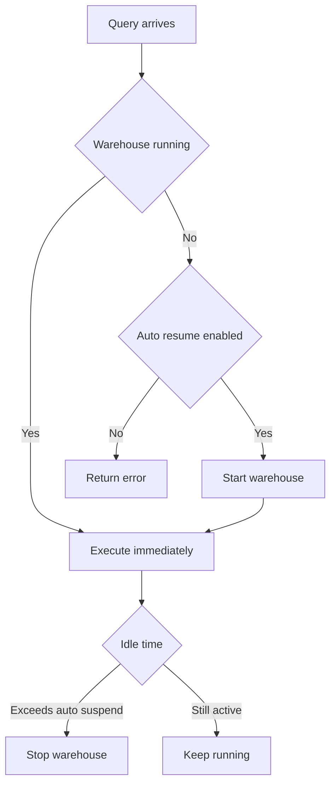
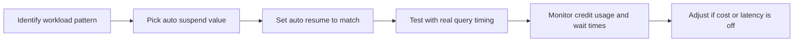
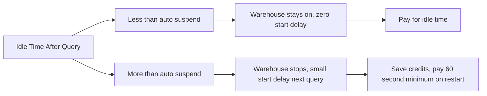
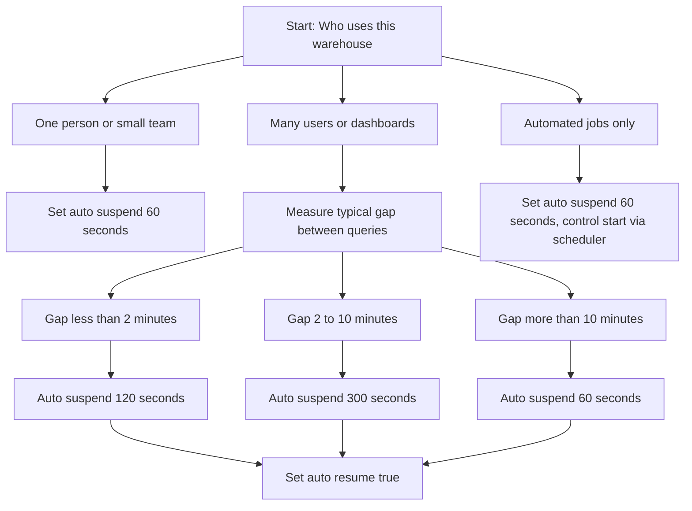

# Auto Suspend and Workloads

# Auto Suspend and Workloads Best Practices

## What Auto Suspend Does

| Setting | Effect | Cost Impact |
|---------|--------|-------------|
| Auto suspend = 60 seconds | Warehouse stops 1 minute after last query ends | Saves credits fast, may add 1-2 second start delay |
| Auto suspend = 300 seconds | Warehouse waits 5 minutes before stopping | More responsive, costs more if idle time is long |
| Auto suspend = 0 or disabled | Warehouse never stops automatically | Highest cost, zero start delay |
| Auto resume = true | Warehouse starts automatically when query arrives | Prevents errors, enables auto suspend to work |
| Auto resume = false | Warehouse stays off until manually started | Saves cost but queries fail if warehouse is off |

## Workload Types and Recommended Settings

| Workload Type | Query Pattern | Auto Suspend | Auto Resume | Why |
|---------------|---------------|--------------|-------------|-----|
| Ad hoc analysis | Random queries, minutes apart | 60 seconds | True | Save money between unpredictable queries |
| Dashboard refresh | Queries every 5-15 minutes | 300 seconds | True | Avoid start delay for user facing reports |
| ETL batch job | Many queries in short window, then silence | 0 during job, 60 after | True during job window | Max throughput during job, save after |
| Data science exploration | Long running queries, irregular gaps | 300-600 seconds | True | Avoid interrupting iterative work |
| Scheduled tasks | Queries at known times only | 60 seconds | False | Start warehouse via task scheduler, stop after |
| 24/7 service API | Continuous low volume queries | Disabled or 3600 seconds | True | Eliminate any start latency for end users |

## Cost Math for Auto Suspend

| Scenario | Auto Suspend | Idle Time | Billed Idle Minutes | Credits Wasted XSmall |
|----------|--------------|-----------|-------------------|---------------------|
| Query every 2 minutes | 60 seconds | 60 seconds avg | 1 minute per cycle | 0.017 credits per hour |
| Query every 10 minutes | 300 seconds | 5 minutes idle | 5 minutes per cycle | 0.083 credits per hour |
| Query once per hour | 300 seconds | 55 minutes idle | 5 minutes per cycle | 0.083 credits per hour |
| Query once per hour | 60 seconds | 59 minutes idle | 1 minute per cycle | 0.017 credits per hour |

Note: XSmall = 1 credit per hour. Multiply by warehouse size for other tiers.

## Common Mistakes and Fixes

| Mistake | What Happens | How To Fix |
|---------|--------------|------------|
| Auto suspend disabled on dev warehouse | Warehouse runs 24/7, billing even when no one uses it | Set to 60 seconds for any non production workload |
| Auto resume false with auto suspend enabled | Queries fail with warehouse suspended error | Set auto resume true unless you control start/stop externally |
| Same auto suspend for dev and prod | Dev wastes credits, prod has start delays | Use 60 seconds for dev, 300+ for user facing prod |
| Ignoring query frequency | Picking suspend time without measuring real gaps | Monitor query history for 1 week before setting value |
| Forgetting 60 second minimum billing | Restarting warehouse every minute wastes more than keeping it on | If queries come every 90 seconds, use 120 second suspend not 60 |
| Not testing start time | Assuming resume is instant, but it can take 2-10 seconds | Measure actual start time for your warehouse size and region |

## Decision Flow for Auto Suspend

## Monitoring and Adjusting

| Metric | Where To Find It | What To Look For |
|--------|-----------------|------------------|
| Warehouse load time | Query history, warehouse start events | If consistently over 5 seconds, consider larger size or region check |
| Idle time distribution | ACCOUNT_USAGE warehouse events | If most idle periods exceed your suspend setting, you can lower it |
| Credit usage per query | WAREHOUSE_METERING_HISTORY | If idle credits exceed query credits, lower auto suspend |
| Query wait time | Query history, queued provisioning time | If users wait for warehouse start, increase auto suspend or enable auto resume |
| Restart frequency | Warehouse events log | If restarting more than 10 times per hour, raise auto suspend slightly |

## Key Practices

- Start with 60 seconds for any new warehouse. Lower is safer than higher
- Always pair auto suspend with auto resume true unless you have external orchestration
- Use different warehouses for different workload types. Do not force one setting to fit all
- Measure real query gaps before finalizing suspend time. Guessing leads to waste or delays
- Document the expected pattern for each warehouse. Helps others understand the setting
- Review settings quarterly. Workloads change, and your config should too
- Use resource monitors as a backup. Auto suspend saves money, resource monitors prevent surprises
- Test the user experience. If start delay frustrates users, raise suspend time slightly

## Quick Reference Table

| If your queries come... | Try this auto suspend | And this auto resume |
|-------------------------|----------------------|---------------------|
| Every 30-90 seconds | 120 seconds | True |
| Every 2-5 minutes | 300 seconds | True |
| Every 10-30 minutes | 60 seconds | True |
| Only at scheduled times | 60 seconds | False, start via scheduler |
| Unpredictable, user driven | 300 seconds | True |
| Continuous, 24/7 | Disabled or 3600 seconds | True |

## Bottom Line

- Auto suspend controls when you stop paying for compute
- The right value depends on how often queries arrive, not on warehouse size
- Start conservative with 60 seconds. Raise only if start delay causes real problems
- Auto resume must be true for auto suspend to work without breaking queries
- Measure before you guess. One week of query history tells you more than intuition
- Separate workloads into separate warehouses. One setting cannot optimize for all patterns
- Cost savings compound. Saving 0.1 credits per hour per warehouse adds up fast across many warehouses

Think of auto suspend like a car engine:
- Turning it off saves fuel when parked
- Restarting takes a moment and uses a little extra fuel
- If you step out for 30 seconds, leave it running
- If you step out for 5 minutes, turn it off
- Know your pattern. Adjust your habit. Save without stress
