# Virtual Warehouse Best Practices
This document covers the additional best practices which we did not cover in the previous [document]([url](https://github.com/Balasubramanian-pg/COF-CO3/blob/main/Domain%201.0%20Snowflake%20AI%20Data%20Cloud%20Features%20and%20Architecture/1.4%20Virtual%20Warehouses/Readme.md)). 

Let us first start from understanding the bigger picture.

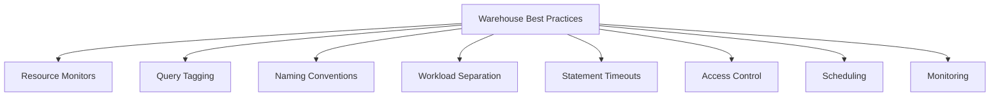

## Resource Monitors and Credit Control

| Setting | What It Does | Recommended Use |
|---------|-------------|-----------------|
| Credit quota | Set maximum credits per billing period | Apply to every production warehouse |
| Notify at thresholds | Send alert at 50 percent, 75 percent, 90 percent usage | Gives team time to adjust before hitting limit |
| Action at limit | Suspend warehouse or block queries | Suspend for dev, block for prod with on call alert |
| Frequency | Monthly or weekly reset | Match to your billing cycle or sprint cadence |

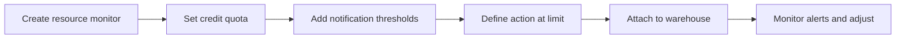

## Query Tagging for Cost Attribution

| Tag Field | Example Value | Why Tag It |
|-----------|---------------|------------|
| team | analytics, finance, engineering | Track cost by owning team |
| project | dashboard_refresh, ml_training, etl_v2 | Allocate spend to initiative |
| environment | dev, test, prod | Separate cost buckets for each stage |
| owner | jane_doe, etl_service | Know who to contact for optimization |
| cost_center | CC_12345 | Map to finance system for chargeback |

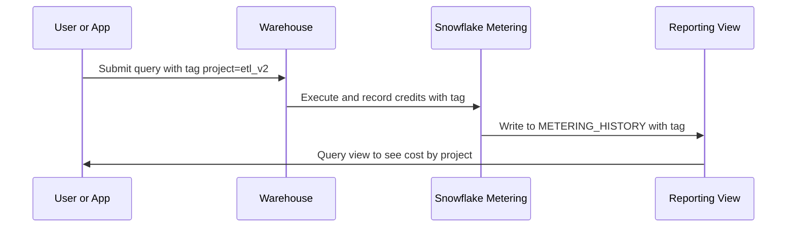

## Naming Conventions That Scale

| Pattern | Example | Benefit |
|---------|---------|---------|
| Purpose first | REPORTING_WH, ETL_WH, DEV_WH | Clear what the warehouse is for |
| Environment suffix | _DEV, _TEST, _PROD | Prevent accidental cross environment use |
| Team prefix | ANALYTICS_REPORTING_WH, FINANCE_ETL_WH | Quick ownership identification |
| Avoid size in name | Do not use MEDIUM_WH | Size changes, name should not |
| Lowercase with underscores | reporting_prod_wh | Consistent, easy to script and search |

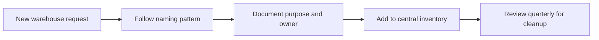

## Workload Separation Strategy

| Workload Type | Dedicated Warehouse | Why Separate |
|---------------|---------------------|--------------|
| Development | DEV_WH (XSmall, 60s suspend) | Prevent dev queries from blocking prod |
| Testing | TEST_WH (Small, 60s suspend) | Isolate test data loads from reporting |
| Production reporting | REPORTING_WH (Medium, multi cluster) | Guarantee performance for business users |
| ETL and transforms | ETL_WH (Large, scheduled) | Heavy jobs do not compete with interactive queries |
| Data science | DS_WH (Medium with acceleration) | Long exploratory queries get needed resources |
| Executive dashboards | EXEC_WH (Medium, Standard policy) | Priority handling for leadership facing tools |

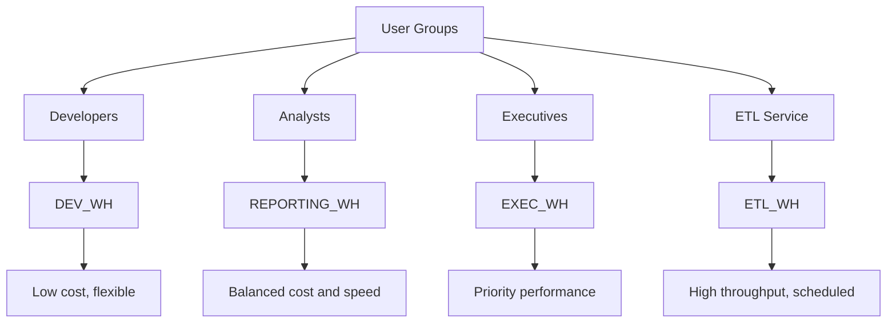

## Statement Timeout Configuration

| Timeout Value | Best For | Risk If Too Short | Risk If Too Long |
|---------------|----------|-------------------|------------------|
| 60 seconds | Simple lookups, API backed queries | Legitimate queries get cancelled | Minimal, but may hide inefficient queries |
| 300 seconds default | General reporting and transforms | Complex joins may fail mid execution | Runaway queries waste more credits |
| 1800 seconds | Large batch transforms, data science | Rarely needed, may indicate poor query design | Very high cost if query loops or scans unnecessarily |
| No timeout | Only for controlled maintenance windows | Not recommended for regular use | Unlimited credit exposure |

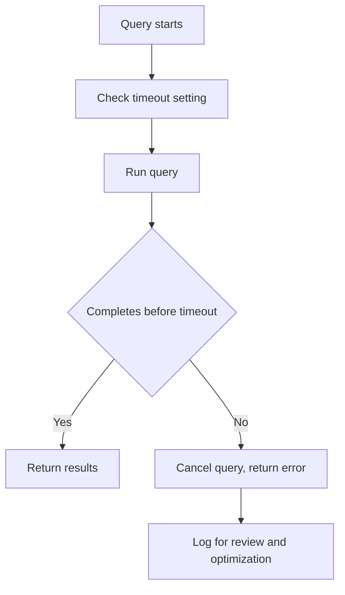

## Access Control and Role Assignment

| Practice | How To Implement | Why It Matters |
|----------|-----------------|----------------|
| Grant warehouse usage to roles, not users | GRANT USAGE ON WAREHOUSE x TO ROLE y | Easier to audit and update when team changes |
| Use separate roles for different warehouses | REPORTING_ROLE, ETL_ROLE, DEV_ROLE | Prevent accidental use of wrong warehouse |
| Limit OPERATE privilege to admins | Only grant to platform team | Prevent users from resizing or suspending warehouses |
| Review warehouse grants quarterly | Query SNOWFLAKE.ACCOUNT_USAGE.GRANTS | Catch stale permissions before they cause issues |
| Document who can use each warehouse | Central wiki or config repo | New team members know where to run their work |

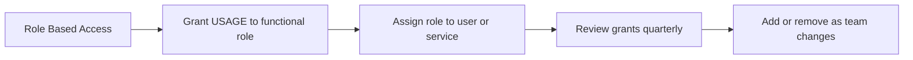

## Warehouse Scheduling for Batch Jobs

| Scenario | Scheduling Approach | Tool Options |
|----------|--------------------|--------------|
| Nightly ETL | Start warehouse 1 hour before job, stop after | Snowflake Tasks, Airflow, cron |
| Weekly report refresh | Resume warehouse 30 minutes before, suspend after | Snowflake Tasks with dependency chain |
| Month end close | Keep warehouse running for 48 hour window | Manual start stop with calendar reminder |
| Ad hoc maintenance | On demand start by admin only | Snowsight or CLI with approval workflow |

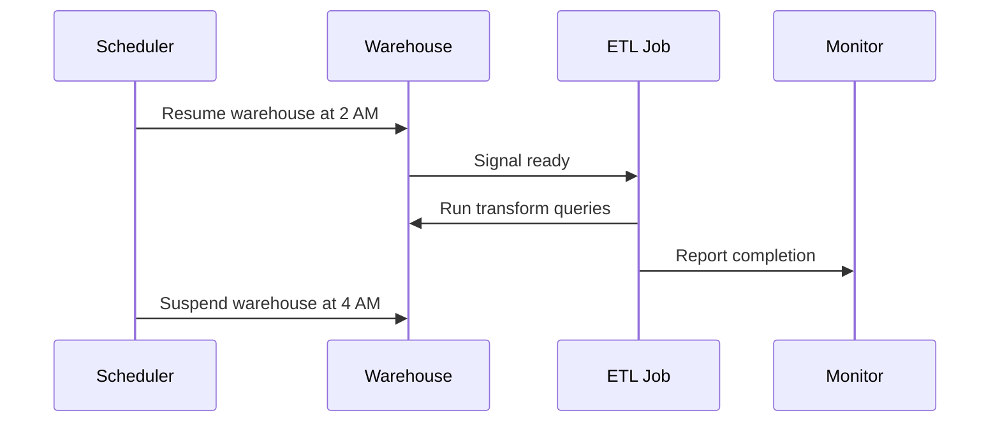

## Monitoring and Alerting Setup

| Metric | Where To Query | Alert Threshold | Action |
|--------|---------------|-----------------|--------|
| Credits per hour | WAREHOUSE_METERING_HISTORY | 2x baseline for 2 hours | Investigate workload change or runaway query |
| Queue time > 30 seconds | QUERY_HISTORY with QUEUED_PROVISIONING_TIME | Sustained during business hours | Scale out or adjust policy |
| Warehouse start failures | WAREHOUSE_EVENTS_HISTORY | Any failure in prod | Alert on call engineer |
| Idle time > auto suspend | WAREHOUSE_LOAD_HISTORY | Frequent short idle periods | Consider lowering auto suspend |
| Query timeout errors | QUERY_HISTORY with ERROR_MESSAGE | Spike in cancellations | Review timeout setting or query patterns |

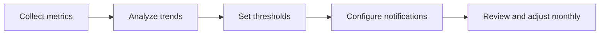

## Cost Attribution and Chargeback

| Step | Action | Output |
|------|--------|--------|
| 1 | Tag every query with team and project | Consistent metadata in metering views |
| 2 | Aggregate credits by tag weekly | Cost breakdown by team or initiative |
| 3 | Share report with stakeholders | Visibility into spend drivers |
| 4 | Set budgets per team via resource monitors | Guardrails before overspend |
| 5 | Review and adjust allocations quarterly | Align spend with business priorities |

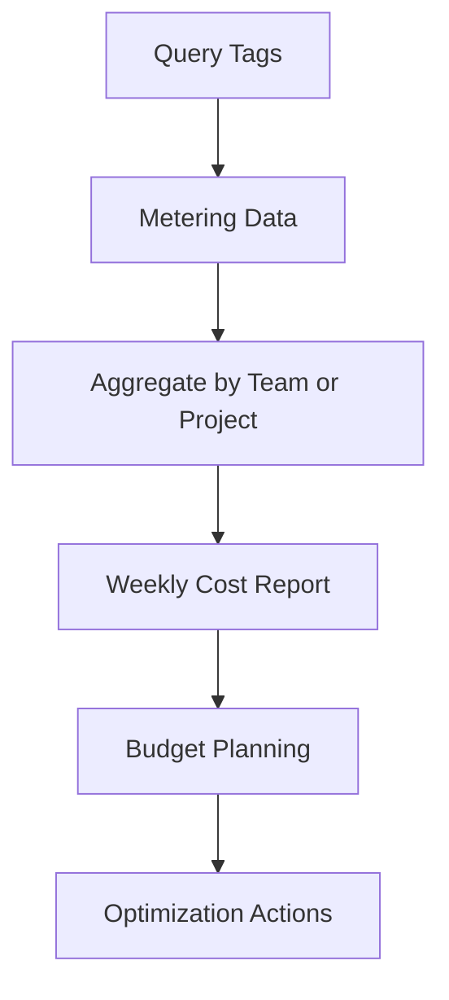

## Testing and Validation Before Production Changes

| Change Type | Test Approach | Rollback Plan |
|-------------|---------------|---------------|
| Resize warehouse | Run sample queries on new size, compare runtime and credits | Revert to previous size if no improvement |
| Add multi cluster | Enable with min 1 max 2, monitor queue times for 1 week | Reduce max back to 1 if cost not justified |
| Change scaling policy | Switch one non critical warehouse first, measure user impact | Revert to previous policy if wait times increase |
| Update auto suspend | Lower by 60 seconds, monitor for start delay complaints | Increase back if users report friction |
| New query tag | Add to dev warehouse first, verify tags appear in metering views | Remove tag if not populating correctly |

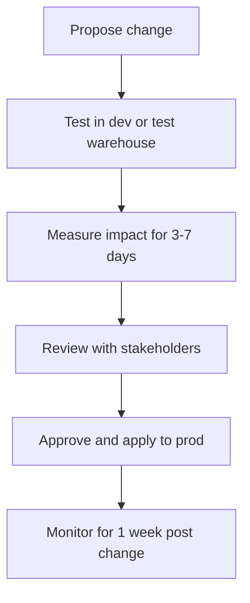

## Quick Reference Checklist

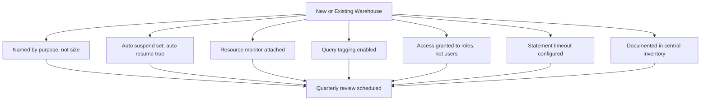

## Common Anti Patterns to Avoid

| Anti Pattern | What Happens | Better Approach |
|--------------|--------------|-----------------|
| One warehouse for everything | Dev queries block prod reports, cost attribution impossible | Separate warehouses by workload type |
| Setting size based on guess | Over provision wastes credits, under provision frustrates users | Test with real queries before finalizing |
| Ignoring query tags | Cannot tell which team or project drove spend | Tag every query at submission |
| Never reviewing settings | Workloads change but config stays static | Schedule quarterly warehouse reviews |
| Granting OPERATE to all users | Anyone can resize or suspend, causing outages | Limit to platform or admin roles |
| Disabling auto suspend to avoid start delay | Warehouse bills 24/7 even when idle | Use 300 second suspend for user facing, 60 for others |

## Bottom Line

- Separate workloads into separate warehouses. One size and policy cannot fit all patterns
- Tag everything. Without tags, you cannot attribute cost or optimize effectively
- Start small and measure. Increase size or clusters only when data shows you need to
- Automate guardrails. Resource monitors and timeouts prevent surprises before they happen
- Document decisions. Future you and your teammates need context for why settings exist
- Review regularly. Workloads evolve, and your warehouse config should evolve with them
- Control access by role. Make it easy to grant and revoke access as teams change
- Test changes in non prod first. Warehouse changes can impact cost and performance immediately

Think of warehouse management like managing a fleet of vehicles:
- Name each vehicle by its job, not its engine size
- Turn off engines when parked to save fuel
- Assign drivers to vehicles by role, not by name
- Track fuel use by trip purpose to spot waste
- Service vehicles on a schedule before they break down
- Keep a log of changes so you know what was done and why

Apply these habits consistently. Small improvements compound. Cost savings add up. Performance stays predictable. Teams stay unblocked.
