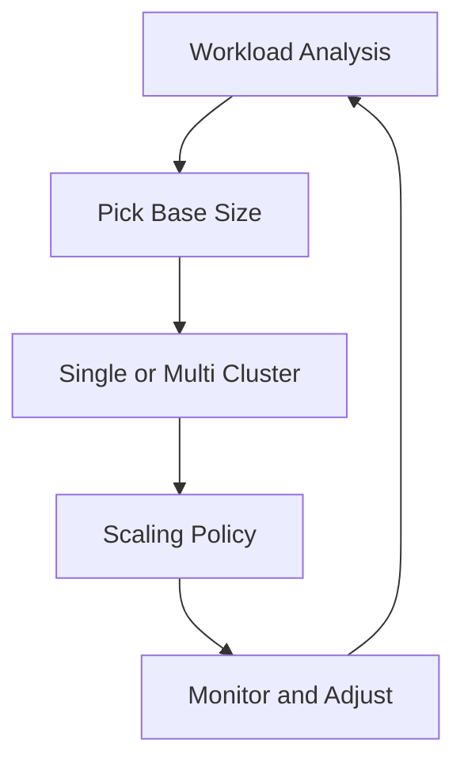
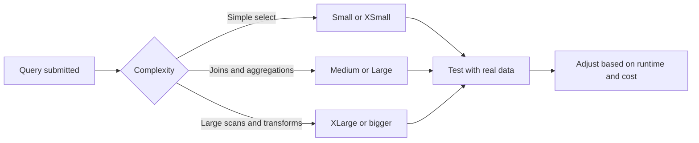
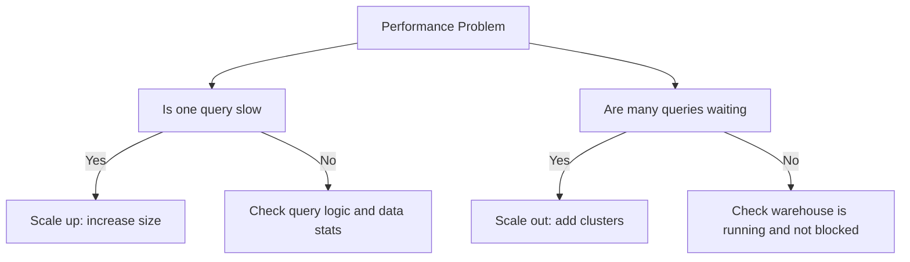
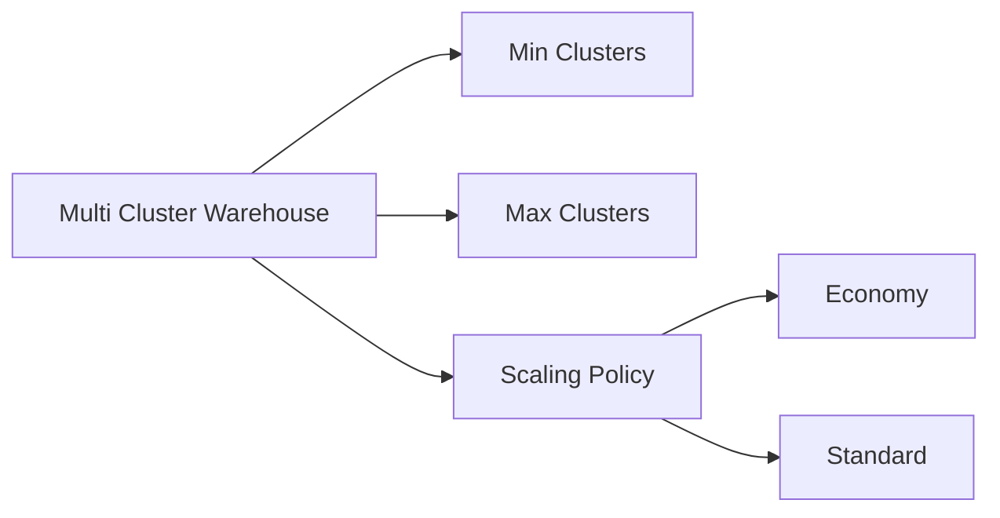
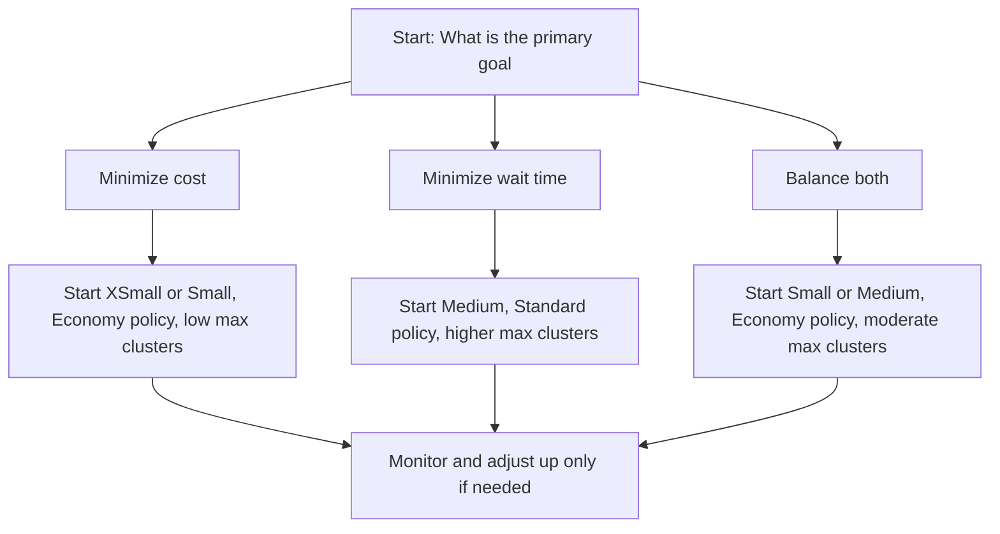
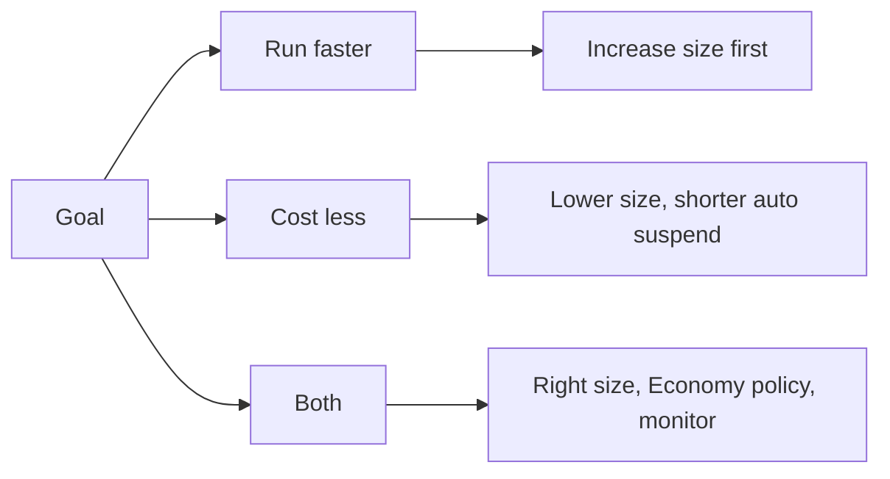
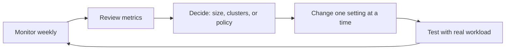
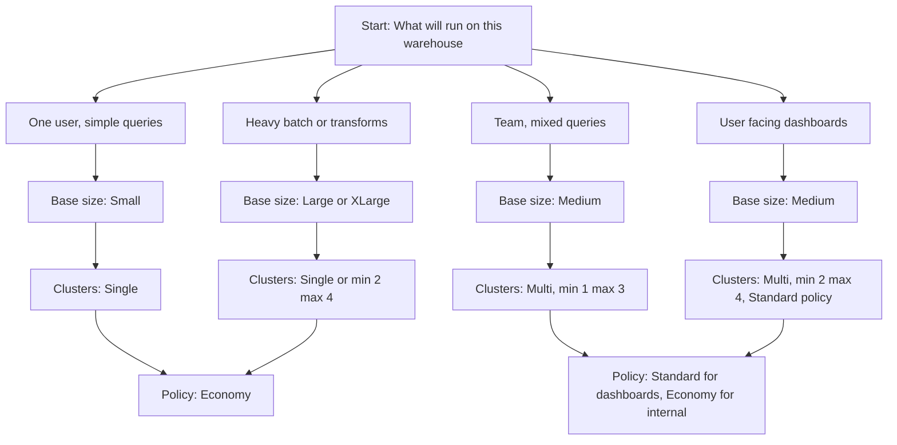

# Virtual Warehouse Sizing and Scaling Best Practices

## Warehouse Size Reference

| Size | Credits Per Hour | Compute Power | Best For |
|------|-----------------|---------------|----------|
| XSmall | 1 | 1x baseline | Learning, testing, tiny queries |
| Small | 2 | 2x baseline | Light analytics, development |
| Medium | 4 | 4x baseline | Regular reporting, moderate data |
| Large | 8 | 8x baseline | Complex transforms, bigger datasets |
| XLarge | 16 | 16x baseline | Heavy ETL, concurrent dashboards |
| 2XLarge | 32 | 32x baseline | Enterprise batch processing |
| 3XLarge to 6XLarge | 64 to 128 | 64x to 128x baseline | Massive parallel workloads |

Note: Each size step doubles compute power and cost. A query that takes 4 minutes on Small may take 2 minutes on Medium, but both cost the same total credits if they do the same work.

## Scale Up vs Scale Out

| Approach | What Changes | When To Use | Tradeoff |
|----------|--------------|-------------|----------|
| Scale up | Increase warehouse size (Small to Medium) | Single query is slow, needs more power | Faster queries, higher cost per minute |
| Scale out | Add more clusters (multi-cluster warehouse) | Many queries waiting, users blocked | Better concurrency, same cost per query |
| Both | Bigger size plus more clusters | Heavy load with complex queries | Maximum performance, maximum cost |

## Multi Cluster Configuration

| Setting | Economy Policy | Standard Policy |
|---------|---------------|-----------------|
| Add cluster when | Queries wait in queue for 2 minutes | Queue starts forming, before users wait |
| Remove cluster when | Load drops below min for 5 minutes | Load drops and stays low for 10 minutes |
| Cost behavior | Conservative, lower spend | Proactive, higher spend for responsiveness |
| Best for | Batch jobs, internal tools, cost sensitive | User dashboards, executive reports, SLA driven |

## Workload Based Sizing Guide

| Workload Type | Query Pattern | Recommended Base Size | Cluster Strategy |
|---------------|---------------|----------------------|------------------|
| Ad hoc analysis | One user, irregular queries | Small | Single cluster |
| Team reporting | 5-20 users, mixed complexity | Medium | Multi cluster, min 1 max 3, Standard |
| ETL batch | Many large queries in window | Large or XLarge | Single cluster or min 2 max 4, Economy |
| Executive dashboards | Few users, need fast response | Medium | Multi cluster, min 2 max 4, Standard |
| Data science | Long exploratory queries | Medium with acceleration | Single cluster, longer timeout |
| 24/7 API service | Continuous small queries | Small | Single cluster, no auto suspend |

## Cost and Performance Tradeoffs

| Change | Effect on Runtime | Effect on Cost Per Query | Effect on Cost Per Hour |
|--------|------------------|-------------------------|------------------------|
| Double warehouse size | Cuts runtime roughly in half | Same total credits | Doubles if warehouse stays on |
| Add second cluster | No change to single query speed | Same | Doubles only when both clusters run |
| Enable query acceleration | Faster for large scans | May reduce total credits | Adds serverless billing, but often net savings |
| Increase max clusters | Reduces queue wait | Same per query | Higher peak cost, better user experience |

## Monitoring and Adjustment Signals

| Metric | Where To Find | Signal To Scale Up | Signal To Scale Out |
|--------|--------------|-------------------|-------------------|
| Query runtime | Query history | Consistently over target SLA | Not applicable |
| Queue time | Query history, queued provisioning | Not applicable | Users wait more than 30 seconds |
| Warehouse load | Warehouses view in Snowsight | CPU or memory near 100 percent | All clusters at 100 percent, queue forming |
| Credit usage | METERING_HISTORY views | High credits but slow queries | High credits with many short queries waiting |
| User feedback | Support tickets or surveys | Complaints about slow reports | Complaints about waiting for query to start |

## Common Mistakes and Fixes

| Mistake | What Happens | How To Fix |
|---------|--------------|------------|
| Picking size based on guess | Warehouse too small causes slow queries, too large wastes credits | Test with real queries and data before finalizing |
| Using multi cluster for slow single queries | Adds cost but does not speed up one query | Scale up size first, add clusters only for concurrency |
| Setting max clusters too low | Users wait during peak times even with Economy policy | Raise max clusters or switch to Standard policy for user facing work |
| Never reviewing warehouse settings | Workloads change but config stays static | Schedule quarterly review of size, clusters, and policy |
| Ignoring query acceleration | Large scans run slower and cost more than needed | Enable for warehouses that run selective large table scans |
| Same warehouse for dev and prod | Dev tests block prod queries or waste credits | Separate warehouses with different sizes and policies |

## Sizing Decision Flow

## Quick Reference: When To Change What

| Symptom | First Thing To Try | If That Does Not Help |
|---------|-------------------|----------------------|
| Single query too slow | Increase warehouse size by one step | Check query logic, add clustering keys, enable acceleration |
| Users wait for query to start | Increase max clusters or switch to Standard policy | Increase min clusters for always on capacity |
| Credits high but queries fast | Lower auto suspend, review idle time | Right size warehouse down if consistently underutilized |
| Credits high and queries slow | Check for runaway queries, add statement timeout | Scale up size and review query patterns |
| Peak time slowdowns | Add clusters or raise max clusters | Schedule larger size during known peak windows |
| Off hours waste | Lower auto suspend to 60 seconds | Use resource monitor to suspend during known idle periods |

## Key Practices

- Start smaller than you think. You can increase size in seconds, but you cannot get back wasted credits
- Change one setting at a time. Size, clusters, and policy each affect cost and performance differently
- Test with real data and real query patterns. Sample data often underestimates resource needs
- Use separate warehouses for different workload types. One config cannot optimize for all patterns
- Document the expected workload for each warehouse. Helps teammates understand sizing choices
- Review warehouse metrics monthly. Right size or remove warehouses that are not used
- Enable query acceleration for warehouses that scan large tables with selective filters
- Use resource monitors as a safety net. They do not replace good sizing but prevent surprises

## Bottom Line

- Size controls how fast one query runs. Clusters control how many queries run at once
- Start with the smallest size that meets your performance target. Increase only when needed
- Use Economy policy for cost sensitive work, Standard policy for user facing work
- Multi cluster solves waiting, not slowness. If one query is slow, scale up, not out
- Monitor before you change. One week of real usage data beats guessing
- Cost compounds. Saving 1 credit per hour per warehouse adds up fast across many warehouses
- Sizing is not set and forget. Workloads change, and your config should too

Think of warehouse sizing like choosing a vehicle:
- Size is engine power. Bigger engine goes faster but burns more fuel per minute
- Clusters are number of vehicles. More vehicles carry more passengers at once
- Scaling policy is driving style. Economy saves fuel, Standard gets you there faster
- Your trip determines the choice. Do not rent a truck for a solo commute. Do not use a scooter for a family road trip

Pick the right vehicle for the trip. Adjust when the trip changes. Save fuel without sacrificing the destination.
