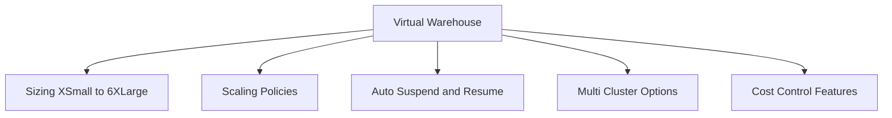
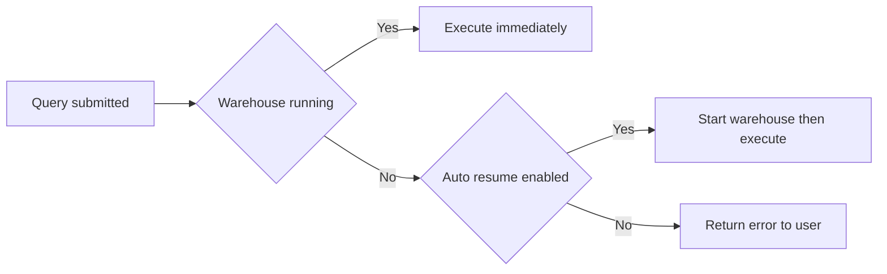
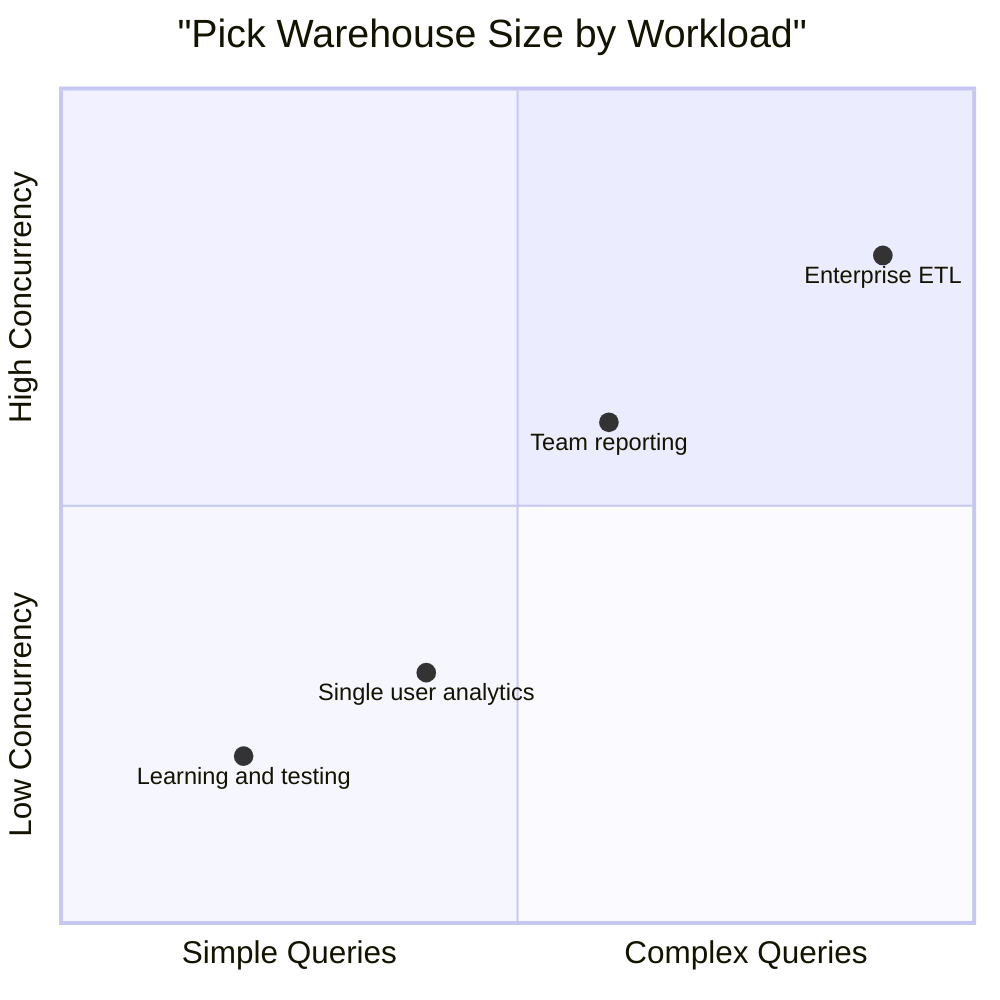
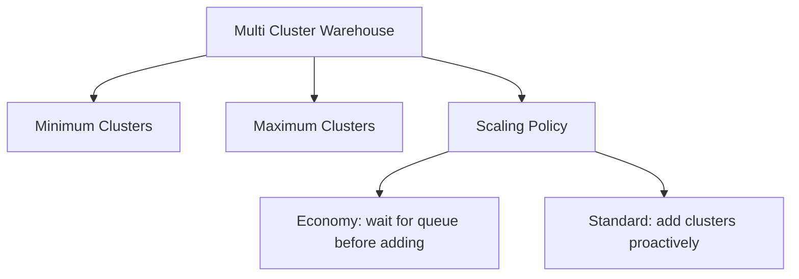
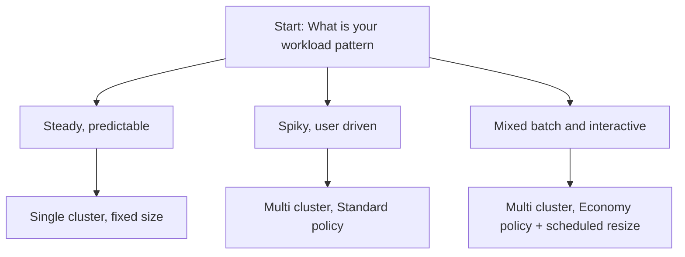
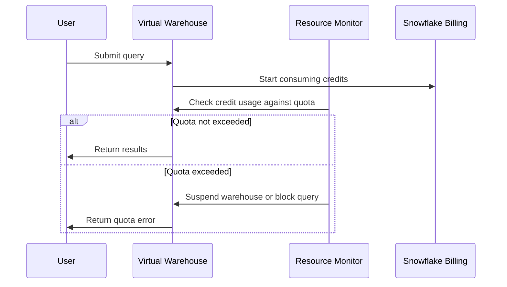
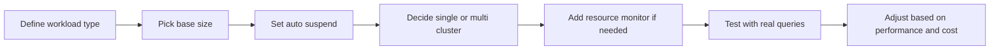
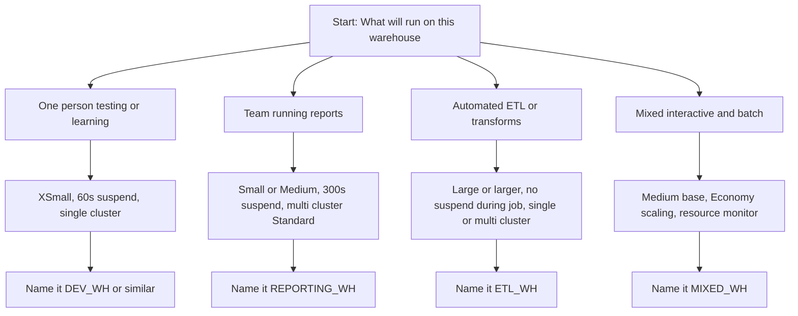
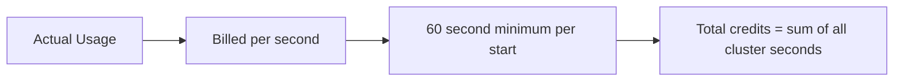

# Virtual Warehouses in Snowflake

| Property | What It Controls | Why It Matters |
|----------|-----------------|----------------|
| Size | Compute power and memory | Bigger size runs queries faster but costs more per minute |
| Auto suspend | How long to wait before stopping when idle | Saves money by not paying for unused compute |
| Auto resume | Whether to start automatically when a query arrives | Prevents failed queries when warehouse is off |
| Cluster count | Number of independent compute clusters | Handles more concurrent users without waiting |
| Scaling policy | How quickly to add or remove clusters | Balances cost against query queue times |
| Statement timeout | Max time a single query can run | Stops runaway queries from wasting credits |

## Warehouse Sizing Guide

| Size | Credits Per Hour | Best For |
|------|-----------------|----------|
| XSmall | 1 | Learning, small queries, testing |
| Small | 2 | Light analytics, development work |
| Medium | 4 | Regular reporting, moderate data volumes |
| Large | 8 | Complex transforms, larger datasets |
| XLarge | 16 | Heavy ETL, concurrent dashboards |
| 2XLarge to 6XLarge | 32 to 128 | Enterprise workloads, massive parallel processing |

Note: Each size step doubles the compute power and the cost.

## Multi Cluster Warehouses

| Setting | Economy Policy | Standard Policy |
|---------|---------------|-----------------|
| When to add cluster | Only when queries wait in queue | When queue starts forming, before users wait |
| When to remove cluster | As soon as load drops | After sustained low load |
| Cost impact | Lower, more conservative | Higher, more responsive |
| Best for | Cost sensitive, predictable workloads | User facing, variable demand |

## Cost Control Features

| Feature | How It Works | When To Use |
|---------|--------------|-------------|
| Auto suspend | Stops billing after N seconds of inactivity | All warehouses, especially dev and test |
| Resource monitors | Set credit quota and trigger actions when exceeded | Production warehouses, team budget tracking |
| Warehouse scheduling | Start and stop warehouses at set times | Batch jobs that run only at certain hours |
| Statement timeout | Cancel queries that run longer than limit | Prevent accidental expensive queries |
| Query acceleration service | Offload parts of query to serverless compute | Large scans with selective filters |

## Common Warehouse Patterns

| Pattern | Configuration | Use Case |
|---------|--------------|----------|
| Dev warehouse | XSmall, 60 second auto suspend, Economy scaling | Individual development, low cost, fast start stop |
| Prod reporting | Medium, 300 second auto suspend, Standard scaling | Team dashboards, balanced cost and responsiveness |
| ETL pipeline | Large or XLarge, no auto suspend during job window | Heavy transforms, predictable schedule, max throughput |
| Executive dashboard | Multi cluster Small to Medium, Standard policy | Variable user load, need consistent response times |
| Data science | Medium with query acceleration, longer timeout | Exploratory queries, large scans, iterative work |

## Troubleshooting Table

| Symptom | Likely Cause | Fix |
|---------|--------------|-----|
| Query waits before starting | Warehouse suspended and auto resume off, or all clusters busy | Enable auto resume or increase max cluster count |
| Query runs slower than expected | Warehouse too small for data volume or complexity | Increase size or enable query acceleration |
| Credits draining fast | Auto suspend too long or warehouse left running | Reduce auto suspend to 60 seconds for non prod |
| Users get queue errors | Max clusters reached during peak | Raise max clusters or switch to Standard scaling |
| Scheduled task fails | Warehouse not running at task time | Enable auto resume or schedule warehouse start |
| Query cancelled unexpectedly | Statement timeout too short for workload | Increase timeout or optimize query logic |

## Warehouse Selection Flow

## Key Practices

- Name warehouses by purpose, not size. Sizes change, names should not
- Always set auto suspend. The default is 300 seconds, but 60 is safer for non prod
- Use separate warehouses for dev, test, and prod. Prevents one team from blocking another
- Attach a resource monitor to every production warehouse. Catch cost surprises early
- Test warehouse size with real queries, not just sample data. Performance can change with scale
- Document the expected workload for each warehouse. Helps others pick the right one
- Review warehouse usage monthly. Right size or remove unused warehouses
- Use query tagging to link warehouse credits back to teams, projects, or applications

## Cost Math Simplified

- Credits are billed per second, with a 60 second minimum per start
- XSmall = 1 credit per hour. Small = 2 credits per hour. Each step doubles
- Multi cluster warehouses bill for each active cluster independently
- Auto suspend saves money by stopping the clock when no one is using the warehouse
- Resource monitors do not reduce cost directly, but prevent runaway spending

Example:
- Query runs 45 seconds on Small warehouse
- Billed for 60 seconds minimum = 2 credits per hour * 60/3600 = 0.033 credits
- If auto suspend was 300 seconds and warehouse stayed idle after, those extra 255 seconds also bill

## Bottom Line

- Virtual warehouses are how you control compute cost and performance in Snowflake
- Start small. You can always make a warehouse bigger, but you cannot get back wasted credits
- Auto suspend is your friend. Set it and forget it for most workloads
- Multi cluster solves concurrency, not slow queries. If one query is slow, increase size, not clusters
- Resource monitors are seat belts. You hope you never need them, but you want them when you do
- Name and document warehouses clearly. Future you and your teammates will thank you

Think of warehouses like engines in a garage:
- Size is horsepower. More power costs more fuel
- Auto suspend is turning the key off when you walk away
- Multi cluster is having multiple engines ready when many cars need to go at once
- Resource monitors are the fuel gauge that warns you before you run empty

Pick the engine that matches the trip. Do not use a race car for a quick errand. Do not use a scooter for a highway commute.
