# Virtual Warehouse Configurations Based on Use Cases

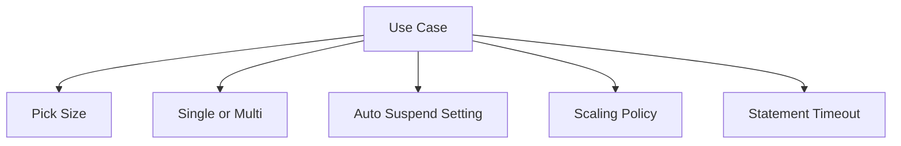

## Use Case Configuration Table

| Use Case | Base Size | Clusters | Auto Suspend | Scaling Policy | Statement Timeout | Why This Works |
|----------|-----------|----------|--------------|----------------|-------------------|---------------|
| Learning and tutorials | XSmall | Single | 60 seconds | Economy | 300 seconds | Low cost, fast start, enough power for basic queries |
| Developer testing | Small | Single | 60 seconds | Economy | 300 seconds | Handles moderate queries, saves credits between tests |
| Ad hoc analyst queries | Small to Medium | Single | 300 seconds | Economy | 600 seconds | Balances cost with responsiveness for unpredictable work |
| Team reporting dashboards | Medium | Multi min 1 max 3 | 300 seconds | Standard | 300 seconds | Handles concurrent users without queue delays |
| Executive dashboards | Medium | Multi min 2 max 4 | 300 seconds | Standard | 300 seconds | Priority performance for leadership facing reports |
| Nightly ETL batch | Large or XLarge | Single or min 2 max 4 | 0 during job, 60 after | Economy | 1800 seconds | Max throughput during window, save credits after |
| Continuous data ingestion | Medium | Single | Disabled or 3600 seconds | Economy | 600 seconds | Always ready for pipe triggers, minimal start delay |
| Data science exploration | Medium with acceleration | Single | 600 seconds | Economy | 1800 seconds | Supports long iterative queries with large scans |
| 24/7 API backend | Small | Single | Disabled | Economy | 60 seconds | Always on for low latency, small size controls cost |
| Month end financial close | Large | Multi min 2 max 6 | 0 during window | Standard | 1800 seconds | Handles peak concurrency and complex calculations |

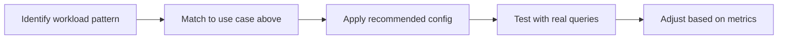

## Configuration Details by Use Case

### Learning and Tutorials

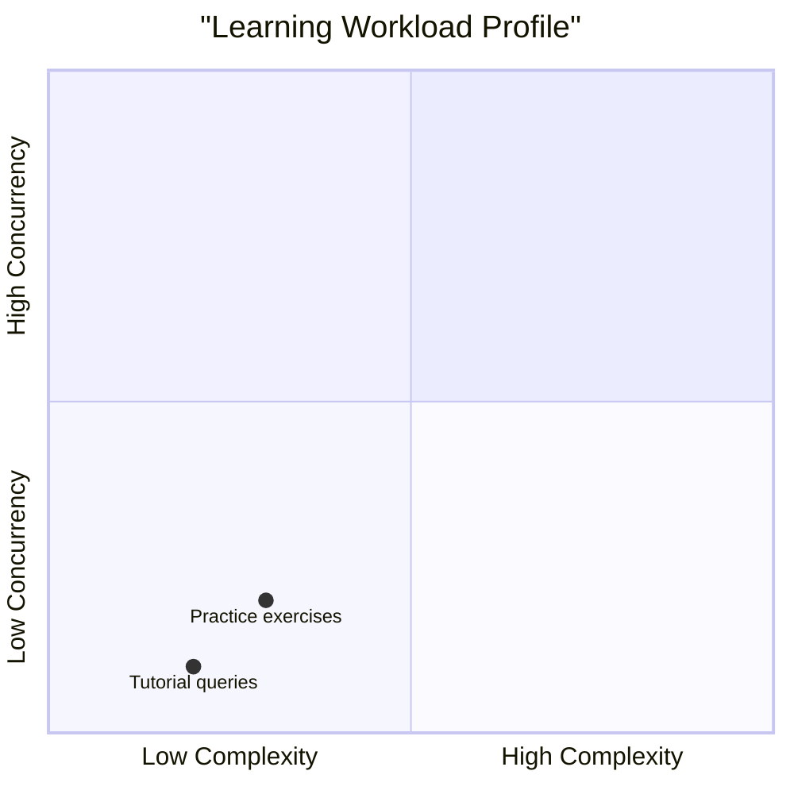

- Size: XSmall keeps cost minimal while learning
- Auto suspend: 60 seconds stops billing quickly after practice
- Single cluster: Only one person querying at a time
- Timeout: 300 seconds prevents accidental long running queries
- Tag queries with environment=learning for cost tracking

### Developer Testing

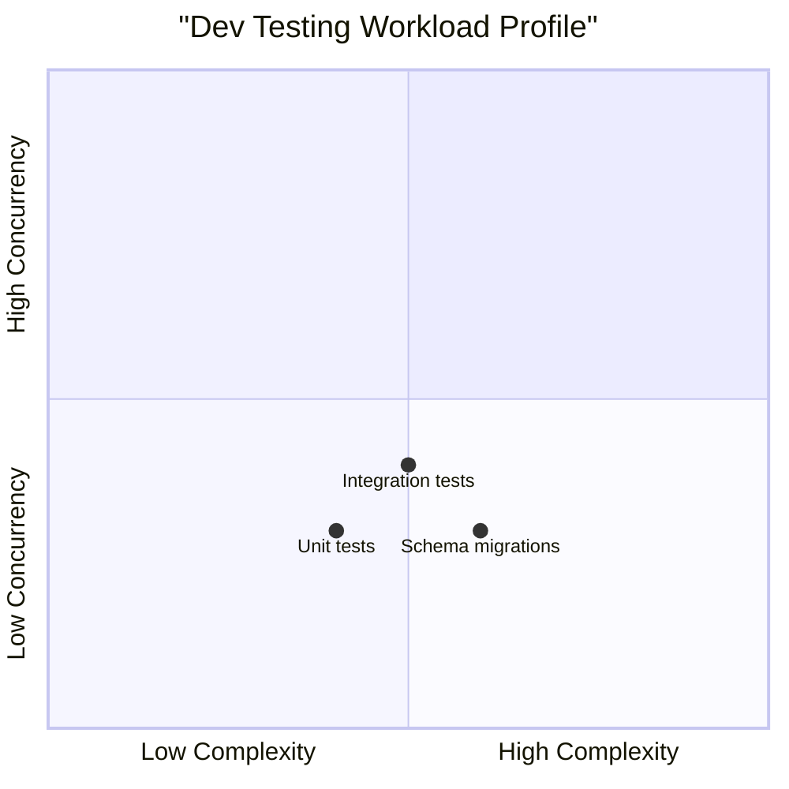

- Size: Small handles moderate transforms without overspending
- Auto suspend: 60 seconds saves credits between test runs
- Resource monitor: Set low quota to catch runaway test scripts
- Tag queries with team=engineering and project=feature_name
- Use separate warehouse from prod to avoid blocking business users

### Ad Hoc Analyst Queries

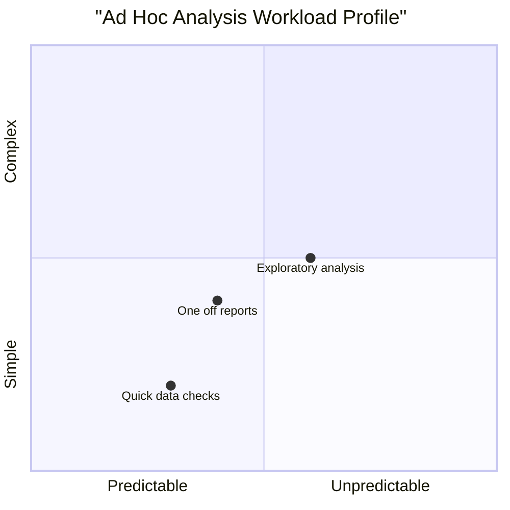

- Size: Start Small, scale to Medium if queries feel slow
- Auto suspend: 300 seconds avoids start delay for irregular queries
- Single cluster: Most analysts work independently
- Timeout: 600 seconds allows complex joins to complete
- Enable query acceleration for warehouses scanning large tables

### Team Reporting Dashboards

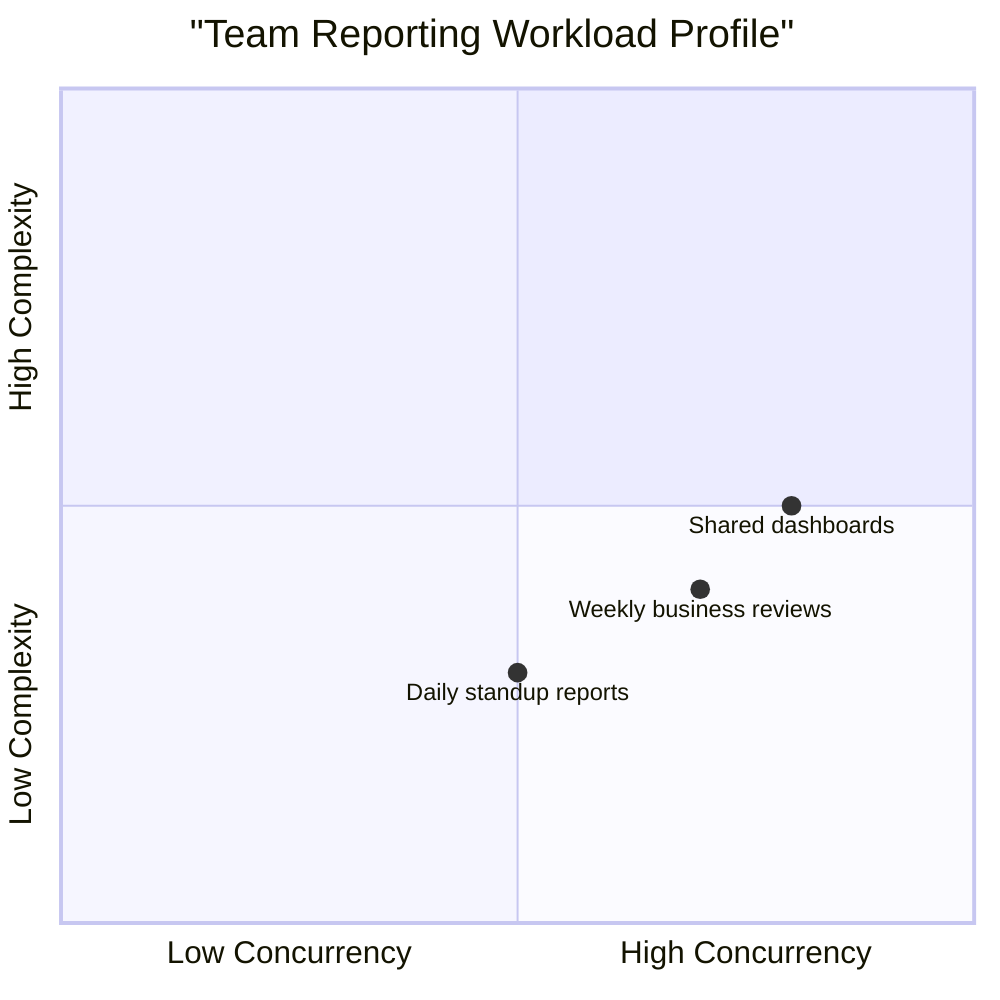

- Size: Medium balances cost with query speed for mixed workloads
- Clusters: Multi cluster with min 1 max 3 handles peak morning traffic
- Scaling policy: Standard adds clusters before users feel wait times
- Auto suspend: 300 seconds keeps warehouse warm during business hours
- Tag queries with team=analytics and dashboard=report_name

### Executive Dashboards

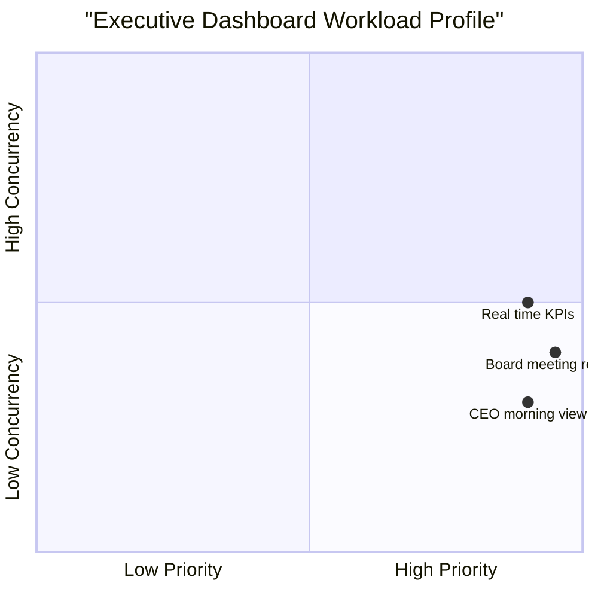

- Size: Medium ensures fast response for curated queries
- Clusters: Multi cluster min 2 max 4 guarantees capacity during leadership reviews
- Scaling policy: Standard proactively scales to avoid any queue time
- Auto resume: Always true, never let executives wait for warehouse start
- Resource monitor: High quota with alert only, never block executive queries

### Nightly ETL Batch

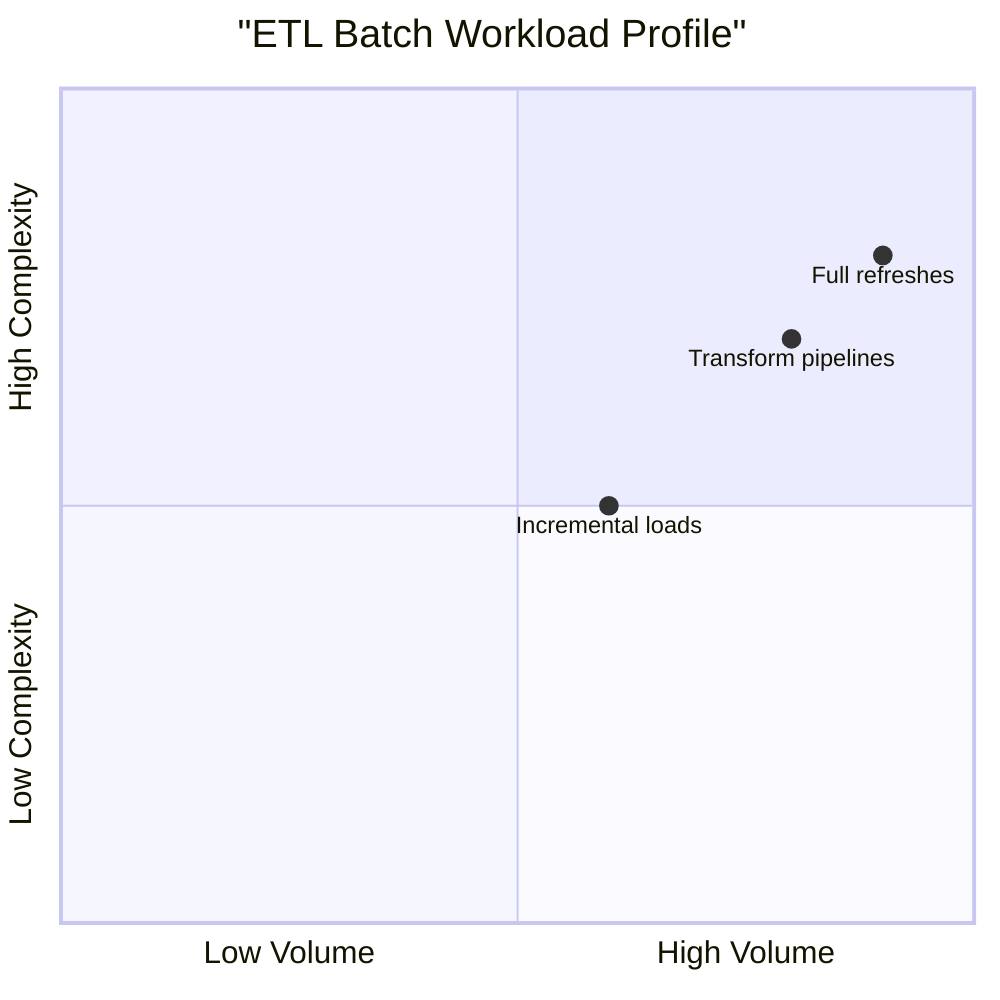

- Size: Large or XLarge for heavy transforms and large data volumes
- Clusters: Single for sequential jobs, multi for parallelizable steps
- Auto suspend: 0 during job window, 60 seconds after completion
- Scaling policy: Economy to avoid adding clusters unless queue builds
- Timeout: 1800 seconds allows long running transforms to finish
- Schedule: Start warehouse 15 minutes before job, suspend after success

### Continuous Data Ingestion

- Size: Medium handles steady stream of COPY operations
- Clusters: Single cluster sufficient for sequential file processing
- Auto suspend: Disabled or 3600 seconds to stay ready for file arrivals
- Notification integration: Triggers pipe automatically when files land
- Timeout: 600 seconds for large file loads
- Monitor: Watch pipe load history for backlogs or errors

### Data Science Exploration

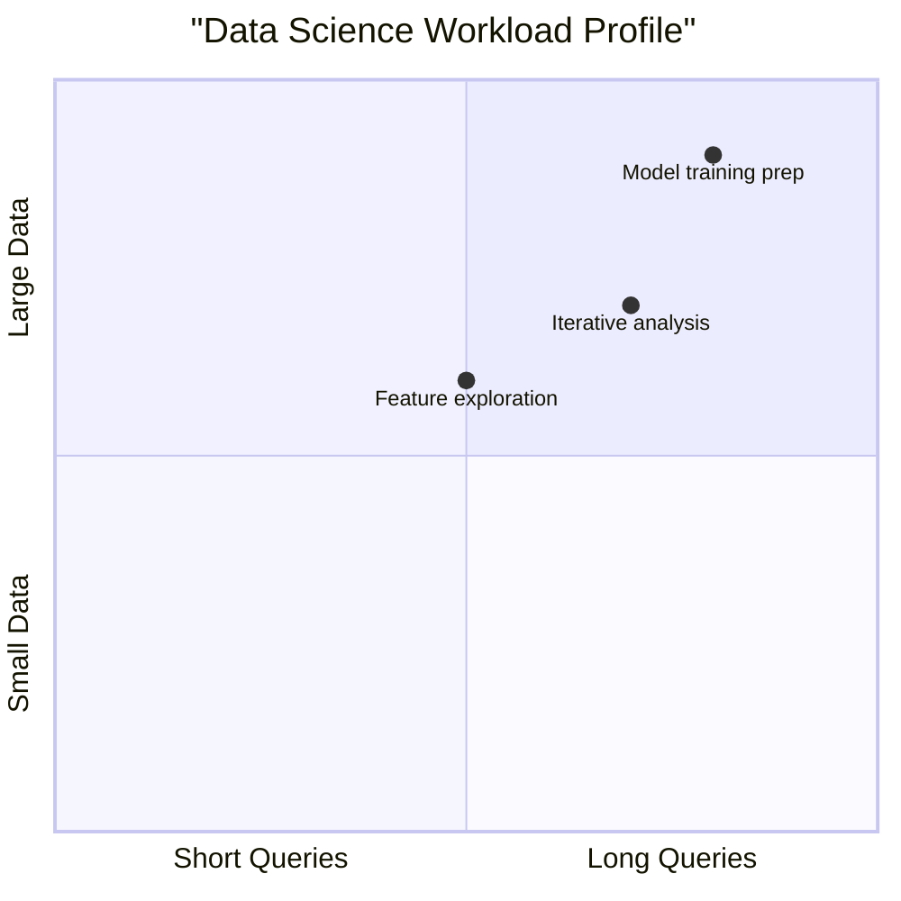

- Size: Medium with query acceleration for large selective scans
- Clusters: Single cluster, data scientists typically work solo
- Auto suspend: 600 seconds avoids interrupting iterative workflow
- Timeout: 1800 seconds for long exploratory queries
- Enable: Snowpark for Python or Java based transformations
- Tag: project=ml_experiment for cost attribution

### 24/7 API Backend

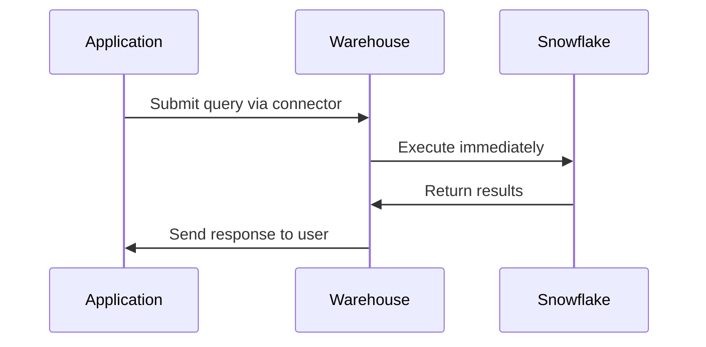

- Size: Small keeps cost low for simple lookup queries
- Clusters: Single cluster, API calls typically sequential per user
- Auto suspend: Disabled to guarantee zero start latency
- Timeout: 60 seconds fails fast for unexpected slow queries
- Connection pooling: Reuse sessions to avoid reconnect overhead
- Monitor: Track p95 latency and error rates, not just credits

### Month End Financial Close

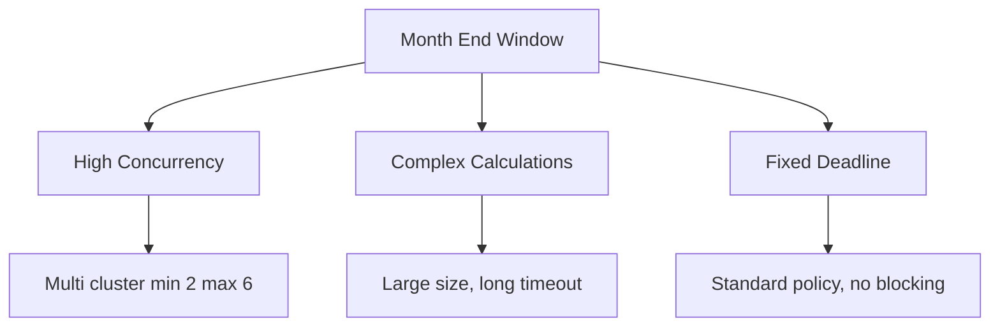

- Size: Large handles complex financial calculations and aggregations
- Clusters: Multi cluster min 2 max 6 for finance team concurrent access
- Scaling policy: Standard ensures no queue delays during critical window
- Auto suspend: 0 during 48 hour close window, 60 seconds after
- Timeout: 1800 seconds for complex reconciliations
- Resource monitor: High quota with alert only, never block close activities
- Tag: project=month_end_close for post analysis and optimization

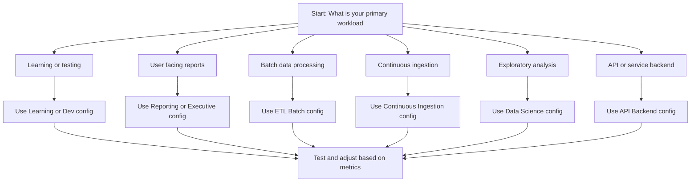

## Configuration Testing Checklist

| Step | Action | Success Signal |
|------|--------|----------------|
| 1 | Run representative queries on new config | Queries complete within target time |
| 2 | Simulate peak concurrency | No queue time over 30 seconds |
| 3 | Measure credits per query | Cost aligns with budget expectations |
| 4 | Test auto suspend and resume | Warehouse starts within 5 seconds, stops after idle |
| 5 | Verify query tags appear in metering views | Cost attribution works in reports |
| 6 | Confirm resource monitor alerts fire | Guardrails activate at defined thresholds |
| 7 | Document config and expected workload | Team can understand and maintain settings |

## When to Revisit Configuration

| Trigger | Action |
|---------|--------|
| Query runtime increases 2x over baseline | Review size and enable query acceleration |
| Users report waiting for queries to start | Increase max clusters or switch to Standard policy |
| Credit spend exceeds budget by 25 percent | Review idle time, lower auto suspend, right size down |
| New team or project starts using warehouse | Add dedicated warehouse or adjust tags for attribution |
| Business SLA changes | Rebalance size, clusters, and policy to meet new targets |
| Quarterly review cycle | Audit all warehouse configs against current workloads |

## Key Principles

- Match config to workload pattern, not to team preference
- Start conservative on size and clusters, increase only when data shows need
- Separate workloads into separate warehouses to avoid one size fits all compromise
- Tag every query for cost attribution and optimization insights
- Test config changes in non prod before applying to production
- Monitor metrics weekly, adjust settings monthly, review strategy quarterly
- Document the why behind each config choice for future reference
- Use resource monitors and timeouts as safety nets, not as primary controls

## Bottom Line

- No single warehouse config works for all use cases
- Pick the pattern that matches your workload, then test and adjust
- Cost and performance are both outcomes of config choices, not accidents
- Small tweaks compound: 60 second auto suspend saves more than you think
- Separate concerns: dev, reporting, ETL, and APIs need different configs
- Measure before you change, measure after you change, measure regularly
- Document decisions so future you understands the tradeoffs

Think of warehouse configs like tailoring clothes:
- One size does not fit all bodies
- Measure the person before cutting the fabric
- Test the fit before the final stitch
- Adjust when the person grows or changes
- Keep a record of measurements for next time

Apply the same care to warehouse configs. Measure your workload. Test your settings. Adjust when needs change. Document what works. Save cost without sacrificing performance.
