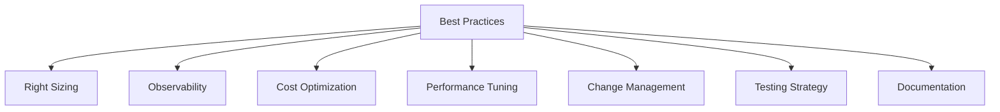
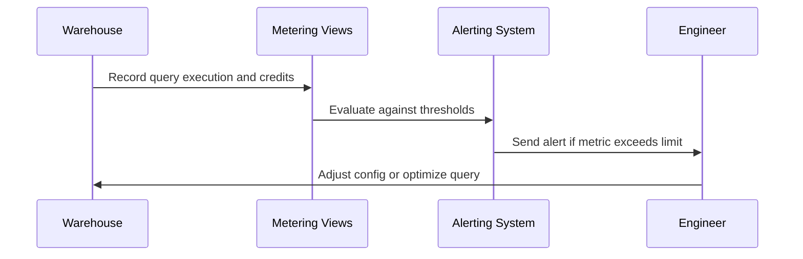
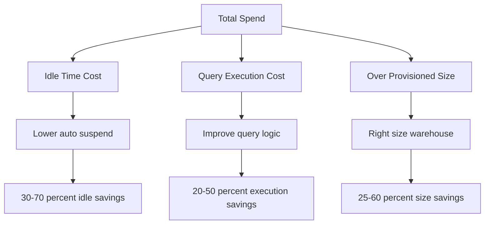
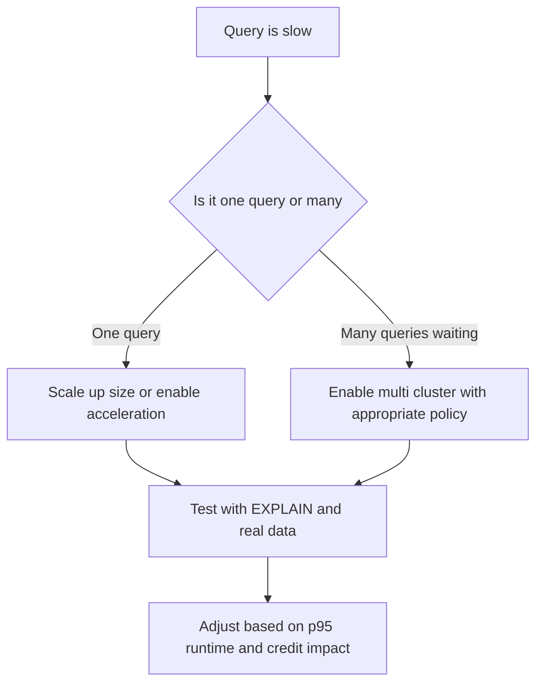
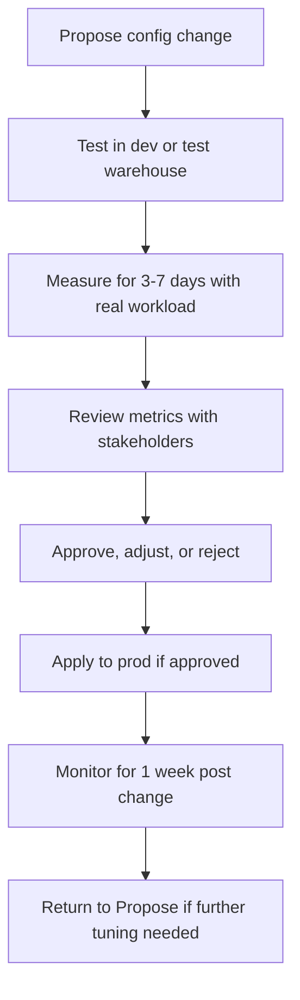
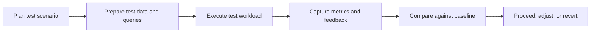
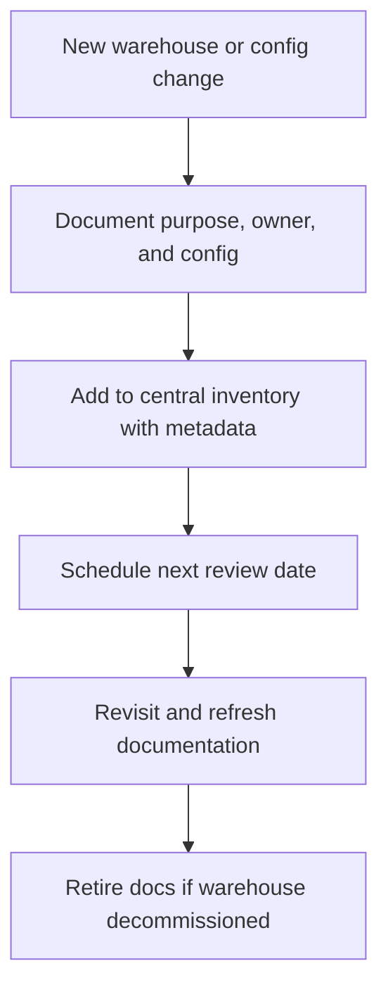
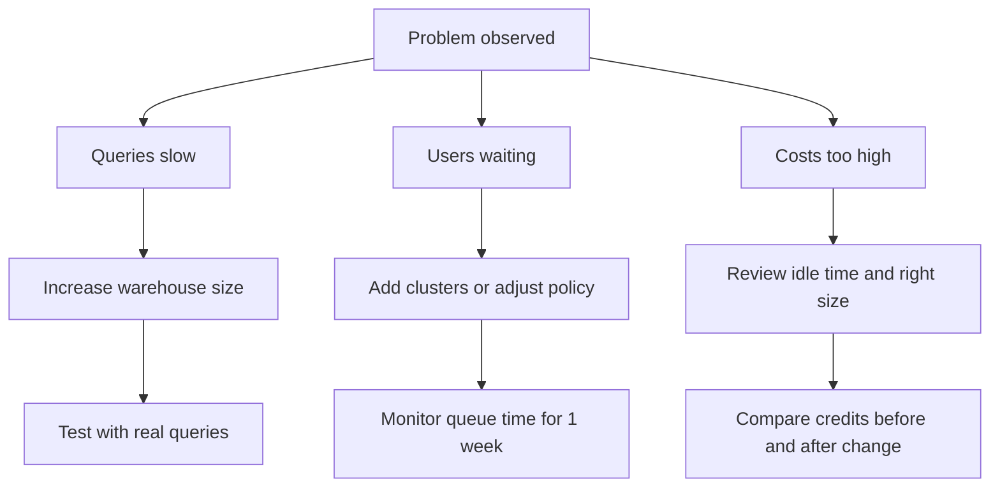

# Additional Best Practices for Warehouse Scaling and Configuration

## Right Sizing Strategies

| Practice | How To Do It | Why It Works |
|----------|-------------|--------------|
| Start one size smaller than you think | Pick Small instead of Medium for new workloads | You can scale up in seconds. You cannot get back wasted credits |
| Use query history to baseline | Run EXPLAIN on representative queries before picking size | Shows estimated cost and execution plan before you spend |
| Measure p95 runtime, not average | Focus on the slowest 5 percent of queries | Average hides outliers that frustrate users |
| Right size down quarterly | Review warehouses with consistent low CPU or memory | Save credits without impacting performance |
| Separate interactive from batch | Never run ETL and dashboards on same warehouse | Prevents batch jobs from blocking user queries |

## Observability and Monitoring

| Metric | Where To Find | What To Watch For | Action If Off Target |
|--------|--------------|-------------------|---------------------|
| Queued provisioning time | QUERY_HISTORY.QUEUED_PROVISIONING_TIME | Consistently over 30 seconds | Increase max clusters or switch to Standard policy |
| Warehouse load percentage | WAREHOUSE_LOAD_HISTORY | CPU or memory near 100 percent for hours | Increase warehouse size |
| Credits per query | WAREHOUSE_METERING_HISTORY joined with QUERY_HISTORY | Sudden spike without workload change | Check for runaway query or missing filters |
| Auto suspend events | WAREHOUSE_EVENTS_HISTORY | Warehouse restarting more than 10 times per hour | Increase auto suspend by 60-120 seconds |
| Query timeout errors | QUERY_HISTORY where ERROR_MESSAGE contains timeout | Spike in cancellations | Increase timeout or optimize query logic |

## Cost Optimization Patterns

| Pattern | Implementation | Expected Savings |
|---------|---------------|------------------|
| Auto suspend at 60 seconds for non prod | Set in warehouse config | 30-70 percent reduction in idle spend |
| Resource monitors with notify at 75 percent | Attach to each prod warehouse | Prevents 100 percent budget overruns |
| Query tagging for attribution | Set session query_tag before running | Enables targeted optimization by team or project |
| Schedule warehouses for batch jobs | Start 15 minutes before job, suspend after | Eliminates 24/7 billing for time bound work |
| Right size down after peak windows | Use Tasks or API to resize post job | Captures savings without manual intervention |

## Performance Tuning Tips

| Tuning Lever | When To Use | How To Apply |
|--------------|-------------|--------------|
| Query acceleration service | Large table scans with selective filters | Enable at warehouse level, test with representative query |
| Clustering keys | Tables with frequent filtered queries on same column | Define clustering key, monitor reclustering cost |
| Materialized views | Repeated aggregations on same base table | Create view, ensure query rewrites to use it |
| Result caching | Same query run multiple times in short window | No config needed, Snowflake caches automatically for 24 hours |
| Warehouse resizing | Single query consistently slow | Increase size by one step, measure p95 improvement |

## Change Management for Warehouse Configs

| Change Type | Pre Change Steps | Post Change Validation | Rollback Trigger |
|-------------|-----------------|------------------------|------------------|
| Resize warehouse | Run sample queries on new size, document expected improvement | Compare p95 runtime and credits per query for 3 days | Runtime increases or credits double without benefit |
| Add multi cluster | Start with min 1 max 2, Economy policy | Monitor queue time and credit spend for 1 week | Queue time unchanged but credits up 50 percent |
| Change scaling policy | Apply to one non critical warehouse first | Track user reported wait times and credit delta | User complaints increase or cost exceeds budget |
| Update auto suspend | Lower by 60 seconds incrementally | Check for start delay complaints in support tickets | More than 5 percent of users report friction |
| Enable query acceleration | Test on dev warehouse with large scan query | Verify query plan uses acceleration, measure credit delta | No runtime improvement or credits increase |

## Testing Strategy for Warehouse Changes

| Test Type | Goal | How To Execute |
|-----------|------|----------------|
| Load test | Verify warehouse handles peak concurrency | Replay historical query patterns at 2x volume |
| Soak test | Confirm stability over extended runtime | Run representative workload for 24-48 hours |
| Failover test | Validate auto resume and scaling behavior | Suspend warehouse, submit query, measure start time |
| Cost test | Ensure config change does not blow budget | Run same workload before and after, compare credits |
| User acceptance test | Confirm experience meets expectations | Have real users run typical queries, collect feedback |

## Documentation Practices That Scale

| Document Item | Where To Store | Update Frequency |
|---------------|---------------|------------------|
| Warehouse purpose and owner | Central wiki or config repo | When ownership or purpose changes |
| Expected workload pattern | Same as above, with example queries | Quarterly or when workload shifts |
| Config rationale | Comment in IaC template or change ticket | With every config change |
| SLA targets | Service catalog or team charter | When business requirements change |
| Runbook for common issues | Shared docs with search | After each incident or quarterly review |

## Quick Reference Decision Matrix

## Anti Patterns to Avoid

| Anti Pattern | What Happens | Better Approach |
|--------------|--------------|-----------------|
| Setting max clusters to 10 just in case | Paying for capacity you never use | Start with max 2 or 3, raise only when queue data shows need |
| Using Standard policy for dev warehouses | Burning credits for readiness no one needs | Use Economy for non user facing workloads |
| Changing multiple settings at once | Cannot tell which change caused improvement or regression | Change one lever at a time, measure, then proceed |
| Ignoring query tags | Cannot attribute cost or optimize by team | Tag every query at submission with team and project |
| Never testing config changes | Assuming settings work without validation | Test in non prod first, measure with real workload |
| Documenting once and never updating | Docs become wrong, team loses trust | Schedule quarterly review, tie to config change process |

## Key Principles to Remember

- Measure before you change. One week of real query history beats guessing
- Change one thing at a time. Size, clusters, and policy each move different levers
- Start cheap and prove need. Scaling up is easy. Scaling down saves money
- Separate workloads. One warehouse config cannot optimize for all patterns
- Tag everything. Without attribution, you cannot optimize or charge back
- Document the why. Future you needs context for decisions made today
- Review regularly. Workloads evolve, and your config should too
- Test in non prod first. Warehouse changes impact cost and performance immediately

## Bottom Line

- Scaling policies manage concurrency, not query speed. Fix size first, then fix queues
- Economy policy saves money. Standard policy saves time. Pick based on actual user impact
- Right sizing is ongoing. Workloads change, and your config should change with them
- Observability enables optimization. You cannot fix what you do not measure
- Change management prevents surprises. Test, measure, document, then scale
- Cost compounds. Small savings per warehouse add up fast across many warehouses
- Simplicity scales. Start with the minimum config that meets your SLA, add complexity only when data forces it

Think of warehouse scaling like managing a restaurant kitchen:
- Size is the skill of each chef. Better chefs cook faster but cost more per hour
- Clusters are the number of chefs. More chefs handle more orders at once
- Scaling policy is the host. Economy seats guests when a table opens. Standard pre seats to avoid wait
- Auto suspend is closing the kitchen. Turn off the lights when no one is dining
- Monitoring is the manager watching the pass. Spot bottlenecks before guests complain

Apply the same discipline. Know your demand. Staff to match. Adjust when patterns shift. Save without sacrificing the experience.
