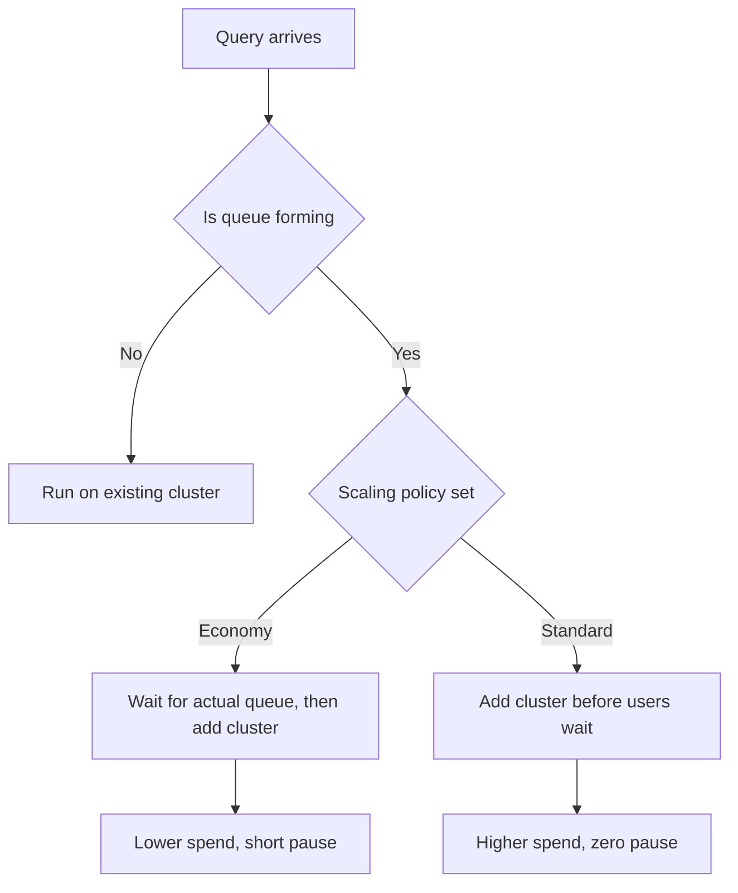
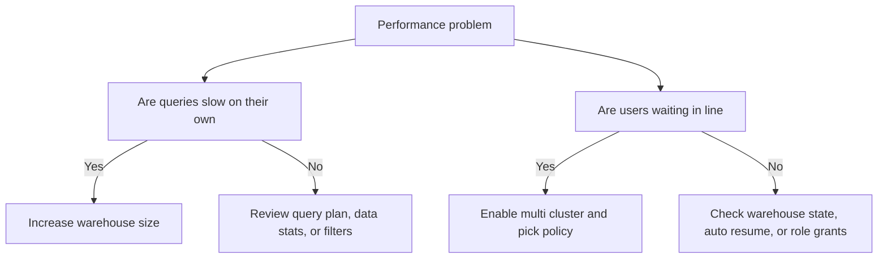

# Scaling Policies for Multi Cluster Warehouses

## Economy vs Standard

| Policy | When it adds a cluster | When it removes a cluster | Credit impact | User impact |
|--------|----------------------|--------------------------|---------------|-------------|
| Economy | Only after queries sit in queue for about 2 minutes | Quickly when load drops below min | Lower | Brief wait during sudden spikes |
| Standard | As soon as query volume starts rising | Slowly, keeps clusters warm longer | Higher | Smooth experience, no visible queue |

## How the Mechanics Actually Work

- Scaling policies only activate when you set max clusters above 1
- They control concurrency, not query execution speed
- Each added cluster burns the exact same credits per minute as the first
- Scale down is never instant. Snowflake waits 5 to 10 minutes of low load before shutting a cluster off
- Policy changes apply to the next scaling cycle, not to queries already running
- You still pay the 60 second minimum every time a new cluster spins up

## When To Pick Which

| Situation | Pick | Why |
|-----------|------|-----|
| Internal tools or batch pipelines | Economy | Cost matters more than sub second readiness |
| Customer facing dashboards | Standard | Users will notice and complain about wait times |
| Executive reporting windows | Standard | Leadership expects instant results during reviews |
| Dev or test environments | Economy | Spikes are rare, saving credits is the goal |
| Unknown workload patterns | Economy | Start cheap, measure real queue time, switch only if needed |

## Common Traps and Reality Checks

- Scaling policies do not fix slow queries. They only fix lines. If one query takes 3 minutes, adding a second cluster does not make it run faster
- Default max clusters is 1. You must raise it or scaling policies do nothing
- Leaving standard policy on for a single user warehouse just burns credits for no reason
- Queue time under 30 seconds is usually fine. Chasing zero wait costs more than most teams budget
- Economy is not broken. It is conservative. Give it one week of real traffic before calling it slow
- Multi cluster does not replace right sizing. Fix size first, then fix concurrency

## First Principles for Scaling

- Supply and demand. Clusters are supply. Queries are demand. The policy is just the valve
- Cost scales linearly. Two active clusters cost exactly twice as much per minute. No magic discount
- Readiness costs money. Standard policy pays for idle capacity so you never wait
- Reactivity saves money. Economy policy waits for proof of need before spending
- Measure before you change. Guessing queue time leads to wasted credits or frustrated teams
- Start with the cheapest option that meets your actual SLA. Raise the ceiling only when data forces it

## Setup and Verification Steps

- Set min clusters to 1
- Set max clusters to your realistic peak, not your dream peak
- Pick Economy or Standard based on the table above
- Enable auto resume true
- Run your normal workload for one full business day
- Check query history for queued provisioning time
- If average queue time stays under 30 seconds, keep Economy
- If queue time regularly passes 1 minute, switch to Standard or raise max clusters
- Repeat monthly as workload patterns shift
