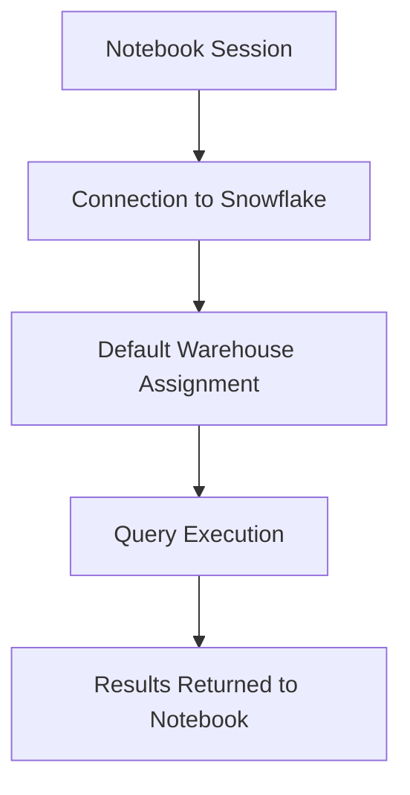
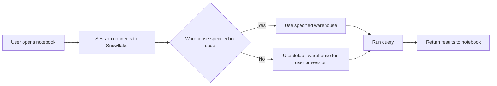
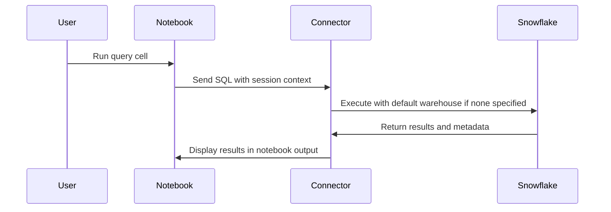
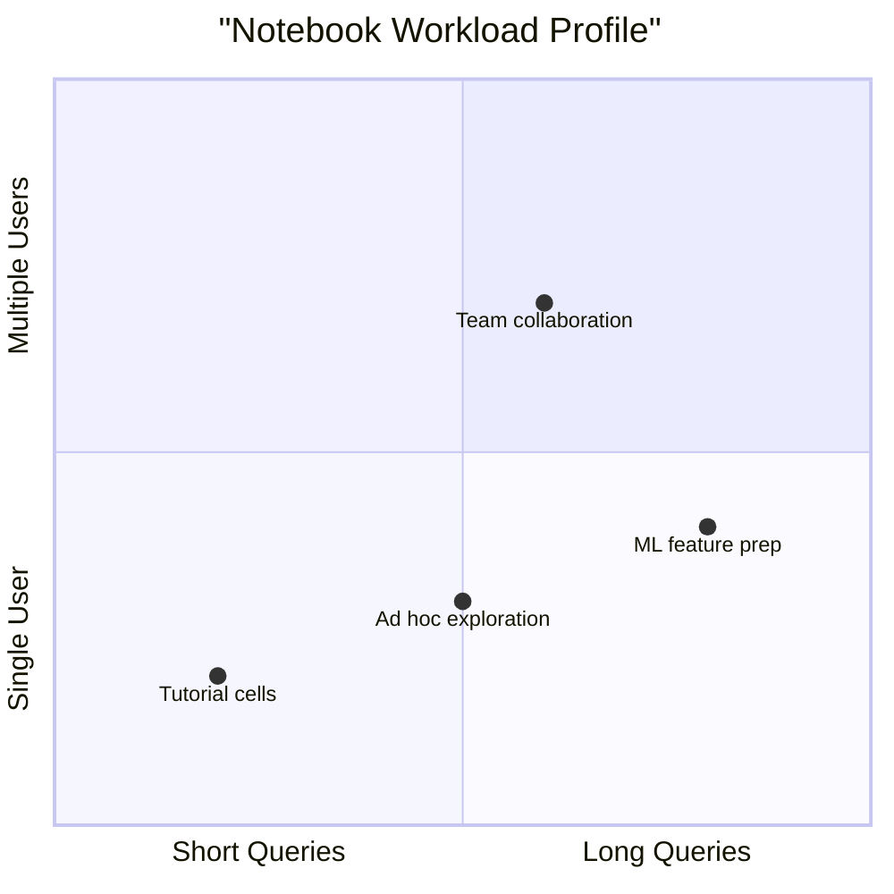
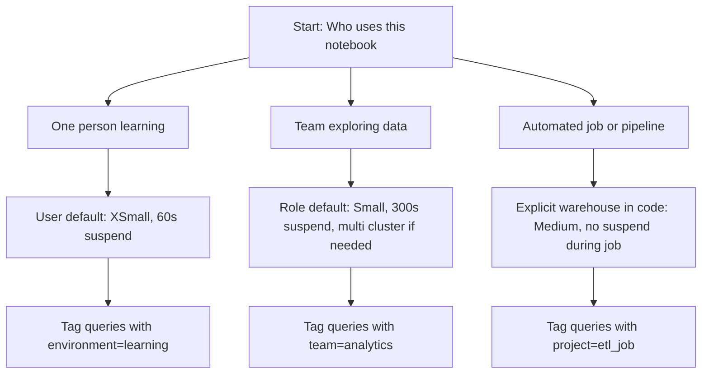
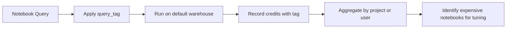
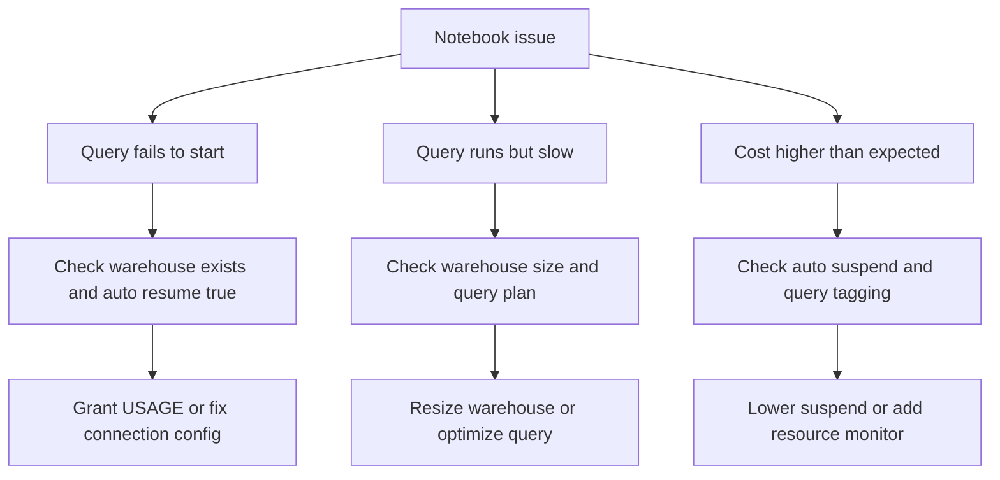
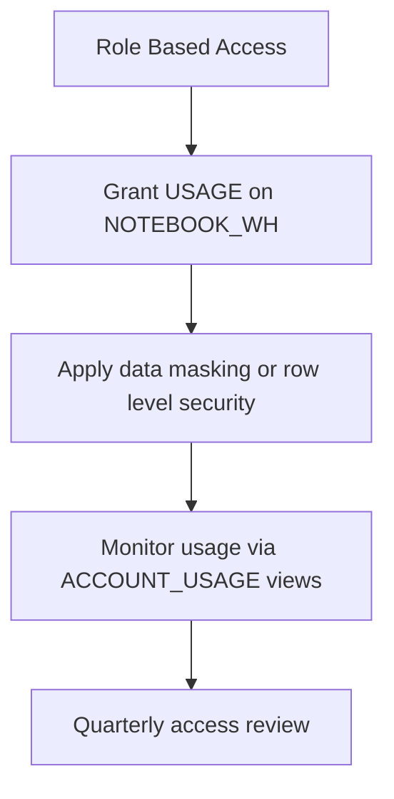
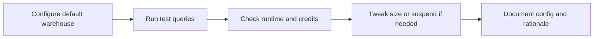
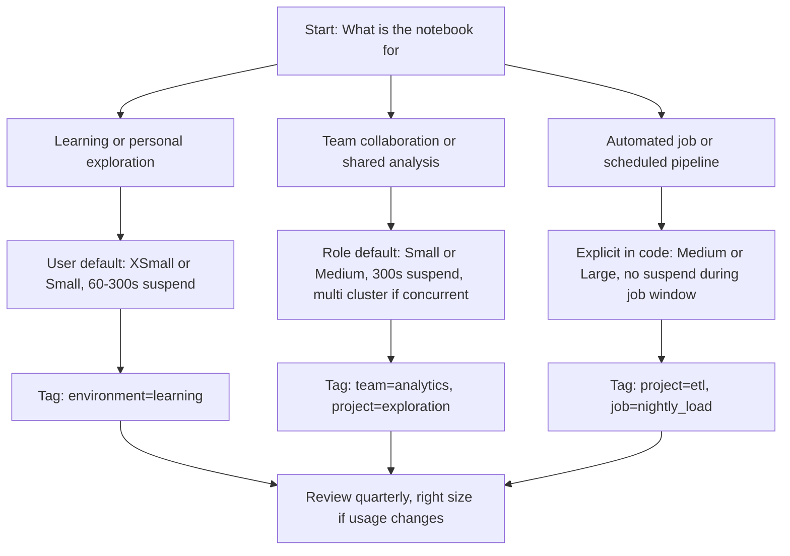

# Default Warehouse for Notebooks



## What Is a Default Warehouse for Notebooks

| Term | Meaning |
|------|---------|
| Default warehouse | The compute cluster automatically used when a notebook runs a query without explicitly specifying one |
| Notebook session | An interactive coding environment like Snowflake Native Notebooks, Jupyter with Snowpark, or VS Code with Python connector |
| Session context | The set of parameters (role, warehouse, database, schema) active for a notebook connection |

- Notebooks do not run queries on their own. They send SQL or Snowpark code to Snowflake
- Snowflake executes that code on a virtual warehouse
- If the notebook does not specify a warehouse, Snowflake uses the default assigned to the user or session
- Setting a sensible default prevents accidental use of oversized or shared warehouses



## Configuration Options

| Method | Where To Set | Scope | Best For |
|--------|--------------|-------|----------|
| User default warehouse | ALTER USER username SET DEFAULT_WAREHOUSE = wh_name | All sessions for that user | Individual analysts or data scientists |
| Session parameter | Session configuration in notebook code or connection string | Single notebook session | Temporary overrides or testing |
| Role default warehouse | ALTER ROLE role_name SET DEFAULT_WAREHOUSE = wh_name | All users with that role | Team based workflows |
| Notebook platform setting | Snowflake Native Notebooks UI or partner tool config | All notebooks in that workspace | Centralized control for managed environments |
| Connection profile | Config file or environment variable used by connector | Specific project or script | Reproducible pipelines and shared notebooks |



## Recommended Warehouse Settings for Notebooks

| Workload Type | Base Size | Auto Suspend | Auto Resume | Statement Timeout | Why |
|---------------|-----------|--------------|-------------|-------------------|-----|
| Learning and tutorials | XSmall | 60 seconds | True | 300 seconds | Low cost, fast start, safe for beginners |
| Exploratory analysis | Small | 300 seconds | True | 600 seconds | Handles moderate queries, avoids interrupting flow |
| Data science with Snowpark | Medium | 600 seconds | True | 1800 seconds | Supports long running Python or Scala logic |
| Shared team notebook | Small to Medium | 300 seconds | True | 600 seconds | Balances cost with responsiveness for multiple users |
| Production notebook job | Medium | 0 during run, 60 after | True | 1800 seconds | Guarantees resources during scheduled execution |



## How to Set Default Warehouse in Common Scenarios

### Snowflake Native Notebooks

```sql
-- Set at user level (persists across sessions)
ALTER USER analyst_jane SET DEFAULT_WAREHOUSE = NOTEBOOK_WH;

-- Set at role level (applies to all users with role)
ALTER ROLE ANALYST_ROLE SET DEFAULT_WAREHOUSE = NOTEBOOK_WH;

-- Override in notebook cell for one time use
USE WAREHOUSE LARGE_TEMP_WH;
-- Run queries here
USE WAREHOUSE DEFAULT; -- Revert to default
```

### Jupyter with Snowpark Python

```python
# In connection parameters
connection_parameters = {
    "account": "myaccount",
    "user": "myuser",
    "warehouse": "NOTEBOOK_WH",  # Default for this session
    "database": "ANALYTICS",
    "schema": "PUBLIC"
}

# Or set after connection
session = Session.builder.configs(connection_parameters).create()
session.sql("USE WAREHOUSE NOTEBOOK_WH").collect()
```

### VS Code with Snowflake Extension

```yaml
# In .snowflake/connection.yml
profiles:
  notebook_dev:
    account: myaccount
    user: myuser
    warehouse: NOTEBOOK_WH  # Default for this profile
    role: ANALYST_ROLE
    database: ANALYTICS
```

### Airflow or Orchestration Tool

```python
# In task definition
SnowflakeOperator(
    task_id="run_notebook_query",
    warehouse="NOTEBOOK_WH",  # Explicit, no reliance on user default
    sql="SELECT * FROM my_table"
)
```



## Cost Control for Notebook Warehouses

| Practice | How To Implement | Impact |
|----------|-----------------|--------|
| Dedicated notebook warehouse | Create NOTEBOOK_WH separate from REPORTING_WH or ETL_WH | Prevents notebook queries from blocking business critical work |
| Auto suspend at 300 seconds | Set in warehouse config for interactive use | Saves credits during thinking time between cells |
| Resource monitor attached | Set credit quota and alert thresholds | Catches runaway notebook sessions before budget impact |
| Query tagging enforced | Set session query_tag at notebook start | Enables cost attribution by user, project, or experiment |
| Statement timeout at 600 seconds | Prevents accidental long running scans | Fails fast on missing filters or cartesian joins |



## Common Issues and Fixes

| Symptom | Likely Cause | Resolution |
|---------|--------------|------------|
| Query fails with warehouse suspended error | Default warehouse has auto resume false | Set auto resume true for interactive notebook warehouses |
| Notebook runs slowly | Default warehouse too small for query complexity | Increase size or enable query acceleration for large scans |
| Credits spike unexpectedly | Notebook left running with idle warehouse | Lower auto suspend to 60 seconds for dev notebooks |
| Multiple users block each other | Shared default warehouse with single cluster | Use multi cluster or assign team specific warehouses |
| Query tags not appearing in reports | Tag set after query execution | Set query_tag at session start, before any queries |
| Warehouse not found error | Default warehouse name typo or missing grant | Verify warehouse exists and role has USAGE privilege |



## Security and Access Considerations

| Practice | Why It Matters | How To Apply |
|----------|---------------|--------------|
| Grant USAGE on notebook warehouse to role, not user | Easier to manage as team changes | GRANT USAGE ON WAREHOUSE NOTEBOOK_WH TO ROLE ANALYST_ROLE |
| Limit OPERATE privilege to platform team | Prevents users from resizing or suspending shared warehouses | Only grant OPERATE to SNOWFLAKE_ADMIN or PLATFORM_ROLE |
| Use row level security with notebook roles | Ensures notebook users only see data they are allowed to see | Apply masking policies and secure views before granting access |
| Audit notebook warehouse usage | Detect misuse or unexpected patterns | Query ACCOUNT_USAGE.WAREHOUSE_METERING_HISTORY filtered by notebook tags |
| Isolate prod data access | Prevents accidental changes from exploratory notebooks | Use separate databases or schemas for dev exploration vs production |



## Testing and Validation Checklist

| Step | Action | Success Signal |
|------|--------|----------------|
| 1 | Set default warehouse at user or role level | New notebook sessions pick up warehouse without code change |
| 2 | Run representative query from notebook | Query completes within expected time |
| 3 | Leave notebook idle for 5 minutes | Warehouse suspends after auto suspend period |
| 4 | Submit query after idle period | Warehouse resumes automatically, query runs |
| 5 | Check metering views for query tags | Credits attributed to correct project or user |
| 6 | Simulate concurrent notebook users | No queue time over 30 seconds for interactive work |
| 7 | Verify resource monitor alerts fire | Guardrails activate at defined thresholds |



## Quick Reference: Default Warehouse Decision Flow



## Key Practices

- Set a default warehouse at the role level for team notebooks. Reduces config drift and onboarding friction
- Use a dedicated warehouse for notebooks. Do not share with dashboards or ETL to avoid resource contention
- Keep auto resume true for interactive notebooks. Users should not see warehouse suspended errors during exploration
- Start with Small size for new notebook warehouses. Scale up only after measuring real query patterns
- Tag every notebook query at session start. Without tags, you cannot attribute cost or optimize effectively
- Attach a resource monitor to notebook warehouses. Catches runaway sessions before they impact budget
- Document the expected workload for each notebook warehouse. Helps teammates understand sizing and policy choices
- Review notebook warehouse usage monthly. Right size or retire warehouses that are no longer used

## Bottom Line

- The default warehouse for notebooks is a safety net and a cost control lever
- Set it intentionally. Do not rely on Snowflake defaults or user preferences
- Match the warehouse config to the notebook workload. Learning, exploration, and production jobs need different settings
- Separate notebook work from other workloads. Shared warehouses create contention and obscure cost attribution
- Measure before you change. One week of notebook query history tells you more than guessing
- Tag everything. Without attribution, you cannot optimize or explain spend
- Review regularly. Notebook usage patterns change as teams learn and projects evolve

Think of default warehouse for notebooks like a home office setup:
- The default desk is where you sit unless you choose otherwise
- A small desk works for quick tasks. A large desk helps with complex projects
- Turning off the light when you leave saves power. Leaving it on avoids fumbling in the dark
- Labeling your files helps you find work later. Tagging queries helps you track cost later
- Upgrading your setup is easy. Downgrading feels like losing progress

Set your default wisely. Adjust when your work changes. Save effort without sacrificing output.
