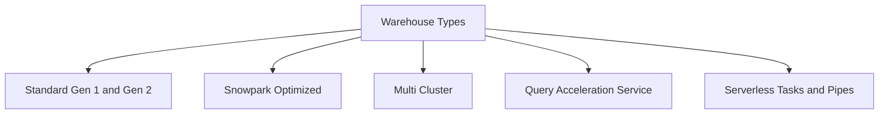
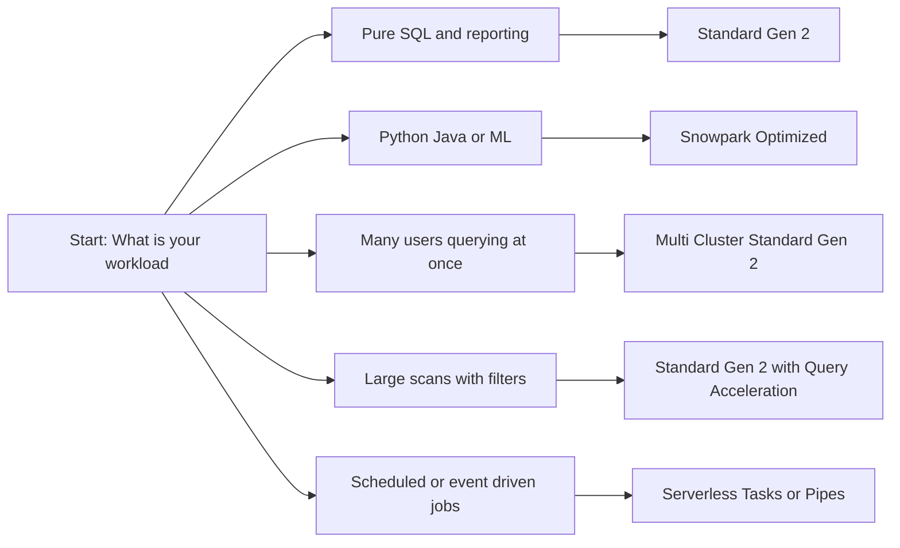
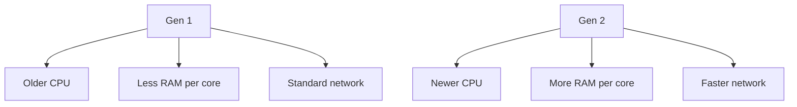
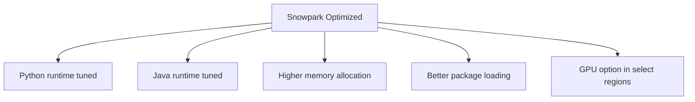
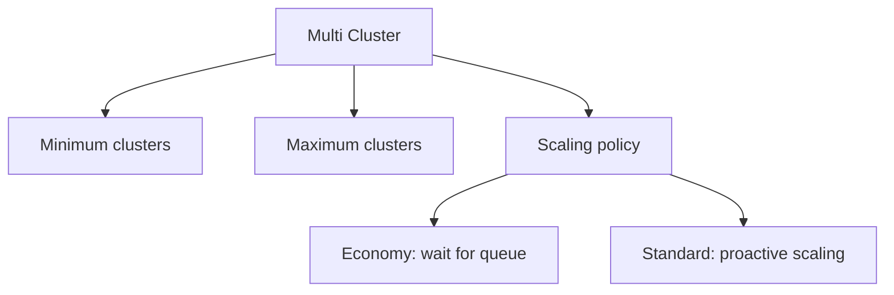
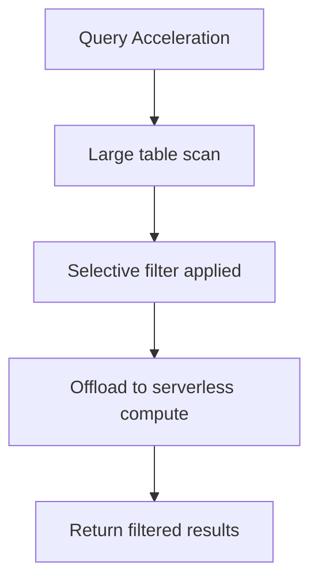
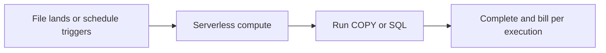
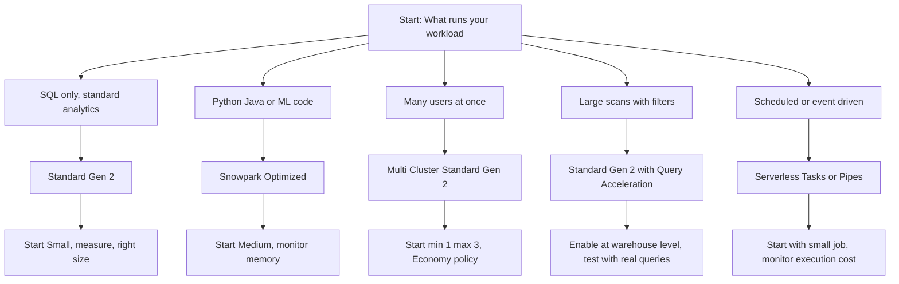

# Virtual Warehouse Types Overview

| Type | Best For | Not Ideal For | Key Differentiator |
|------|----------|---------------|-------------------|
| Standard Gen 2 | SQL queries, BI, reporting, general ETL | Heavy Python or Java workloads | Default choice, modern hardware, best price performance |
| Standard Gen 1 | Legacy systems not yet migrated | Any new workload | Older hardware, same price, slower execution |
| Snowpark Optimized | Python, Java, UDFs, ML inference, external packages | Pure SQL analytics | Memory tuned for language runtimes, fewer out of memory errors |
| Multi Cluster | High concurrency dashboards, team reporting | Single long running query | Adds clusters to handle queue, does not speed up individual queries |
| Query Acceleration Service | Large table scans with selective filters | Small lookups or full table scans | Offloads scan work to serverless compute, reduces credits for eligible queries |
| Serverless for Tasks and Pipes | Scheduled jobs, continuous ingestion | Interactive querying | No warehouse to manage, pay per execution, auto scales |

## Standard Gen 1 and Gen 2

| Property | Gen 1 | Gen 2 |
|----------|-------|-------|
| Hardware | Legacy processors | Modern processors |
| Memory per vCPU | Baseline | 2x to 3x more |
| Storage I/O | Standard | Higher bandwidth |
| Default in new accounts | No | Yes |
| Credit price per size | Same | Same |
| Work completed per credit | Baseline | More work, fewer credits |
| Out of memory risk | Higher for large workloads | Lower, handles bigger data |

- Gen 2 is faster and finishes the same query using fewer total credits
- Same credit price does not mean same cost. Faster execution means lower spend
- Use Gen 2 for all new workloads. Keep Gen 1 only during migration
- Right size after moving to Gen 2. You may drop from Large to Medium and keep the same speed

## Snowpark Optimized

| Property | Value |
|----------|-------|
| Target workload | Snowpark Python, Java, UDFs, ML inference |
| Hardware focus | Memory heavy, runtime tuned for language execution |
| GPU support | Available in select regions for specific ML libraries |
| Credit rate | Same as standard warehouses of the same size |
| Configuration | WAREHOUSE_TYPE set to SNOWPARK-OPTIMIZED |

- Use when running Python or Java code, not for pure SQL
- Start with Medium size. Small sizes often crash during package imports
- Keep SQL and Snowpark workloads on separate warehouses to avoid contention
- Monitor memory usage, not just CPU. Snowpark jobs fail from memory limits first

## Multi Cluster Warehouses

| Policy | Adds cluster when | Removes cluster when | Best for |
|--------|------------------|---------------------|----------|
| Economy | Queries wait in queue for about 2 minutes | Load drops below min for 5 minutes | Cost sensitive, internal tools |
| Standard | Queue starts forming, before users wait | Load stays low for 10 minutes | User facing dashboards, SLA driven |

- Multi cluster solves concurrency, not slow queries. If one query is slow, increase size, not clusters
- Each added cluster burns the same credits per minute as the first
- Start with Economy policy. Switch to Standard only if queue time frustrates users
- Set max clusters to realistic peak, not dream peak. You pay for every active cluster

## Query Acceleration Service

| When it helps | When it does not help |
|---------------|----------------------|
| Scanning 100 GB table, returning 1 GB | Scanning 10 GB table, returning 9 GB |
| Filtering on clustered column | Full table aggregation with no filter |
| Ad hoc exploration with unpredictable filters | Pre aggregated materialized views |

- Enable at warehouse level. Snowflake decides per query whether to use it
- No config changes needed in SQL. Works automatically for eligible queries
- Billing includes serverless credits. Usually net savings for large selective scans
- Test with representative queries. Not all workloads benefit

## Serverless for Tasks and Pipes

| Feature | Tasks Serverless | Pipes Serverless |
|---------|-----------------|------------------|
| Trigger | Time based schedule or dependency | File arrival in stage |
| Compute | Auto provisioned, no warehouse needed | Auto provisioned, no warehouse needed |
| Billing | Per execution, based on work done | Per execution, based on COPY work |
| Best for | Daily aggregates, cleanup jobs | Continuous ingestion from cloud storage |
| Not for | Interactive querying, long running transforms | Manual ad hoc loads |

- No warehouse to size, suspend, or monitor. Snowflake handles scaling
- Pay only for work done. No idle billing
- Use for predictable, repeatable jobs. Not for exploratory work
- Monitor via TASK_HISTORY or PIPE_USAGE views for cost tracking

| Decision Factor | Question To Ask | Guiding Answer |
|----------------|-----------------|----------------|
| Language | Is the workload pure SQL or code heavy | SQL: Standard. Code: Snowpark Optimized |
| Concurrency | Are many users querying at once | Yes: Multi cluster. No: Single cluster |
| Data volume | Are you scanning large tables with filters | Yes: Enable Query Acceleration |
| Execution pattern | Is the job scheduled or event triggered | Yes: Consider serverless Tasks or Pipes |
| Cost sensitivity | Is minimizing spend the top priority | Start with Economy policy and right size down |
| User experience | Do users complain about wait times | Yes: Standard scaling policy, higher max clusters |

| Common Mistake | What Happens | Better Approach |
|----------------|--------------|-----------------|
| Using Snowpark Optimized for SQL | Same cost, zero gain | Use Standard Gen 2 for pure SQL |
| Assuming multi cluster fixes slow queries | Adds cost, does not speed up one query | Scale up size first, then add clusters for concurrency |
| Leaving Query Acceleration always on | Serverless credits add up for ineligible queries | Enable at warehouse level, let Snowflake decide per query |
| Using serverless for interactive work | Higher per execution cost, no session caching | Use standard warehouse for ad hoc querying |
| Mixing workload types on one warehouse | Memory contention, unpredictable performance | Separate SQL, Snowpark, and dashboard workloads |
| Skipping right sizing after migration | Paying for more compute than needed | Re evaluate size after moving to Gen 2 or Snowpark Optimized |

- Start with Standard Gen 2. It is the default for a reason
- Add complexity only when your workload requires it
- Separate workloads into separate warehouses. One type cannot optimize for all patterns
- Measure before you change. One week of real query history beats guessing
- Tag queries with workload type. Track cost and performance by category
- Review warehouse types quarterly. Snowflake updates hardware and features regularly
- Document the why behind each choice. Future you needs context for decisions made today

Think of warehouse types like vehicle classes:
- Standard Gen 2 is the reliable sedan. Handles most trips efficiently
- Snowpark Optimized is the cargo van. Built for heavy loads and special equipment
- Multi cluster is adding more vehicles. Moves more people at once, does not make one car faster
- Query Acceleration is a tow truck for heavy lifts. Helps with specific tough jobs
- Serverless is ride share. Pay per trip, no maintenance, no parking

Pick the vehicle that matches the trip. Do not rent a van for a solo commute. Do not use a sedan for a cross country move. Match the tool to the task. Save cost without sacrificing the outcome.
