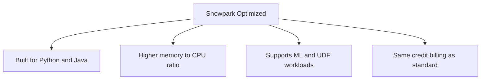
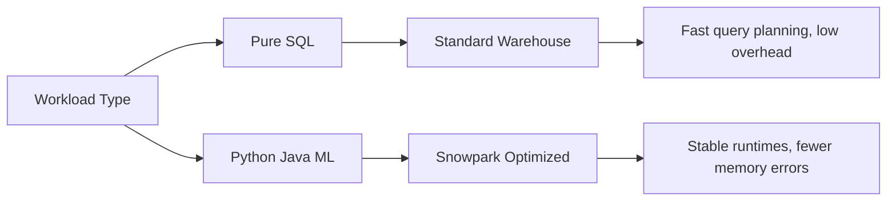
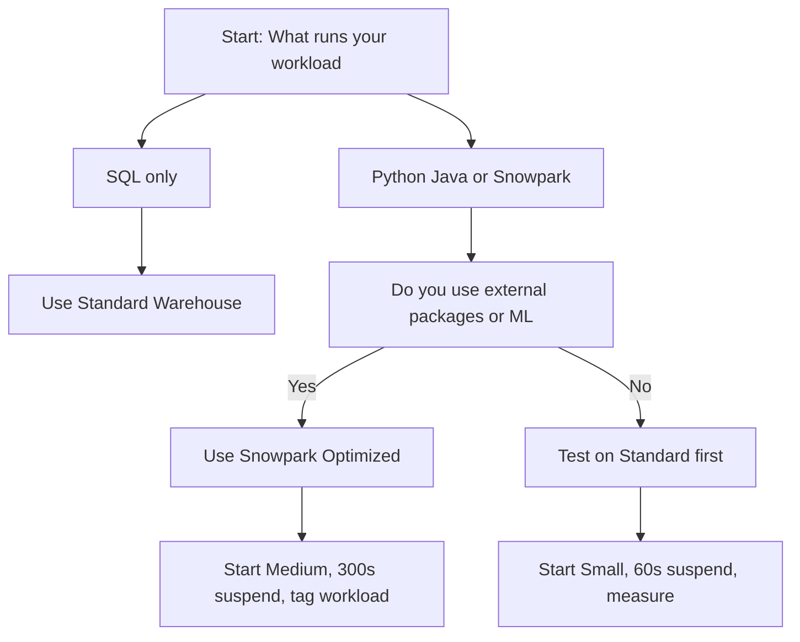

# Snowpark Optimized Warehouse

| Property | What It Means |
|----------|---------------|
| Target workload | Snowpark Python, Java, UDFs, UDTFs, ML inference |
| Hardware focus | Memory heavy, runtime tuned for language execution |
| GPU option | Available in select regions for specific ML libraries |
| Credit rate | Same as standard warehouses of the same size |
| Configuration | WAREHOUSE_TYPE set to SNOWPARK-OPTIMIZED |

| Setting | Example Value | Reason |
|---------|---------------|--------|
| Warehouse type | SNOWPARK-OPTIMIZED | Triggers optimized hardware and runtime config |
| Base size | Medium | Python and Java need more memory than SQL |
| Auto suspend | 300 seconds | Code execution pauses between steps |
| Auto resume | True | Prevents failed runs when idle |
| Statement timeout | 1800 seconds | Stops infinite loops or stalled jobs |

## Standard vs Snowpark Optimized

| Feature | Standard Warehouse | Snowpark Optimized |
|---------|-------------------|-------------------|
| Best for | SQL queries, BI, standard ETL | Python, Java, Snowpark, ML |
| Memory setup | CPU focused, query engine tuned | Balanced for language runtimes |
| External packages | Runs in restricted sandbox | Better compatibility and loading speed |
| GPU support | Not available | Available in some regions for ML |
| Typical error fixed | Slow query plans, queue waits | Out of memory errors, runtime crashes |
| When to pick | Dashboards, data transforms, reporting | UDFs, model inference, code heavy pipelines |

## When To Use vs When To Skip

| Scenario | Pick Optimized | Skip Optimized |
|----------|---------------|----------------|
| Running Snowpark Python transforms | Yes | No |
| Building ML models or running inference | Yes | No |
| Loading heavy third party packages | Yes | No |
| Pure SQL analytics or reporting | No | Yes |
| Simple COPY INTO or file loads | No | Yes |
| Dashboard refreshes or ad hoc queries | No | Yes |

| Metric | What To Watch | Action If Off Target |
|--------|---------------|---------------------|
| Memory usage | High during package imports or data transforms | Increase size or split job into steps |
| Runtime stability | Frequent out of memory or process kills | Move to Snowpark Optimized if on standard |
| Credit spend | Same as standard for equal size | Optimize code logic instead of changing hardware |
| Queue time | Users waiting for compute | Add clusters or separate workloads |
| Job completion | Timeouts or stalls | Lower timeout, fix infinite loops, check data filters |

## Best Practices

- Keep SQL and Snowpark workloads on separate warehouses. Mixing them causes memory contention
- Start with Medium size. Small sizes often crash during package imports or data loads
- Set auto suspend to 300 seconds. Code execution pauses longer than SQL queries
- Tag queries with workload type. Track Snowpark cost separately from SQL work
- Test external packages before scaling. Some libraries take minutes to load and burn credits
- Monitor memory, not just CPU. Snowpark jobs fail from memory limits first
- Use separate roles for access. Grant USAGE to data science roles, restrict from analysts
- Review job logs weekly. Stale or failing Snowpark jobs drain credits silently
- Do not expect hardware to fix bad code. Optimized warehouses run inefficient logic faster and more expensively
- Keep GPU usage explicit. Only specific ML libraries trigger GPU acceleration. SQL and standard Python ignore it

## Common Mistakes

| Mistake | What Happens | Fix |
|---------|--------------|-----|
| Using for pure SQL | Same cost, zero performance gain | Switch to standard warehouse |
| Assuming GPU auto speeds everything | Only specific ML frameworks use it | Verify library supports GPU before enabling |
| Running multiple heavy jobs on one warehouse | Memory contention, job failures | Split into separate warehouses or schedule sequentially |
| Forgetting statement timeout | Infinite loops drain credits | Set timeout to 1800 seconds max |
| Skipping memory monitoring | Jobs fail silently, retries burn spend | Track memory via query history and job logs |
| Treating it like a magic fix | Bad filters or joins still run slow | Optimize code first, then adjust warehouse |

## Quick Setup Checklist

- Create warehouse with WAREHOUSE_TYPE set to SNOWPARK-OPTIMIZED
- Assign to role, not individual user
- Set auto resume true and auto suspend to 300 seconds
- Attach resource monitor with alert at 75 percent quota
- Run test job with real data and real package imports
- Compare runtime and memory usage against standard warehouse
- Keep config if memory errors drop and runtime stabilizes
- Revert if cost rises without performance or stability gain
- Document expected workload and tag queries for tracking
- Schedule monthly review to right size or retire unused warehouses
