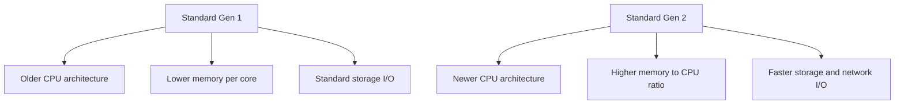
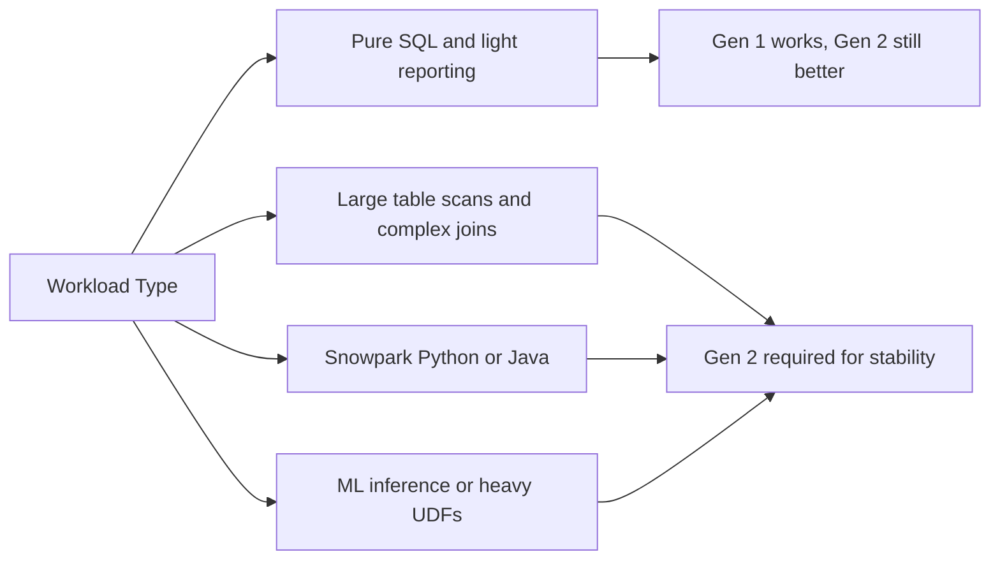
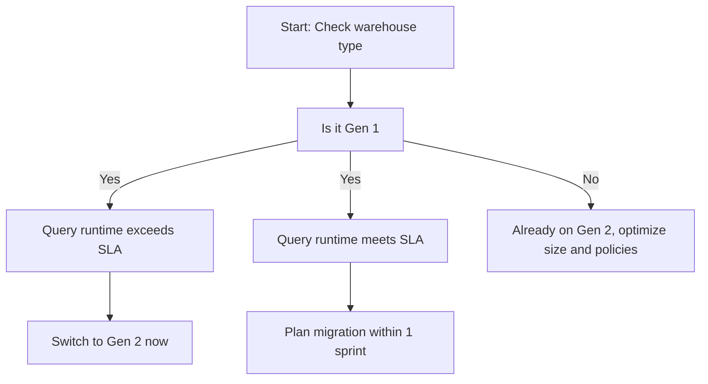

# Standard Gen 1 vs Gen 2 Virtual Warehouses

| Aspect | Gen 1 | Gen 2 |
|--------|-------|-------|
| Hardware generation | Legacy processors | Modern processors |
| Memory allocation | Less RAM per vCPU | 2x to 3x more RAM per vCPU |
| Storage network speed | Standard bandwidth | Higher bandwidth for data movement |
| Query engine tuning | Basic SQL workloads | Complex joins, large scans, data apps |
| Default status | Not default in new accounts | Default for all new warehouses |
| Credit pricing | Same per size tier | Same per size tier |
| Work per credit | Baseline | Faster execution, fewer total credits |
| Snowpark and package support | Can hit memory limits | Handles large imports and runtime loads |

- Gen 1 uses older compute nodes with tighter memory constraints
- Gen 2 uses newer nodes with more RAM and faster internal networking
- Both run the exact same Snowflake query optimizer and storage layer
- The only difference is the physical hardware behind the virtual warehouse
- Gen 2 finishes the same work faster and burns fewer credits over time
- Snowflake treats Gen 2 as the standard. Gen 1 is legacy infrastructure

- Use Gen 2 for all new workloads. It is faster and costs less per completed query
- Keep Gen 1 only if you have a legacy system that cannot change connection settings yet
- Do not stay on Gen 1 because it feels familiar. You are paying the same rate for slower hardware
- Gen 2 reduces out of memory errors for data apps and large transforms
- Gen 2 handles concurrent users better because each node caches more data locally

| Step | Action | Verify |
|------|--------|--------|
| 1 | Check current type | Run SHOW WAREHOUSES and check WAREHOUSE_TYPE column |
| 2 | Create Gen 2 warehouse | Set size, auto suspend, and grant to roles |
| 3 | Test real queries | Run the same SQL on both warehouses and compare duration |
| 4 | Update connections | Point apps and notebooks to the new warehouse |
| 5 | Monitor for 3 days | Check for queue errors, timeouts, or credit spikes |
| 6 | Drop Gen 1 warehouse | Remove it to stop idle billing and avoid confusion |

- Migration requires zero data movement. Only compute endpoints change
- Run both warehouses side by side during the switch to avoid downtime
- Test with production data patterns, not sample rows. Performance gaps show at scale
- Keep auto resume enabled on the new warehouse to prevent failed queries
- Drop the old warehouse immediately after cutover. Idle legacy warehouses waste credits

| Mistake | What Happens | Fix |
|---------|--------------|-----|
| Keeping Gen 1 for cost savings | Same credit rate, slower execution, higher total cost | Migrate to Gen 2 and right size down |
| Assuming Gen 2 fixes bad queries | Poor filters or missing joins still run slow | Optimize SQL first, then let Gen 2 accelerate it |
| Mixing Gen 1 and Gen 2 in same pipeline | Inconsistent runtimes make scheduling hard | Standardize all compute on Gen 2 |
| Forgetting to update connection strings | Apps keep hitting old warehouse after migration | Audit all drivers, ORMs, and notebook configs |
| Skipping credit comparison | You do not see the savings that justify the switch | Track credits per query before and after migration |
| Treating generation like a feature toggle | It is hardware. You cannot flip it back and forth per query | Plan a clean cutover and drop the old warehouse |

- Gen 2 is the baseline. Gen 1 is deprecated hardware
- Same credit price does not mean same cost. Faster execution means lower total spend
- Right size after migration. You may drop from Large to Medium and keep the same speed
- Tag queries to track generation performance. Data beats assumptions
- Document the switch date and credit delta. Share results with your team
- Review warehouse types quarterly. Snowflake updates hardware silently in new regions
