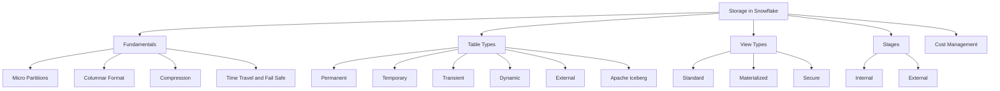
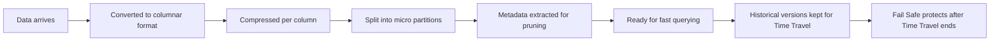
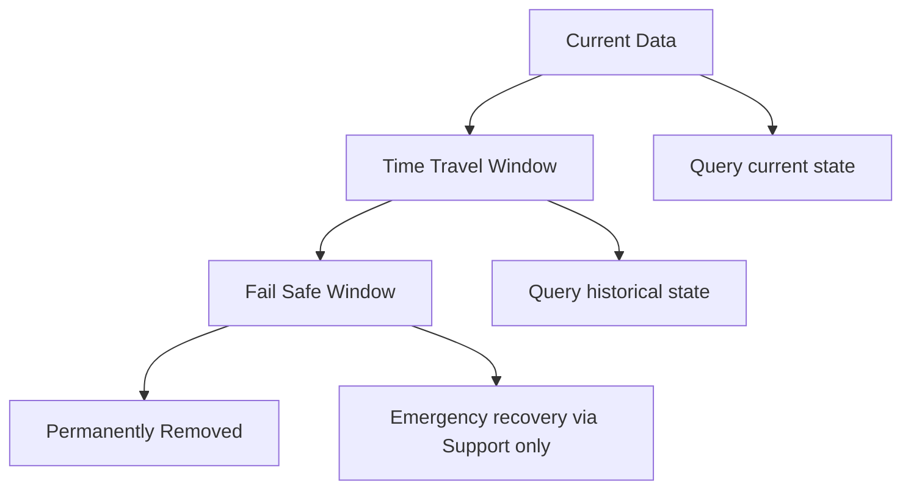
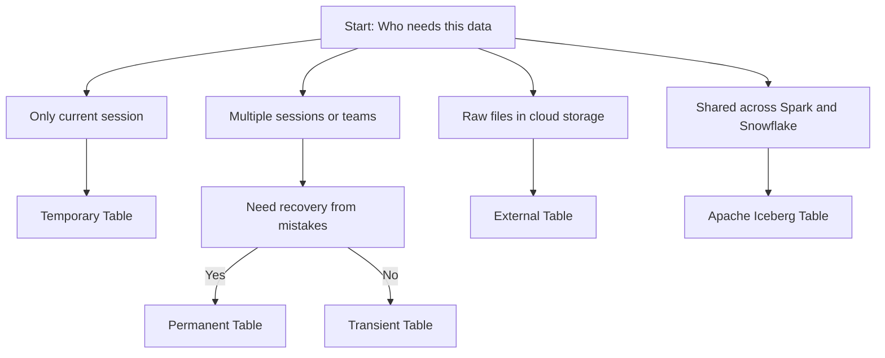
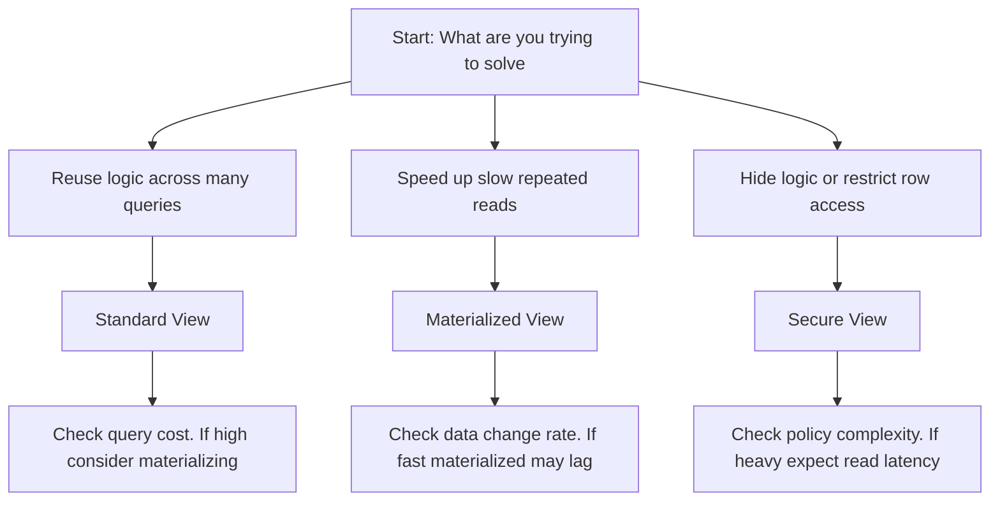
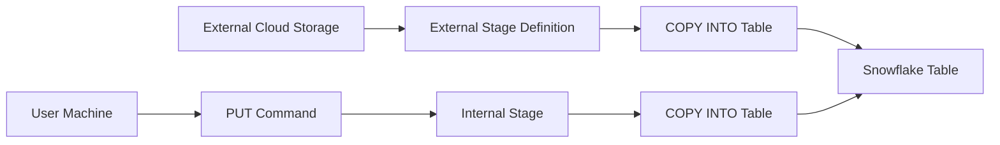
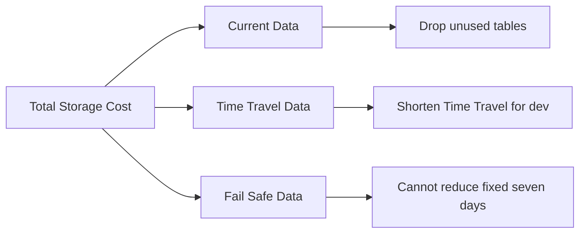
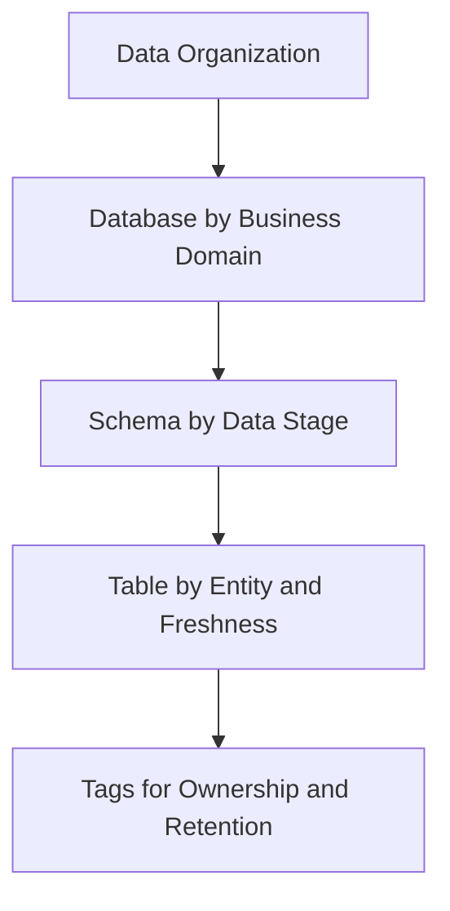
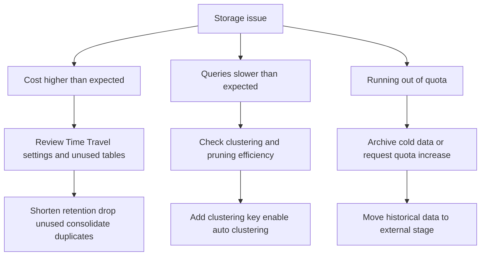
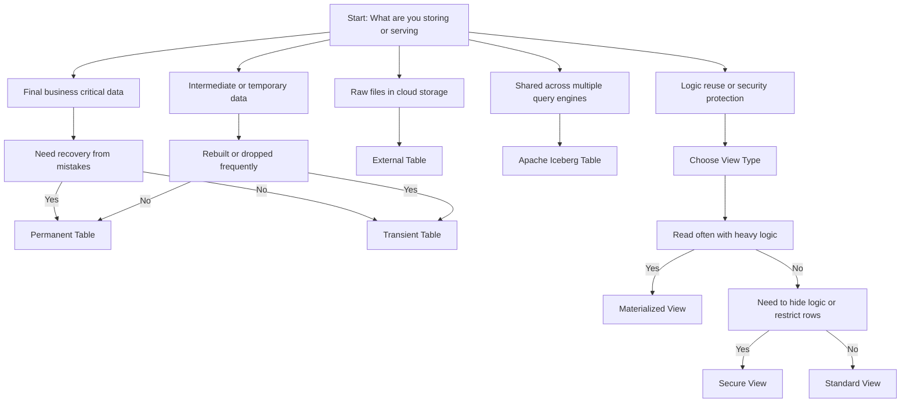

# Snowflake Storage Concepts Overview

| Concept | What It Is | Why It Matters |
|---------|-----------|----------------|
| Micro partitions | Small immutable blocks of columnar data | Enable fast pruning and efficient updates |
| Columnar storage | Data stored by column not by row | Read only the columns you need |
| Automatic compression | Best algorithm per column applied on ingest | Reduces storage cost and I/O without config |
| Clustering metadata | Min max and distinct values tracked per block | Lets Snowflake skip irrelevant data |
| Time Travel | Access to historical data for a window | Recover from mistakes or audit changes |
| Fail Safe | Protected recovery period after Time Travel | Emergency only recovery for compliance |
| Table types | Different lifecycle and protection levels | Match storage to data importance and cost needs |
| View types | Different ways to reuse or protect query logic | Balance compute cost freshness and security |
| Stages | Holding areas for files during load or unload | Bridge between cloud storage and Snowflake tables |

## Storage Fundamentals

### Micro Partitions

| Property | Detail |
|----------|--------|
| Size | Fifty to five hundred megabytes uncompressed |
| Immutability | Written once. Never changed in place |
| Metadata | Min max null count distinct count per column |
| Pruning | Skip blocks that cannot match query filters |
| Management | Snowflake creates merges and drops automatically |

- You do not manage blocks. You manage how data lands and how you query it
- The system assumes you will read less than you store. If you always read everything pruning does nothing for you
- Blocks are born sorted. Updates and deletes scatter values. This is decay. It is normal
- Clustering keys guide how Snowflake groups data when it naturally rewrites blocks

### Compression and Columnar Format

| Feature | How It Works | Benefit |
|---------|-------------|---------|
| Columnar format | Each column stored separately | Read only columns you need |
| Per column compression | Best algorithm picked per column type | Higher compression ratios |
| Dictionary encoding | Repeated values stored as references | Saves space for low cardinality columns |
| Run length encoding | Consecutive identical values stored once | Efficient for sorted or time series data |
| Automatic application | No user config needed | Works out of the box |

- Compression ratios typically three to ten times depending on data
- You are billed for compressed size not raw size
- Columnar format enables vectorized execution for faster analytics
- No need to create indexes. Micro partition metadata serves that purpose

### Time Travel and Fail Safe

| Edition | Time Travel Window | Fail Safe |
|---------|-------------------|-----------|
| Standard | One day fixed | Seven days |
| Enterprise and above | One to ninety days configurable | Seven days |

| Action | Syntax Example |
|--------|---------------|
| Query as of timestamp | SELECT FROM table AT TIMESTAMP TO_TIMESTAMP_TZ 2024 01 15 10 00 00 UTC |
| Query as of offset | SELECT FROM table BEFORE OFFSET 60 MINUTE |
| Undelete table | UNDELETE TABLE table WITH TIMESTAMP TO_TIMESTAMP_TZ 2024 01 15 10 00 00 UTC |

- Time Travel stores historical micro partitions separately from current data
- You pay storage costs for historical data during the Time Travel window
- Fail Safe data is not queryable. It is for emergency recovery only via Snowflake Support
- Setting Time Travel to zero days disables historical access but does not reduce storage for current data

## Table Types Summary

| Type | Data Location | Time Travel | Fail Safe | Best For |
|------|--------------|-------------|-----------|----------|
| Permanent | Snowflake storage | One to ninety days | Seven days | Production data that must be recovered |
| Temporary | Snowflake storage | Zero to one day | None | Session specific intermediate results |
| Transient | Snowflake storage | Zero to one day | None | ETL staging or rebuilt aggregates |
| Dynamic | Snowflake storage | Inherits from base | Inherits from base | Automated incremental pipelines |
| External | Your cloud storage | Not supported | Not supported | Query raw files without loading |
| Apache Iceberg | Your cloud storage | Via snapshots | Via catalog | Multi engine access and governance |

### When to Use Each Table Type

| Scenario | Recommended Type | Why |
|----------|-----------------|-----|
| Customer records that must be audited | Permanent | Need Time Travel and Fail Safe for compliance |
| ETL staging tables dropped daily | Transient | Avoid paying for history on temporary data |
| Session specific calculations | Temporary | Isolate work that does not leave the script |
| Automated data mart refresh | Dynamic | Snowflake handles incremental updates automatically |
| Query raw logs without loading | External | No copy step. Query files where they live |
| Share data with Spark and Trino | Apache Iceberg | Open format readable by multiple engines |

## View Types Summary

| Type | What It Holds | When Compute Happens | Storage Cost | Best For |
|------|--------------|---------------------|--------------|----------|
| Standard | Saved query definition | At query time | None | Logic reuse light transforms ad hoc reports |
| Materialized | Physical copy of results | During background refresh | You pay for stored rows | Heavy dashboards repeated slow queries |
| Secure | Saved query with access rules | At query time plus policy check | None | Sharing sensitive data hiding logic row masking |

### View Selection Guide

| Question | If Yes | If No |
|----------|--------|-------|
| Will many people read the same result often | Consider Materialized View | Standard View likely sufficient |
| Does the source data change slowly | Materialized View can help | Standard View avoids staleness risk |
| Do you need to hide table structure or filter rows by user | Secure View adds protection | Standard or Materialized without security |
| Is the underlying query heavy with joins or aggregations | Materialize to avoid repeated cost | Standard View keeps logic simple |
| Do you need always current data | Standard or Secure View | Materialized View may have lag |

## Stages for File Management

| Stage Type | Location | Best For | Access Pattern |
|------------|----------|----------|---------------|
| Internal user stage | Inside Snowflake tied to your user | Quick ad hoc file loads | PUT and GET commands from client |
| Internal table stage | Inside Snowflake tied to a table | Loading data into one table repeatedly | COPY INTO table FROM stage |
| Internal named stage | Inside Snowflake with custom name | Shared file storage across teams | GRANT usage to roles for collaboration |
| External stage | Reference to S3 Azure Blob or GCS | Querying data where it lives or loading from external pipelines | Define with URL and credentials or IAM role |

| Command | Purpose | Example |
|---------|---------|---------|
| PUT | Upload file from local to internal stage | PUT file data.csv @my_stage |
| GET | Download file from internal stage to local | GET @my_stage data.csv file tmp |
| LIST | Show files in a stage | LIST @my_stage |
| REMOVE | Delete files from internal stage | REMOVE @my_stage old_file.csv |
| COPY INTO | Load data from stage into table | COPY INTO my_table FROM @my_stage FILE_FORMAT CSV |

## Storage Cost Management

| Billing Component | How It Is Measured | Typical Rate US East AWS |
|------------------|-------------------|-------------------------|
| Compressed storage | Average bytes stored per day | Twenty three USD per TB per month |
| Time Travel storage | Historical micro partitions retained | Same rate as compressed storage |
| Fail Safe storage | Protected recovery data after Time Travel | Same rate as compressed storage |
| Data transfer | Bytes moved out of Snowflake to external | Varies by cloud provider and region |

### Cost Control Practices

| Practice | How To Implement | Expected Impact |
|----------|-----------------|-----------------|
| Drop or truncate unused tables | Identify with ACCOUNT_USAGE views | Immediate storage savings |
| Shorten Time Travel for dev test | ALTER DATABASE SET DATA_RETENTION_TIME_IN_DAYS 1 | Reduce historical storage by up to ninety percent |
| Use transient tables for temporary data | CREATE TRANSIENT TABLE instead of TABLE | No Time Travel or Fail Safe storage costs |
| Archive old data to external stage | COPY to S3 then DROP from Snowflake | Move cold data to cheaper cloud storage |
| Monitor storage growth weekly | Query STORAGE_METERING_HISTORY views | Catch surprises before they impact budget |

## Data Organization Best Practices

| Practice | Why It Matters | How To Apply |
|----------|---------------|--------------|
| Use databases to separate business domains | Clear ownership and access control | Create FINANCE_DB MARKETING_DB OPERATIONS_DB |
| Use schemas to separate data lifecycle stages | Organize raw cleaned and curated data | Use RAW CLEANED REPORTING schemas inside each database |
| Name tables with purpose and freshness | Avoid confusion about data source and recency | Use naming like events_raw_daily user_facts_hourly |
| Use transient tables for intermediate results | Avoid paying for Time Travel on temporary data | CREATE TRANSIENT TABLE for ETL staging |
| Document table purpose and retention | Helps teammates understand when to archive or drop | Add table comment with owner and expected lifespan |
| Tag objects for cost attribution | Track spend by team project or environment | Add tags like team analytics project monthly_report |

## Common Storage Mistakes and Fixes

| Mistake | What Happens | How To Fix |
|---------|--------------|------------|
| Leaving ninety day Time Travel on dev databases | Paying for history on data that changes daily | Set DATA_RETENTION_TIME_IN_DAYS to one for non prod |
| Using permanent tables for ETL staging | Accumulating Time Travel storage for data you never query | Use transient tables or drop immediately after use |
| Never reviewing table sizes | Large unused tables keep consuming storage | Query ACCOUNT_USAGE.TABLE_STORAGE_METRICS monthly |
| Loading duplicate files to internal stages | Wasting storage on redundant raw files | Implement deduplication logic before load |
| Ignoring clustering depth on large filtered tables | Queries scan more micro partitions than needed | Define clustering key and enable automatic clustering |
| Using standard views for heavy repeated queries | Paying compute cost on every read | Materialize the view if result is read often |
| Materializing fast changing data | Background refreshes burn credits for stale results | Use standard view or query source directly |

## Decision Framework

## Key Principles

- Storage is billed for compressed data not raw size. Compression is automatic and free
- Time Travel and Fail Safe add storage costs. Configure retention based on actual need
- Micro partitions and pruning make large tables fast. You do not need to manage indexes
- Clustering improves query performance for filtered workloads. Monitor depth to justify cost
- Table type is a lifecycle decision not a performance decision. Match protection to data value
- View type is a compute timing decision. Choose when you pay for the work
- Separate workloads by database and schema. Makes access control and cost attribution clearer
- Use transient tables for temporary data. Avoid paying for history you never query
- Review storage usage monthly. Workloads change and your storage strategy should too
- Archive cold data to external storage. Keep hot data in Snowflake for performance

## Bottom Line

- Snowflake storage is automatic columnar compressed and partitioned
- You control cost through retention settings table lifecycle and data organization
- Micro partitions and metadata enable fast queries without manual indexing
- Time Travel is powerful but costs money. Set it intentionally per environment
- Table types let you match protection to data importance. Permanent for critical Transient for temporary Temporary for session only
- View types let you balance compute cost freshness and security. Standard for reuse Materialized for speed Secure for protection
- Stages bridge files and tables. Use internal for quick loads external for integration
- Measure before you optimize. One week of storage metrics beats guessing
- Document your data organization. Future you and your teammates need context

Think of Snowflake storage like a smart warehouse:
- Items arrive and are automatically sorted labeled and compressed
- You can ask for any item from any point in the recent past
- The warehouse skips aisles it knows do not contain what you need
- You pay for the space your items actually occupy not the raw size they arrived in
- Temporary items can be marked for quick disposal to save space
- Shared items can be accessed through controlled windows without moving them

Use the warehouse wisely. Keep what you need. Archive what you do not. Organize so you can find things fast. Save space without losing what matters.
