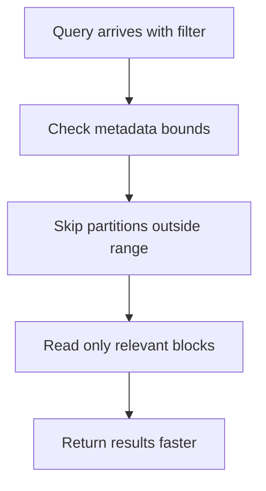
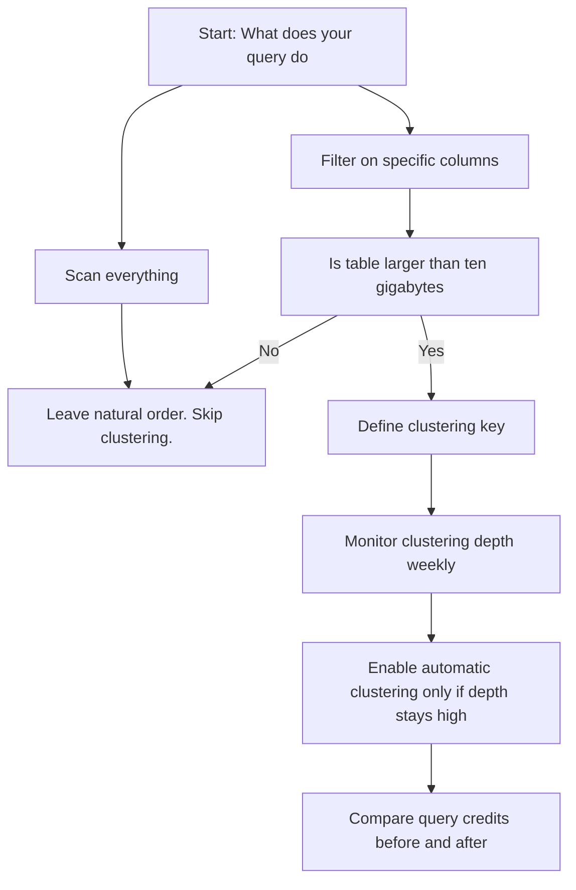
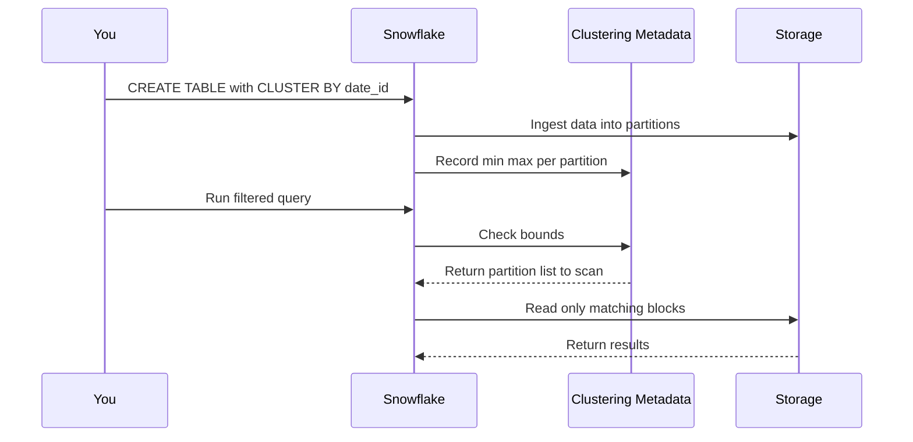
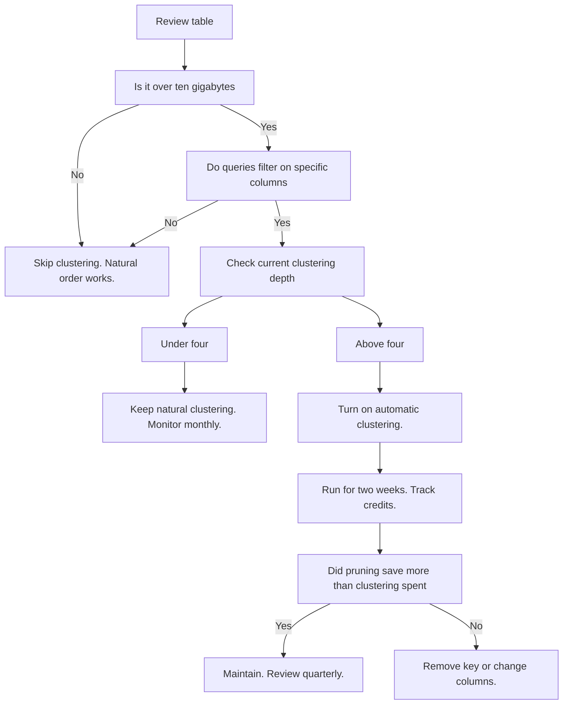

# Data Clustering in Snowflake

- Data clustering is not an index. It is a map of where your data lives.
- Snowflake tracks the lowest and highest values of each column inside every micro partition.
- When you run a query, Snowflake reads the map first. It skips blocks that cannot possibly contain your answer.
- This is called pruning. Less data read means less compute used. Less compute means lower cost.

| Concept | What It Means | Why It Matters |
|---------|---------------|----------------|
| Micro partition | Immutable block of columnar data | Snowflake never changes existing blocks. It writes new ones. |
| Natural clustering | Order of data when it first lands | New data usually lands sorted. Pruning works well initially. |
| Clustering decay | DML operations mix old and new data | Inserts updates and deletes scatter values. Map becomes fuzzy. |
| Clustering depth | Count of overlapping partitions per value | Low depth means clean map. High depth means heavy overlap. |
| Automatic clustering | Background task that reorganizes data | Snowflake rewrites blocks to restore the map. Costs credits. |

- You do not need clustering to make Snowflake fast. You need it to keep Snowflake from doing unnecessary work.
- If your query reads the whole table anyway, clustering adds cost and brings no speed.
- If your query filters on one column and reads one percent of the data, clustering cuts the work by ninety percent.
- The goal is never to organize data perfectly. The goal is to organize it enough that your most common queries skip the noise.

| Workload Pattern | Should You Cluster | Reason |
|------------------|-------------------|--------|
| Filter by date or status on a billion row table | Yes | Pruning skips months of data in milliseconds. |
| Join two large tables on a common key | Yes | Both sides skip irrelevant blocks before joining. |
| Full table aggregation with no WHERE clause | No | Scanning everything makes clustering useless. |
| Table under five gigabytes | No | Snowflake reads it fast anyway. Metadata overhead costs more. |
| Random lookup by UUID or hash | No | High cardinality spreads values everywhere. Map does not help. |
| Frequently updated table with wide filters | Maybe | Test first. High DML may outpace clustering benefits. |

- Automatic clustering burns credits. It is a compute operation that rewrites storage.
- You pay once to reorganize. You save every time a query skips data.
- If your queries do not filter on the clustered column, you pay the reorganization cost for zero return.
- Never enable automatic clustering on a table just because the feature exists. Enable it because your query history proves it will pay for itself.

| Metric | What To Track | Healthy Range | Action If Off |
|--------|---------------|---------------|---------------|
| Clustering depth | Average overlap per value | Under four for key columns | Enable automatic clustering or adjust key |
| Pruning ratio | Bytes read vs bytes scanned | Above seventy percent | Query likely hits right partitions |
| Automatic clustering credits | Spend per week | Less than ten percent of total warehouse spend | Re evaluate key or disable |
| Query runtime | P95 completion time | Meets SLA | Adjust size or fix query logic first |

| Trap | What Happens | How To Fix |
|------|--------------|------------|
| Clustering on too many columns | Overlap increases. Map becomes useless. Pick one or two. |
| Using high cardinality columns | Every partition holds a wide range. Pruning fails. Pick low cardinality or sequential columns. |
| Enabling automatic clustering blindly | Credits drain. Performance does not improve. Check clustering depth first. |
| Clustering a small table | Overhead outweighs benefit. Natural order is enough. |
| Ignoring DML impact | Heavy updates break clustering. Schedule clustering during quiet windows or accept decay. |
| Assuming clustering fixes bad SQL | Missing joins or full scans still read everything. Fix the query before touching storage. |

- Define the key on the column you filter most. Usually a date or sequential ID.
- Let Snowflake run for a week. Watch how the data organizes itself naturally.
- Check clustering depth with the SYSTEM function.
- Turn on automatic clustering only if depth stays above your target and queries are slow.
- Measure credits spent on clustering versus credits saved from faster pruning.
- Adjust or remove the key if the math does not work out.

- You are probably trying to optimize everything. Do not. Optimize only the queries that run often and cost the most.
- Clustering is a trade off. You exchange write overhead for read speed. If your workload writes more than it reads, clustering will slow you down.
- The system already clusters data on load. You are not starting from chaos. You are fighting the natural decay that happens over time.
- You can change clustering keys at any time. Snowflake rewrites data in the background. Treat it as an experiment, not a permanent contract.
- Monitor the actual credit savings. If automatic clustering costs more than it saves, turn it off. The tool is not obligated to stay on.

- Data does not need to be perfect. It needs to be predictable enough that your queries can ignore what they do not need.
- Clustering is not about forcing order. It is about reducing friction.
- Measure the friction. Remove only what costs you. Leave the rest alone.
- The system will do the heavy lifting if you point it in the right direction.
- Ask yourself what you are actually trying to read. Optimize for that. Ignore the rest.
