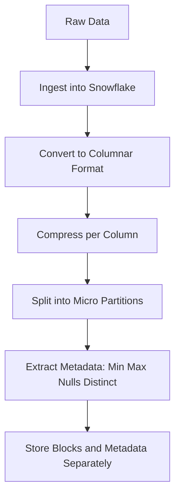
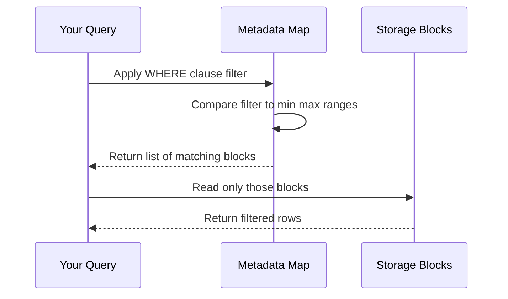
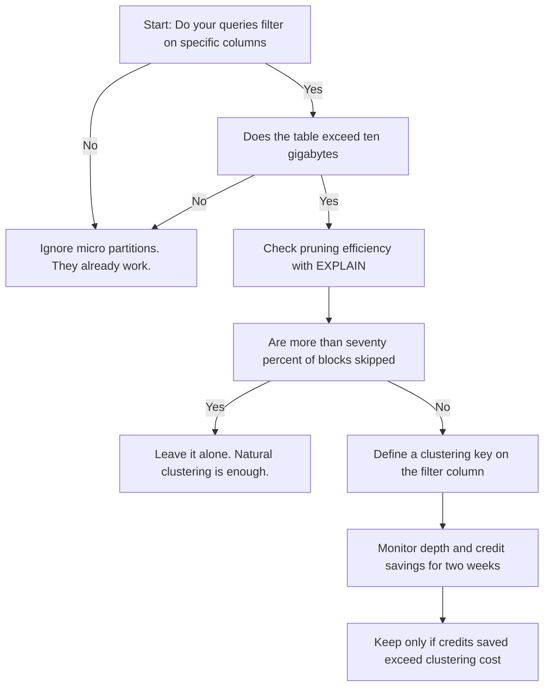

# Micro Partitions

| Concept | What It Actually Is | Why You Should Care |
|---------|-------------------|-------------------|
| Size | Fifty to five hundred megabytes uncompressed per block | Large enough to batch I/O efficiently. Small enough to skip quickly. |
| Immutability | Written once. Never changed in place. | Updates and deletes create new blocks. Old ones are marked for cleanup. |
| Metadata | Min max null count and distinct count per column per block | Acts as a map. Lets the engine skip blocks before reading a single byte. |
| Pruning | Skipping blocks that cannot match your filter | Reads less data. Uses less compute. Costs fewer credits. |
| Automatic Management | Snowflake creates merges and drops blocks without your input | You do not manage pages or indexes. You manage how data lands and how you query it. |

- You are likely treating storage like a traditional database. It is not. Snowflake does not use B trees or page pointers. It uses a map and a filter.
- The system assumes you will read less than you store. If you always read everything, the map does nothing for you. Optimize your query first.
- Blocks are born sorted. As you insert update or delete, values scatter. The map gets fuzzy. This is decay. It is normal. It is not broken.
- Clustering keys do not rewrite data on every change. They tell Snowflake how to group data when it naturally rewrites blocks. You are guiding gravity not forcing order.
- You cannot force a specific block size. You cannot force block boundaries. You can only control what columns you load and in what order.
- Time Travel and Fail Safe work because blocks are immutable. Historical versions are just pointers to old blocks. You pay for the blocks you keep.
- If your table fits in memory, pruning barely matters. If your table spans petabytes, pruning is the difference between a query that finishes and one that times out.
- Do not ask how to tune blocks. Ask what your queries actually need to skip. Design for the skip. The system handles the rest.

| What You Control | What Snowflake Controls | What You Cannot Change |
|------------------|------------------------|------------------------|
| Column order during load | Block creation and compression | Block size or internal layout |
| Clustering key definition | Metadata extraction and pruning logic | Physical storage location |
| Time Travel retention window | Block cleanup and vacuum scheduling | Direct block manipulation |
| Query filters and join order | Automatic merging of overlapping blocks | Index creation or hints |

- You will be tempted to cluster every large table. Stop. Clustering is a tax on writes. Only pay it when reads are expensive.
- High cardinality columns like UUIDs or emails spread across every block. The map overlaps completely. Pruning fails. Pick sequential or categorical columns.
- Multiple clustering keys increase overlap. The map gets wider. Pick the one column your queries use most. Add a second only when the first proves insufficient.
- Automatic clustering runs in the background. It burns credits. If your workload is mostly inserts and rarely queried, clustering will drain your budget for no return.
- You do not need to rebuild tables to fix pruning. Let the system merge blocks over time. Forcing manual rewrites wastes compute and creates more overlap.
- Check query history for bytes scanned versus bytes returned. If scanned is near returned, your filters are not aligning with block boundaries. Change the query or the load order.
- Storage cost is based on compressed size. Pruning reduces compute cost. Do not confuse the two. You cannot compress your way out of bad query patterns.
- The system already clusters data on ingest. Your job is not to organize perfection. Your job is to prevent unnecessary work.

| Symptom | Likely Root Cause | How To Fix |
|---------|-------------------|------------|
| Queries scan full table despite WHERE clause | Filter column has high cardinality or is not in the load order | Change load order or pick a different clustering key |
| Credits spike after enabling automatic clustering | DML rate is high and queries do not benefit from pruning | Disable automatic clustering and review query patterns |
| Time Travel storage costs grow unexpectedly | Long retention on tables that change daily | Shorten retention for non prod or use transient tables |
| Pruning ratio drops over time | Natural decay from frequent updates | Schedule a manual clustering operation during off peak hours |
| Query runs fast at first then slows | Data scattered after bulk load or heavy DML | Let the system auto merge or adjust clustering key |
| You see no performance change after clustering | Queries already prune efficiently or table is too small | Measure bytes scanned. If already low, clustering adds cost not speed |

- You are trying to control what should be invisible. The design hides the mechanics so you can focus on logic. Trust the abstraction until it proves inefficient.
- Measure the skip not the read. If your query touches one block out of a thousand, the system is working. Celebrate that and move to the next bottleneck.
- Storage and compute are separate by design. You pay for blocks you keep. You pay for compute you run. Optimize each independently.
- Do not build storage solutions for compute problems. Fix the query first. If it still scans too much, then guide the layout.
- The system will not punish you for leaving things alone. It will punish you for forcing order where none is needed.
- Ask yourself what you are actually trying to avoid reading. Build your load order and keys around that question. Ignore everything else.
