# Snowflake Storage Fundamentals

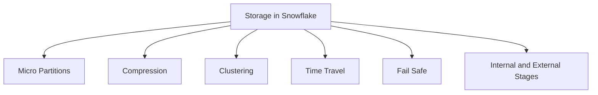

| Concept | What It Is | Why It Matters |
|---------|-----------|----------------|
| Micro partitions | Small immutable blocks of data 50 to 500 MB uncompressed | Enables fast pruning, efficient updates, and time travel |
| Columnar storage | Data stored by column not by row | Speeds up analytical queries that read few columns |
| Automatic compression | Snowflake compresses data on ingest using best algorithm per column | Reduces storage cost and I/O without user action |
| Clustering keys | Metadata that tracks value ranges per micro partition | Helps Snowflake skip irrelevant data during queries |
| Time Travel | Access to historical data for a configurable window | Recover from mistakes, audit changes, reproduce results |
| Fail safe | Protected recovery period after Time Travel ends | Emergency only recovery for compliance and disaster scenarios |
| Internal stage | Temporary storage area inside your Snowflake account | Hold files during load or unload operations |
| External stage | Reference to cloud storage like S3 Azure Blob or GCS | Query data where it lives without moving it |

## Micro Partitions Deep Dive

| Property | Detail |
|----------|--------|
| Size range | 50 to 500 MB uncompressed per micro partition |
| Immutability | Once written micro partitions never change |
| Update behavior | Updates create new micro partitions old ones marked for cleanup |
| Pruning | Snowflake skips micro partitions that cannot match query filters |
| Metadata tracked | Min max values null count distinct count per column per micro partition |

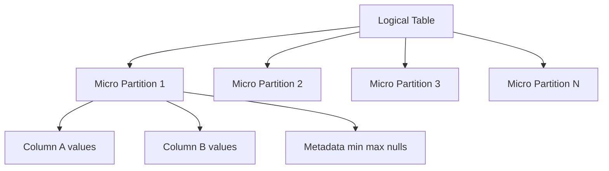

- Micro partitions are created automatically during data load or DML
- You do not manage them directly. Snowflake handles creation merging and cleanup
- Queries use metadata to skip micro partitions that cannot contain matching rows
- This pruning is why Snowflake can scan petabytes but read only gigabytes
- Clustering keys improve pruning efficiency for filtered queries

## Compression and Columnar Storage

| Feature | How It Works | Benefit |
|---------|-------------|---------|
| Columnar format | Each column stored separately | Read only columns you need skip the rest |
| Per column compression | Snowflake picks best algorithm per column type | Higher compression ratios than one size fits all |
| Dictionary encoding | Repeated values stored as references | Saves space for low cardinality columns like status or region |
| Run length encoding | Consecutive identical values stored once | Efficient for sorted or time series data |
| Automatic application | No user config needed | Works out of the box with no tuning |

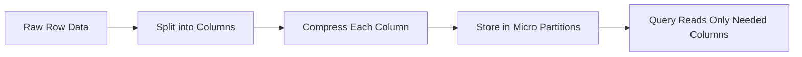

- Compression ratios typically 3x to 10x depending on data type and patterns
- You are billed for compressed storage size not raw size
- Columnar format enables vectorized execution for faster analytics
- No need to create indexes. Micro partition metadata serves that purpose

## Clustering and Pruning

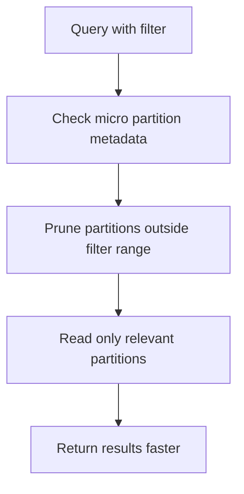

| Term | Meaning |
|------|---------|
| Clustering key | One or more columns used to co locate related data in micro partitions |
| Clustering depth | Measure of how well data is organized by clustering key lower is better |
| Automatic clustering | Background process that reorganizes data to maintain clustering quality |
| Pruning | Skipping micro partitions that cannot match query filters based on metadata |

| When clustering helps | When it does not help |
|----------------------|----------------------|
| Frequent filters on same column | Queries always scan full table |
| Large tables with selective filters | Small tables under 10 GB |
| Time series data filtered by date | Random access patterns with no filter pattern |
| Join keys used in frequent joins | Columns with high cardinality and no filter selectivity |

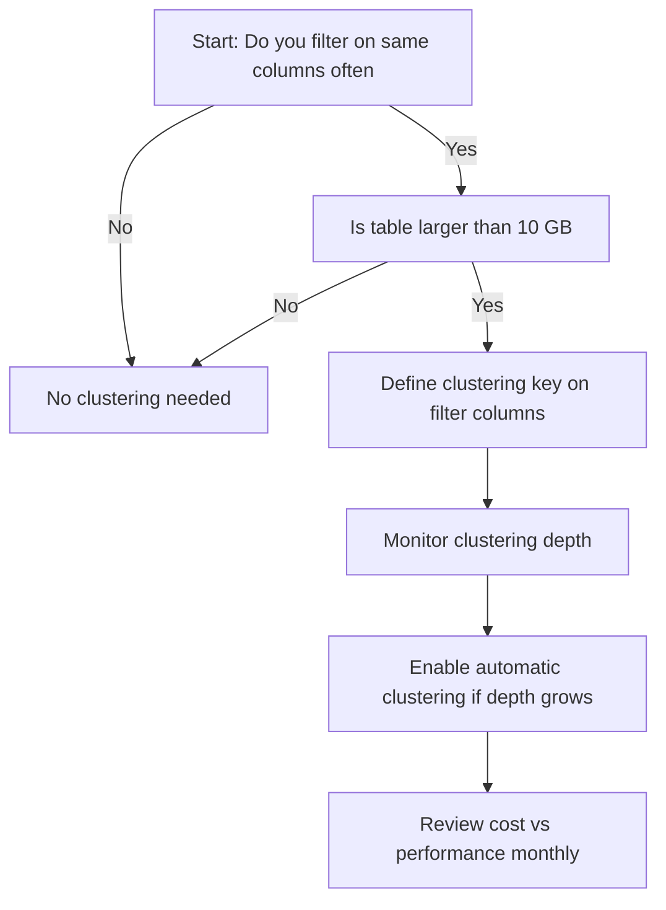

## Time Travel and Fail Safe

| Feature | Standard Edition | Enterprise and Above |
|---------|-----------------|---------------------|
| Time Travel window | 1 day fixed | 1 to 90 days configurable |
| Fail safe period | 7 days after Time Travel ends | 7 days after Time Travel ends |
| Access method | SELECT with AT or BEFORE clause | Same plus programmatic access via API |
| Use cases | Undo accidental deletes or updates | Compliance auditing point in time analysis |
| Billing | Storage for historical micro partitions | Storage for historical micro partitions |

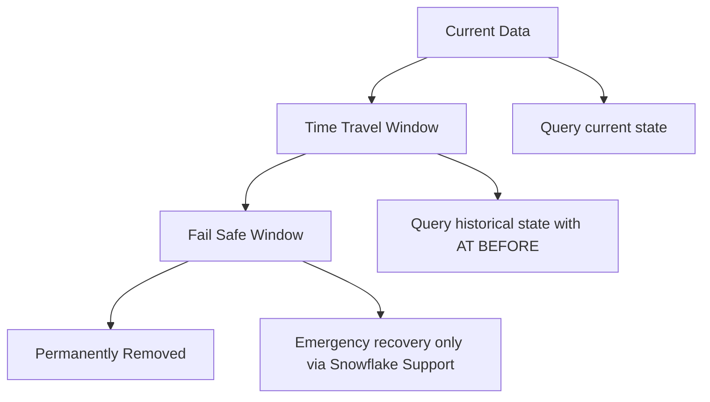

| Action | Time Travel Syntax Example |
|--------|---------------------------|
| Query table as of timestamp | SELECT * FROM my_table AT TIMESTAMP TO_TIMESTAMP_TZ 2024 01 15 10 00 00 UTC |
| Query table as of offset | SELECT * FROM my_table BEFORE OFFSET 60 MINUTE |
| Query table as of statement | SELECT * FROM my_table AT STATEMENT 4f2a1b3c 0000 1234 abcd 5678ef901234 |
| Undelete table | UNDELETE TABLE my_table WITH TIMESTAMP TO_TIMESTAMP_TZ 2024 01 15 10 00 00 UTC |

- Time Travel stores historical micro partitions separately from current data
- You pay storage costs for historical data during the Time Travel window
- Fail safe data is not queryable. It is for emergency recovery only via Snowflake Support
- Setting Time Travel to 0 days disables historical access but does not reduce storage for current data
- Use shorter Time Travel windows for dev and test environments to control cost

## Internal and External Stages

| Stage Type | Location | Best For | Access Pattern |
|------------|----------|----------|---------------|
| Internal user stage | Inside your Snowflake account tied to your user | Quick ad hoc file loads and unloads | PUT and GET commands from client |
| Internal table stage | Inside your Snowflake account tied to a specific table | Loading data into one table repeatedly | COPY INTO table FROM stage |
| Internal named stage | Inside your Snowflake account with custom name | Shared file storage across tables or users | GRANT usage to roles for collaboration |
| External stage | Reference to cloud storage S3 Azure Blob GCS | Querying data where it lives or loading from external pipelines | Define with URL and credentials or IAM role |

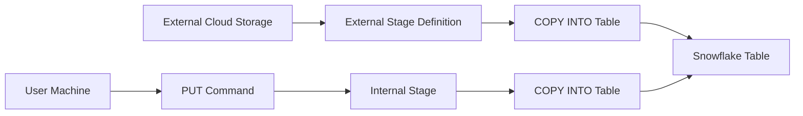

| Command | Purpose | Example |
|---------|---------|---------|
| PUT | Upload file from local machine to internal stage | PUT file data.csv @my_stage |
| GET | Download file from internal stage to local machine | GET @my_stage data.csv file tmp |
| LIST | Show files in a stage | LIST @my_stage |
| REMOVE | Delete files from internal stage | REMOVE @my_stage old_file.csv |
| COPY INTO | Load data from stage into table | COPY INTO my_table FROM @my_stage FILE_FORMAT CSV |

- Internal stages are managed by Snowflake. You do not see the underlying cloud storage
- External stages require network connectivity and proper IAM or credential configuration
- Files in internal stages are encrypted and compressed automatically
- External stages support file format inference and schema detection for semi structured data
- Use named stages for reusable file storage across multiple loads or teams

## Storage Billing and Cost Control

| Billing Component | How It Is Measured | Typical Rate US East AWS |
|------------------|-------------------|-------------------------|
| Compressed storage | Average bytes stored per day including micro partitions and historical data | 23 USD per TB per month |
| Time Travel storage | Historical micro partitions retained within configured window | Same rate as compressed storage |
| Fail safe storage | Protected recovery data after Time Travel ends | Same rate as compressed storage |
| Data transfer | Bytes moved out of Snowflake to external destinations | Varies by cloud provider and region |

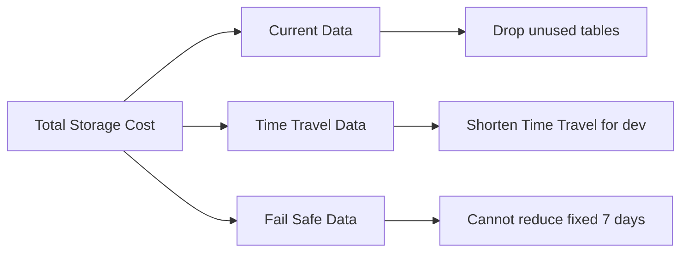

| Practice | How To Implement | Expected Impact |
|----------|-----------------|-----------------|
| Drop or truncate unused tables | Identify with ACCOUNT_USAGE views | Immediate storage savings |
| Shorten Time Travel for dev test | ALTER DATABASE SET DATA_RETENTION_TIME_IN_DAYS 1 | Reduce historical storage by up to 90 percent |
| Use transient tables for temporary data | CREATE TRANSIENT TABLE instead of TABLE | No Time Travel or Fail safe storage costs |
| Archive old data to external stage | COPY to S3 then DROP from Snowflake | Move cold data to cheaper cloud storage |
| Monitor storage growth weekly | Query STORAGE_METERING_HISTORY views | Catch surprises before they impact budget |

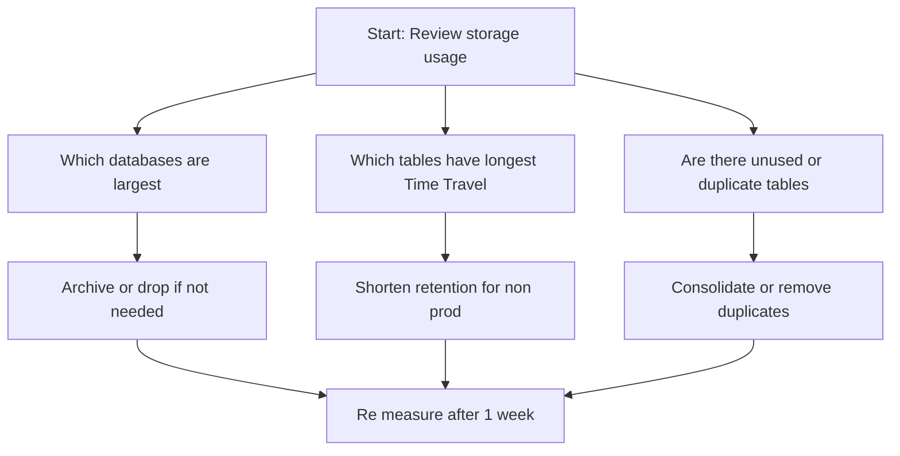

## Data Organization Best Practices

| Practice | Why It Matters | How To Apply |
|----------|---------------|--------------|
| Use databases to separate business domains | Clear ownership and access control | Create FINANCE_DB MARKETING_DB OPERATIONS_DB |
| Use schemas to separate data lifecycle stages | Organize raw cleaned and curated data | Use RAW CLEANED REPORTING schemas inside each database |
| Name tables with purpose and freshness | Avoid confusion about data source and recency | Use naming like events_raw_daily user_facts_hourly |
| Use transient tables for intermediate results | Avoid paying for Time Travel on temporary data | CREATE TRANSIENT TABLE for ETL staging |
| Document table purpose and retention | Helps teammates understand when to archive or drop | Add table comment with owner and expected lifespan |

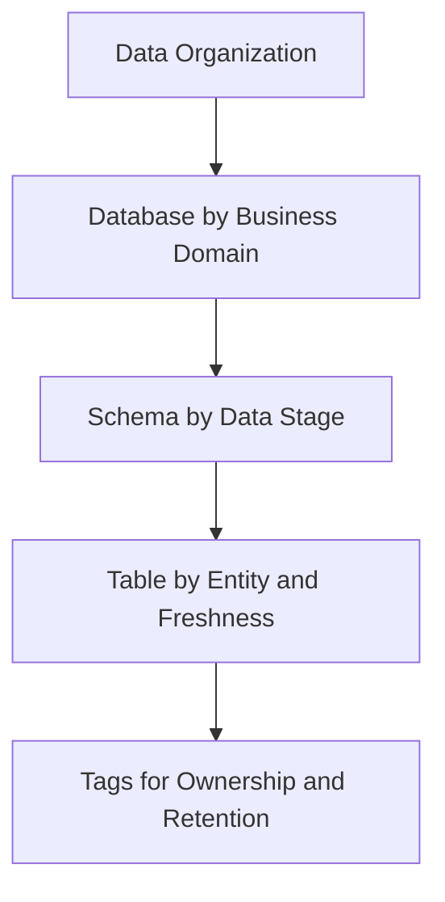

## Common Storage Mistakes and Fixes

| Mistake | What Happens | How To Fix |
|---------|--------------|------------|
| Leaving 90 day Time Travel on dev databases | Paying for 90 days of history on data that changes daily | Set DATA_RETENTION_TIME_IN_DAYS to 1 for non prod |
| Using permanent tables for temporary ETL steps | Accumulating Time Travel storage for data you never query | Use transient tables or drop immediately after use |
| Never reviewing table sizes | Large unused tables keep consuming storage | Query ACCOUNT_USAGE.TABLE_STORAGE_METRICS monthly |
| Loading duplicate files to internal stages | Wasting storage on redundant raw files | Implement deduplication logic before load or use external stage |
| Ignoring clustering depth on large filtered tables | Queries scan more micro partitions than needed | Define clustering key and enable automatic clustering |
| Assuming compression is free | Compressed storage still costs money | Archive cold data to external cloud storage for lower cost |

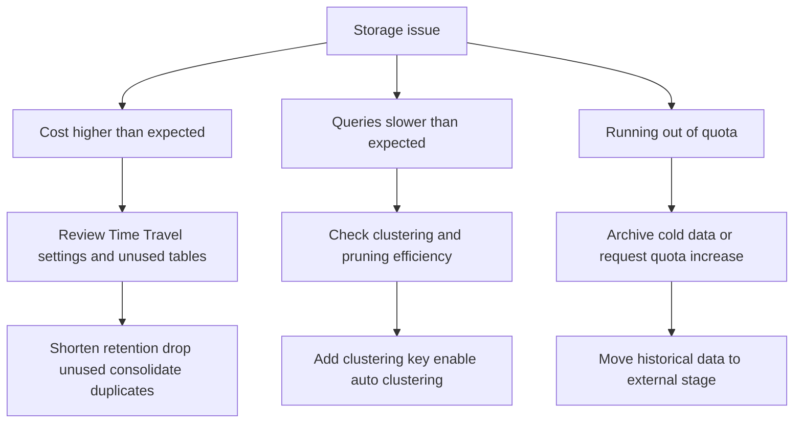

## Quick Reference Decision Flow

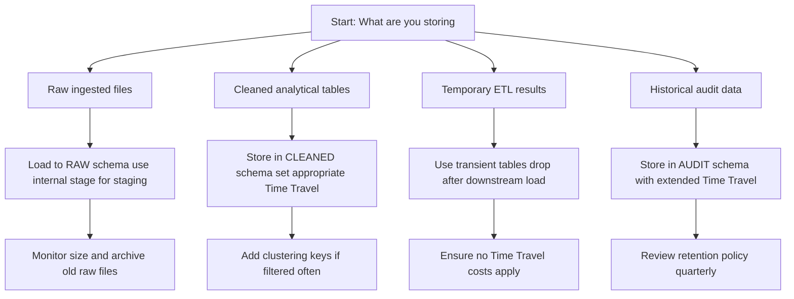

## Key Principles

- Storage is billed for compressed data not raw size. Compression is automatic and free
- Time Travel and Fail safe add storage costs. Configure retention based on actual need
- Micro partitions and pruning make large tables fast. You do not need to manage indexes
- Clustering improves query performance for filtered workloads. Monitor depth to justify cost
- Separate workloads by database and schema. Makes access control and cost attribution clearer
- Use transient tables for temporary data. Avoid paying for history you never query
- Review storage usage monthly. Workloads change and your storage strategy should too
- Archive cold data to external storage. Keep hot data in Snowflake for performance

## Bottom Line

- Snowflake storage is automatic columnar compressed and partitioned
- You control cost through retention settings table lifecycle and data organization
- Micro partitions and metadata enable fast queries without manual indexing
- Time Travel is powerful but costs money. Set it intentionally per environment
- Stages are your bridge to files. Use internal for quick loads external for integration
- Measure before you optimize. One week of storage metrics beats guessing
- Document your data organization. Future you and your teammates need context

Think of Snowflake storage like a smart warehouse:
- Items arrive and are automatically sorted labeled and compressed
- You can ask for any item from any point in the recent past
- The warehouse skips aisles it knows do not contain what you need
- You pay for the space your items actually occupy not the raw size they arrived in
- Temporary items can be marked for quick disposal to save space

Use the warehouse wisely. Keep what you need. Archive what you do not. Organize so you can find things fast. Save space without losing what matters.
