# Apache Iceberg and External Tables in Snowflake

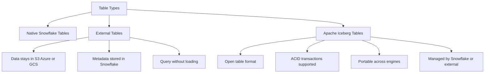

| Table Type | Where Data Lives | Who Manages Metadata | Best For |
|------------|-----------------|---------------------|----------|
| Native Snowflake Table | Snowflake managed storage | Snowflake | High performance analytics, frequent updates, Time Travel |
| External Table | Your cloud storage S3 Azure GCS | You for files Snowflake for metadata | Query raw files without loading, data lake exploration |
| Apache Iceberg Table | Your cloud storage or Snowflake | Iceberg catalog Snowflake or external | Multi engine access, open format governance, incremental processing |

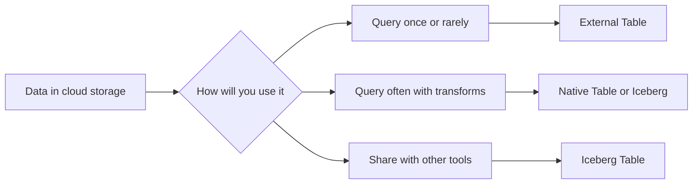

## External Tables

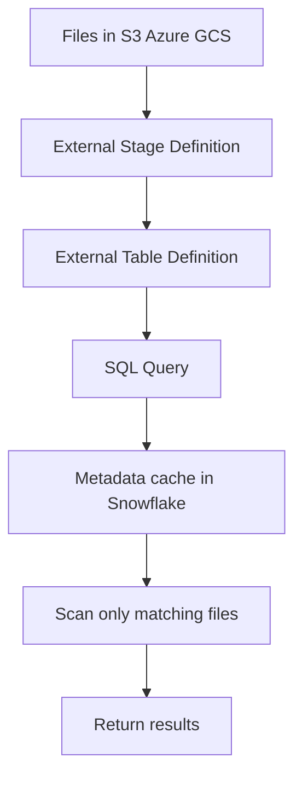

| Feature | What It Does | Limitation |
|---------|-------------|------------|
| File based access | Query CSV JSON Parquet directly in cloud storage | No DML updates or deletes on source files |
| Metadata caching | Snowflake caches file list and stats for faster pruning | Cache refresh required after file changes |
| Partition pruning | Skip files based on folder structure or file metadata | Requires consistent partition layout |
| Schema inference | Auto detect columns from file content | Schema changes require manual refresh |
| No data movement | Query where data lives | Performance depends on cloud network and file format |

| Use Case | Why External Table Works |
|----------|-------------------------|
| Ad hoc exploration of raw logs | No load step. Query files as they land. |
| One time analysis of third party data | Avoid copying large datasets you may not need. |
| Data lake federation | Query multiple buckets or accounts from one SQL interface. |
| Cost sensitive archival access | Keep cold data in cheap storage. Query only when needed. |

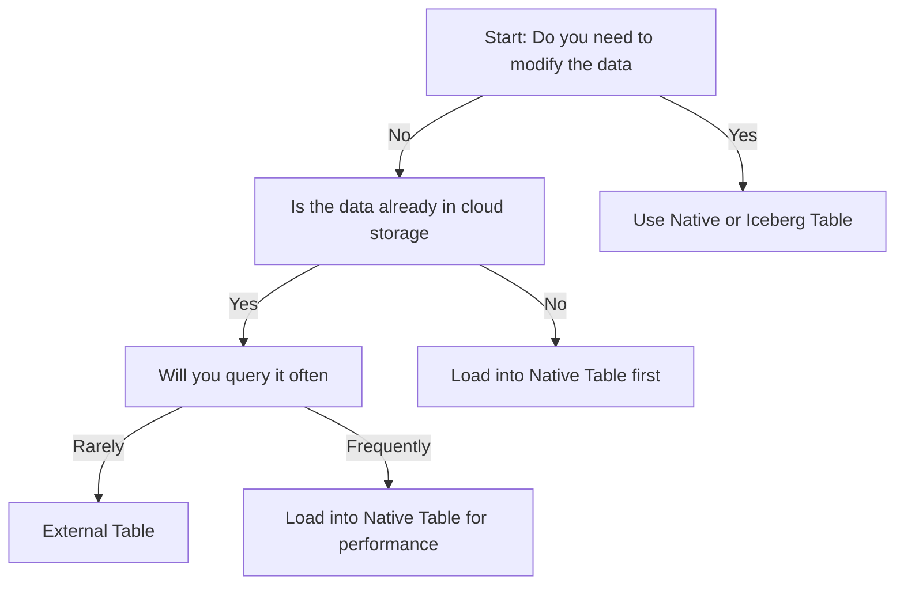

| Setup Step | Example Command |
|------------|----------------|
| Create external stage | CREATE EXTERNAL STAGE ext_s3 URL s3 my bucket CREDENTIALS AWS KEY ID key SECRET KEY secret FILE FORMAT PARQUET |
| Create external table | CREATE EXTERNAL TABLE logs_ext WITH LOCATION @ext_s3/logs/ FILE FORMAT PARQUET AS SELECT METADATA filename AS file_name VALUE path to col1 AS col1 FROM @ext_s3/logs/ |
| Refresh metadata | ALTER EXTERNAL TABLE logs_ext REFRESH |
| Query with pruning | SELECT col1 FROM logs_ext WHERE file_name LIKE 2024 01 |

- External tables do not store data in Snowflake. They store pointers and metadata.
- You pay for storage in your cloud account. You pay Snowflake for compute when you query.
- File format matters. Parquet and ORC enable column pruning. CSV and JSON scan full files.
- Partition layout matters. Folder based partitions like year month day enable file skipping.
- Metadata refresh is manual. New files do not appear until you run REFRESH.

## Apache Iceberg Tables

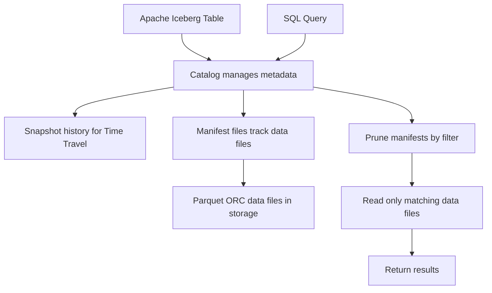

| Feature | What It Enables | Why It Matters |
|---------|----------------|----------------|
| Open table format | Tables readable by Spark Trino Flink and Snowflake | Avoid vendor lock in. Share data across tools. |
| ACID transactions | Atomic commits with snapshot isolation | Safe concurrent writes. No partial reads. |
| Schema evolution | Add rename or reorder columns without rewriting data | Adapt to changing requirements without downtime. |
| Hidden partitioning | Partition by derived values without exposing folder structure | Query by logical field not physical path. |
| Time Travel | Query table as of specific snapshot | Reproduce results. Audit changes. Roll back mistakes. |
| Incremental processing | Read only new or changed files | Efficient pipelines. Avoid full table scans. |

| Deployment Option | Where Metadata Lives | Who Manages Catalog | Best For |
|------------------|---------------------|---------------------|----------|
| Snowflake managed Iceberg | Snowflake internal storage | Snowflake | Teams already in Snowflake. Minimal setup. |
| External catalog Iceberg | Your cloud storage or metastore | You or third party catalog | Multi engine access. Existing Iceberg investments. |

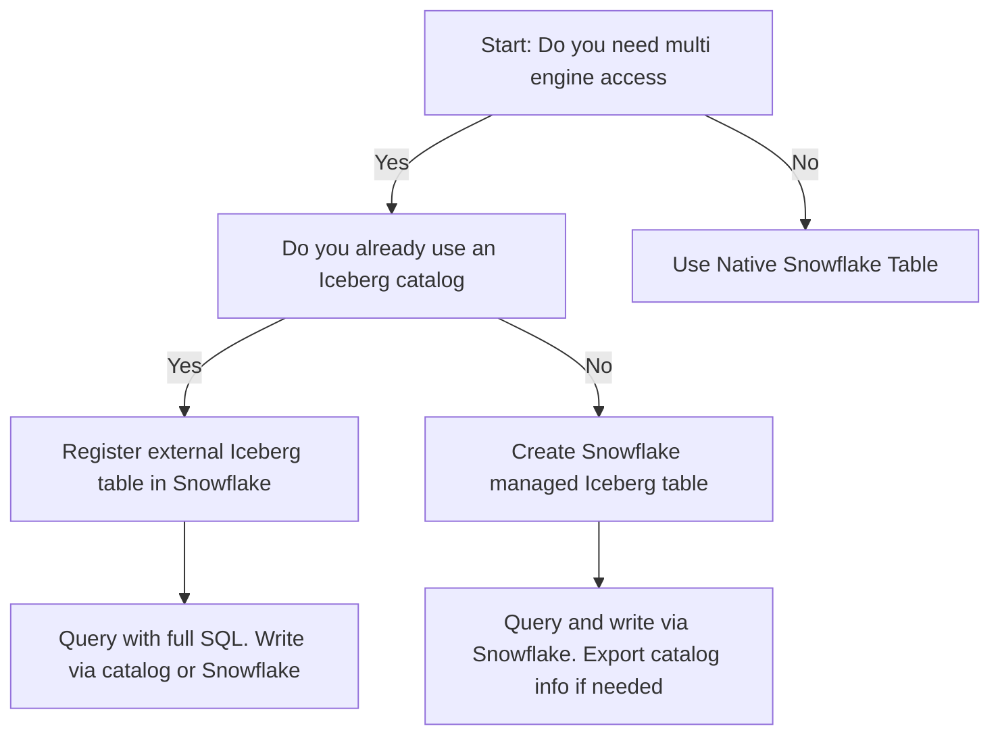

| Setup Step | Snowflake Managed Example | External Catalog Example |
|------------|--------------------------|-------------------------|
| Create Iceberg table | CREATE ICEBERG TABLE sales_iceberg COL1 STRING COL2 INT CATALOG SNOWFLAKE LOCATION s3 my bucket | CREATE EXTERNAL VOLUME iceberg_vol STORAGE LOCATIONS s3 my bucket CREATE ICEBERG TABLE sales_ext COL1 STRING COL2 INT CATALOG EXTERNAL VOLUME iceberg_vol |
| Insert data | INSERT INTO sales_iceberg VALUES a 1 | INSERT INTO sales_ext VALUES a 1 |
| Time Travel query | SELECT FROM sales_iceberg AT SNAPSHOT id 12345 | SELECT FROM sales_ext AT SNAPSHOT id 12345 |
| Register external table | Not applicable | SELECT SYSTEM REGISTER ICEBERG TABLE s3 my bucket path catalog name rest |

- Iceberg tables store data files in your cloud storage. Metadata lives in a catalog.
- Snowflake can act as the catalog or connect to an external one like AWS Glue or Nessie.
- You control the storage cost. Snowflake charges compute for queries and catalog operations.
- Schema changes do not rewrite data. Iceberg tracks column evolution in metadata.
- Concurrent writes are safe. Iceberg uses optimistic concurrency with snapshot isolation.

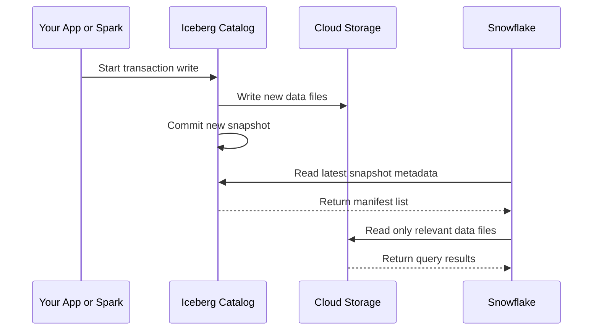

## Comparison Table

| Capability | Native Table | External Table | Iceberg Table |
|------------|-------------|----------------|---------------|
| Data location | Snowflake storage | Your cloud storage | Your cloud storage |
| DML support | Full INSERT UPDATE DELETE MERGE | Read only | Full ACID transactions |
| Time Travel | Built in configurable window | Not supported | Via snapshot history |
| Schema evolution | ALTER TABLE requires rewrite | Manual refresh needed | Native support no rewrite |
| Multi engine access | Snowflake only | Snowflake only | Spark Trino Flink Snowflake |
| Partition management | Automatic micro partitions | Folder based manual layout | Hidden partitioning logical fields |
| Metadata management | Fully managed by Snowflake | File list cached in Snowflake | Catalog managed external or Snowflake |
| Best performance | Highest for analytics | Depends on file format and network | Near native with proper tuning |
| Cost model | Storage plus compute in Snowflake | Storage in cloud compute in Snowflake | Storage in cloud compute in Snowflake or other engine |
| Use when | You own the data and need speed | You want to query without moving | You need portability and governance |

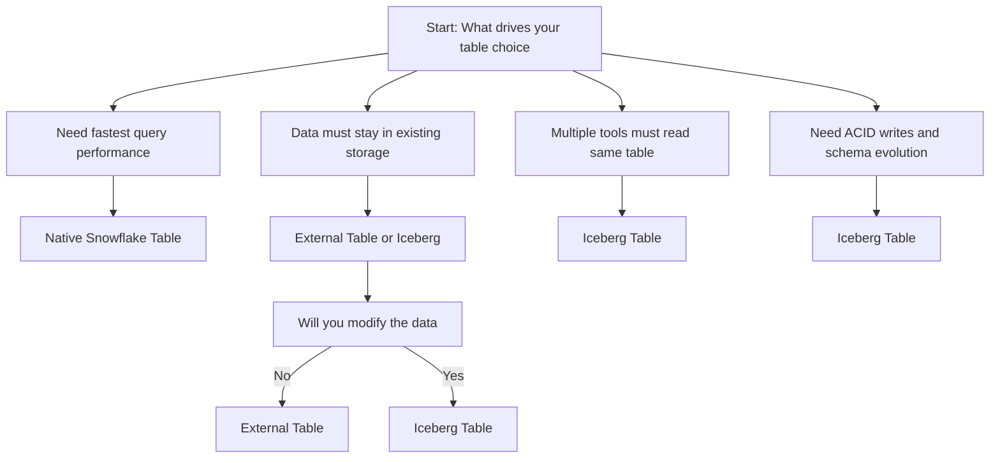

## Performance and Cost Considerations

| Factor | External Table | Iceberg Table | Native Table |
|--------|---------------|---------------|--------------|
| Query speed | Slower for full scans faster with pruning | Near native with manifest pruning | Fastest with micro partition pruning |
| Write cost | Not applicable read only | Catalog commits plus data writes | Snowflake storage and compute |
| Storage cost | Your cloud storage rates | Your cloud storage rates | Snowflake storage rates |
| Network cost | Data transfer from cloud to Snowflake | Same as external | Internal Snowflake network |
| Metadata cost | Minimal cache refresh | Catalog operations and snapshot history | Included in Snowflake service |

- External tables scan files. If your query needs ten columns from a hundred column Parquet file Snowflake reads only those ten. If your file is CSV it reads everything.
- Iceberg tables scan manifests first. Manifests tell Snowflake which data files contain matching rows. This extra map layer adds minimal overhead but enables powerful pruning.
- Native tables use micro partitions. The map is built in. No extra metadata layer. Fastest for pure Snowflake workloads.
- You pay for data transfer when querying external or Iceberg tables. Keep compute in the same region as storage to minimize egress.
- Iceberg snapshot history costs storage. Prune old snapshots if you do not need long Time Travel.

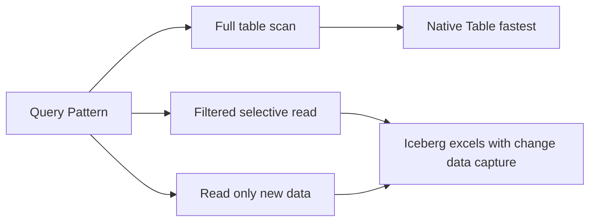

## Best Practices

- Use External Tables for read only exploration of raw files. Do not use them for production reporting if performance matters.
- Use Iceberg Tables when you need to share data across Spark Trino and Snowflake. Avoid rebuilding pipelines for each engine.
- Use Native Tables when all your work happens in Snowflake. You get the best performance with the least complexity.
- Always use columnar file formats Parquet or ORC for External and Iceberg tables. CSV and JSON waste I/O and credits.
- Partition External Tables by folder structure year month day. Partition Iceberg Tables by logical fields not physical paths.
- Refresh External Table metadata after file changes. Automate this with Tasks or event driven triggers.
- Prune Iceberg snapshot history. Keep only the snapshots you need for Time Travel. Delete the rest to control catalog storage.
- Monitor bytes scanned versus bytes returned. If they are close your pruning is not working. Adjust partitioning or file format.
- Keep compute and storage in the same cloud region. Cross region queries add latency and egress costs.
- Test query performance with realistic data volumes. Small samples hide I/O and pruning issues that appear at scale.

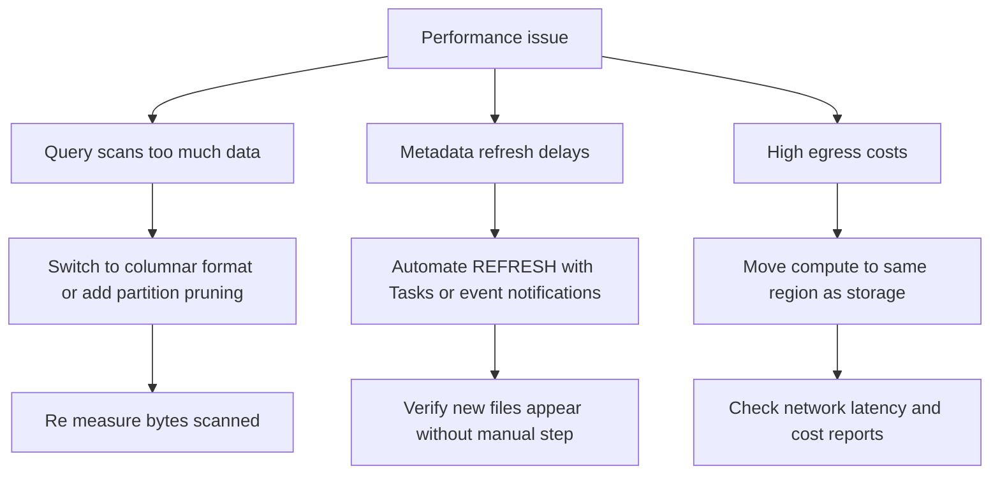

## Common Pitfalls

| Pitfall | What Happens | How To Avoid |
|---------|--------------|--------------|
| Using External Tables for frequent reporting | Queries are slow and expensive due to full file scans | Load frequently queried data into Native or Iceberg tables |
| Forgetting to refresh External Table metadata | New files do not appear in queries | Automate REFRESH after file ingestion completes |
| Using CSV for External or Iceberg tables | No column pruning. Full file scans every time | Convert to Parquet or ORC during ingestion |
| Over partitioning Iceberg tables | Too many small files. Catalog metadata bloats. | Partition by one or two high value columns only |
| Keeping all Iceberg snapshots forever | Catalog storage grows without bound | Set retention policy for snapshot history |
| Assuming Iceberg fixes bad query patterns | Poor filters or missing joins still scan too much | Optimize SQL first then tune table format |
| Mixing table types in one pipeline | Complexity increases. Debugging becomes harder | Standardize on one type per workload stage |

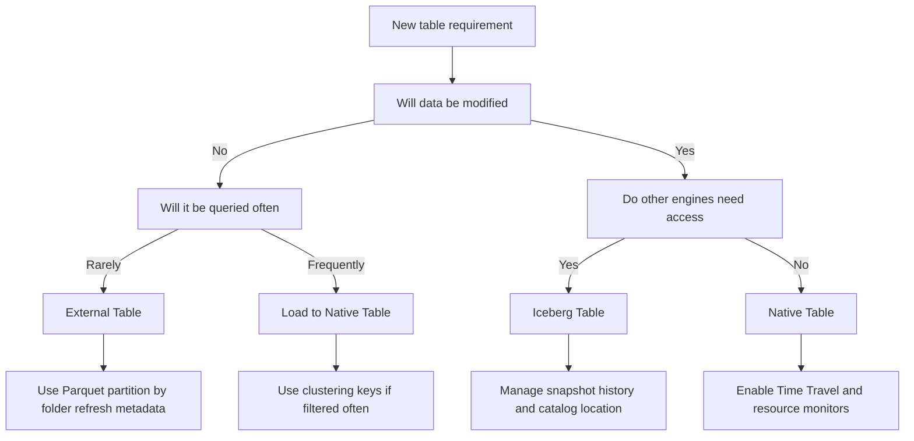

## Key Principles

- Choose the table type that matches your access pattern not your preference.
- External Tables are for reading without moving. Iceberg Tables are for sharing without copying. Native Tables are for speed without compromise.
- File format matters more than table type for External and Iceberg. Parquet enables pruning. CSV disables it.
- Partitioning is about skipping work. Partition by the columns your queries filter on most.
- Metadata has cost. Catalog operations snapshot history and cache refreshes all consume compute.
- Measure before you optimize. Track bytes scanned credits per query and egress volume. Data beats assumptions.
- Keep it simple. Do not introduce Iceberg unless you need multi engine access. Do not use External Tables for production dashboards.

## Bottom Line

- External Tables let you query data where it lives. Use them for exploration and rare access.
- Iceberg Tables let you share data across tools. Use them when governance and portability matter.
- Native Tables give you the best performance in Snowflake. Use them when all your work stays in Snowflake.
- You do not need to pick one forever. Load External data into Native tables when usage grows. Export Native data to Iceberg when sharing needs arise.
- Storage and compute are separate. Optimize each for your actual workload.
- Start simple. Add complexity only when your requirements force it.
- Measure what matters. Bytes scanned credits spent and query latency tell you more than feature checklists.

Think of table types like transportation:
- External Tables are like reading a map. You see the terrain without moving anything.
- Iceberg Tables are like a shared vehicle. Multiple drivers can use the same car safely.
- Native Tables are like a dedicated train. Fast reliable but only runs on Snowflake tracks.

Pick the vehicle that matches your trip. Do not rent a train for a short walk. Do not use a map when you need to move cargo. Match the tool to the task. Save effort without sacrificing the outcome.
