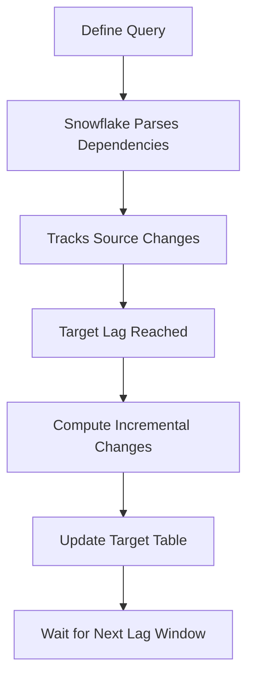
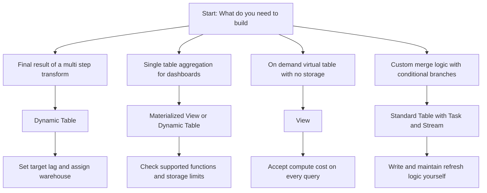
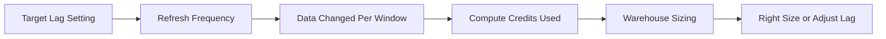

# Dynamic Tables in Snowflake

| Property | What It Does | Why It Matters |
|----------|--------------|----------------|
| Target lag | Maximum allowed delay between source update and table refresh | Controls the trade off between data freshness and compute cost |
| Refresh mode | Incremental or full execution | Incremental saves credits. Full runs when query logic blocks incremental processing |
| Warehouse | Compute cluster assigned to run refreshes | You control performance sizing and cost isolation |
| Dependency tracking | Snowflake maps upstream tables and views automatically | Removes manual pipeline scheduling and orchestration |
| State tracking | Records last refresh timestamp and processed watermarks | Enables exact incremental updates without duplicate rows |

- You write the final query. Snowflake handles the execution schedule and incremental logic
- No manual task creation. No stream management. No custom merge statements
- Snowflake calculates what changed since the last refresh and only processes that delta
- If a source table changes schema, the refresh pauses until you update the definition
- The result is a physical table. You pay for compute during refresh and storage for the materialized data

| Type | How It Updates | Best For | Cost Pattern |
|------|---------------|----------|--------------|
| Dynamic Table | Automatic refresh based on target lag | Multi step pipelines, data marts, reporting layers | Predictable compute per refresh. Storage for result |
| Materialized View | Background refresh on base table change | Simple aggregations, single table projections | Hidden compute. Harder to track or control |
| Table plus Task plus Stream | Manual orchestration with custom SQL | Complex conditional logic, branching pipelines | Higher development cost. Full control over execution |
| View | Recomputes on every query | Ad hoc analysis, virtual transformations | Compute on demand. No storage cost. Slows with scale |

| Configuration Step | Recommended Value | Reason |
|--------------------|-------------------|--------|
| Target lag | 5 minutes for near real time, 60 minutes for reporting | Matches business need without over spending |
| Warehouse size | Medium for under 100 GB changes, Large for heavier loads | Prevents refresh timeouts and long queues |
| Auto resume | True | Ensures refresh runs on schedule without manual intervention |
| Auto suspend | 300 seconds after refresh completes | Stops billing when pipeline is idle |
| Resource monitor | Attach with 80 percent alert threshold | Catches unexpected credit spikes early |

- Declarative over imperative. You state the desired end state. The system handles the path
- Lag is a contract. You define acceptable staleness. Snowflake optimizes compute to meet it
- Incremental processing requires state tracking. It compares changes and writes deltas
- Full refresh sometimes costs less than incremental for small tables or complex queries
- Dependencies form a chain. If table A feeds table B which feeds table C, Snowflake refreshes them in order
- Compute and storage are separate. You pay for the warehouse during refresh. You pay for storage for the result
- Start with one table. Measure refresh duration and credits. Scale to chains only when the pattern works

| Issue | Root Cause | Fix |
|-------|------------|-----|
| Refresh switches to full mode | Query uses functions that block incremental processing | Rewrite query with supported operations or accept full refresh cost |
| Refresh runs longer than expected | Source data volume spiked or warehouse undersized | Increase warehouse size or improve source table clustering |
| Target lag not met | Warehouse suspended or credit quota exceeded | Enable auto resume and verify resource monitor limits |
| DDL change breaks refresh | Column dropped or type changed in source table | Update dynamic table definition and resume manually |
| High credit usage | Lag set too low for large data changes | Increase target lag or right size warehouse down |
| Stale data in target table | Refresh failed and is in suspended state | Check error logs, fix source issue, resume refresh |

- Do not treat dynamic tables as real time. They are near real time. Sub second needs require streaming architectures
- Incremental is not automatically cheaper. Measure the credit cost per refresh before committing to a pipeline
- Schema changes in source tables break the refresh contract. Test DDL changes in dev first
- Warehouse sizing matters. Undersized warehouses cause timeouts. Oversized warehouses waste credits
- Track refresh history with DYNAMIC_TABLE_REFRESH_HISTORY. Data beats assumptions for tuning
- Separate dynamic table warehouses from interactive query warehouses. Prevents resource contention
- Start with a longer lag. Shorten it only when business requirements demand faster data and budget allows
- Document the dependency chain. Future troubleshooting requires knowing what feeds what
