# Permanent Temporary and Transient Tables

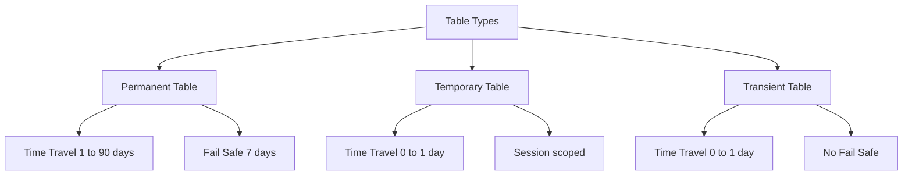

| Property | Permanent Table | Temporary Table | Transient Table |
|----------|----------------|-----------------|-----------------|
| Data retention | Configurable 1 to 90 days Time Travel | 0 to 1 day Time Travel | 0 to 1 day Time Travel |
| Fail Safe period | 7 days after Time Travel ends | None | None |
| Scope | Visible to all sessions with privileges | Visible only to creating session | Visible to all sessions with privileges |
| Lifetime | Until explicitly dropped | End of session or explicit drop | Until explicitly dropped |
| Storage cost | Current plus historical plus Fail Safe | Current plus minimal history | Current plus minimal history |
| Best for | Production data that must be recovered | Intermediate results in a single workflow | ETL staging or data that does not need long history |

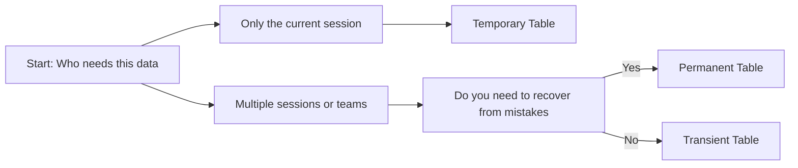

## Permanent Tables

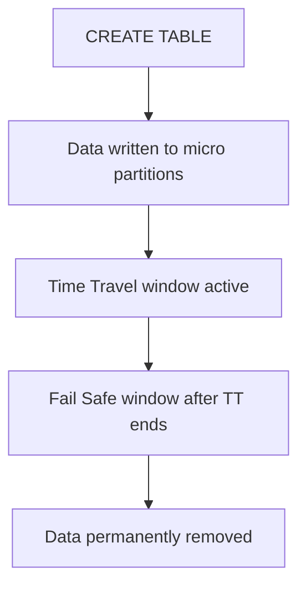

| Feature | Detail |
|---------|--------|
| Time Travel | Query historical data with AT or BEFORE clause |
| Fail Safe | Emergency recovery only via Snowflake Support |
| DML support | Full INSERT UPDATE DELETE MERGE with history |
| Cloning | Zero copy clone preserves history and structure |
| Sharing | Can be shared via Secure Data Sharing |

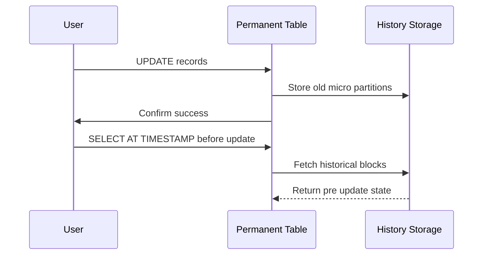

| Use Case | Why Permanent Table Works |
|----------|---------------------------|
| Customer or financial records | Need to audit changes or recover from errors |
| Shared analytical datasets | Multiple teams query and depend on stable data |
| Compliance required data | Regulations mandate retention and recovery capability |
| Production reporting tables | Business users need reliable consistent results |

| Cost Factor | What You Pay For |
|-------------|-----------------|
| Current data | Compressed storage at standard rate |
| Time Travel data | Historical micro partitions for configured window |
| Fail Safe data | Protected storage for 7 days after Time Travel |
| Clones | Storage for changed blocks only zero copy for unchanged |

## Temporary Tables

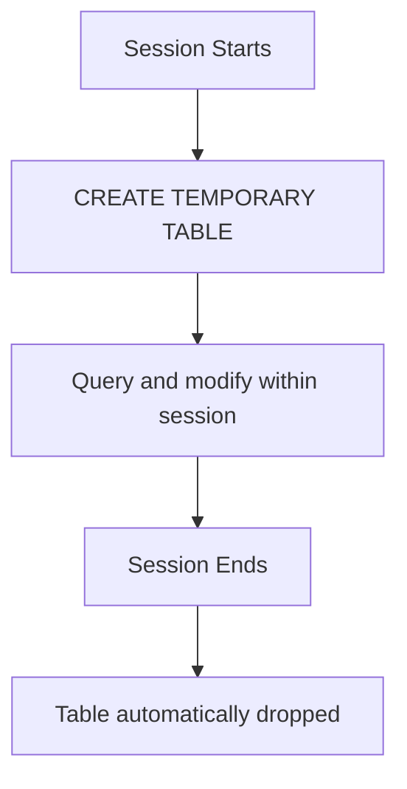

| Feature | Detail |
|---------|--------|
| Session scope | Only visible to the connection that created it |
| Automatic cleanup | Dropped when session ends or explicitly dropped |
| Time Travel | Minimal or none depending on edition and setting |
| Fail Safe | None |
| Naming | Can use same name as permanent table without conflict |

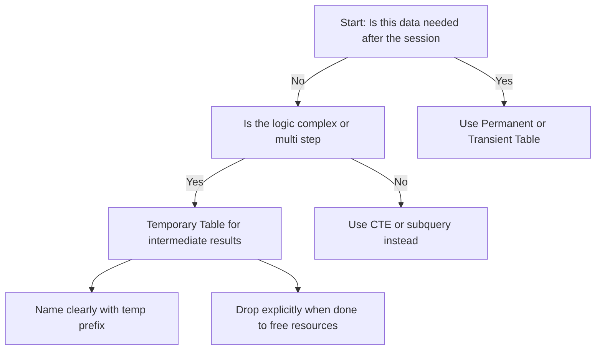

| Use Case | Why Temporary Table Works |
|----------|---------------------------|
| Multi step transformation in one script | Hold intermediate results without polluting schema |
| Testing query logic before production | Isolate test data from shared tables |
| Session specific calculations | User specific aggregations that do not need sharing |
| ETL staging within a single transaction | Buffer data before final load to permanent table |

| Cost Factor | What You Pay For |
|-------------|-----------------|
| Current data | Compressed storage while table exists |
| Time Travel data | Minimal if any depending on configuration |
| Fail Safe data | None |
| Cleanup | No cost automatic drop at session end |

## Transient Tables

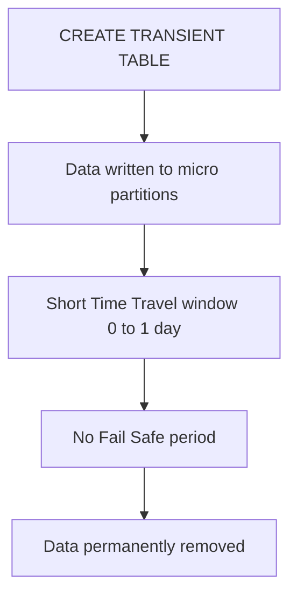

| Feature | Detail |
|---------|--------|
| Time Travel | Configurable 0 to 1 day only |
| Fail Safe | None |
| Scope | Visible to all sessions with privileges like permanent tables |
| Lifetime | Until explicitly dropped |
| Cloning | Supported but clone inherits transient properties |

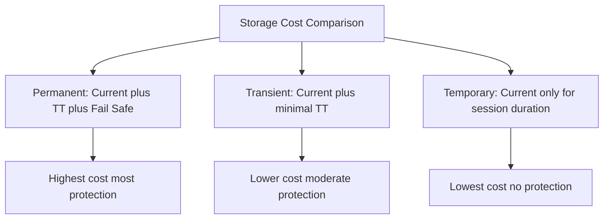

| Use Case | Why Transient Table Works |
|----------|---------------------------|
| ETL staging tables | Hold data between load and transform steps |
| Intermediate pipeline results | Data that feeds next step but does not need long history |
| Development and testing | Avoid paying for history on data that changes daily |
| Aggregated outputs that are rebuilt daily | No need to recover yesterday version if today will replace it |

| Cost Factor | What You Pay For |
|-------------|-----------------|
| Current data | Compressed storage at standard rate |
| Time Travel data | Only if configured up to 1 day |
| Fail Safe data | None |
| Clones | Storage for changed blocks only |

## Comparison Summary

| Decision Factor | Permanent | Temporary | Transient |
|----------------|-----------|-----------|-----------|
| Need to recover from accidental delete | Yes | No | Maybe if 1 day window enough |
| Data needed after session ends | Yes | No | Yes |
| Multiple users or processes access | Yes | No | Yes |
| Compliance or audit requirements | Yes | No | Rarely |
| Cost sensitivity high | No | Yes | Yes |
| Data rebuilt or replaced frequently | No | Maybe | Yes |
| Intermediate results in pipeline | No | Yes | Yes |
| Final output for business users | Yes | No | Rarely |

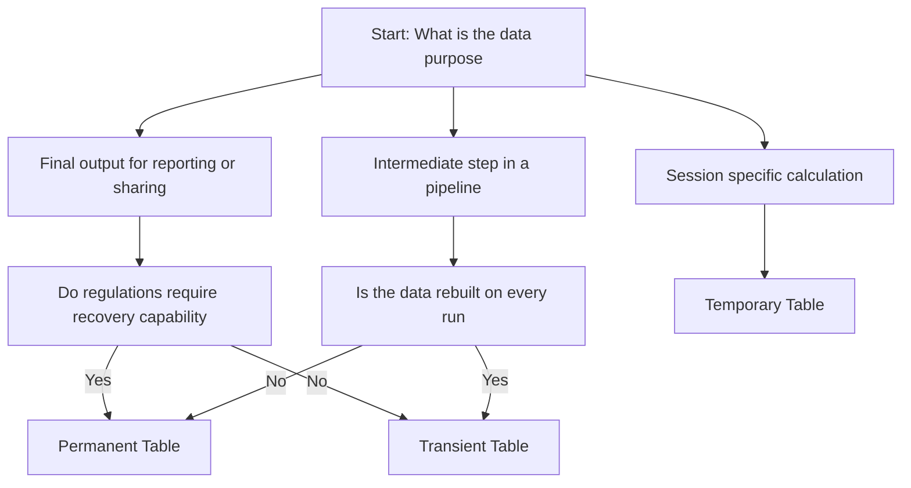

## Common Mistakes and Fixes

| Mistake | What Happens | How To Fix |
|---------|--------------|------------|
| Using Permanent tables for ETL staging | Paying for 90 days of history on data dropped daily | Switch to Transient tables for intermediate steps |
| Using Temporary tables for shared outputs | Other sessions cannot see the data | Use Permanent or Transient tables for shared results |
| Leaving 90 day Time Travel on dev databases | Storage costs balloon for test data | Set DATA_RETENTION_TIME_IN_DAYS to 1 for non prod |
| Forgetting to drop Temporary tables explicitly | Resources held until session ends which may be longer than expected | Drop explicitly when done even though auto cleanup exists |
| Assuming Transient tables cannot be cloned | They can be cloned but clone is also transient | Document clone behavior to avoid confusion |
| Mixing table types in one pipeline without documentation | Hard to reason about data lifecycle and cost | Add comments or metadata tags indicating table type and purpose |

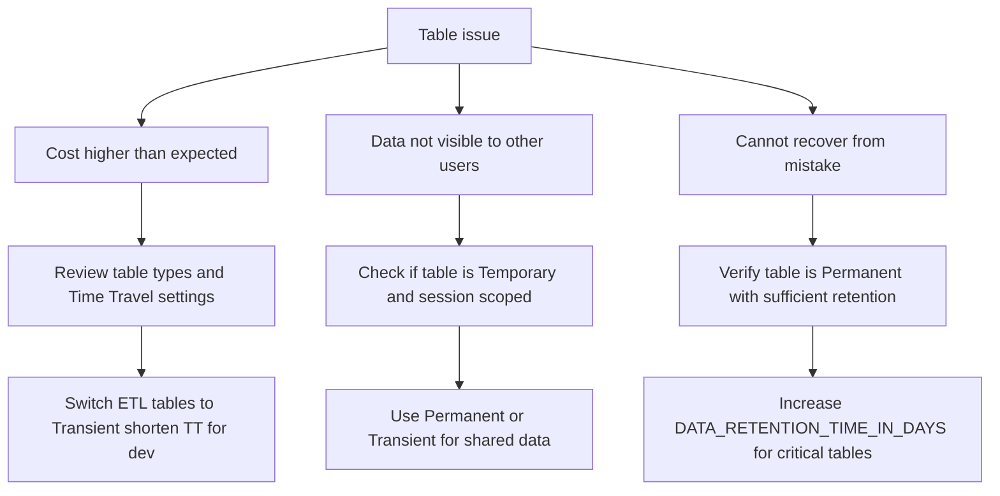

## Best Practices

- Use Permanent tables for final business critical data that needs recovery capability
- Use Transient tables for ETL staging intermediate results and rebuilt aggregates
- Use Temporary tables for session specific logic that does not leave the script
- Set Time Travel to 1 day for dev and test environments to control storage cost
- Tag tables with lifecycle metadata to document expected retention and ownership
- Monitor storage by table type with ACCOUNT_USAGE views to catch cost surprises
- Drop Temporary tables explicitly when done to free resources immediately
- Document why each table uses its type to help teammates make consistent choices

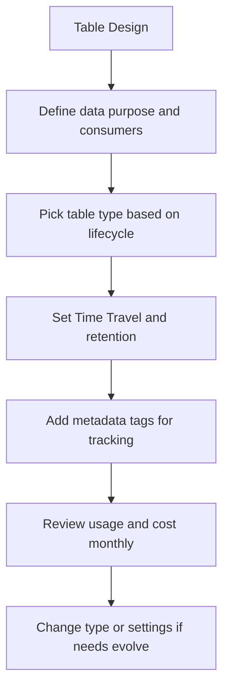

## Quick Reference Setup

```sql
-- Permanent table with 7 day Time Travel
CREATE TABLE prod.customer_facts (
  customer_id NUMBER
  total_spend NUMBER
  last_order_date DATE
)
DATA_RETENTION_TIME_IN_DAYS = 7;

-- Transient table for ETL staging with 1 day Time Travel
CREATE TRANSIENT TABLE etl.staging_orders (
  order_id NUMBER
  raw_payload VARIANT
  loaded_at TIMESTAMP
)
DATA_RETENTION_TIME_IN_DAYS = 1;

-- Temporary table for session specific logic
CREATE TEMPORARY TABLE session.user_metrics (
  user_id NUMBER
  session_count NUMBER
  avg_duration NUMBER
);
```

| Action | Command |
|--------|---------|
| Change retention on existing table | ALTER TABLE name SET DATA_RETENTION_TIME_IN_DAYS = n |
| Convert Permanent to Transient | Not directly supported. Create new Transient table and copy data |
| View table type and retention | SHOW TABLES LIKE name or query INFORMATION_SCHEMA.TABLES |
| Check storage by table type | Query ACCOUNT_USAGE.TABLE_STORAGE_METRICS with table type filter |

## Key Principles

- Table type is a lifecycle decision not a performance decision
- Permanent tables protect against mistakes. Transient tables protect your budget
- Temporary tables isolate work. They do not share and they do not persist
- Time Travel costs money. Set it based on actual recovery needs not fear
- Fail Safe cannot be disabled for Permanent tables. Plan for that cost
- Transient tables can be cloned shared and queried like Permanent tables
- Temporary tables disappear when the session ends. Do not store final results in them
- You can change table type by recreating. Plan the migration window and test first

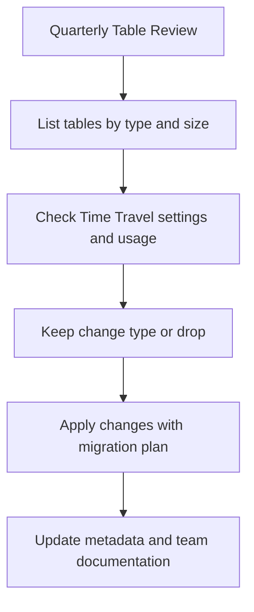

## Bottom Line

- Permanent tables are for data that must survive mistakes and serve many users
- Transient tables are for data that matters today but does not need long history
- Temporary tables are for work that lives and dies in a single script or session
- You pay for what you keep. Shorten retention where recovery is not critical
- You pay for what you compute. Right size warehouses that refresh or transform tables
- Start with the simplest type that meets your need. Add protection only when required
- Measure storage by table type monthly. Workloads change and your choices should too

Think of table types like document storage:
- Permanent tables are like a fireproof safe. Keep important papers recoverable for years
- Transient tables are like a desk drawer. Hold working documents you may need briefly
- Temporary tables are like a whiteboard. Sketch ideas during a meeting then wipe clean

Pick the storage that matches the document importance. Do not put a grocery list in a safe. Do not put a contract on a whiteboard. Match the protection to the value. Save cost without losing what matters.
