# Snowflake Table Types Overview

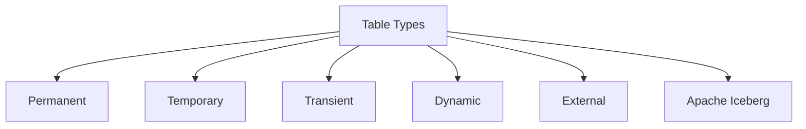

| Table Type | Data Location | Time Travel | Fail Safe | Best For |
|------------|--------------|-------------|-----------|----------|
| Permanent | Snowflake storage | 1 to 90 days | 7 days | Production data that must be recovered |
| Temporary | Snowflake storage | 0 to 1 day | None | Session specific intermediate results |
| Transient | Snowflake storage | 0 to 1 day | None | ETL staging or rebuilt aggregates |
| Dynamic | Snowflake storage | Inherits from base | Inherits from base | Automated incremental pipelines |
| External | Your cloud storage | Not supported | Not supported | Query raw files without loading |
| Apache Iceberg | Your cloud storage | Via snapshots | Via catalog | Multi engine access and governance |

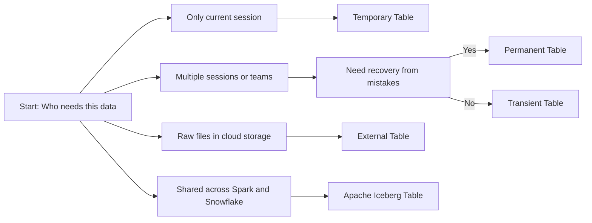

## Permanent Tables

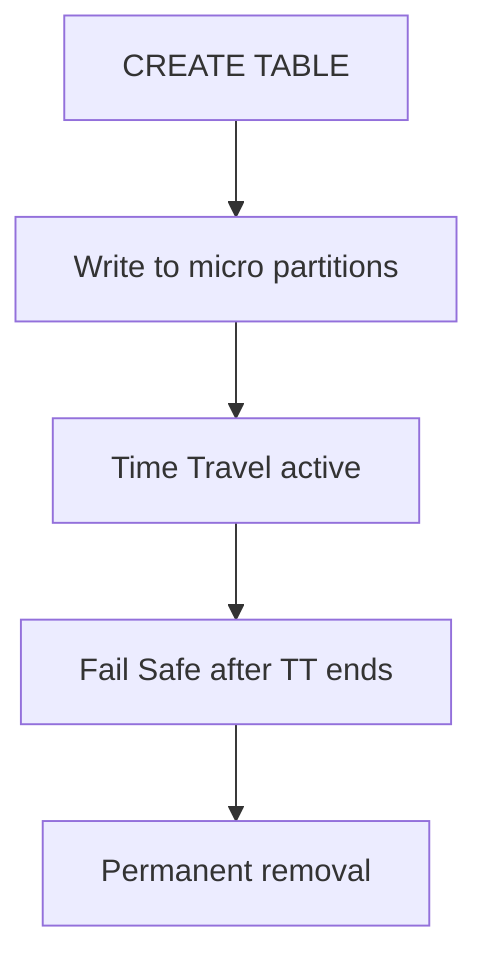

| Feature | Detail |
|---------|--------|
| Time Travel | Query historical data with AT or BEFORE clause |
| Fail Safe | Emergency recovery via Snowflake Support only |
| Cloning | Zero copy clone preserves history |
| Sharing | Can be shared via Secure Data Sharing |
| DML | Full INSERT UPDATE DELETE MERGE with history |

| Cost Factor | What You Pay For |
|-------------|-----------------|
| Current data | Compressed storage at standard rate |
| Time Travel data | Historical micro partitions for configured window |
| Fail Safe data | Protected storage for 7 days after Time Travel |

```sql
CREATE TABLE prod.customer_facts (
  customer_id NUMBER,
  total_spend NUMBER,
  last_order_date DATE
)
DATA_RETENTION_TIME_IN_DAYS = 7;
```

## Temporary Tables

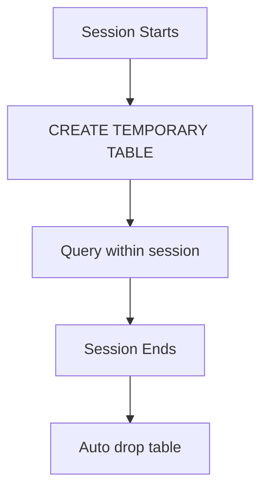

| Feature | Detail |
|---------|--------|
| Scope | Visible only to creating session |
| Lifetime | Ends with session or explicit drop |
| Time Travel | 0 to 1 day depending on edition |
| Fail Safe | None |
| Naming | Can reuse names without conflict |

```sql
CREATE TEMPORARY TABLE session.user_metrics (
  user_id NUMBER,
  session_count NUMBER,
  avg_duration NUMBER
);
```

| Use Case | Why It Works |
|----------|-------------|
| Multi step transformation in one script | Hold intermediate results without polluting schema |
| Testing query logic before production | Isolate test data from shared tables |
| Session specific calculations | User specific aggregations that do not need sharing |

## Transient Tables

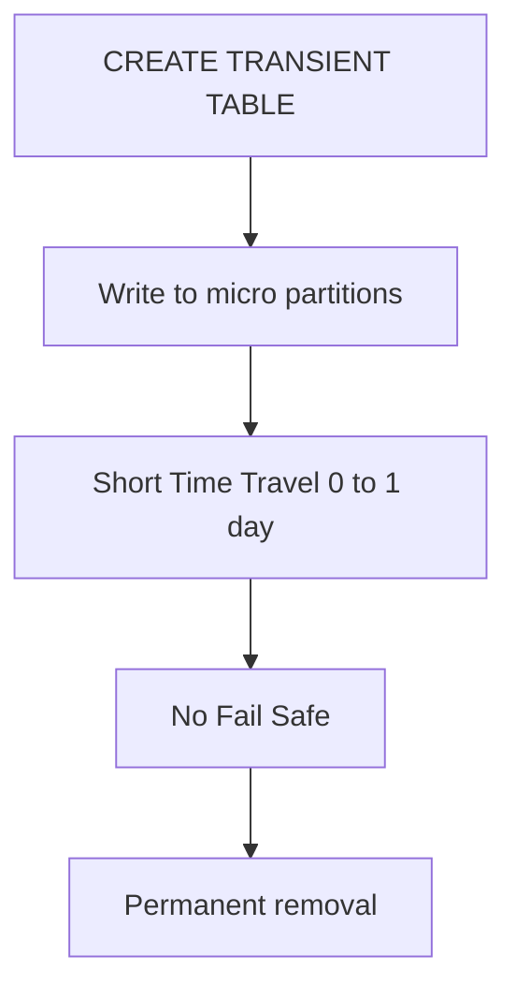

| Feature | Detail |
|---------|--------|
| Time Travel | Configurable 0 to 1 day only |
| Fail Safe | None |
| Scope | Visible to all sessions with privileges |
| Lifetime | Until explicitly dropped |
| Cloning | Supported inherits transient properties |

```sql
CREATE TRANSIENT TABLE etl.staging_orders (
  order_id NUMBER,
  raw_payload VARIANT,
  loaded_at TIMESTAMP
)
DATA_RETENTION_TIME_IN_DAYS = 1;
```

| Cost Factor | What You Pay For |
|-------------|-----------------|
| Current data | Compressed storage at standard rate |
| Time Travel data | Only if configured up to 1 day |
| Fail Safe data | None |

## Dynamic Tables

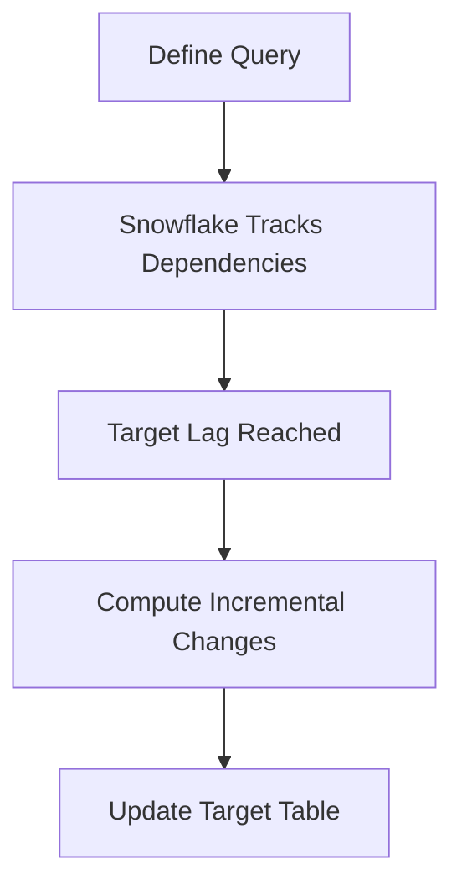

| Property | What It Does |
|----------|-------------|
| Target lag | Maximum delay between source update and refresh |
| Refresh mode | Incremental or full execution |
| Warehouse | Compute cluster assigned to run refreshes |
| Dependency tracking | Automatic mapping of upstream objects |
| State tracking | Records last refresh and processed watermarks |

```sql
CREATE DYNAMIC TABLE analytics.daily_sales
TARGET_LAG = '1 hour'
WAREHOUSE = reporting_wh
AS
SELECT
  date,
  product_id,
  SUM(amount) as total_sales
FROM raw.transactions
GROUP BY date, product_id;
```

| Use Case | Why Dynamic Table Works |
|----------|------------------------|
| Multi step data pipelines | Automatic refresh without manual orchestration |
| Data marts for reporting | Keeps derived tables fresh with minimal effort |
| Incremental aggregation | Processes only changed data since last refresh |

## External Tables

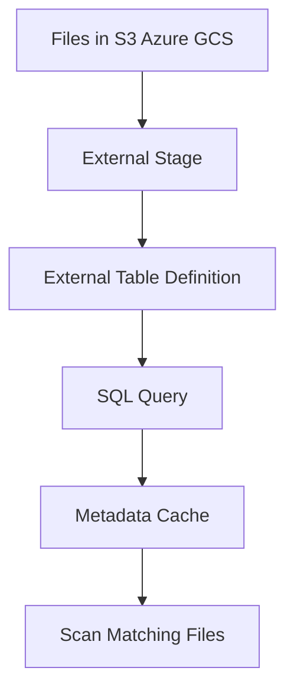

| Feature | What It Does | Limitation |
|---------|-------------|------------|
| File based access | Query CSV JSON Parquet directly in cloud storage | No DML updates or deletes on source files |
| Metadata caching | Snowflake caches file list and stats | Cache refresh required after file changes |
| Partition pruning | Skip files based on folder structure | Requires consistent partition layout |
| Schema inference | Auto detect columns from file content | Schema changes require manual refresh |

```sql
CREATE EXTERNAL TABLE logs_ext
WITH LOCATION @ext_s3/logs/
FILE_FORMAT = (TYPE = PARQUET)
AS
SELECT
  METADATA$filename AS file_name,
  VALUE:col1::STRING AS col1
FROM @ext_s3/logs/;
```

| Use Case | Why External Table Works |
|----------|-------------------------|
| Ad hoc exploration of raw logs | No load step. Query files as they land |
| One time analysis of third party data | Avoid copying large datasets you may not need |
| Data lake federation | Query multiple buckets from one SQL interface |

## Apache Iceberg Tables

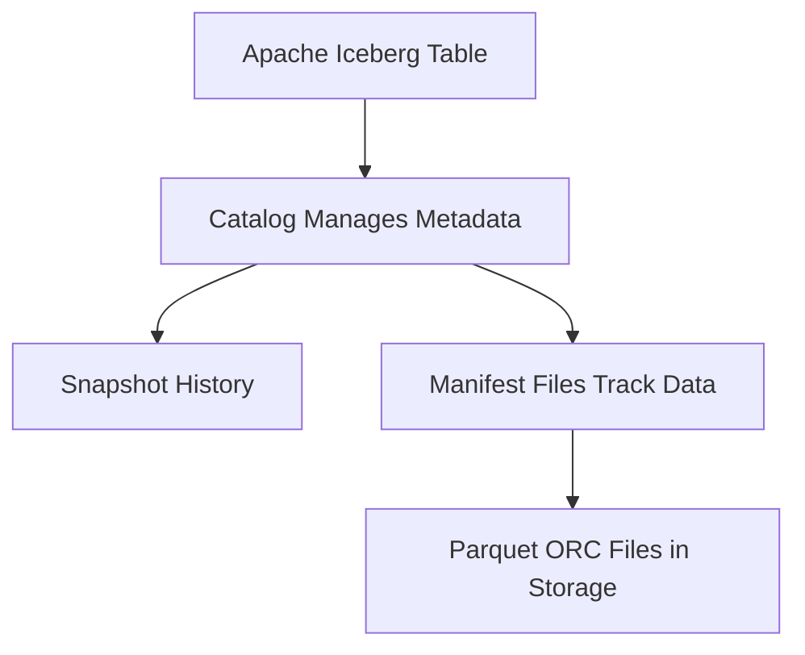

| Feature | What It Enables |
|---------|----------------|
| Open table format | Readable by Spark Trino Flink and Snowflake |
| ACID transactions | Atomic commits with snapshot isolation |
| Schema evolution | Add rename or reorder columns without rewriting |
| Hidden partitioning | Partition by derived values not physical paths |
| Time Travel | Query table as of specific snapshot |
| Incremental processing | Read only new or changed files |

```sql
CREATE ICEBERG TABLE sales_iceberg (
  sale_id NUMBER,
  product_id NUMBER,
  amount NUMBER,
  sale_date DATE
)
CATALOG = SNOWFLAKE
LOCATION = 's3://my-bucket/iceberg/sales';
```

| Deployment Option | Where Metadata Lives | Best For |
|------------------|---------------------|----------|
| Snowflake managed | Snowflake internal storage | Teams already in Snowflake minimal setup |
| External catalog | Your cloud storage or metastore | Multi engine access existing Iceberg investments |

## Comparison Summary

| Decision Factor | Permanent | Temporary | Transient | Dynamic | External | Iceberg |
|----------------|-----------|-----------|-----------|---------|----------|---------|
| Data location | Snowflake | Snowflake | Snowflake | Snowflake | Cloud storage | Cloud storage |
| DML support | Full | Full | Full | Via refresh | Read only | Full ACID |
| Time Travel | 1 to 90 days | 0 to 1 day | 0 to 1 day | Inherits base | None | Via snapshots |
| Fail Safe | 7 days | None | None | Inherits base | None | Via catalog |
| Multi engine access | Snowflake only | Snowflake only | Snowflake only | Snowflake only | Snowflake only | Spark Trino Flink Snowflake |
| Schema evolution | ALTER TABLE | ALTER TABLE | ALTER TABLE | Via redefinition | Manual refresh | Native support |
| Best for | Production critical data | Session logic | ETL staging | Automated pipelines | Raw file exploration | Cross platform governance |

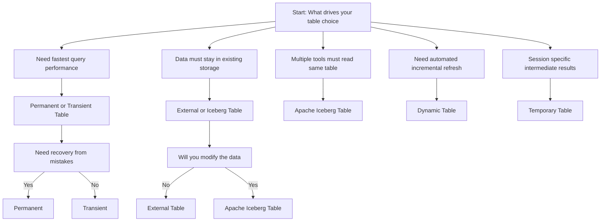

## Cost Comparison

| Table Type | Storage Cost | Compute Cost | When You Pay |
|------------|-------------|--------------|--------------|
| Permanent | Current plus Time Travel plus Fail Safe | Queries and DML | Always for storage on demand for compute |
| Temporary | Current only while session active | Queries and DML | Only while table exists |
| Transient | Current plus optional 1 day Time Travel | Queries and DML | Always for storage on demand for compute |
| Dynamic | Same as base table type | Refresh jobs plus queries | Storage always compute during refresh |
| External | Your cloud storage rates | Queries scan files | Storage in cloud compute in Snowflake |
| Iceberg | Your cloud storage plus catalog metadata | Queries plus catalog ops | Storage in cloud compute per engine |

## Common Mistakes and Fixes

| Mistake | What Happens | How To Fix |
|---------|--------------|------------|
| Using Permanent tables for ETL staging | Paying for 90 days of history on data dropped daily | Switch to Transient tables for intermediate steps |
| Using Temporary tables for shared outputs | Other sessions cannot see the data | Use Permanent or Transient tables for shared results |
| Leaving 90 day Time Travel on dev databases | Storage costs balloon for test data | Set DATA_RETENTION_TIME_IN_DAYS to 1 for non prod |
| Using External Tables for frequent reporting | Queries are slow due to full file scans | Load frequently queried data into Native or Iceberg tables |
| Assuming Iceberg fixes bad query patterns | Poor filters still scan too much | Optimize SQL first then tune table format |
| Forgetting to refresh External Table metadata | New files do not appear in queries | Automate REFRESH after file ingestion completes |

## Best Practices

- Use Permanent tables for final business critical data that needs recovery capability
- Use Transient tables for ETL staging intermediate results and rebuilt aggregates
- Use Temporary tables for session specific logic that does not leave the script
- Use Dynamic tables for automated incremental pipelines without manual orchestration
- Use External tables for read only exploration of raw files in cloud storage
- Use Apache Iceberg tables when you need to share data across multiple query engines
- Set Time Travel to 1 day for dev and test environments to control storage cost
- Tag tables with lifecycle metadata to document expected retention and ownership
- Monitor storage by table type with ACCOUNT_USAGE views to catch cost surprises
- Start with the simplest type that meets your need. Add complexity only when required

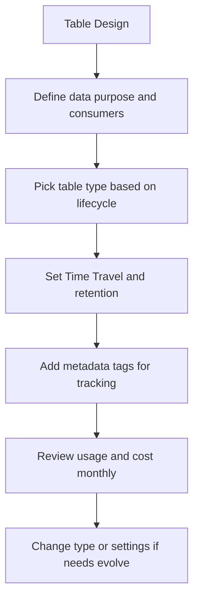

## Quick Reference Decision Flow

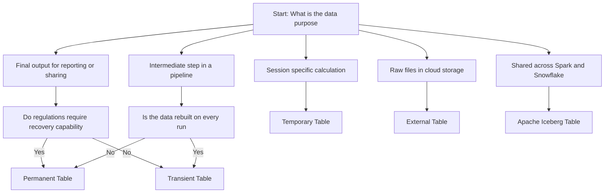

## Key Principles

- Table type is a lifecycle decision not a performance decision
- Permanent tables protect against mistakes. Transient tables protect your budget
- Temporary tables isolate work. They do not share and they do not persist
- Dynamic tables automate refresh. You define the query. Snowflake handles the rest
- External tables query where data lives. No copy. No load. Just read
- Iceberg tables enable cross engine access. Write once. Read anywhere
- Time Travel costs money. Set it based on actual recovery needs not fear
- Fail Safe cannot be disabled for Permanent tables. Plan for that cost
- You pay for what you keep. Shorten retention where recovery is not critical
- Start simple. Add complexity only when your requirements force it

## Bottom Line

- Permanent tables are for data that must survive mistakes and serve many users
- Transient tables are for data that matters today but does not need long history
- Temporary tables are for work that lives and dies in a single script or session
- Dynamic tables are for pipelines that refresh automatically without manual code
- External tables are for querying raw files without moving them into Snowflake
- Iceberg tables are for sharing data across Spark Trino Flink and Snowflake
- You pay for what you keep. Shorten retention where recovery is not critical
- You pay for what you compute. Right size warehouses that refresh or transform tables
- Measure storage by table type monthly. Workloads change and your choices should too

Think of table types like storage containers:
- Permanent tables are like a vault. Keep important items safe and recoverable
- Transient tables are like a workbench. Hold items you are using now
- Temporary tables are like a notepad. Sketch ideas then discard when done
- Dynamic tables are like a conveyor belt. Move and transform items automatically
- External tables are like a window. Look at items without bringing them inside
- Iceberg tables are like a shared locker. Multiple people can access the same items

Pick the container that matches what you are storing. Do not put a pencil in a vault. Do not put a contract on a notepad. Match the protection to the value. Save cost without losing what matters.
