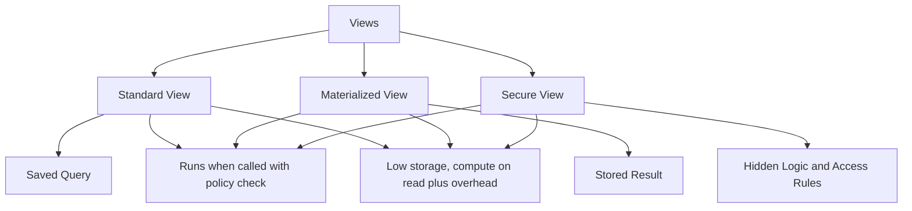
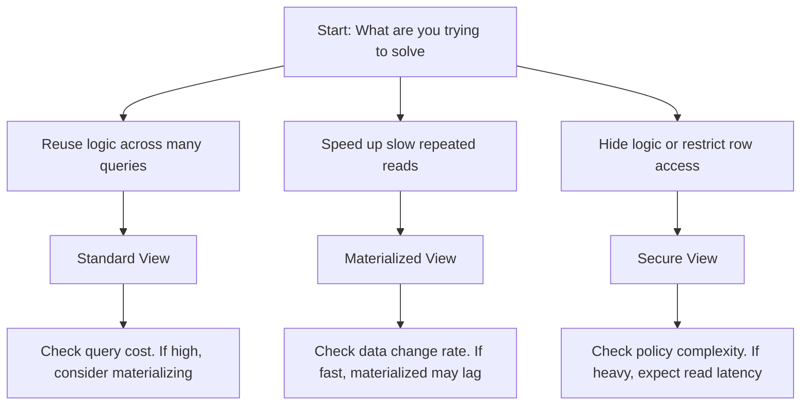
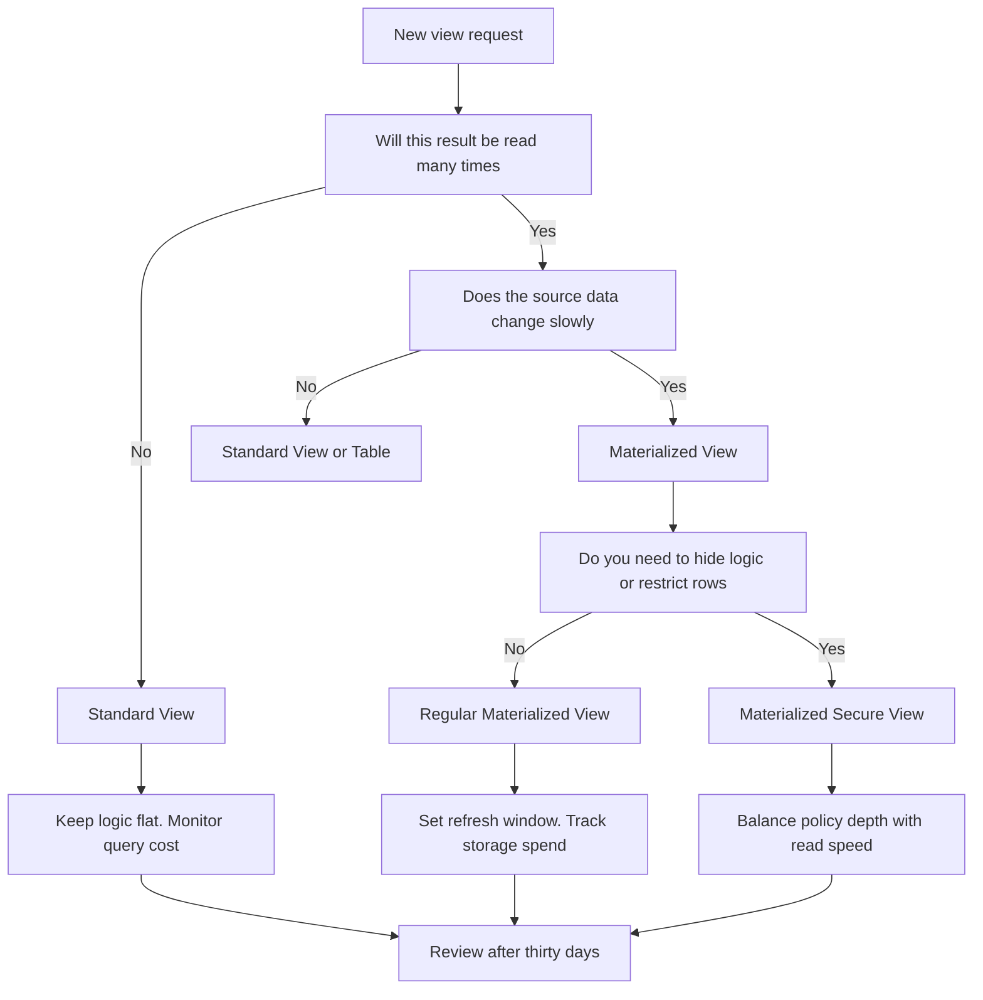

# View Types in Snowflake

### **Standard View**  
*A virtual table defined by a query.*  
- **What it is**: A saved SQL query that runs *every time* you access it.  
- **Data freshness**: Always current—pulls live from base tables.  
- **Cost**: Zero storage, but pays compute cost on every read.  
- **Best for**: Abstraction (hiding complex joins), consistent filtering, or simplifying access patterns.  
- **Mental model**: A *live window* into your data—what you see is exactly what's there, right now.

### **Materialized View**  
*A physical snapshot of a query's result.*  
- **What it is**: The query runs *once* (or on a schedule), and results are stored on disk.  
- **Data freshness**: Stale until refreshed—trade immediacy for speed.  
- **Cost**: Uses storage + requires refresh strategy, but reads are fast and cheap.  
- **Best for**: Heavy aggregations, reporting dashboards, or high-traffic derived datasets.  
- **Mental model**: A *photocopy* of your data—fast to hand out, but you decide when to make a new copy.

### **Secure View**  
*A view that enforces access policy at query time.*  
- **What it is**: A view (standard or materialized) with embedded security logic—row filters, column masking, or structure hiding.  
- **Data freshness**: Depends on underlying type (standard = live, materialized = refreshed).  
- **Cost**: Adds evaluation overhead per query, but centralizes governance.  
- **Best for**: Compliance, multi-tenant isolation, or exposing only approved slices of data.  
- **Mental model**: A *filtered lens*—the data doesn't change, but what each user *sees* is controlled by policy.

### The real distinction isn't technical—it's about *what you're optimizing for*:  
- **Standard**: Correctness + simplicity  
- **Materialized**: Read performance + scalability  
- **Secure**: Governance + least-privilege access  

### Caveats You Must be Aware of  
- Materialized views *lie* if you forget to refresh them.  
- Secure views *fail silently* if misconfigured—test with low-privilege roles.  
- Standard views *scale poorly* if the underlying query is heavy and called often.  

If you're choosing between them, ask: *"What breaks first if I pick wrong—performance, freshness, or security?"* That usually points to the right anchor.

| Property | Standard View | Materialized View | Secure View |
|----------|---------------|-------------------|-------------|
| What it holds | A saved query, not data | A physical table of pre computed results | A saved query with enforced access rules |
| When work happens | At query time | During background refresh | At query time with policy evaluation |
| Storage cost | None | You pay for stored result rows | None |
| Compute cost | Paid each time it runs | Paid during refresh, cheap to read | Paid each time it runs plus policy overhead |
| Data freshness | Always current | Lag depends on refresh frequency | Always current |
| Best use | Logic reuse, light joins, ad hoc reporting | Heavy dashboards, slow aggregations, frequent reads | Sharing sensitive data, row level masking, hiding business logic |
| Not suited for | Repeated heavy scans or complex joins | Rapidly changing source data or strict real time needs | High performance queries where policy checks add latency |

| First Principle | What it means for you |
|-----------------|----------------------|
| A view is a lens not a vault | It shapes how you see data but does not store the data itself |
| You choose when to do the work | Standard views push work to read time. Materialized views push work to write time. Secure views add policy work to read time |
| Freshness costs compute | Always current data requires running queries on demand. Cached data requires paying to keep it updated |
| Security adds friction | Hiding logic and filtering rows protects data but slows execution. You trade speed for control |
| Views layer complexity | Each view wraps another query. Too many layers hide cost and make debugging difficult |

| Common Trap | What happens | How to think differently |
|-------------|--------------|--------------------------|
| Using standard views to hide slow joins | Every user pays the same heavy cost repeatedly. Credits vanish | If the same result is read often, compute it once. Store the answer. Use a materialized view |
| Materializing fast changing data | Background refreshes burn credits. Users see stale results | If data shifts faster than the refresh cycle, do not cache. Query the source directly |
| Nesting views inside views | Query plans grow tangled. Pruning fails. Cost becomes invisible | Flatten when possible. One clear query beats three hidden layers |
| Assuming secure views are free | Policy evaluation runs per query. Complex rules add latency | Keep masking simple. Push heavy filtering to the underlying table or role grants |
| Creating views for every small transform | You build a house of cards. One source change breaks many views | Transform once. Write to a transient or permanent table. Reference that table instead |

- You are likely treating views as a way to avoid writing new tables. This is a delay tactic not a solution
- A view does not optimize your query. It only delays when the optimization matters
- If your dashboard runs the same heavy aggregation five hundred times a day, you are choosing to pay five hundred times
- If your data changes every minute, caching it creates a lie. Users will trust the number and act on old information
- Security should be simple. If your secure view needs ten case statements and three subqueries to mask rows, your data model is broken
- Measure what you actually read. If a view is called twice a week, materializing it wastes storage for no gain
- Name views by purpose not by structure. A view called v_temp_final_joined_v2 tells no one what it does
- Document the refresh expectation for materialized views. If users think it is real time and it is not, trust breaks
- Review views quarterly. Remove the ones nobody calls. Archive the ones that hide cost. Keep only what serves a clear purpose
