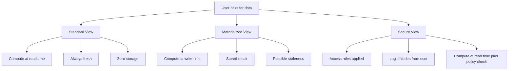
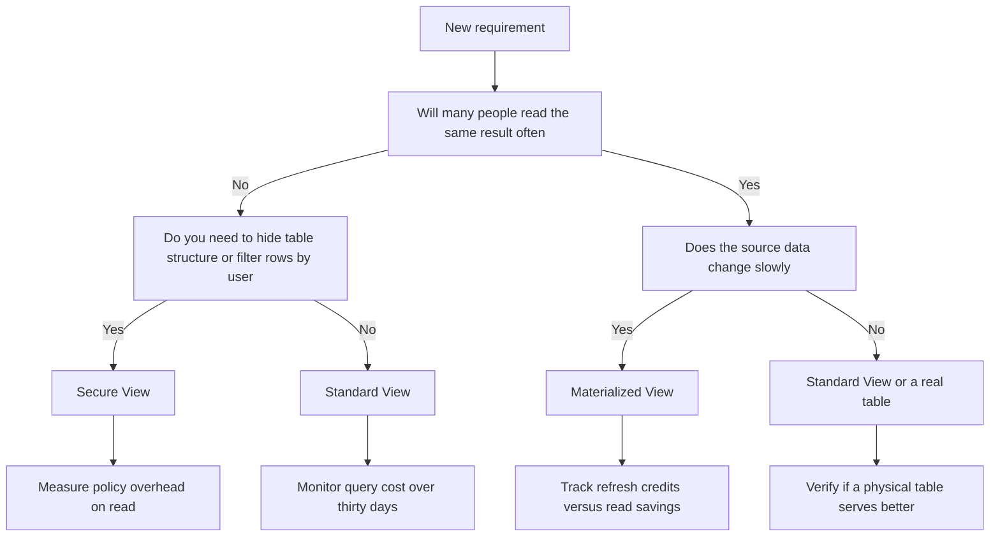

# Standard Materialized and Secure Views

This document is pretty much a replica of the folder's readme.md so you can skip this if you want. However there are minor changes which might help you comprehend the difference a bit deeper than the other document. 

| Property | Standard View | Materialized View | Secure View |
|---|---|---|---|
| What it holds | A saved query definition | A physical copy of query results | A saved query with access rules |
| When compute happens | Every time you query it | When data changes or on a schedule | Every time you query it |
| Storage cost | None | You pay for the cached rows | None |
| Data freshness | Always current | Depends on refresh timing | Always current |
| Who sees the underlying tables | Anyone with query access | Anyone with query access | Only the owner sees the source logic |
| Best use case | Simple logic reuse, ad hoc reports | Heavy dashboards, repeated slow queries | Sharing sensitive data, masking rows |
| Where it breaks | Heavy joins run slowly on every call | Fast changing data causes refresh waste | Complex masking rules slow down reads |

- You are likely treating views as a way to avoid writing code. They are not shortcuts. They are contracts about when you pay for work.
>[!Note]
>A standard view pushes all the work to the moment of reading. You save space but spend compute repeatedly. If ten people run the same heavy report, you pay ten times for the same math.

Views do not fix slow queries. They only change when the slowness happens. If your base query is poorly written, materializing it just caches a slow result. Securing it just hides a slow result behind a policy.

>[!Tip]
>A materialized view pulls the work forward. You compute once, store the answer, and serve it quickly. You trade storage and background compute for fast reads. If the source data shifts faster than your refresh cycle, you are serving old truths as if they were new.
- A secure view adds a gatekeeper. It hides the structure of your tables and applies rules before returning rows. It does not speed anything up. It trades a small amount of query speed for control and safety.
>[!Caution]
> Freshness and cost sit on opposite ends of a scale. You cannot have instant answers, zero storage, and low compute at the same time. Pick two. Accept the third as a compromise.
>[!Caution]
> Nesting views inside other views creates invisible debt. Each layer adds parsing time and hides where the real work happens. A single clear query beats a chain of hidden ones.

- Do not materialize a view because you read it once a week. The storage and refresh credits will outweigh any saved compute time.
- Do not use a standard view for a dashboard that loads fifty times a day. You are burning credits on repeated work that could be done once.
- Do not build a secure view with complex case statements and joins just to mask data. Row access policies and proper roles often handle the same problem with less query overhead.
- Check your query history before you create anything. Find which queries run often, which ones scan too much, and which ones return small results. Let the actual usage dictate the tool.
- Name your views by what they return, not how they are built. A view called v_cust_join_v3 tells you nothing. A view called active_customers_last_30_days tells you exactly what to expect.
- Review your views every quarter. Remove the ones that no longer serve a purpose. Archive the ones that hide too much complexity. Keep only what earns its keep.
- Remember that a view is a promise, not a shortcut. It promises a certain shape of data at a certain time. Make sure the promise matches what your users actually need, not what is easiest to write.

Think of views like different ways to serve water from a well. A standard view draws a bucket every time someone is thirsty. It is always fresh, but you tire your arm quickly. A materialized view fills a tank once a day. You save effort during the day, but the water may grow stale if the source shifts. A secure view puts a filter on the spout. It controls who drinks and what they taste, but it slows the flow. Choose the method that matches your thirst, your patience, and your need for safety. Do not build a tank when a bucket will do. Do not use a filter when everyone is trusted. Match the tool to the truth of the situation.
