# AI and ML Services in Snowflake

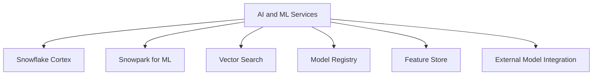

| Service | What It Does | Best For | Not Ideal For |
|---------|-------------|----------|---------------|
| Snowflake Cortex | Pre built AI functions for text and images | Summarization sentiment analysis embeddings | Custom model training from scratch |
| Snowpark for ML | Run Python ML code directly in Snowflake | Training custom models building pipelines | Simple SQL aggregations |
| Vector Search | Store and query embeddings for semantic matching | RAG apps recommendations similarity search | Exact match lookups |
| Model Registry | Track versions metadata and lineage of models | Team collaboration model governance | One off experiments with no reuse |
| Feature Store | Share and reuse engineered features across teams | Consistent features for training and inference | Ad hoc analysis with no reuse |
| External Model Integration | Call models hosted outside Snowflake | Using proprietary or third party models | Low latency real time inference |

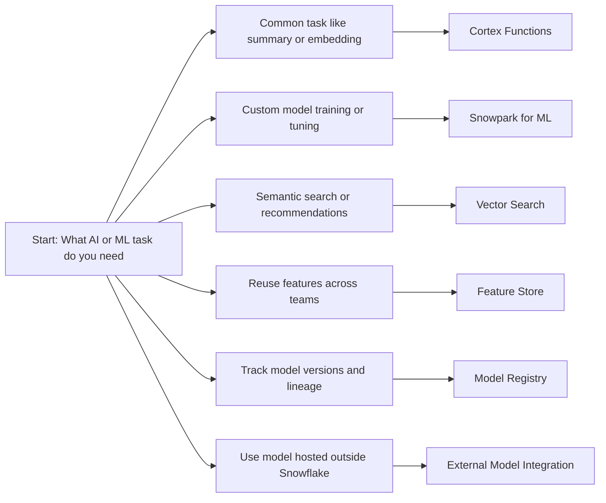

## Snowflake Cortex

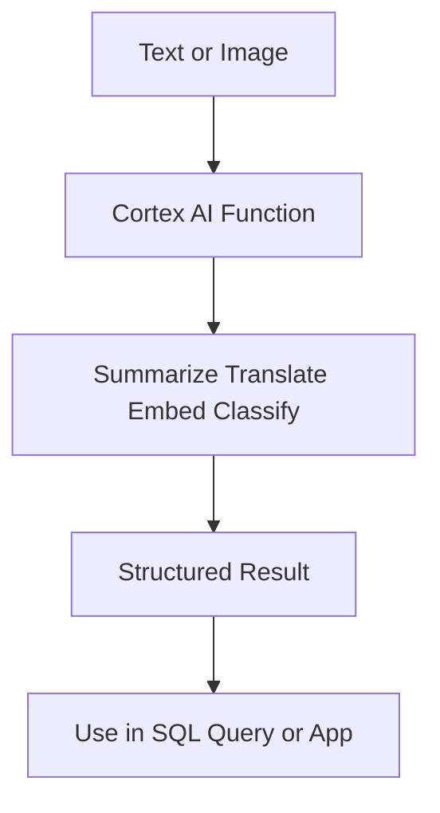

| Function | Input | Output | Example Use |
|----------|-------|--------|-------------|
| COMPLETE | Prompt text | Generated text | Draft responses write SQL explain concepts |
| EXTRACT_ANSWER | Question and context | Short answer | Q and A over documents |
| SUMMARIZE | Long text | Short summary | Condense reports or support tickets |
| SENTIMENT | Text | Positive neutral negative score | Analyze customer feedback |
| TRANSLATE | Text and target language | Translated text | Localize content for global teams |
| EMBED_TEXT_... | Text | Vector embedding | Semantic search RAG apps |
| RECOGNIZE_IMAGE | Image URL | Labels and descriptions | Tag images for search |
| DETECT_LANG | Text | Language code | Route content to correct pipeline |

```sql
-- Example: Summarize customer feedback with Cortex
SELECT
  ticket_id,
  feedback_text,
  SNOWFLAKE.CORTEX.SUMMARIZE(feedback_text) as summary,
  SNOWFLAKE.CORTEX.SENTIMENT(feedback_text) as sentiment_score
FROM support_tickets
WHERE created_date > DATEADD(day, -7, CURRENT_DATE);
```

| When to use Cortex | When to build your own |
|-------------------|----------------------|
| You need a common AI task like summary or embedding | You need a custom model trained on proprietary data |
| You want to avoid managing model infrastructure | You need full control over model version and tuning |
| You are prototyping or building internal tools | You are building a production ML product with strict SLAs |
| You want to get started in minutes not weeks | You have existing MLOps pipelines to integrate with |

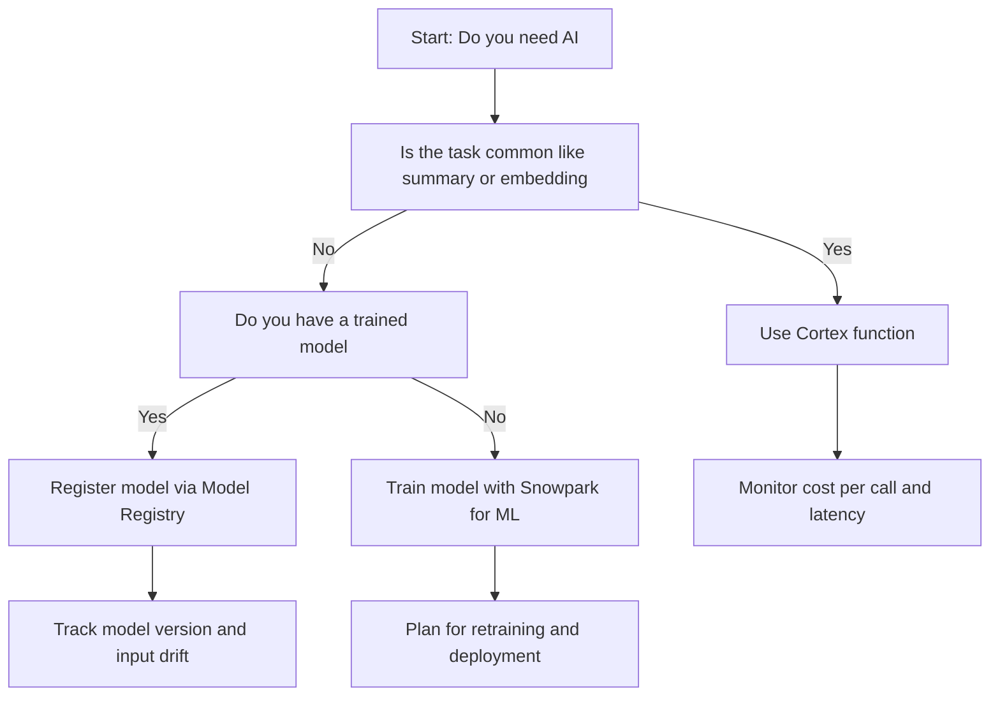

## Snowpark for ML

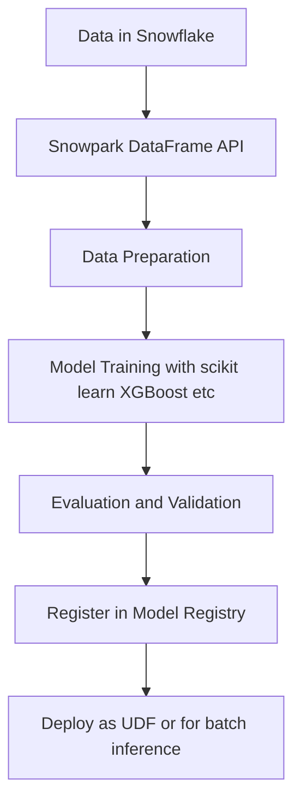

| Capability | What It Enables | Why It Matters |
|------------|----------------|----------------|
| DataFrame API | Chain transformations like filter join aggregate | Write code that reads like SQL but with programmatic control |
| In database execution | Code runs where data lives | No data egress faster and cheaper |
| Package support | Use pandas numpy scikit learn xgboost | No need to rewrite everything from scratch |
| Local testing | Run code against local data before deploying | Catch errors early without burning credits |
| Pushdown optimization | Snowpark translates code to SQL where possible | Get performance of SQL with flexibility of code |

```python
# Example: Train a simple churn model with Snowpark and scikit learn
from snowflake.snowpark import Session
from sklearn.ensemble import RandomForestClassifier
import pandas as pd

def train_churn_model(session: Session):
    # Load data from Snowflake
    df = session.table("analytics.customer_features").to_pandas()
    
    # Prepare features and target
    X = df[["tenure_months", "monthly_charges", "support_tickets"]]
    y = df["churned"]
    
    # Train model
    model = RandomForestClassifier(n_estimators=100)
    model.fit(X, y)
    
    # Register model in Snowflake Model Registry
    # (simplified - actual registration uses MLflow or Snowflake APIs)
    return model
```

| Use Case | Snowpark for ML Pattern |
|----------|------------------------|
| Train a classification model | Load data prepare features train with scikit learn register as UDF |
| Build a recommendation pipeline | Join user and item data compute embeddings store results |
| Run batch inference on new data | Load trained model apply to new rows write predictions to table |
| Tune hyperparameters | Loop over parameter sets evaluate metrics pick best model |

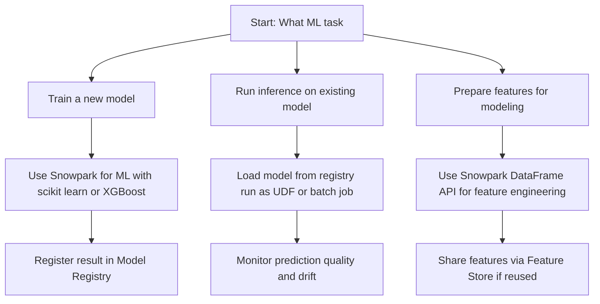

## Vector Search and Embeddings

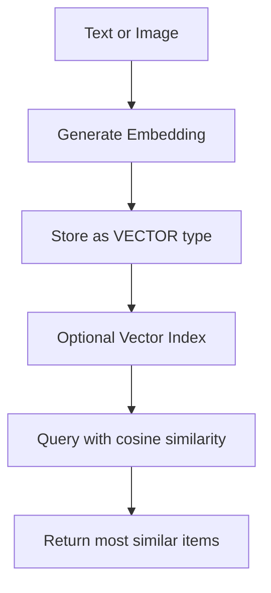

| Feature | What It Does | Why It Matters |
|---------|-------------|----------------|
| VECTOR data type | Store fixed length numeric arrays | Native support for embeddings without BLOB hacks |
| Cosine distance function | Compute similarity between vectors | Enables semantic search not just keyword match |
| Cortex embedding functions | Generate embeddings with one SQL call | No need to manage external embedding service |
| Vector index (preview) | Speed up nearest neighbor search | Reduce latency for large embedding tables |
| Combine with SQL filters | Filter by metadata then rank by similarity | Get relevant results that also meet business rules |

```sql
-- Example: Semantic search with vector similarity
WITH query_embedding AS (
  SELECT SNOWFLAKE.CORTEX.EMBED_TEXT_1024('snowflake-arctic-embed', 'fast running shoes') AS vec
)
SELECT
  product_id,
  product_name,
  1 - VECTOR_COSINE_SIMILARITY(q.vec, p.embedding) AS similarity
FROM products p
CROSS JOIN query_embedding q
WHERE category = 'footwear'
  AND in_stock = TRUE
ORDER BY similarity DESC
LIMIT 10;
```

| Use Case | Vector Search Pattern |
|----------|----------------------|
| Product recommendations | Embed product descriptions find similar items |
| Document Q and A | Embed questions match to relevant passages |
| Fraud detection | Embed transaction patterns find anomalies |
| Content deduplication | Embed text find near duplicates for cleanup |

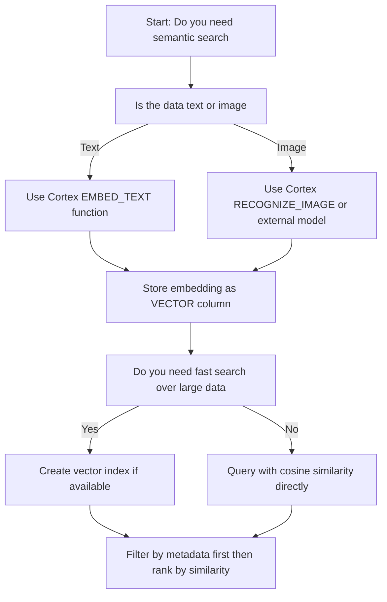

## Model Registry

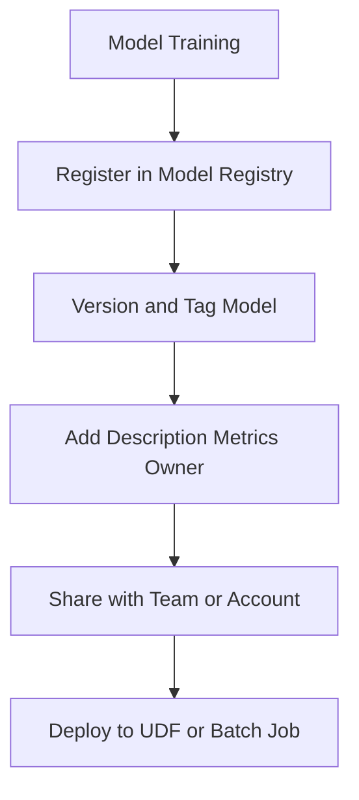

| Feature | What It Does | Why It Matters |
|---------|-------------|----------------|
| Version tracking | Keep multiple versions of same model | Roll back if new version performs worse |
| Metadata storage | Store metrics parameters and description | Understand what each model does without reading code |
| Lineage tracking | See which data and code created the model | Audit and reproduce results for compliance |
| Access control | Grant read or write access to models | Teams can share models without copying files |
| Integration with Snowpark | Register models directly from training code | No manual upload or config files needed |

```sql
-- Example: Register a model (conceptual - actual API may vary)
-- This is illustrative; check current Snowflake docs for exact syntax

-- After training with Snowpark
CALL SYSTEM$REGISTER_MODEL(
  model_name => 'churn_predictor_v2',
  model_type => 'sklearn',
  description => 'Random forest model for customer churn prediction',
  input_schema => 'tenure_months NUMBER, monthly_charges NUMBER',
  output_schema => 'churn_score FLOAT'
);
```

| Practice | Why It Works |
|----------|-------------|
| Tag models with owner and purpose | Makes it easy to find and retire unused models |
| Store evaluation metrics at registration | Compare versions without rerunning tests |
| Link model to training data snapshot | Reproduce results or debug issues later |
| Set retention policy for old versions | Control storage cost without losing recent history |
| Document expected input distribution | Catch data drift before model performance drops |

## Feature Store Concepts

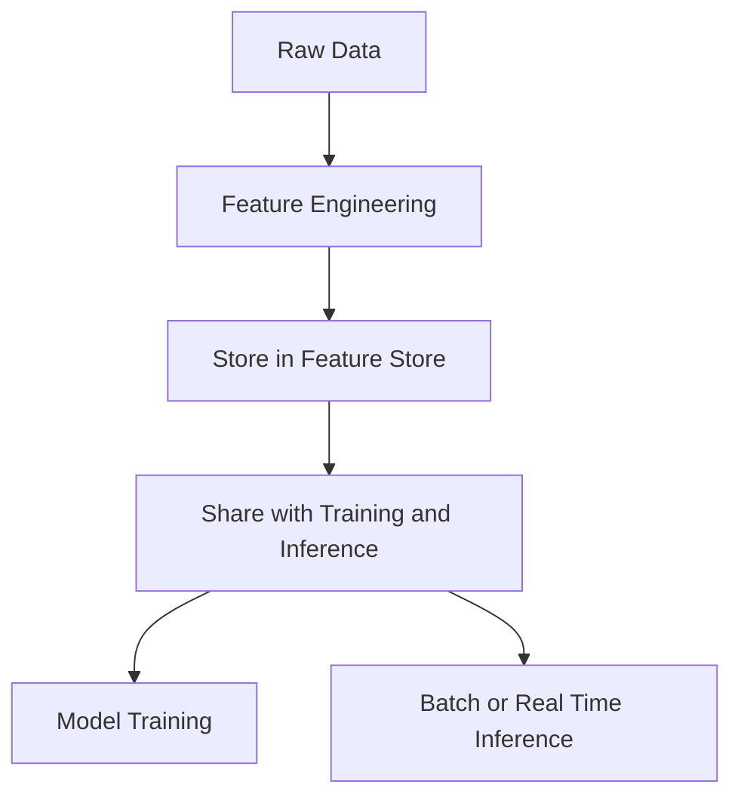

| Capability | What It Enables | Why It Matters |
|------------|----------------|----------------|
| Centralized feature definitions | One source of truth for features | Avoid teams building the same feature differently |
| Point in time correct joins | Join features to labels at training time | Prevent data leakage and biased models |
| Online and offline serving | Same feature logic for training and inference | No training serving skew |
| Feature lineage | Track which raw data created each feature | Debug issues or comply with data governance |
| Reuse across models | Multiple models can use same features | Save engineering time and compute |

```sql
-- Example: Define and reuse a feature (conceptual)
-- Create feature definition
CREATE OR REPLACE FEATURE customer_avg_spend AS
SELECT
  customer_id,
  AVG(order_total) as avg_spend_30d
FROM orders
WHERE order_date >= DATEADD(day, -30, CURRENT_DATE)
GROUP BY customer_id;

-- Use in training query
SELECT
  c.customer_id,
  f.avg_spend_30d,
  c.churned as label
FROM customers c
JOIN FEATURE customer_avg_spend f ON c.customer_id = f.customer_id;
```

| When to use a feature store | When simple tables work |
|----------------------------|------------------------|
| Multiple teams build models | One team owns all modeling |
| Features are reused across models | Each model has unique features |
| You need point in time correct training data | Training data is simple and static |
| You serve features in real time | Only batch inference is needed |

## External Model Integration

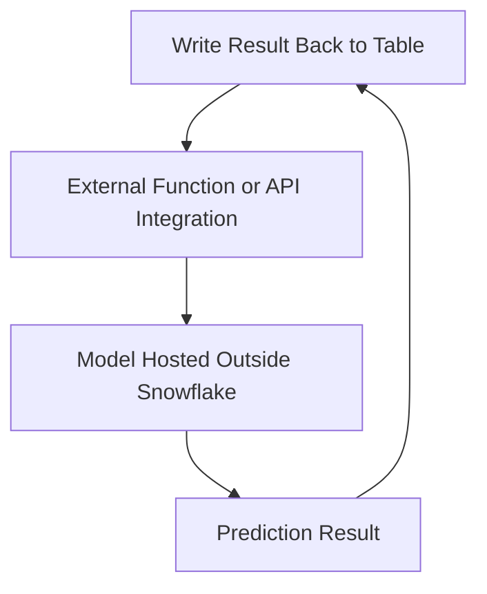

| Integration Method | Best For | Consideration |
|-------------------|----------|---------------|
| External Functions | Call REST API from SQL with secure auth | Adds network latency and external cost |
| Snowpark with external libraries | Use models that cannot run in Snowflake | Requires data egress or model porting |
| Hybrid deployment | Train in Snowflake deploy elsewhere | Manage two environments and sync logic |
| Model export | Export trained model for external use | Ensure format compatibility and version sync |

```sql
-- Example: External function to call fraud scoring API
CREATE OR REPLACE EXTERNAL FUNCTION score_fraud (
  transaction_id STRING,
  amount NUMBER,
  merchant_id STRING
)
RETURNS OBJECT
API_INTEGRATION = fraud_api_integration
AS 'https://api.fraudservice.com/score';

-- Use in query
SELECT
  transaction_id,
  amount,
  score_fraud(transaction_id, amount, merchant_id):fraud_score as risk_score
FROM new_transactions;
```

| Practice | Why It Matters |
|----------|---------------|
| Cache external predictions for repeated inputs | Avoid calling external service for same data repeatedly |
| Set timeouts and retry logic | Handle external service downtime gracefully |
| Monitor latency and error rates | Catch degradation before users complain |
| Log inputs and outputs for audit | Trace predictions back to source data if needed |
| Fallback to default value on failure | Keep pipeline running when external service is down |

## Cost and Performance Considerations

| Service | Cost Driver | How to Control |
|---------|------------|----------------|
| Cortex | Per call pricing for AI functions | Cache embeddings. Use for high value tasks only |
| Snowpark for ML | Compute credits for training and inference | Right size warehouse. Cache results. Avoid redundant calls |
| Vector Search | Storage for embeddings plus compute for similarity | Filter before ranking. Use approximate search for large sets |
| Model Registry | Storage for model artifacts and metadata | Archive old versions. Delete unused models |
| Feature Store | Storage for feature tables plus compute for joins | Reuse features. Avoid duplicating logic |
| External Integration | Network egress plus external service cost | Cache responses. Use batch calls. Monitor error rates |

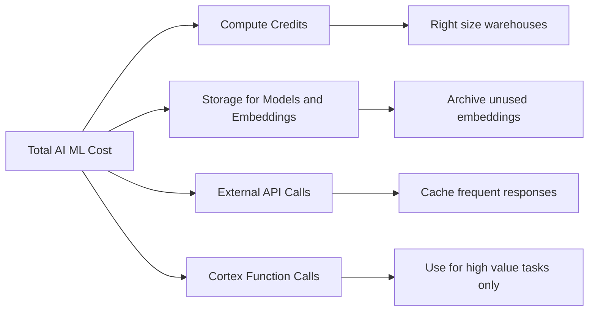

| Metric | Where To Find | What To Watch For |
|--------|--------------|-------------------|
| Cortex call cost | ACCOUNT_USAGE.CORTEX_FUNCTION_USAGE | Spike in calls without business justification |
| Model training time | QUERY_HISTORY with Snowpark tags | Training taking longer than expected |
| Vector query latency | QUERY_HISTORY with vector functions | Latency increasing as embedding table grows |
| Feature reuse rate | Custom tracking via feature store logs | Features built but never used by models |
| External function error rate | QUERY_HISTORY with external function calls | Errors increasing indicating service issues |

## Decision Framework

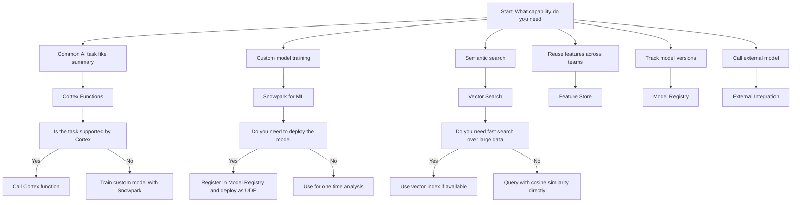

## Common Pitfalls

| Mistake | What Happens | Better Approach |
|---------|--------------|-----------------|
| Using Cortex for every text field | High cost for low value tasks | Use Cortex only for features that drive business decisions |
| Training models without tracking | Cannot reproduce or compare results | Register every model with metrics and parameters |
| Building embeddings without filtering | Irrelevant results that match semantically but not contextually | Filter by metadata before ranking by similarity |
| Ignoring data drift | Model performance drops over time silently | Monitor input distribution and retrain when needed |
| Caching nothing | Recomputing same embeddings or predictions repeatedly | Cache results that do not change often |
| No fallback for external calls | Query fails when external service is down | Add default value or retry logic for resilience |
| Over engineering features | Building complex feature store for one model | Start with simple tables. Add feature store only when reuse justifies it |

## Best Practices Summary

- Start with Cortex for common AI tasks. Build custom models only when needed
- Keep data in Snowflake. Bring code to data not data to code
- Register every model with version and metrics. Future you will thank you
- Cache embeddings and predictions that do not change often
- Filter before vector search. Reduce candidate set for better relevance and speed
- Tag AI and ML workloads for cost attribution. Track spend by project or team
- Test with small data before scaling. Catch errors before they burn credits
- Monitor latency and error rates for external integrations
- Review usage quarterly. Remove unused models features or embeddings
- Security first. Set permissions before sharing models or features

## Bottom Line

- Cortex gives you pre built AI without managing models. Use it for common tasks
- Snowpark for ML lets you train custom models where your data lives
- Vector search enables semantic matching on top of your structured data
- Model Registry helps you track versions and share models safely
- Feature Store lets teams reuse engineered features without duplication
- External integration lets you call models outside Snowflake when needed
- Every AI feature has a cost. Measure before you scale
- Start simple. Add complexity only when your use case requires it
- Keep data in Snowflake. Bring compute to data. Avoid egress

Think of AI and ML services like a kitchen:
- Cortex is your pre made spice blend. Works great for common dishes
- Snowpark is your stove and knives. Lets you cook anything from scratch
- Vector search is your taste tester. Finds similar flavors not just identical ingredients
- Model Registry is your recipe book. Track what you made and how it turned out
- Feature Store is your prepped ingredients. Save time by reusing what you already cut
- External integration is your food delivery. Bring in specialty items you cannot make

Pick the tool that matches the meal. Do not order delivery when you can cook it. Do not prep ingredients for a one time snack. Match the effort to the outcome. Save time without sacrificing quality.
