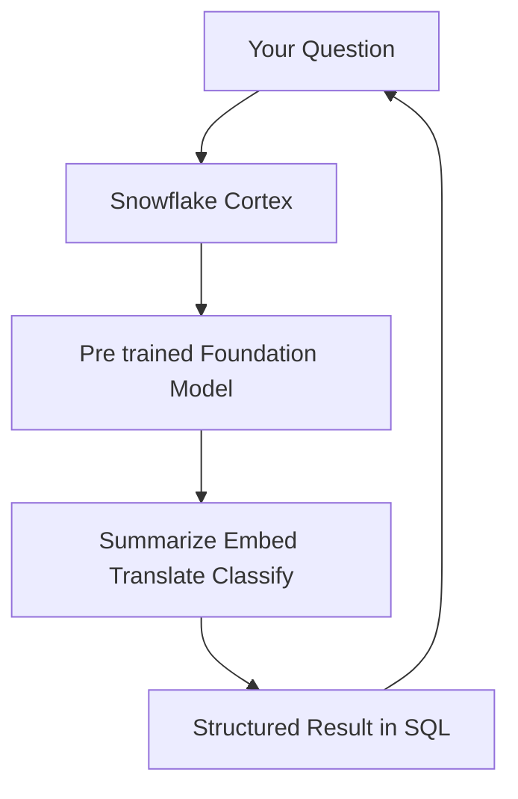
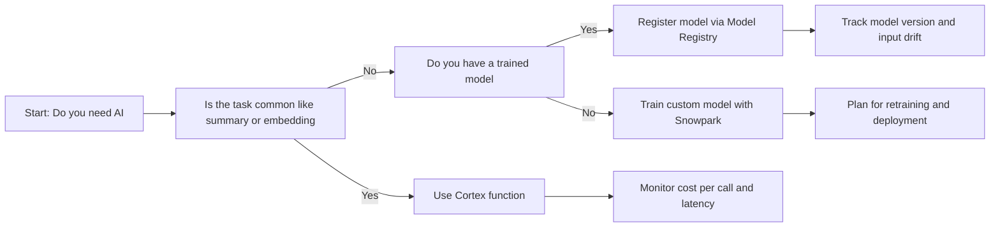
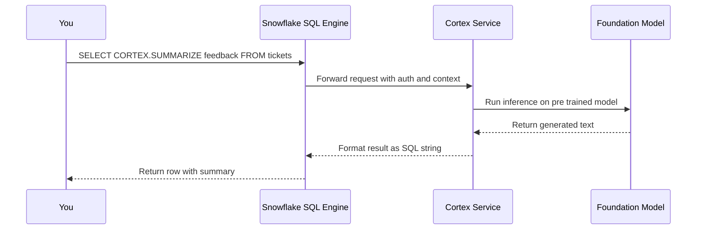
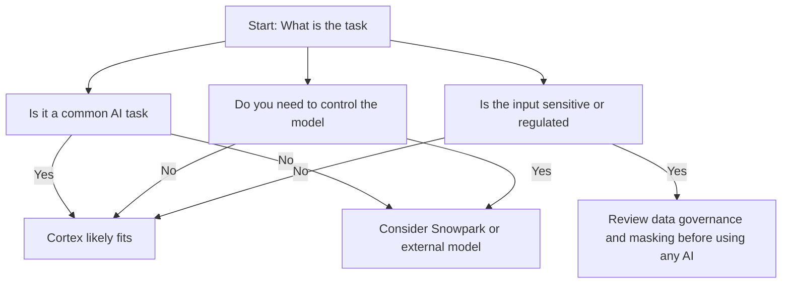
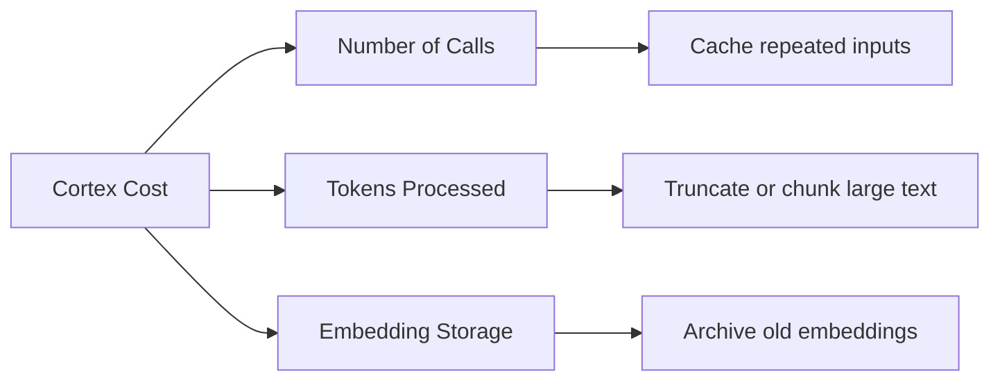
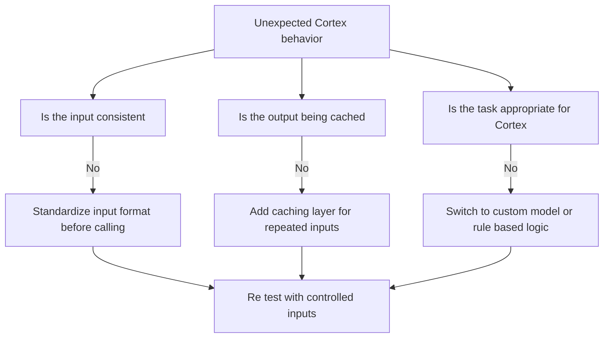
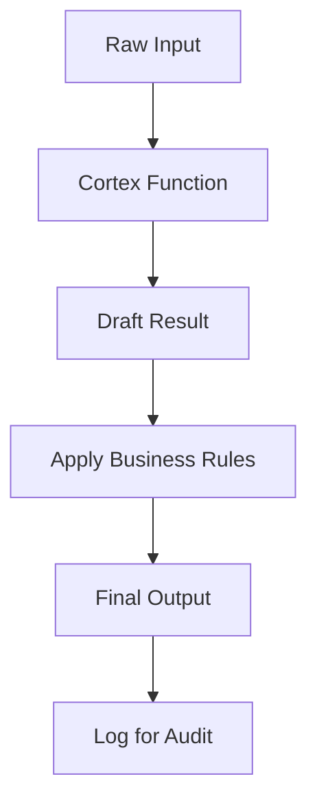
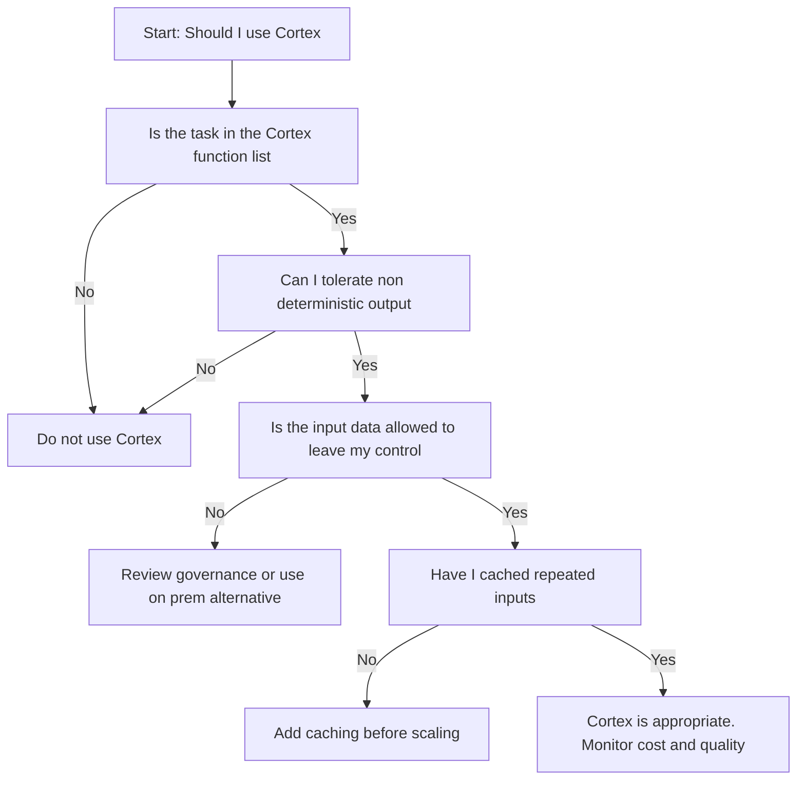
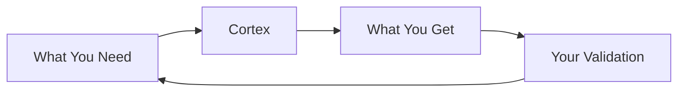

# Snowflake Cortex: AI Functions Without the Overhead



| Function | Input | Output | One Line Description |
|----------|-------|--------|---------------------|
| COMPLETE | Prompt text | Generated text | Ask it to write explain or draft |
| EXTRACT_ANSWER | Question plus context | Short answer | Pull facts from documents |
| SUMMARIZE | Long text | Short summary | Condense reports tickets or logs |
| SENTIMENT | Text | Positive neutral negative score | Gauge tone of feedback |
| TRANSLATE | Text and target language | Translated text | Localize content |
| EMBED_TEXT_... | Text | Vector embedding | Turn words into numbers for search |
| RECOGNIZE_IMAGE | Image URL | Labels and descriptions | Tag images automatically |
| DETECT_LANG | Text | Language code | Route content by language |

- Cortex is not a model you train. It is a model you call
- You do not manage infrastructure. You do not version weights. You do not monitor drift
- You write SQL. Cortex returns an answer. That is the contract
- If you need full control over the model, Cortex is not your tool. If you need an answer now, it might be



## What Cortex Actually Does

| Layer | What Happens | What You See |
|-------|-------------|--------------|
| Your SQL | You call SNOWFLAKE.CORTEX.SUMMARIZE text | A function call like any other |
| Snowflake routing | Request sent to managed inference service | No config no endpoint no auth to manage |
| Foundation model | Pre trained model processes input | You do not pick the model version |
| Result formatting | Output converted to SQL type | String number or object you can use |
| Billing | Per call or per token charged to account | Visible in METERING_HISTORY |

- Cortex runs outside your warehouse. It does not consume your compute credits
- It does consume Cortex credits which are billed separately
- The model is managed by Snowflake. You cannot fine tune it. You cannot export it
- If the model changes under the hood, your results may change. This is not a bug. It is the nature of managed services



## When Cortex Fits and When It Does Not

| Scenario | Cortex Fits | Cortex Does Not Fit |
|----------|-------------|---------------------|
| Summarize customer support tickets | Yes common task no custom training needed | No if you need to control exactly how summarization works |
| Generate embeddings for semantic search | Yes one call returns vector ready for VECTOR_COSINE_SIMILARITY | No if you need a specific embedding model not offered by Cortex |
| Translate product descriptions to five languages | Yes built in translate function handles this | No if you need custom terminology or brand voice enforcement |
| Classify support tickets by urgency | Yes sentiment or custom prompt via COMPLETE can help | No if you need deterministic rules or audit trail of classification logic |
| Train a churn model on your proprietary features | No Cortex does not train custom models | Yes use Snowpark for ML with scikit learn or XGBoost |
| Run inference on a model you trained last year | No Cortex cannot load your custom weights | Yes register your model in Model Registry and deploy as UDF |



## Cost and Performance Reality

| Factor | What Drives Cost | How to Control It |
|--------|-----------------|-------------------|
| Number of calls | Each function call is billed | Cache results for repeated inputs |
| Input length | Longer text costs more tokens | Truncate or chunk large documents |
| Output length | Longer generations cost more | Set max tokens if the function allows |
| Embedding dimension | Larger vectors cost more to store and query | Pick the smallest embedding that meets accuracy needs |
| Latency | Model inference takes time | Do not call Cortex in a tight user facing loop without caching |



| Metric | Where To Find | What To Watch For |
|--------|--------------|-------------------|
| Cortex call count | ACCOUNT_USAGE.CORTEX_FUNCTION_USAGE | Spike in calls without business justification |
| Average latency | QUERY_HISTORY filtering on Cortex functions | Latency creeping up as model or load changes |
| Error rate | QUERY_HISTORY where ERROR_MESSAGE is not null | Errors indicating input format or service issues |
| Cost per feature | Join usage data with business metrics | High cost features that do not drive value |

## Common Traps and How to Avoid Them

| Trap | What Happens | Better Path |
|------|--------------|-------------|
| Calling Cortex on every row without caching | Cost explodes for repeated inputs | Cache embeddings or summaries in a table for reuse |
| Using COMPLETE for tasks that have a dedicated function | Higher cost and less reliable output | Use SUMMARIZE for summarization not COMPLETE with a prompt |
| Assuming output is deterministic | Same input may yield slightly different output over time | Do not use Cortex for tasks that require exact reproducibility |
| Ignoring input length limits | Long inputs get truncated or fail | Chunk documents or summarize in stages |
| Treating Cortex as a black box oracle | Blind trust in output leads to errors | Validate critical outputs with rules or human review |
| Forgetting data governance | Sensitive data sent to Cortex may violate policy | Mask or anonymize data before calling Cortex if required |



## Practical Patterns That Work

### Pattern: Summarize then search

```sql
-- Step 1: Summarize long feedback
CREATE OR REPLACE TABLE support_summaries AS
SELECT
  ticket_id,
  SNOWFLAKE.CORTEX.SUMMARIZE(feedback_text) as summary
FROM support_tickets
WHERE LENGTH(feedback_text) > 500;

-- Step 2: Search summaries instead of raw text
SELECT ticket_id, summary
FROM support_summaries
WHERE summary ILIKE '%shipping delay%';
```

- Summarize once. Search many times. Avoid calling Cortex on every query

### Pattern: Embed once reuse many times

```sql
-- Generate embeddings for product catalog
CREATE OR REPLACE TABLE product_embeddings AS
SELECT
  product_id,
  SNOWFLAKE.CORTEX.EMBED_TEXT_1024('snowflake-arctic-embed', description) as embedding
FROM products;

-- Reuse embeddings for semantic search without regenerating
WITH query_vec AS (
  SELECT SNOWFLAKE.CORTEX.EMBED_TEXT_1024('snowflake-arctic-embed', 'comfortable office chair') as vec
)
SELECT p.product_id, p.name
FROM products p
CROSS JOIN query_vec q
ORDER BY VECTOR_COSINE_SIMILARITY(p.embedding, q.vec) DESC
LIMIT 10;
```

- Embeddings are expensive to generate. Store them. Reuse them. Do not regenerate on every search

### Pattern: Validate before trusting

```sql
-- Use Cortex for draft then apply rules
SELECT
  ticket_id,
  CASE
    WHEN SNOWFLAKE.CORTEX.SENTIMENT(feedback) = 'negative'
      AND feedback ILIKE '%refund%'
    THEN 'urgent_review'
    ELSE 'normal'
  END as priority
FROM support_tickets;
```

- Cortex gives you a signal. Your rules give you control. Combine them



## Decision Checklist



| Question | If No | If Yes |
|----------|-------|--------|
| Is the task in the Cortex function list | Build custom solution | Proceed to next question |
| Can I tolerate non deterministic output | Do not use Cortex for this task | Proceed to next question |
| Is the input data allowed to leave my control | Review governance or use on prem alternative | Proceed to next question |
| Have I cached repeated inputs | Add caching before scaling | Cortex is appropriate. Monitor cost and quality |

## First Principles to Remember

- Cortex is a tool not a strategy. It solves specific tasks. It does not replace thinking
- Every call costs money. Every token counts. Measure before you scale
- Output is probabilistic. Design your pipeline to handle variation
- Data governance does not stop at the warehouse edge. Sensitive data sent to Cortex may still be sensitive
- Caching is not optional. It is the difference between a prototype and a production system
- Validation is your responsibility. Cortex gives you an answer. You decide if it is right



## Bottom Line

- Cortex gives you AI without infrastructure. Use it for common tasks that do not require custom models
- It is not magic. It is a managed service with costs limits and trade offs
- Cache what you can. Validate what you must. Monitor what you spend
- Start small. Test with real data. Scale only when the value is clear
- If you need control train your own model. If you need speed call Cortex

Think of Cortex like a library:
- You ask a question. The librarian finds an answer from pre read books
- You do not write the books. You do not shelve them. You just ask
- Sometimes the answer is perfect. Sometimes it is close. You decide if it is good enough
- Asking many questions costs time. Asking the same question twice is wasteful. Remember the answer

Use the library wisely. Ask the right questions. Remember the answers that matter. Do not ask the same thing twice. Save your energy for the questions only you can answer.
