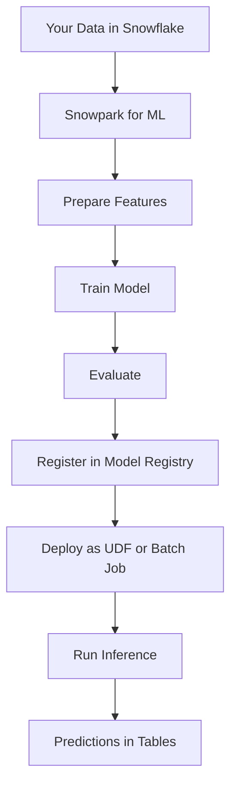
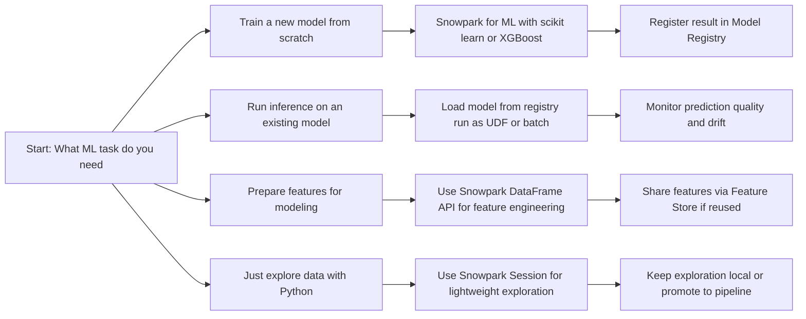
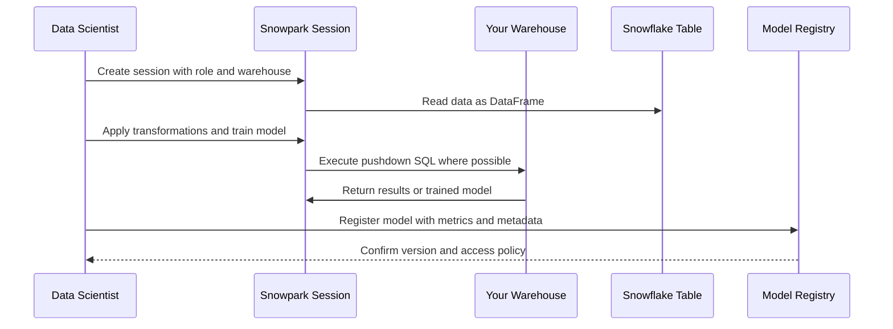
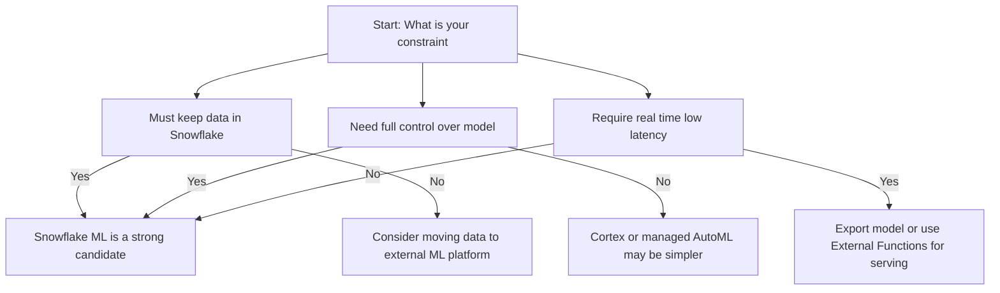
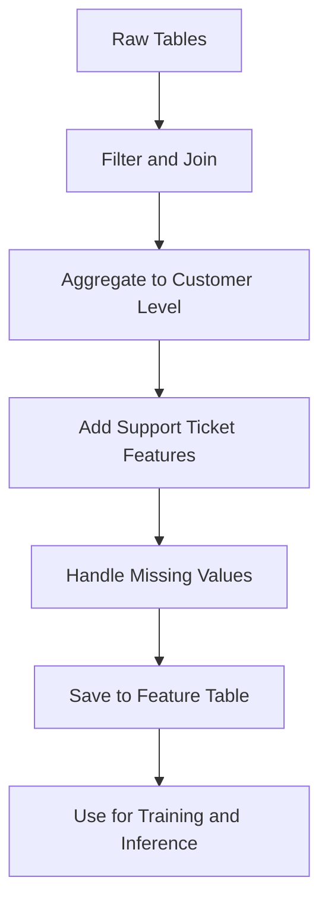
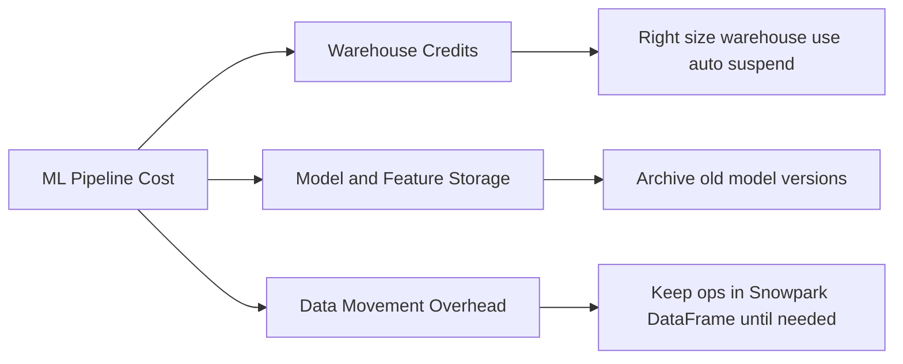
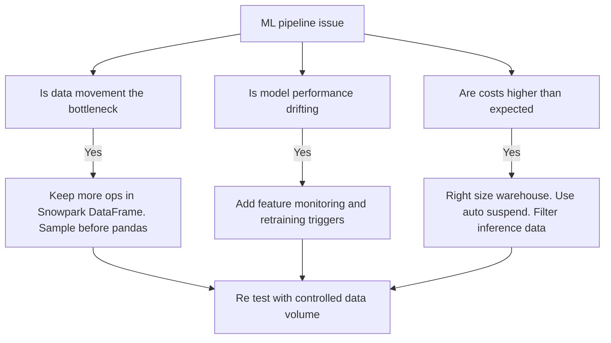
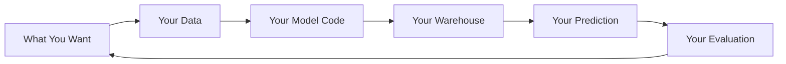
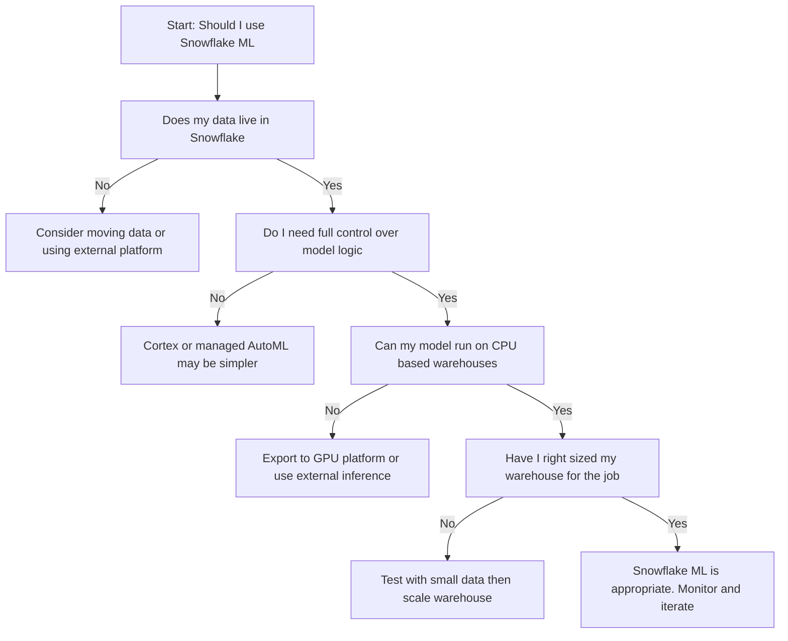

# Snowflake ML



| Capability | What It Actually Does | Why You Should Care |
|------------|----------------------|-------------------|
| DataFrame API | Chain transformations like filter join aggregate in Python or Scala | Write code that reads like a story not a spreadsheet |
| In database execution | Code runs where data lives no egress | Faster cheaper safer than moving data to a notebook |
| Package support | Use pandas numpy scikit learn xgboost lightgbm | No need to rewrite your entire ML stack |
| Local testing | Run code against small local data before deploying | Catch errors before they burn production credits |
| Pushdown optimization | Snowpark translates code to SQL where possible | Get SQL performance with Python flexibility |
| Model registry integration | Register trained models with version and metadata | Track what works and reproduce results later |



## What Snowflake ML Actually Is

| Layer | What Happens | What You Control |
|-------|-------------|------------------|
| Your code | Python Scala or Java using Snowpark API | Logic features model choice hyperparameters |
| Snowpark runtime | Translates DataFrame ops to SQL where possible | Package versions runtime configuration |
| Snowflake compute | Executes on your warehouse with your credits | Warehouse size auto suspend resource monitors |
| Data access | Reads and writes tables in your account | Roles grants row level security masking |
| Model registry | Stores model artifacts metadata and lineage | Version tags descriptions access policies |

- Snowflake ML is not a black box. It is your code running on your data with your permissions
- You pick the algorithm. You tune the parameters. You decide when to retrain
- Snowflake provides the runway. You fly the plane
- If you want a fully managed AutoML experience, Cortex may be closer. If you want control, this is your tool



## When Snowflake ML Fits and When It Does Not

| Scenario | Snowflake ML Fits | Snowflake ML Does Not Fit |
|----------|------------------|---------------------------|
| Train a churn model on customer behavior data | Yes data stays in Snowflake use scikit learn or XGBoost | No if you need GPU acceleration not available in your warehouse |
| Run batch predictions on new transactions daily | Yes deploy model as stored procedure scheduled with Task | No if you need sub second real time inference for user facing apps |
| Engineer features for multiple models | Yes use DataFrame API to build reusable feature logic | No if each model needs completely unique one off transformations |
| Experiment with new algorithms in a notebook | Yes use local testing mode then promote to Snowflake | No if you need to share interactive notebooks with non technical stakeholders |
| Serve predictions via a low latency API | No Snowflake is not a model serving endpoint | Yes use External Functions or export model to dedicated serving infrastructure |
| Train a deep learning model with custom layers | No Snowpark ML focuses on classical ML and light deep learning | Yes use Snowpark with external GPU clusters or specialized ML platforms |



## Practical Patterns That Work

### Pattern: Train register deploy in one flow

```python
from snowflake.snowpark import Session
from sklearn.ensemble import RandomForestClassifier
from sklearn.metrics import accuracy_score
import joblib

def train_and_register_churn_model(session: Session):
    # Load data
    df = session.table("analytics.customer_features").to_pandas()
    
    # Prepare
    X = df[["tenure_months", "monthly_charges", "support_tickets"]]
    y = df["churned"]
    
    # Train
    model = RandomForestClassifier(n_estimators=100, random_state=42)
    model.fit(X, y)
    
    # Evaluate
    preds = model.predict(X)
    acc = accuracy_score(y, preds)
    
    # Register with metadata
    session.ml.register_model(
        model=model,
        model_name="churn_predictor",
        version="v1.2",
        description=f"Random forest churn model. Accuracy: {acc:.3f}",
        input_schema="tenure_months FLOAT, monthly_charges FLOAT, support_tickets INT",
        output_schema="churn_score FLOAT"
    )
    
    return acc
```

- Train evaluate and register in one script. No manual uploads. No config files. Just code.

### Pattern: Batch inference at scale

```sql
-- Deploy model as stored procedure
CREATE OR REPLACE PROCEDURE predict_churn_batch()
RETURNS TABLE (customer_id NUMBER, churn_score FLOAT)
LANGUAGE PYTHON
RUNTIME_VERSION = '3.8'
PACKAGES = ('snowflake-snowpark-python', 'scikit-learn', 'pandas')
HANDLER = 'run'
AS $$
def run(session):
    # Load model from stage or registry
    # Load new customers
    # Run predictions
    # Write results to table
    return session.table("predictions.churn_scores")
$$;

-- Schedule with Task
CREATE OR REPLACE TASK daily_churn_prediction
  WAREHOUSE = ml_wh
  SCHEDULE = 'USING CRON 0 2 * * * UTC'
AS
  CALL predict_churn_batch();
```

- Batch inference is where Snowflake ML shines. Predict millions of rows without moving data.

### Pattern: Feature engineering that scales

```python
def build_customer_features(session: Session):
    # Start with raw tables
    orders = session.table("raw.orders")
    support = session.table("raw.support_tickets")
    
    # Engineer features with DataFrame API
    customer_features = (
        orders
        .filter(col("order_date") >= date_sub(current_date(), 90))
        .group_by("customer_id")
        .agg(
            sum("order_total").alias("spend_90d"),
            count("order_id").alias("order_count_90d"),
            avg("order_total").alias("avg_order_value")
        )
        .join(
            support.filter(col("created_date") >= date_sub(current_date(), 30))
            .group_by("customer_id")
            .agg(count("ticket_id").alias("support_tickets_30d")),
            on="customer_id",
            how="left"
        )
        .fill_null(0)  # Handle missing support tickets
    )
    
    # Write to feature table
    customer_features.write.mode("overwrite").save_as_table("features.customer_model_input")
    
    return customer_features
```

- Chain transformations like a story. Each step is testable. The whole pipeline is reproducible.



## Cost and Performance Reality

| Factor | What Drives Cost | How to Control It |
|--------|-----------------|-------------------|
| Warehouse size and runtime | Larger warehouses cost more per minute. Longer runs cost more total. | Right size for the job. Use auto suspend. Monitor with WAREHOUSE_METERING_HISTORY |
| Data movement to pandas | to_pandas pulls data to driver. Large pulls burn time and memory. | Use Snowpark DataFrame ops as long as possible. Only convert when needed for ML libraries |
| Package cold start | Loading large packages like sklearn adds startup time. | Pin minimal package versions. Pre load in session if running many jobs |
| Model registration storage | Storing many model versions consumes storage. | Archive old versions. Delete failed experiments. Keep only what you deploy |
| Batch inference scale | Predicting 1 million rows costs more than 1 thousand. | Filter to only rows that need prediction. Incremental inference not full table scans |



| Metric | Where To Find | What To Watch For |
|--------|--------------|-------------------|
| Training runtime | QUERY_HISTORY filtered on your warehouse and tags | Runtime creeping up as data grows |
| Memory usage | Query history with memory bytes fields | Out of memory errors indicating need for larger warehouse |
| Model registry size | ACCOUNT_USAGE.MODEL_REGISTRY views | Storage growing without corresponding deployments |
| Feature reuse rate | Custom tracking via feature table access logs | Features built but never used by models |
| Inference latency | QUERY_HISTORY on prediction procedures | Latency increasing as feature set or model complexity grows |

## Common Traps and How to Avoid Them

| Trap | What Happens | Better Path |
|------|--------------|-------------|
| Converting to pandas too early | Pulling millions of rows to driver causes memory errors | Keep data in Snowpark DataFrame. Use to_pandas only for final model training on sampled data |
| Training on full history every time | Runtime grows linearly with data. Costs explode. | Use incremental training or sample recent data for model updates |
| Registering every experiment | Model registry becomes a graveyard of unused versions | Register only models that pass evaluation thresholds. Tag experiments separately |
| Ignoring feature drift | Model performance drops silently as input distribution shifts | Monitor feature statistics. Retrain when drift exceeds thresholds |
| Hardcoding warehouse in code | Cannot change compute without redeploying | Use session configuration or environment variables for warehouse selection |
| No evaluation in pipeline | Model deployed without knowing if it works | Always compute and log metrics before registration. Block deployment if below threshold |



## First Principles to Remember

- Data is heavy. Code is light. Move code to data not data to code
- A model is a hypothesis. Test it before you trust it. Measure before you scale
- Features are assumptions. Document them. Version them. Reuse them wisely
- Training is exploration. Deployment is commitment. Keep them separate in your pipeline
- Cost is a feature. If you cannot afford to run it in production do not build it in production
- Reproducibility is not optional. If you cannot rerun it you did not finish it



## Decision Checklist



| Question | If No | If Yes |
|----------|-------|--------|
| Does my data live in Snowflake | Consider moving data or using external platform | Proceed to next question |
| Do I need full control over model logic | Cortex or managed AutoML may be simpler | Proceed to next question |
| Can my model run on CPU based warehouses | Export to GPU platform or use external inference | Proceed to next question |
| Have I right sized my warehouse for the job | Test with small data then scale warehouse | Snowflake ML is appropriate. Monitor and iterate |

## Best Practices Summary

- Start small. Train on a sample. Validate the pipeline. Then scale to full data
- Keep feature logic in Snowpark DataFrame. Convert to pandas only when the ML library requires it
- Register models with metrics and metadata. Future you will not remember why v1.3 beat v1.2
- Tag your queries with project and experiment identifiers. Cost attribution starts with visibility
- Use transient tables for intermediate feature sets. Avoid paying for Time Travel on temporary data
- Monitor feature distributions. Retrain when drift exceeds thresholds not on a calendar
- Separate training and inference warehouses. Prevent experimentation from blocking production predictions
- Document the expected input schema and data range. Catch bad data before it breaks your model

## Bottom Line

- Snowflake ML lets you train and deploy models where your data lives
- It is not AutoML. It is your code your choices your responsibility
- You gain speed by avoiding data movement. You pay with warehouse credits
- Start with a sample. Validate the logic. Scale the compute. Measure the value
- If you need a model today with no code Cortex may help. If you need a model your way Snowflake ML is your workshop

Think of Snowflake ML like a carpentry studio:
- Your data is the wood. It is heavy. It stays on the workbench
- Your code is the tool. You pick the chisel the saw the plane
- Your warehouse is the power. More power cuts faster but costs more
- Your model is the chair. You design it. You build it. You decide if it holds weight
- Your registry is the blueprint shelf. Keep the ones that work. Discard the ones that wobble

Use the studio wisely. Measure twice. Cut once. Build what matters. Discard what does not. Save your strength for the work only you can do.
