# App Development in Snowflake

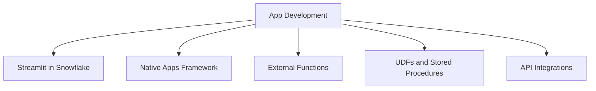

| Feature | What It Does | Best For | Not Ideal For |
|---------|-------------|----------|---------------|
| Streamlit in Snowflake | Build interactive Python apps with no frontend code | Internal dashboards prototypes data explorers | High traffic public apps custom UI requirements |
| Native Apps Framework | Package and distribute apps with code data and logic | ISVs multi tenant apps governed internal tools | One off scripts with no distribution need |
| External Functions | Call external APIs from SQL with secure integration | Enrich data with third party services trigger external workflows | Low latency real time user facing calls |
| UDFs and Stored Procedures | Reuse custom logic in SQL with Python Java JavaScript | Encapsulate complex logic for reuse across teams | Simple expressions that fit in one SQL line |
| API Integrations | Define secure connections to external services | Centralized auth and config for multiple external calls | Ad hoc one time API tests |

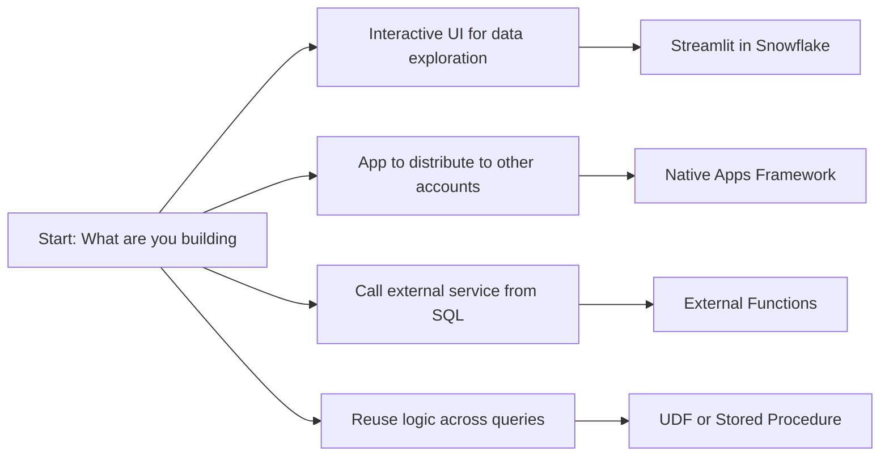

## Streamlit in Snowflake

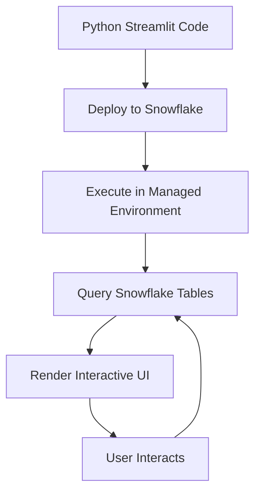

| Feature | What It Means | Why It Matters |
|---------|--------------|----------------|
| No separate hosting | App runs inside Snowflake | No DevOps no servers no connection strings |
| Direct data access | Query tables with Snowpark or SQL | No egress no latency from external DB calls |
| Version control | Store app code in Git or Snowflake stage | Track changes collaborate roll back safely |
| Sharing | Grant access to other users or roles | Share insights without sharing raw data |
| Scheduling | Use Tasks to refresh data behind app | Keep dashboards fresh without manual runs |

```python
# Example: Simple sales dashboard in Streamlit
import streamlit as st
import snowflake.snowpark as snowpark

def main(session: snowpark.Session):
    st.title("Monthly Sales Overview")
    
    # Load data
    df = session.table("analytics.monthly_sales").to_pandas()
    
    # Visualize
    st.line_chart(df.set_index("month")["revenue"])
    
    # Filter
    region = st.selectbox("Filter by region", df["region"].unique())
    filtered = df[df["region"] == region]
    
    # Show details
    st.dataframe(filtered)
    
    # Export
    st.download_button("Download CSV", filtered.to_csv(), "sales.csv")
```

| Use Case | Why Streamlit Works |
|----------|-------------------|
| Internal dashboard for analysts | Fast to build no frontend team needed |
| Prototype for stakeholder review | Share a working app in hours not weeks |
| Data quality monitoring tool | Query tables show metrics alert on thresholds |
| Ad hoc analysis explorer | Let users filter and drill without writing SQL |

| Practice | Why It Works |
|----------|-------------|
| Keep app logic separate from data logic | Easier to test and reuse the data layer |
| Use parameters for filters not hardcoded values | Users can explore without editing code |
| Cache expensive queries with st.cache_data | Avoid rerunning the same query on every interaction |
| Set clear role permissions before sharing | Prevent users from seeing data they should not |
| Monitor app usage with QUERY_HISTORY | See which apps are used and which are forgotten |

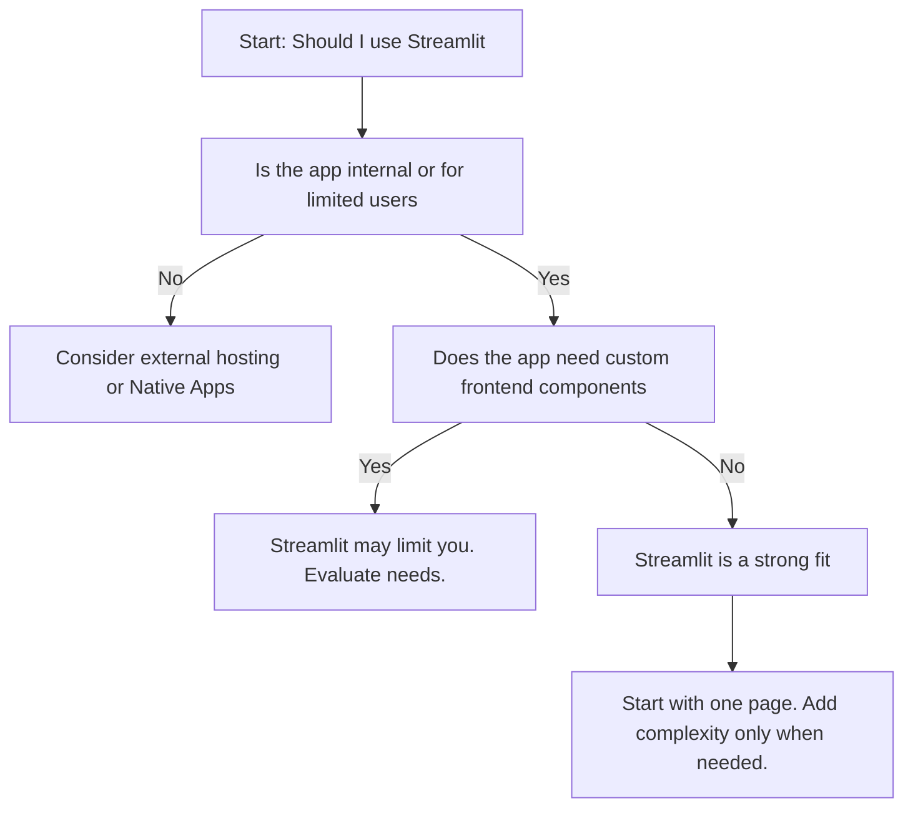

## Native Apps Framework

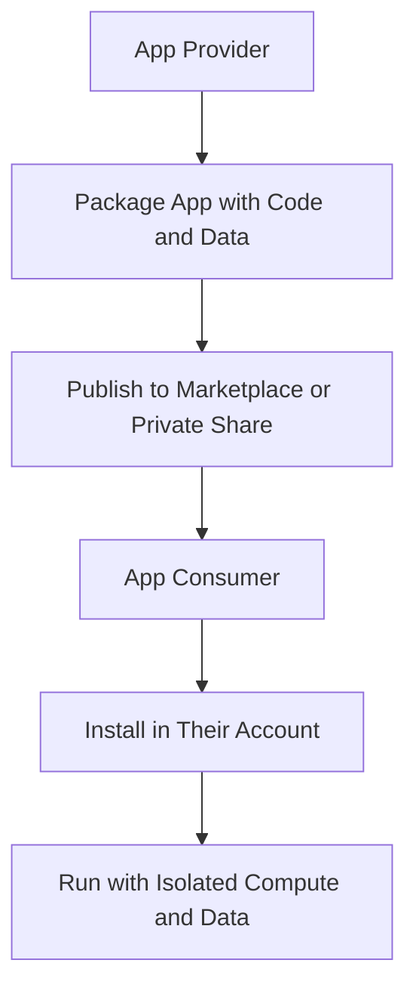

| Component | Role |
|-----------|------|
| Application Package | Contains code schemas stages and setup logic |
| Application Instance | Consumer side deployment with isolated data |
| Provider Account | Where app is developed and maintained |
| Consumer Account | Where app is installed and used |
| Secure Data Sharing | Share reference data without copying |

| Use Case | Why Native Apps Works |
|----------|----------------------|
| ISV selling analytics app | Package once distribute to many customers with usage tracking |
| Internal platform team | Share standardized tools across business units with controlled access |
| Compliance sensitive app | Keep consumer data isolated while sharing logic and reference data |
| Multi tenant SaaS on Snowflake | One code base many isolated instances with per tenant billing |

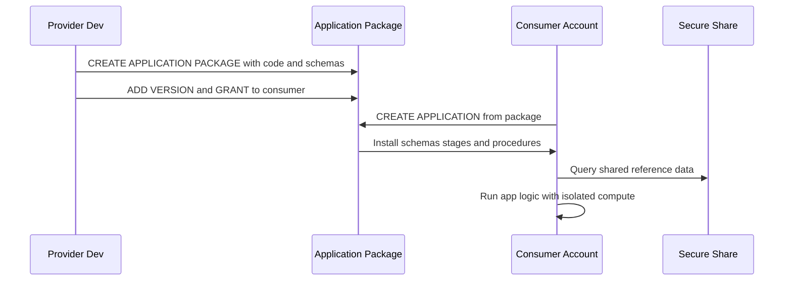

| Practice | Why It Matters |
|----------|---------------|
| Separate reference data from consumer data | Keeps consumer data private while sharing common logic |
| Use versioning for app updates | Consumers can upgrade on their schedule not yours |
| Document setup and permissions clearly | Reduces support tickets and failed installs |
| Test install in a clean account before publishing | Catch missing grants or dependencies early |
| Monitor usage with ACCOUNT_USAGE views | Understand which consumers use which features |

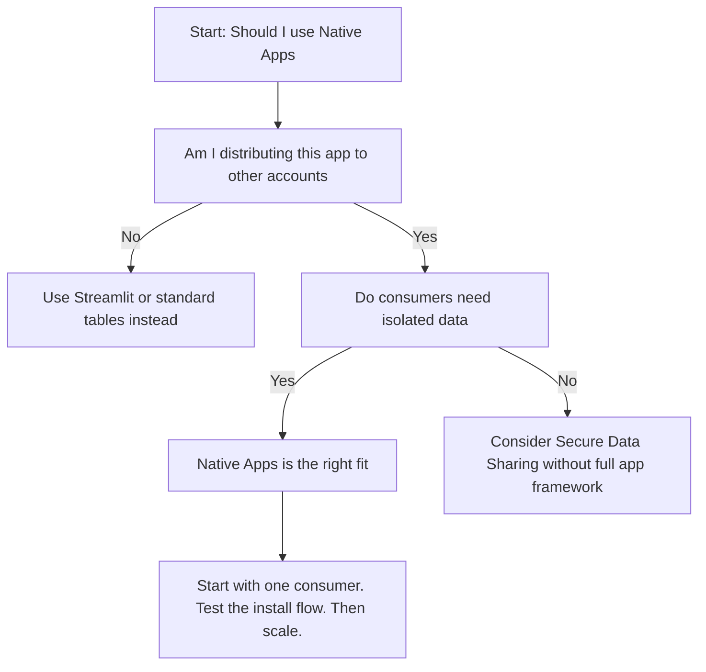

## External Functions

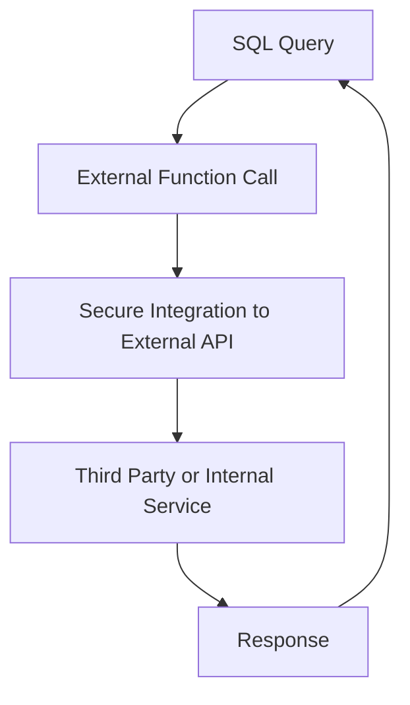

| Component | Role |
|-----------|------|
| API Integration | Defines connection details and auth to external service |
| External Function | SQL wrapper that calls the integration |
| Remote Service | The actual API endpoint that processes the request |
| Proxy (optional) | Adds security or transformation layer between Snowflake and service |

| Use Case | Why External Function Works |
|----------|----------------------------|
| Enrich customer data with third party API | Call service from SQL without moving data out |
| Validate addresses or emails in real time | Get immediate feedback during data entry |
| Score transactions with external fraud model | Use specialized service without rebuilding in Snowflake |
| Trigger external workflow from Snowflake | Start a job in another system when data arrives |

```sql
-- Example: External function to validate email
CREATE OR REPLACE EXTERNAL FUNCTION validate_email (email STRING)
RETURNS BOOLEAN
API_INTEGRATION = my_email_api
HEADERS = ('x-api-key' = '***')
CONTEXT_HEADERS = (current_timestamp)
MAX_BATCH_ROWS = 100
COMPRESSION = AUTO
AS 'https://api.emailvalidate.com/check';

-- Use in query
SELECT
  user_id,
  email,
  validate_email(email) as is_valid
FROM new_signups;
```

| Practice | Why It Matters |
|----------|---------------|
| Set MAX_BATCH_ROWS to match service limits | Avoid overwhelming the external API |
| Use COMPRESSION for large payloads | Reduce network time and cost |
| Cache results in a table for repeated lookups | Avoid calling external service for the same input repeatedly |
| Monitor latency and error rates with QUERY_HISTORY | Catch service degradation before users complain |
| Fallback logic for service downtime | Return default value or queue for retry instead of failing query |

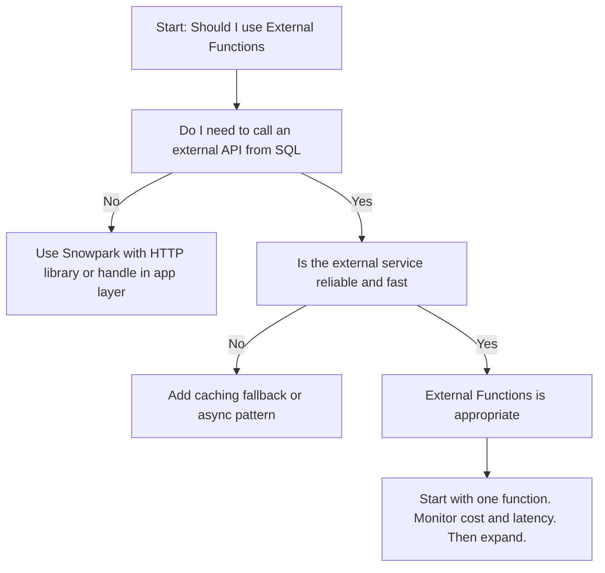

## UDFs and Stored Procedures for App Logic

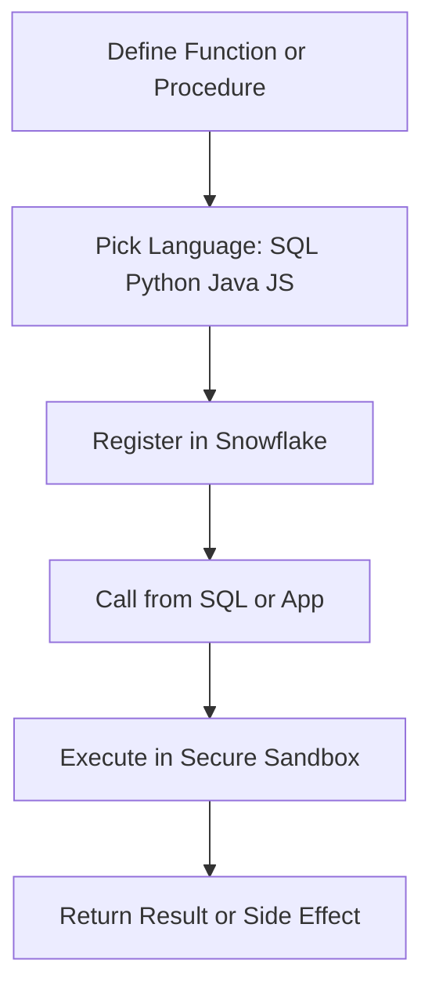

| Type | Returns | Side Effects | Best For |
|------|---------|--------------|----------|
| Scalar UDF | Single value | None | Simple transformations like formatting or calculation |
| Table UDF | Table result | None | Return multiple rows from custom logic |
| Stored Procedure | Status or result set | Can modify data | ETL steps admin tasks multi step workflows |

| Language | When to Use | Consideration |
|----------|-------------|---------------|
| SQL | Simple logic that fits in one expression | Fast to write but limited for complex control flow |
| Python | Data science ML or pandas style logic | Rich libraries but watch package size and cold start |
| Java | Enterprise integrations or existing Java code | Strong typing but more verbose than Python |
| JavaScript | Frontend style logic or JSON manipulation | Good for semi structured data but less ML support |

```sql
-- Example: Python scalar UDF for data masking
CREATE OR REPLACE FUNCTION mask_email (email STRING)
RETURNS STRING
LANGUAGE PYTHON
RUNTIME_VERSION = '3.8'
HANDLER = 'mask'
AS $$
def mask(email):
    if email is None:
        return None
    parts = email.split('@')
    return parts[0][0] + '***@' + parts[1]
$$;
```

| Practice | Why It Matters |
|----------|---------------|
| Register UDFs in a shared schema | Teams can discover and reuse without copying |
| Use immutable functions for deterministic logic | Snowflake can optimize and cache results |
| Limit external package dependencies | Larger packages increase cold start time and cost |
| Document input output and examples | Reduces misuse and support questions |
| Test with edge cases before deploying | Catch null handling or type mismatches early |

## API Integrations for Reuse

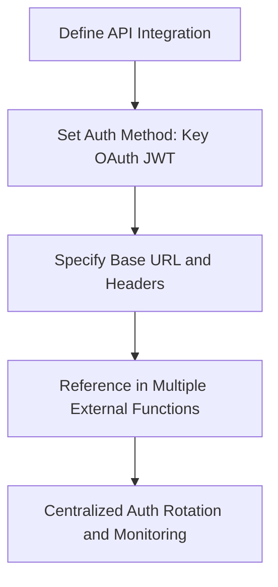

| Auth Method | Best For | Consideration |
|-------------|----------|---------------|
| API Key | Simple services with static keys | Rotate keys regularly. Store securely. |
| OAuth 2.0 | Enterprise services with token refresh | Handle token expiry. Use refresh logic. |
| JWT | Services that accept signed tokens | Manage private keys. Set appropriate expiry. |
| AWS SIGV4 | AWS services with IAM auth | Configure IAM role with least privilege. |

| Practice | Why It Matters |
|----------|---------------|
| Centralize API config in one integration | Change credentials once update all functions |
| Use context headers for audit | Log timestamp user role with each call |
| Set reasonable timeouts | Prevent hung queries from blocking resources |
| Monitor usage per integration | Identify unused or overused external services |
| Document rate limits and quotas | Avoid hitting external service limits unexpectedly |

## Cost and Performance Considerations

| Feature | Cost Driver | How to Control |
|---------|------------|----------------|
| Streamlit | Compute for app execution and data queries | Limit data scanned. Use caching. Set session timeouts |
| Native Apps | Compute in consumer account plus provider maintenance | Right size warehouses. Monitor usage per consumer |
| External Functions | Network egress plus external service cost | Cache responses. Use batch calls. Monitor error rates |
| UDFs and Procedures | Compute per invocation | Register as immutable if deterministic. Batch where possible |
| API Integrations | Shared across functions so minimal direct cost | Reuse integrations. Avoid duplicate configs |

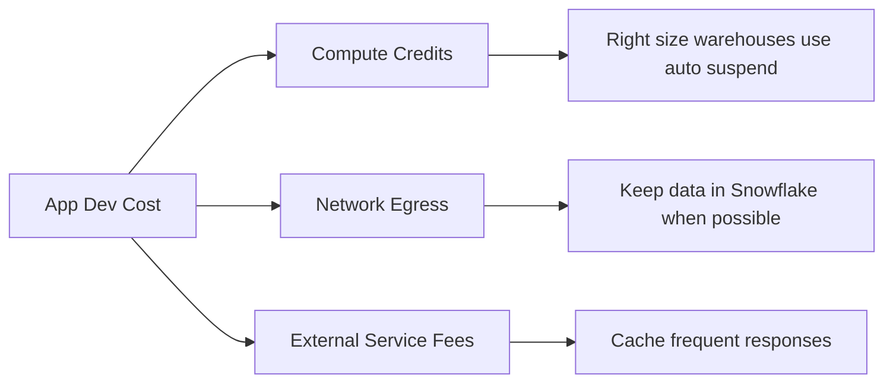

| Metric | Where To Find | What To Watch For |
|--------|--------------|-------------------|
| Streamlit app runtime | QUERY_HISTORY filtered on Streamlit queries | Long runtimes indicating unoptimized data access |
| External function error rate | QUERY_HISTORY where ERROR_MESSAGE is not null | Errors indicating service downtime or auth issues |
| UDF invocation count | ACCOUNT_USAGE.FUNCTION_USAGE views | Spike in calls indicating potential loop or misuse |
| Native Apps install count | ACCOUNT_USAGE.APPLICATION_USAGE views | Low adoption indicating poor fit or discoverability |

## Common Pitfalls and Fixes

| Mistake | What Happens | Better Approach |
|---------|--------------|-----------------|
| Building Streamlit apps with no access control | Users see data they should not | Set role permissions before sharing the app |
| Calling external functions without caching | Cost explodes for repeated inputs | Cache results in a table for reuse |
| Registering UDFs with large package dependencies | Cold start delays and higher memory use | Minimize packages. Use Snowflake provided libraries when possible |
| Using Native Apps for one off internal tools | Overhead outweighs benefit | Use Streamlit or standard tables for internal only |
| Ignoring rate limits on external APIs | Queries fail when limits exceeded | Add retry logic with exponential backoff |
| Hardcoding credentials in app code | Security risk and rotation pain | Use API integrations or secrets management |

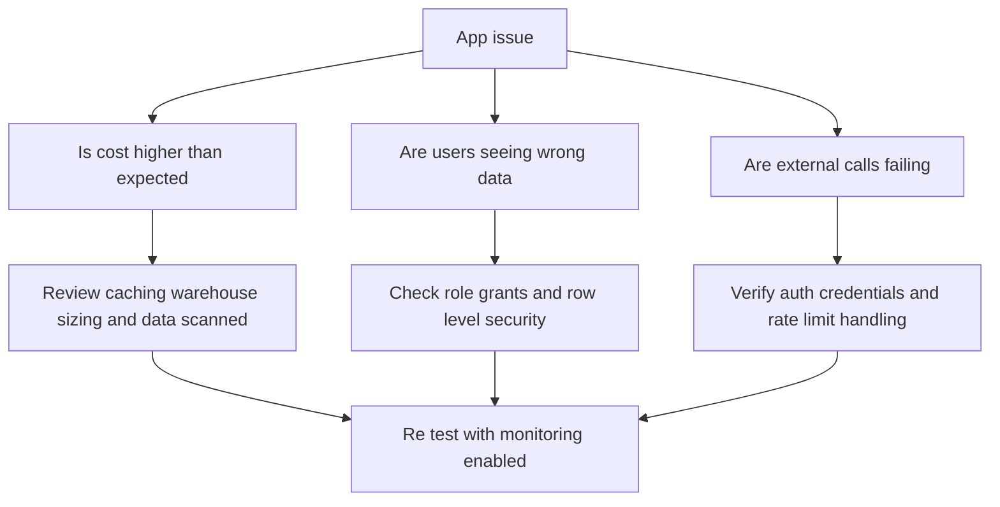

## Decision Framework

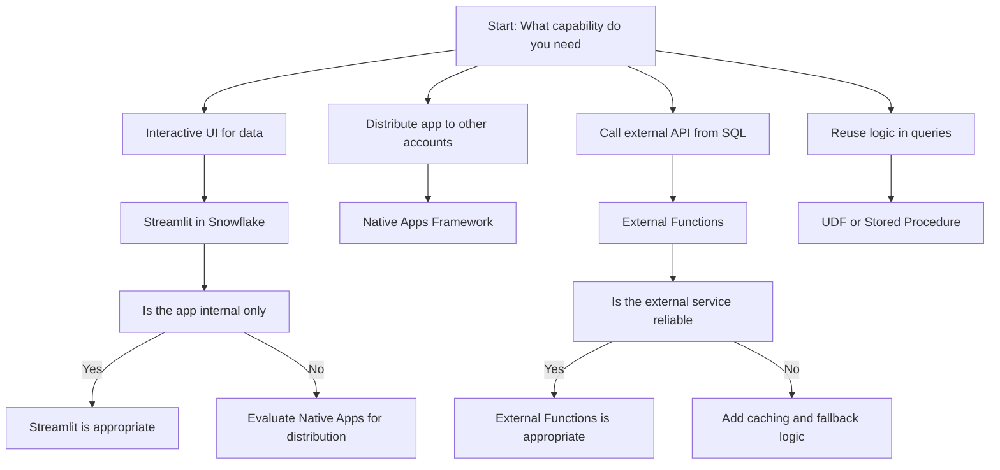

## Best Practices Summary

- Start with the simplest tool that meets your need. Add complexity only when required
- Keep data in Snowflake. Bring code to data not data to code
- Cache results that do not change often. Avoid recomputing the same answer
- Tag app workloads for cost attribution. Track spend by project or team
- Test with small data before scaling. Catch errors before they burn credits
- Document inputs outputs and examples for UDFs and procedures
- Monitor latency and error rates for external integrations
- Review usage quarterly. Remove unused apps functions or integrations
- Security first. Set permissions before sharing apps or functions
- Measure before you scale. One week of usage data beats guessing

## Bottom Line

- Streamlit turns Python scripts into interactive apps with no frontend work
- Native Apps let you package and distribute secure multi tenant apps
- External Functions let you call APIs from SQL with secure integration
- UDFs and procedures let you reuse custom logic in SQL
- Every app feature has a cost. Measure before you scale
- Start simple. Add complexity only when your use case requires it
- Keep data in Snowflake. Bring compute to data. Avoid egress

Think of app development like building a house:
- Streamlit is your prefab kit. Fast to assemble good for temporary or internal use
- Native Apps is your custom build. Designed for distribution with proper permits
- External Functions is your utility connection. Brings in services you do not generate yourself
- UDFs are your reusable fixtures. Install once use in many rooms
- API integrations are your main valve. Central control for all external connections

Pick the approach that matches your blueprint. Do not build a mansion for a weekend stay. Do not use a tent for a permanent home. Match the effort to the need. Save time without sacrificing quality.
