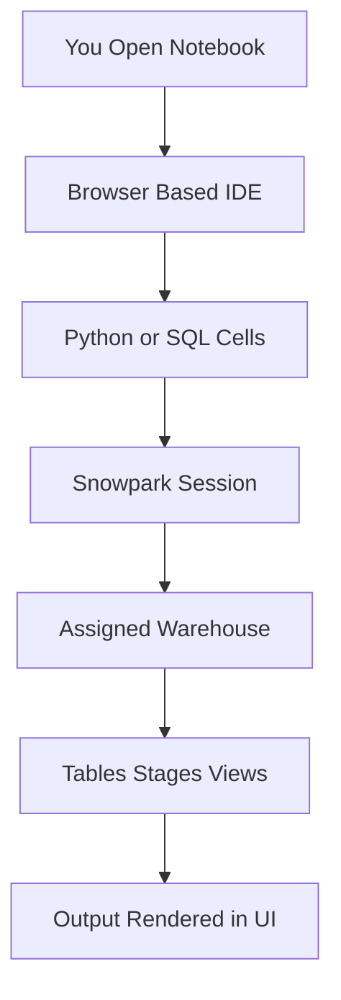
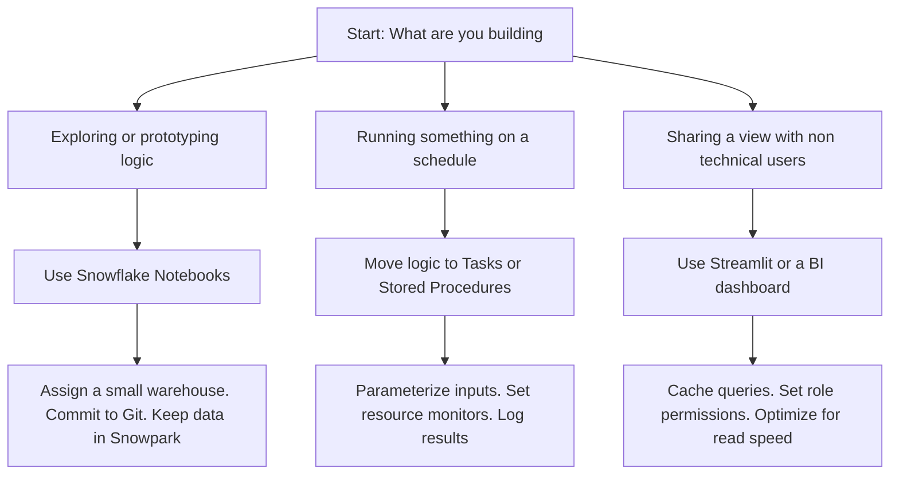

# Snowflake Notebooks

| Aspect | What It Actually Is | What It Is Not |
|--------|-------------------|----------------|
| Execution environment | Managed Python and SQL runtime inside Snowflake | A local Jupyter server or external IDE |
| Data movement | Zero. Code runs where the data lives | A tool that exports data to your laptop |
| Compute | Runs on the warehouse you assign | Free compute. Credits bill per second of warehouse use |
| Persistence | Cells save to Snowflake stage. Code syncs to Git | A production scheduler or long running service |
| Collaboration | Share notebooks. Track changes in Git | A dashboard builder for non technical users |

| Setup Step | What To Do | Why It Matters |
|------------|-----------|----------------|
| Assign a warehouse | Pick a small or medium cluster for dev | Controls cost. Do not point notebooks at prod ETL warehouses |
| Set Python version | Stick to 3.8 or 3.10 across your team | Prevents package conflicts and runtime errors |
| Install packages | Add only what you need pandas numpy scikit learn | Large imports increase cold start time and memory use |
| Connect to Git | Link GitHub GitLab or Bitbucket repo | Tracks changes. Enables rollbacks. Stops lost work |
| Define session defaults | Set database schema and role upfront | Avoids permission errors and querying the wrong context |

| Scenario | Use Notebooks | Skip Notebooks |
|----------|--------------|----------------|
| Exploring a new dataset | Yes. Fast setup. Iterative querying. | No. If you just need a quick count or preview use Snowsight. |
| Prototyping a transform | Yes. Mix Python and SQL cells. Test logic. | No. If it will run daily move it to Tasks or stored procedures. |
| Training a small ML model | Yes. Snowpark keeps data local. Low setup. | No. If training needs hours or GPU use an external platform. |
| Building a user facing dashboard | No. Notebooks are for builders not viewers. | No. Use Streamlit or a BI tool for end users. |
| Sharing analysis with a team | Yes. Version control makes it reproducible. | No. If the output needs a polished static report export or schedule it. |

| Cost Factor | What Drives It | How To Control It |
|-------------|----------------|-------------------|
| Warehouse runtime | Notebook keeps the warehouse active while open | Set auto suspend to 60 seconds. Do not leave tabs open overnight. |
| Package load time | Heavy libraries take time to initialize | Pin minimal dependencies. Import only inside cells that need them. |
| Data pull to driver | to_pandas moves rows out of Snowflake memory | Keep operations in Snowpark DataFrames. Convert only when required. |
| Session idle time | Inactive notebooks still hold warehouse connections | Close unused tabs. Run explicit disconnect commands in cleanup cells. |
| Compute contention | Sharing a warehouse with heavy background jobs | Use a dedicated notebook warehouse. Isolate dev traffic from prod. |

- Do not treat a notebook like a scheduler. It runs when you run it. Production logic belongs in Tasks or stored procedures.
- Do not pull millions of rows into memory. Snowpark will warn you. Respect the warning. Keep the work in the warehouse.
- Do not hardcode paths or credentials. Use connection profiles environment variables and Snowflake stages.
- Do not ignore warehouse costs. The UI is free. The compute behind it bills by the second. Size it for the work not the habit.
- Do not skip Git commits. Browser crashes happen. Lost cells are a waste of time. Sync early and often.
- Do not mix dev and prod contexts. Assign a dev database and schema. Test with samples. Promote only after validation.

- Notebooks are a workspace. They are where you figure out the logic. Once the logic works move it to scheduled objects.
- Data is heavy. Code is light. Keep the data in Snowflake. Let the code come to it.
- Exploration is iterative. Production is repeatable. Do not confuse the two.
- Cost follows compute. You control the warehouse. Size it for the task not the default.
- Measure before you scale. One week of runtime and credit data beats guessing.
- Start small. Prove the pattern. Then automate.
