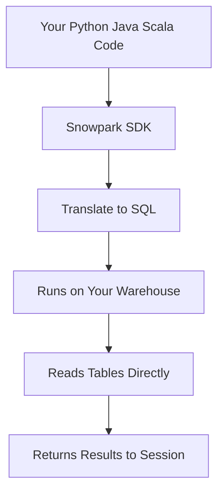
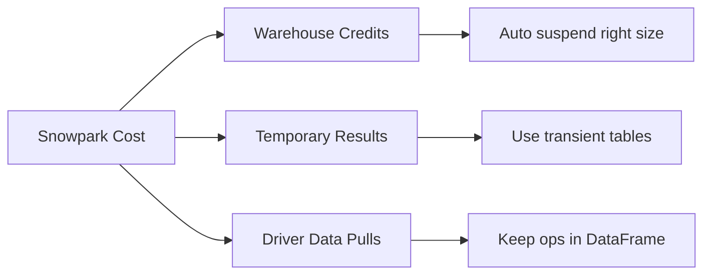
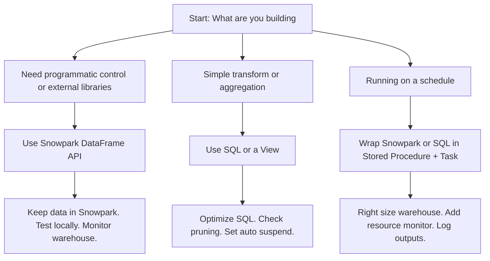

# Snowpark Framework Overview



| Aspect | What It Is | What It Is Not |
|--------|------------|----------------|
| Execution location | Inside Snowflake on your assigned warehouse | A separate cloud cluster or local server |
| Data movement | Zero. Code touches tables where they live | A data export tool or external engine |
| API style | DataFrame with filter join aggregate | A replacement for SQL or a BI layer |
| Primary use | Pipelines transforms ML prep custom logic | A dashboard builder or production scheduler |

```mermaid
sequenceDiagram
  participant Dev as Your Code
  participant SDK as Snowpark Client
  participant Opt as Query Optimizer
  participant WH as Warehouse
  participant Store as Micro Partitions
  
  Dev->>SDK: df = session.table("raw.sales")
  Dev->>SDK: filtered = df.filter(col("amount") > 100)
  SDK->>Opt: Translate DataFrame to SQL
  Opt->>WH: Execute optimized query
  WH->>Store: Prune partitions read columns
  Store-->>WH: Return matching rows
  WH-->>SDK: Send results back
  SDK-->>Dev: Return DataFrame or pandas
```

| Scenario | Use Snowpark | Skip Snowpark |
|----------|-------------|---------------|
| Complex multi step transform | Yes. Chain steps. Test iteratively. | No if a single SQL view does it. |
| ML feature engineering | Yes. Use pandas sklearn after sampling. | No if you only need basic aggregations. |
| Production scheduled job | Yes via Stored Procedure + Task. | No if you can write pure SQL in a Task. |
| Ad hoc data preview | No. Snowsight is faster. | Yes if you need programmatic filtering. |
| Heavy data pull to local machine | No. `to_pandas` breaks at scale. | Yes if dataset fits in driver memory. |

- Session is the gateway. Connects to warehouse role database schema.
- DataFrame is lazy. Nothing runs until you call `collect()` `show()` or `to_pandas()`.
- Pushdown is automatic. Snowpark turns filter join group by into SQL. Complex logic runs in Python on the warehouse.
- UDFs and Procedures let you call Python from SQL. Reuse logic across pipelines.
- Local testing mode lets you run against a small local dataset before hitting the warehouse.
- Execution stays inside Snowflake. Network egress drops to zero.

| Cost Driver | What Happens | How To Control |
|-------------|--------------|----------------|
| Warehouse size and runtime | Bigger runs faster but costs more per minute. Idle time still bills. | Use auto suspend. Right size for the job. Stop when done. |
| Data to pandas | Pulls rows to driver memory. Fails or slows on large sets. | Keep work in Snowpark DataFrames. Sample before converting. |
| Package cold start | Heavy libraries add startup delay. | Import only when needed. Pin minimal versions. |
| Full table scans | Lazy evaluation hides expensive operations until collect. | Use `explain()` to check the plan. Filter early. |



| Trap | What Happens | Better Path |
|------|--------------|-------------|
| Calling `to_pandas()` on millions of rows | Out of memory errors or long delays. | Filter aggregate or sample first. Keep processing in Snowpark. |
| Treating notebooks as production | Code runs only when you click run. Breaks silently. | Move working logic to stored procedures. Schedule with Tasks. |
| Ignoring lazy evaluation | Assuming code runs line by line. | Remember execution waits until you request results. Check query plans. |
| Hardcoding credentials or paths | Security risk and fragile code. | Use connection profiles environment variables and Snowflake stages. |
| Using Snowpark for simple SQL | Extra overhead no performance gain. | Write the logic in SQL first. Use Snowpark only when SQL gets messy. |



- Start with SQL. Move to Snowpark only when logic needs loops conditions or external libraries.
- Filter early. Pushdown works best when you reduce rows before complex steps.
- Sample before `to_pandas()`. Test logic on a small slice. Scale up only after validation.
- Version control your code. Scripts belong in Git. Browser cache is not a backup.
- Isolate compute. Use a dedicated warehouse for dev and exploration. Do not share with prod pipelines.
- Check the query plan. `df.explain()` shows what Snowflake will actually run. Fix scans before they burn credits.
- Clean up after yourself. Drop temporary tables. Close unused sessions. Let auto suspend do the rest.
- Measure before you scale. One week of runtime and credit data beats guessing.

- Snowpark brings code to data. It does not move data to code.
- Lazy evaluation means you control when work happens. Use it to optimize.
- Warehouse credits are the cost. Size and suspend settings matter more than framework choice.
- Simple SQL beats complex Python for straightforward transforms. Do not over engineer.
- Production requires scheduling and error handling. Notebooks are for drafting not deploying.
- Keep data gravity in mind. Heavy data stays put. Light code travels. Match the tool to that rule.
