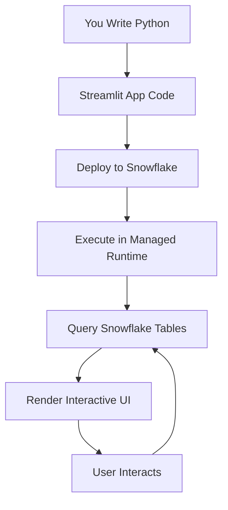
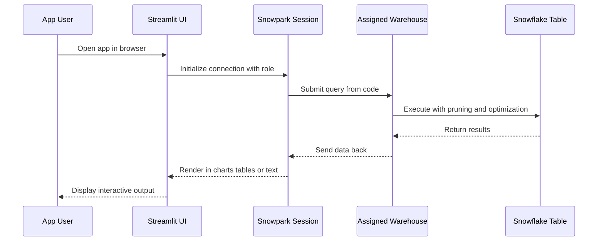
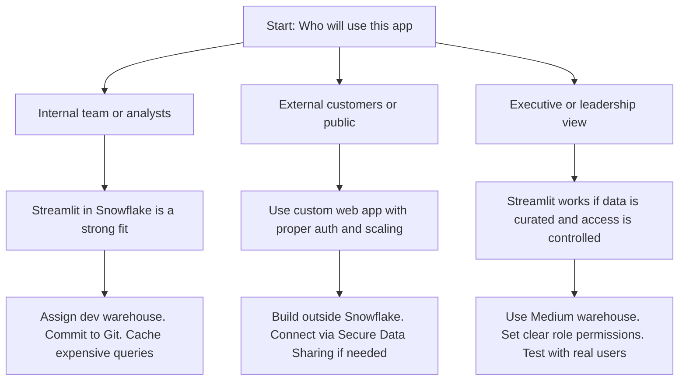
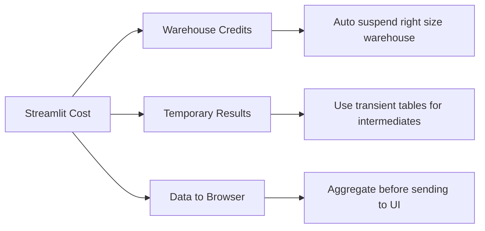
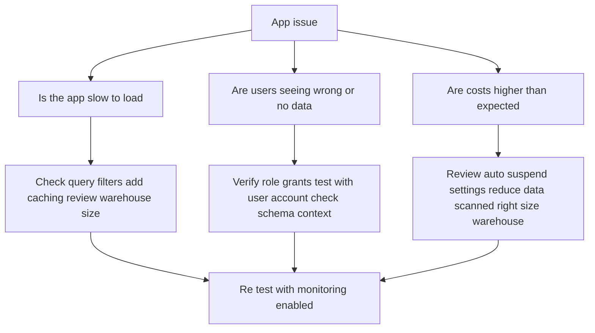

# Streamlit in Snowflake



| Aspect | What It Is | What It Is Not |
|--------|-----------|----------------|
| Hosting | Runs inside Snowflake no separate server | A self hosted Jupyter or external web app |
| Data access | Direct query to Snowflake tables with Snowpark or SQL | A tool that exports data to your laptop |
| Frontend | Python code renders UI components automatically | A custom React or Angular application |
| Authentication | Inherits Snowflake role and permissions | A separate login system you manage |
| Scaling | Runs on your assigned warehouse | Auto scaling independent of Snowflake compute |



| Setup Step | What To Do | Why It Matters |
|------------|-----------|----------------|
| Assign a warehouse | Pick a small or medium cluster for dev | Controls cost. Do not point apps at prod ETL warehouses |
| Set Python version | Use 3.8 or 3.10 consistently across team | Prevents package conflicts and runtime errors |
| Install packages | Add only what you need pandas plotly altair | Large imports increase cold start time and memory use |
| Connect to Git | Link GitHub GitLab or Bitbucket repo | Tracks changes enables rollbacks stops lost work |
| Define session defaults | Set database schema and role in code | Avoids permission errors and querying wrong context |

| Scenario | Use Streamlit | Skip Streamlit |
|----------|--------------|----------------|
| Internal dashboard for analysts | Yes. Fast to build. No frontend team needed. | No. If you need pixel perfect branding use a BI tool. |
| Prototype for stakeholder review | Yes. Share a working app in hours not weeks. | No. If the output is a static PDF export directly. |
| Data quality monitoring tool | Yes. Query tables show metrics alert on thresholds. | No. If alerts need SMS or email use Tasks with notifications. |
| Public facing customer portal | No. Streamlit is for internal or limited access. | No. Use a custom web app with proper auth and scaling. |
| Ad hoc analysis explorer | Yes. Let users filter and drill without writing SQL. | No. If users need saved reports use a BI dashboard. |

| Cost Factor | What Drives It | How To Control It |
|-------------|----------------|-------------------|
| Warehouse runtime | App keeps warehouse active while users interact | Set auto suspend to 60 seconds for dev 300 for prod |
| Data scanned per query | Unfiltered queries read more micro partitions | Add filters early. Use clustering keys on large tables. |
| Package load time | Heavy libraries like matplotlib add startup delay | Import only inside functions that need them. Pin minimal versions. |
| Concurrent user sessions | Each active user may trigger separate queries | Cache expensive results with st.cache_data. Use multi cluster warehouse if needed. |
| Session idle time | Open tabs hold warehouse connections even when idle | Add explicit disconnect logic. Train users to close unused apps. |



- Do not treat Streamlit like a production scheduler. It runs when users interact. Production logic belongs in Tasks or stored procedures.
- Do not pull millions of rows into the browser. st.dataframe works for hundreds of rows not millions. Aggregate before displaying.
- Do not hardcode credentials or connection strings. Use the Snowpark session provided by the Streamlit integration.
- Do not ignore warehouse costs. The UI is free. The compute behind it bills by the second. Size it for the work not the habit.
- Do not skip Git commits. Browser crashes happen. Lost code is a waste of time. Sync early and often.
- Do not mix dev and prod data contexts. Assign a dev database and schema. Test with samples. Promote only after validation.

| Pattern | Code Approach | Why It Works |
|---------|--------------|--------------|
| Cache expensive queries | Use @st.cache_data decorator on data loading functions | Avoids rerunning the same query on every user interaction |
| Parameterize filters | Use st.selectbox or st.text_input to capture user input | Lets users explore without editing code or SQL |
| Separate data and UI logic | Put data loading in one function UI rendering in another | Easier to test reuse and maintain the code |
| Handle errors gracefully | Wrap queries in try except blocks with st.error messages | Prevents app crashes and guides users when data is missing |
| Log usage for monitoring | Add st.session_state or custom logging to track interactions | Helps identify which apps are used and which can be retired |

```python
# Example: Simple sales explorer with caching and parameters
import streamlit as st
import snowflake.snowpark as snowpark

@st.cache_data
def load_sales_data(region_filter):
    session = snowflake.session.get_active_session()
    df = session.table("analytics.monthly_sales")
    if region_filter != "All":
        df = df.filter(snowpark.col("region") == region_filter)
    return df.to_pandas()

def main():
    st.title("Sales Explorer")
    
    region = st.selectbox("Filter by region", ["All", "North", "South", "East", "West"])
    df = load_sales_data(region)
    
    st.line_chart(df.set_index("month")["revenue"])
    st.dataframe(df)
    
    if st.button("Download CSV"):
        st.download_button("Click to download", df.to_csv(), "sales.csv")
```

| Metric | Where To Find | What To Watch For |
|--------|--------------|-------------------|
| App runtime per session | QUERY_HISTORY filtered on Streamlit queries | Long runtimes indicating unoptimized data access or missing filters |
| Warehouse credit usage | WAREHOUSE_METERING_HISTORY joined with query tags | Spike in spend without corresponding user growth |
| Cache hit rate | Custom logging in @st.cache_data functions | Low hit rate meaning caching is not reducing query load |
| Error rate | QUERY_HISTORY where ERROR_MESSAGE contains Streamlit | Errors indicating permission issues missing tables or bad SQL |
| Concurrent sessions | ACCOUNT_USAGE.SESSIONS views with Streamlit user agent | High concurrency that may need multi cluster warehouse scaling |



| Trap | What Happens | Better Path |
|------|--------------|-------------|
| Querying full tables in every interaction | Warehouse scans millions of rows per click | Add filters early. Use clustering. Cache aggregated results. |
| No error handling in data loading | App shows blank page or stack trace to users | Wrap queries in try except. Show friendly st.error messages. |
| Hardcoding database schema names | App breaks when promoted to prod | Use session parameters or environment variables for context. |
| Ignoring role permissions | Users see data they should not access | Set the app role explicitly. Test with least privilege accounts. |
| Building complex UIs without testing | App becomes slow or unresponsive on real data | Start with one chart. Add features incrementally. Test with production data volumes. |



| Question | If No | If Yes |
|----------|-------|--------|
| Is the app for internal or limited users | Consider external hosting or custom web app | Proceed to next question |
| Does the app need custom frontend components | Streamlit may limit you. Evaluate if components exist. | Proceed to next question |
| Can the app run on a small or medium warehouse | Right size up only if performance requires it | Proceed to next question |
| Have you added caching for repeated queries | Add @st.cache_data before scaling users | Streamlit is appropriate. Monitor and iterate |

- Start with one page. Add complexity only when users ask for it.
- Keep data logic separate from UI logic. Makes testing and reuse easier.
- Cache what does not change often. Avoid recomputing the same answer.
- Tag app queries with project and owner. Cost attribution starts with visibility.
- Test with real data volumes. Small samples hide performance issues that appear at scale.
- Document the expected user flow. Future you and teammates need context for decisions.
- Review usage quarterly. Remove apps that nobody uses. Archive ones that are replaced.
- Security first. Set role permissions before sharing. Test with least privilege accounts.

- Streamlit turns Python scripts into interactive apps with no frontend work
- It runs inside Snowflake. Data stays in Snowflake. Compute bills on your warehouse
- It is for builders not viewers. Analysts and engineers use it. End users usually do not
- Caching is not optional. It is the difference between a prototype and a usable tool
- Cost follows compute. You control the warehouse. Size it for the task not the default
- Measure before you scale. One week of runtime and credit data beats guessing
- Start small. Prove the pattern. Then add users features and complexity

Think of Streamlit like a workshop bench:
- Your code is the tool. Python builds the UI. Snowpark fetches the data
- Your warehouse is the power. More power runs faster but costs more per minute
- Your data is the material. It stays on the bench. You do not carry it home
- Your users are the visitors. They see the finished piece not the sawdust
- Your Git repo is the blueprint. Track changes so you can rebuild or fix

Use the bench wisely. Measure twice. Cut once. Build what matters. Discard what does not. Save your strength for the work only you can do.
