# AI ML and Application Development Features in Snowflake

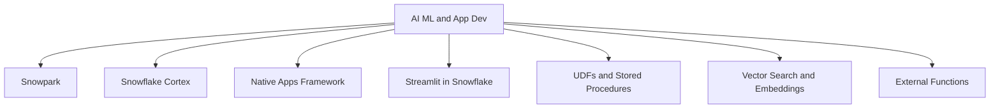

| Feature | What It Does | Best For | Not Ideal For |
|---------|-------------|----------|---------------|
| Snowpark | Run Python Java Scala code directly in Snowflake | Data transforms ML pipelines custom logic | Simple SQL queries that do not need code |
| Snowflake Cortex | Pre built AI functions for text images and predictions | Summarization sentiment analysis embeddings | Custom model training from scratch |
| Native Apps Framework | Package and distribute apps with code data and logic | ISVs building multi tenant apps on Snowflake | One off internal tools with no distribution need |
| Streamlit in Snowflake | Build interactive data apps with Python no frontend needed | Dashboards prototypes internal tools | High traffic public facing apps with custom UI |
| UDFs and Stored Procedures | Reuse custom logic in SQL with Python Java Java Script | Encapsulate complex logic for reuse | Simple expressions that fit in one SQL line |
| Vector Search | Store and query embeddings for semantic search | RAG apps recommendation systems similarity matching | Exact match lookups or structured filters |
| External Functions | Call external APIs from SQL with secure integration | Enrich data with third party services | Low latency real time requirements |

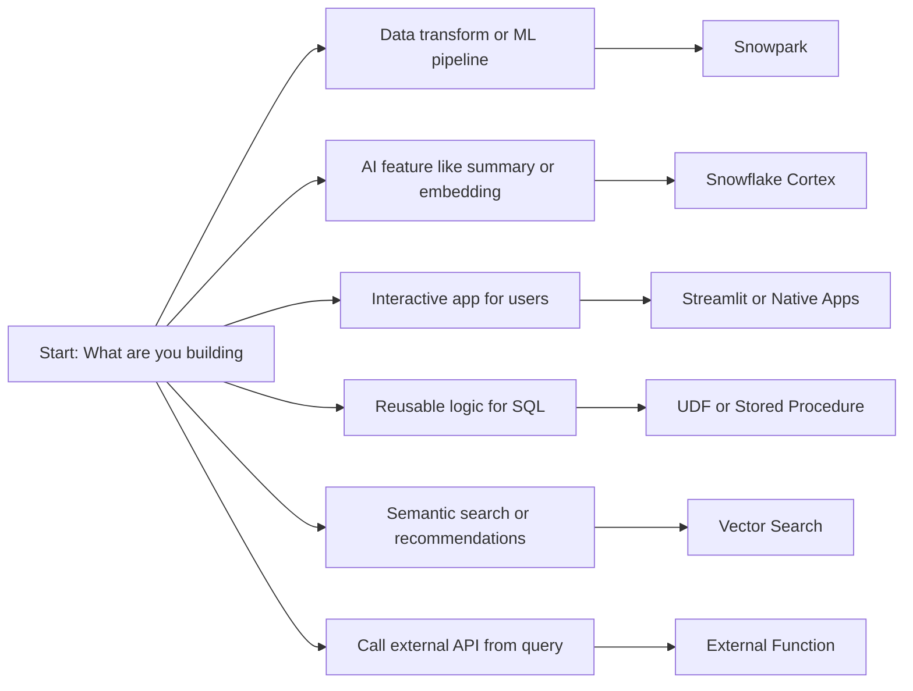

## Snowpark

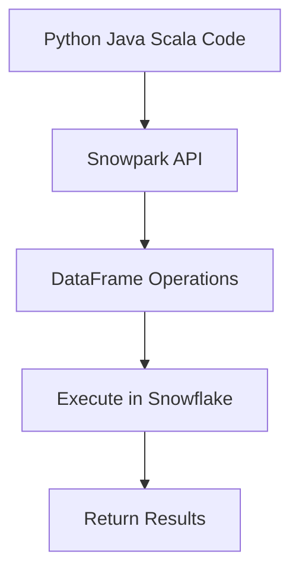

| Capability | What It Enables | Why It Matters |
|------------|----------------|----------------|
| DataFrame API | Chain transformations like filter join aggregate | Write code that reads like SQL but with programmatic control |
| UDF and SP support | Register Python Java functions to call from SQL | Reuse custom logic across queries and teams |
| Local testing | Run code against local data before deploying | Catch errors early without burning credits |
| Package management | Use common libraries like pandas numpy scikit learn | No need to rewrite everything from scratch |
| Pushdown optimization | Snowpark translates code to SQL where possible | Get performance of SQL with flexibility of code |

| Use Case | Snowpark Pattern |
|----------|-----------------|
| Clean and transform raw data | Read table apply filters and joins write to target |
| Train a simple ML model | Load data with Snowpark use scikit learn register model as UDF |
| Build a custom aggregation | Write Python function register as UDF call in SQL |
| Orchestrate a multi step pipeline | Chain DataFrame operations with error handling and logging |

```sql
-- Example: Snowpark Python UDF
CREATE OR REPLACE FUNCTION predict_churn (
  customer_id NUMBER,
  tenure_months NUMBER,
  monthly_charges NUMBER
)
RETURNS FLOAT
LANGUAGE PYTHON
RUNTIME_VERSION = '3.8'
PACKAGES = ('scikit-learn', 'pandas')
HANDLER = 'predict'
AS $$
def predict(customer_id, tenure_months, monthly_charges):
    # Load model from stage or use inline logic
    # Return prediction score
    return 0.85
$$;
```

| Practice | Why It Works |
|----------|-------------|
| Keep logic in Snowpark not in app code | Data stays in Snowflake. No egress. Faster and cheaper |
| Use DataFrame API over raw SQL for complex logic | Easier to test debug and version control |
| Register UDFs for reuse not one off scripts | Teams can call the same logic without copying code |
| Test locally with small data before deploying | Catch errors before they burn production credits |
| Monitor function execution with QUERY_HISTORY | Track cost and performance of custom logic |

## Snowflake Cortex

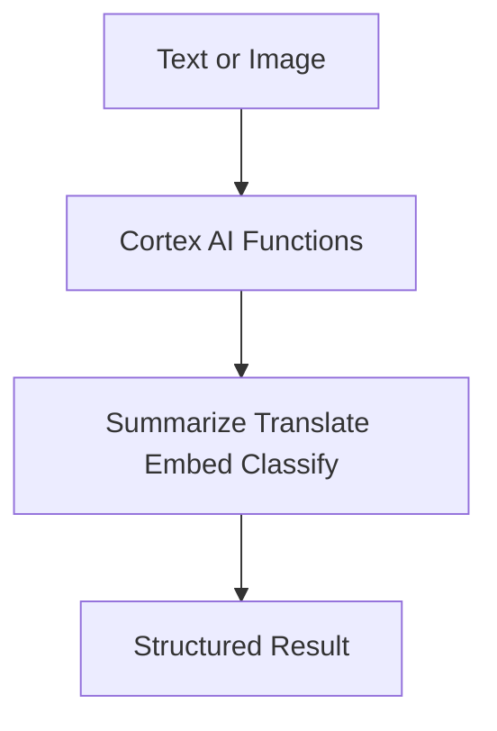

| Function | Input | Output | Use Case |
|----------|-------|--------|----------|
| COMPLETE | Prompt text | Generated text | Draft emails write SQL explain concepts |
| EXTRACT_ANSWER | Question and context | Short answer | Q and A over documents |
| SUMMARIZE | Long text | Short summary | Condense reports or tickets |
| SENTIMENT | Text | Positive neutral negative score | Analyze customer feedback |
| TRANSLATE | Text and target language | Translated text | Localize content |
| EMBED_TEXT_... | Text | Vector embedding | Semantic search RAG apps |
| RECOGNIZE_IMAGE | Image URL | Labels and descriptions | Tag images for search |
| DETECT_LANG | Text | Language code | Route content to correct pipeline |

```sql
-- Example: Use Cortex to summarize customer feedback
SELECT
  feedback_id,
  SNOWFLAKE.CORTEX.SUMMARIZE(feedback_text) as summary
FROM support_tickets
WHERE created_date > DATEADD(day, -7, CURRENT_DATE);
```

| When to use Cortex | When to build your own |
|-------------------|----------------------|
| You need a common AI task like summary or sentiment | You need a custom model trained on proprietary data |
| You want to avoid managing model infrastructure | You need full control over model version and tuning |
| You are prototyping or building internal tools | You are building a production ML product with strict SLAs |
| You want to get started in minutes not weeks | You have existing MLOps pipelines to integrate with |

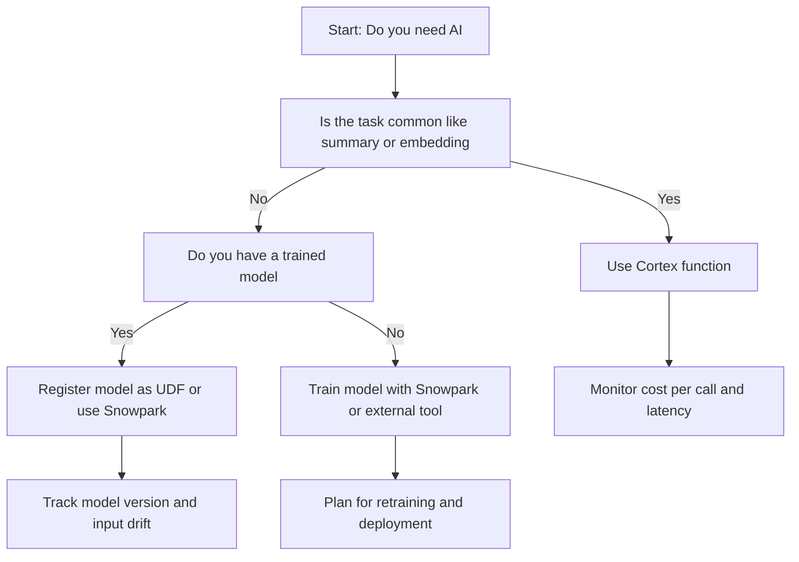

## Native Apps Framework

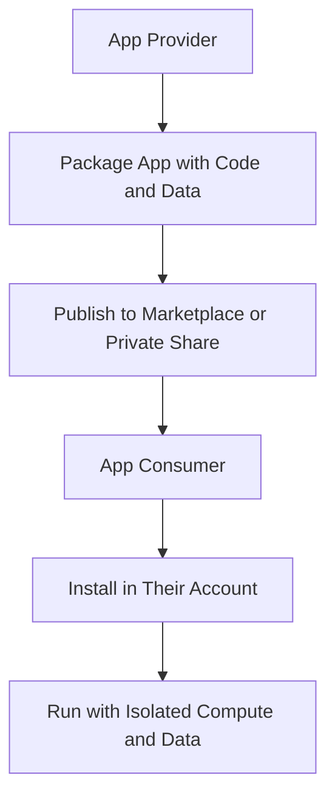

| Component | Role |
|-----------|------|
| Application Package | Contains code schemas stages and setup logic |
| Application Instance | Consumer side deployment with isolated data |
| Provider Account | Where app is developed and maintained |
| Consumer Account | Where app is installed and used |
| Secure Data Sharing | Share reference data without copying |

| Use Case | Why Native Apps Works |
|----------|----------------------|
| ISV selling analytics app | Package once distribute to many customers with usage tracking |
| Internal platform team | Share standardized tools across business units with controlled access |
| Compliance sensitive app | Keep consumer data isolated while sharing logic and reference data |
| Multi tenant SaaS on Snowflake | One code base many isolated instances with per tenant billing |

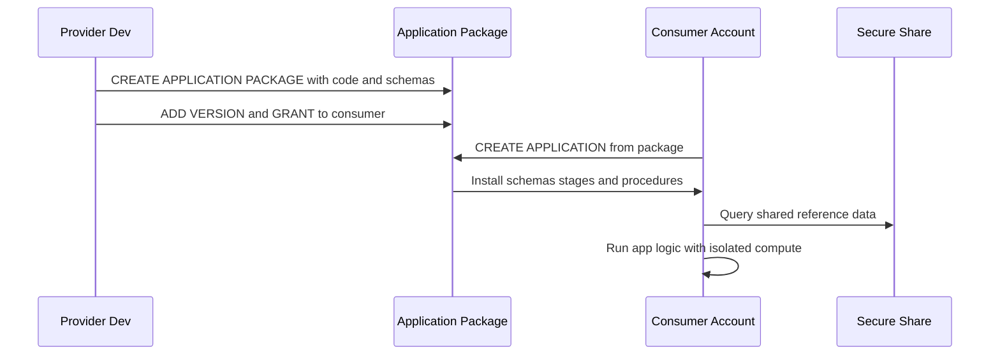

| Practice | Why It Matters |
|----------|---------------|
| Separate reference data from consumer data | Keeps consumer data private while sharing common logic |
| Use versioning for app updates | Consumers can upgrade on their schedule not yours |
| Document setup and permissions clearly | Reduces support tickets and failed installs |
| Test install in a clean account before publishing | Catch missing grants or dependencies early |
| Monitor usage with ACCOUNT_USAGE views | Understand which consumers use which features |

## Streamlit in Snowflake

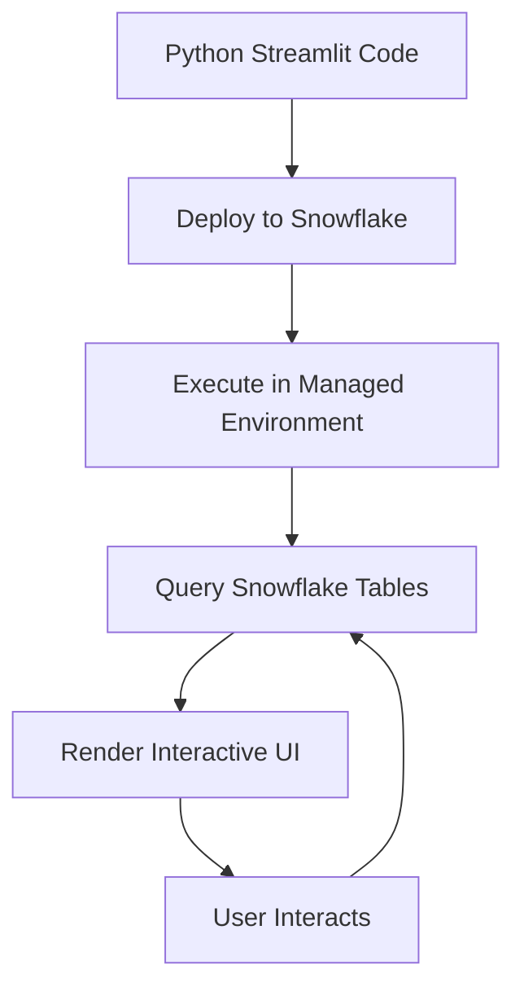

| Feature | What It Does | Limitation |
|---------|-------------|------------|
| No separate hosting | App runs inside Snowflake | No custom domain or advanced frontend config |
| Direct data access | Query tables without connection strings | App inherits permissions of deploying role |
| Version control | Store app code in Git or Snowflake stage | Large apps may hit stage size limits |
| Sharing | Grant access to other users or roles | App runs with deployer permissions by default |
| Scheduling | Use Tasks to refresh data behind app | App UI does not auto refresh without user action |

| Use Case | Why Streamlit Works |
|----------|-------------------|
| Internal dashboard for analysts | Fast to build no frontend team needed |
| Prototype for stakeholder review | Share a working app in hours not weeks |
| Data quality monitoring tool | Query tables show metrics alert on thresholds |
| Ad hoc analysis explorer | Let users filter and drill without writing SQL |

```python
# Example: Simple Streamlit app in Snowflake
import streamlit as st
import snowflake.snowpark as snowpark

def main(session: snowpark.Session):
    st.title("Sales Overview")
    df = session.table("analytics.monthly_sales").to_pandas()
    st.line_chart(df.set_index("month")["revenue"])
    region = st.selectbox("Filter by region", df["region"].unique())
    st.dataframe(df[df["region"] == region])

# Deploy with:
# snow app run --streamlit
```

| Practice | Why It Works |
|----------|-------------|
| Keep app logic separate from data logic | Easier to test and reuse the data layer |
| Use parameters for filters not hardcoded values | Users can explore without editing code |
| Cache expensive queries with st.cache_data | Avoid rerunning the same query on every interaction |
| Set clear role permissions before sharing | Prevent users from seeing data they should not |
| Monitor app usage with QUERY_HISTORY | See which apps are used and which are forgotten |

## UDFs and Stored Procedures

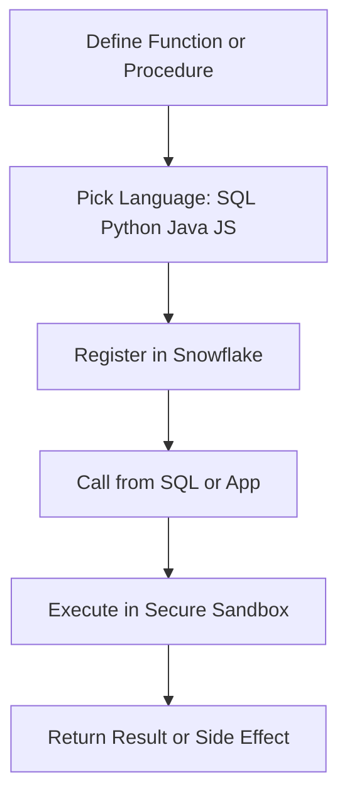

| Type | Returns | Side Effects | Best For |
|------|---------|--------------|----------|
| Scalar UDF | Single value | None | Simple transformations like formatting or calculation |
| Table UDF | Table result | None | Return multiple rows from custom logic |
| Stored Procedure | Status or result set | Can modify data | ETL steps admin tasks multi step workflows |

| Language | When to Use | Consideration |
|----------|-------------|---------------|
| SQL | Simple logic that fits in one expression | Fast to write but limited for complex control flow |
| Python | Data science ML or pandas style logic | Rich libraries but watch package size and cold start |
| Java | Enterprise integrations or existing Java code | Strong typing but more verbose than Python |
| JavaScript | Frontend style logic or JSON manipulation | Good for semi structured data but less ML support |

```sql
-- Example: Python scalar UDF for data masking
CREATE OR REPLACE FUNCTION mask_email (email STRING)
RETURNS STRING
LANGUAGE PYTHON
RUNTIME_VERSION = '3.8'
HANDLER = 'mask'
AS $$
def mask(email):
    if email is None:
        return None
    parts = email.split('@')
    return parts[0][0] + '***@' + parts[1]
$$;
```

| Practice | Why It Matters |
|----------|---------------|
| Register UDFs in a shared schema | Teams can discover and reuse without copying |
| Use immutable functions for deterministic logic | Snowflake can optimize and cache results |
| Limit external package dependencies | Larger packages increase cold start time and cost |
| Document input output and examples | Reduces misuse and support questions |
| Test with edge cases before deploying | Catch null handling or type mismatches early |

## Vector Search and Embeddings

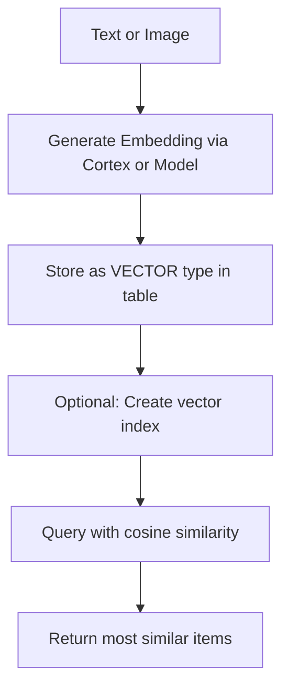

| Feature | What It Does | Why It Matters |
|---------|-------------|----------------|
| VECTOR data type | Store fixed length numeric arrays | Native support for embeddings without BLOB hacks |
| Cosine distance function | Compute similarity between vectors | Enables semantic search not just keyword match |
| Cortex embedding functions | Generate embeddings with one SQL call | No need to manage external embedding service |
| Vector index (preview) | Speed up nearest neighbor search | Reduce latency for large embedding tables |
| Combine with SQL filters | Filter by metadata then rank by similarity | Get relevant results that also meet business rules |

```sql
-- Example: Semantic search with vector similarity
WITH query_embedding AS (
  SELECT SNOWFLAKE.CORTEX.EMBED_TEXT_1024('snowflake-arctic-embed', 'fast running shoes') AS vec
)
SELECT
  product_id,
  product_name,
  1 - VECTOR_COSINE_SIMILARITY(q.vec, p.embedding) AS similarity
FROM products p
CROSS JOIN query_embedding q
WHERE category = 'footwear'
ORDER BY similarity DESC
LIMIT 10;
```

| Use Case | Vector Search Pattern |
|----------|----------------------|
| Product recommendations | Embed product descriptions find similar items |
| Document Q and A | Embed questions match to relevant passages |
| Fraud detection | Embed transaction patterns find anomalies |
| Content deduplication | Embed text find near duplicates for cleanup |

| Practice | Why It Works |
|----------|-------------|
| Normalize embeddings before storing | Ensures cosine similarity works as expected |
| Filter by metadata before vector search | Reduces the candidate set and improves relevance |
| Cache frequent query embeddings | Avoid regenerating the same embedding repeatedly |
| Monitor embedding drift over time | Retrain or update if source data distribution shifts |
| Start with Cortex embeddings before custom models | Faster to prototype switch later if needed |

## External Functions

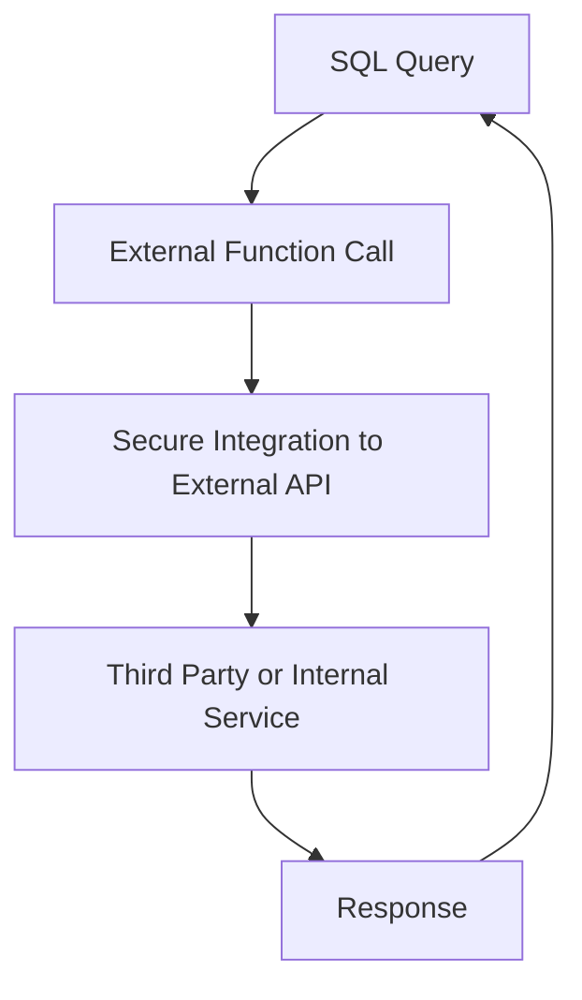

| Component | Role |
|-----------|------|
| API Integration | Defines connection details and auth to external service |
| External Function | SQL wrapper that calls the integration |
| Remote Service | The actual API endpoint that processes the request |
| Proxy (optional) | Adds security or transformation layer between Snowflake and service |

| Use Case | Why External Function Works |
|----------|----------------------------|
| Enrich customer data with third party API | Call service from SQL without moving data out |
| Validate addresses or emails in real time | Get immediate feedback during data entry |
| Score transactions with external fraud model | Use specialized service without rebuilding in Snowflake |
| Trigger external workflow from Snowflake | Start a job in another system when data arrives |

```sql
-- Example: External function to validate email
CREATE OR REPLACE EXTERNAL FUNCTION validate_email (email STRING)
RETURNS BOOLEAN
API_INTEGRATION = my_email_api
HEADERS = ('x-api-key' = '***')
CONTEXT_HEADERS = (current_timestamp)
MAX_BATCH_ROWS = 100
COMPRESSION = AUTO
AS 'https://api.emailvalidate.com/check';

-- Use in query
SELECT
  user_id,
  email,
  validate_email(email) as is_valid
FROM new_signups;
```

| Practice | Why It Matters |
|----------|---------------|
| Set MAX_BATCH_ROWS to match service limits | Avoid overwhelming the external API |
| Use COMPRESSION for large payloads | Reduce network time and cost |
| Cache results in a table for repeated lookups | Avoid calling external service for the same input repeatedly |
| Monitor latency and error rates with QUERY_HISTORY | Catch service degradation before users complain |
| Fallback logic for service downtime | Return default value or queue for retry instead of failing query |

## Decision Framework

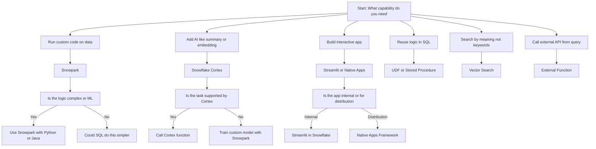

## Common Pitfalls

| Mistake | What Happens | Better Approach |
|---------|--------------|-----------------|
| Using Snowpark for simple SQL logic | Extra code to maintain with no performance gain | Write the logic in SQL first. Use Snowpark only when SQL is not enough |
| Calling Cortex on every row without caching | High cost and latency for repeated inputs | Cache embeddings or results in a table for reuse |
| Building Streamlit apps with no access control | Users see data they should not | Set role permissions before sharing the app |
| Registering UDFs with large package dependencies | Cold start delays and higher memory use | Minimize packages. Use Snowflake provided libraries when possible |
| Using vector search without metadata filters | Irrelevant results that match semantically but not contextually | Filter by category date or status before ranking by similarity |
| Calling external functions without error handling | Query fails when external service is down | Add fallback logic or retry with exponential backoff |
| Ignoring cost of AI features | Cortex calls and vector search add up quickly | Monitor usage per feature. Set budgets and alerts |

## Cost Considerations

| Feature | Cost Driver | How to Control |
|---------|------------|----------------|
| Snowpark | Compute credits for function execution | Right size warehouse. Cache results. Avoid redundant calls |
| Cortex | Per call pricing for AI functions | Cache embeddings. Use for high value tasks only |
| Streamlit | Compute for app execution and data queries | Limit data scanned. Use caching. Set session timeouts |
| UDFs and Procedures | Compute per invocation | Register as immutable if deterministic. Batch where possible |
| Vector Search | Storage for embeddings plus compute for similarity | Filter before ranking. Use approximate search for large sets |
| External Functions | Network egress plus external service cost | Cache responses. Use batch calls. Monitor error rates |

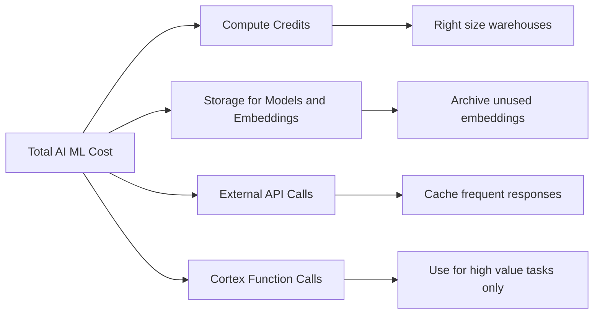

## Best Practices Summary

- Start with SQL. Add code only when SQL cannot express the logic
- Use Cortex for common AI tasks. Build custom models only when needed
- Keep data in Snowflake. Bring code to data not data to code
- Cache results that do not change often. Avoid recomputing the same answer
- Tag AI and ML workloads for cost attribution. Track spend by project or team
- Test with small data before scaling. Catch errors before they burn credits
- Document inputs outputs and examples for UDFs and procedures
- Monitor latency and error rates for external integrations
- Review usage quarterly. Remove unused functions apps or embeddings
- Security first. Set permissions before sharing apps or functions

## Bottom Line

- Snowpark lets you run Python Java and Scala where your data lives
- Cortex gives you pre built AI without managing models
- Native Apps let you package and distribute secure multi tenant apps
- Streamlit turns Python scripts into interactive apps with no frontend work
- UDFs and procedures let you reuse custom logic in SQL
- Vector search enables semantic matching on top of your structured data
- External functions let you call APIs from SQL with secure integration
- Every feature has a cost. Measure before you scale
- Start simple. Add complexity only when your use case requires it
- Keep data in Snowflake. Bring compute to data. Avoid egress

Think of these features like tools in a workshop:
- SQL is your hammer. Simple reliable works for most jobs
- Snowpark is your power drill. More flexible for complex tasks
- Cortex is your pre made jig. Speeds up common work without setup
- Streamlit is your workbench. Lets you assemble and show results
- Vector search is your caliper. Measures similarity not just exact match
- External functions are your extension cord. Reaches outside the workshop when needed

Pick the tool that matches the job. Do not use a drill when a hammer will do. Do not build a jig for a one time task. Match the tool to the work. Save effort without sacrificing quality.
