# Domain 1.0 Snowflake AI Data Cloud Features and Architecture

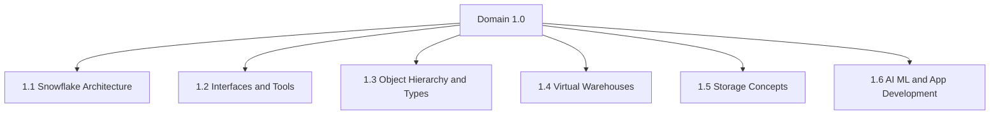

## 1.1 Snowflake Architecture

### Core Architecture Model

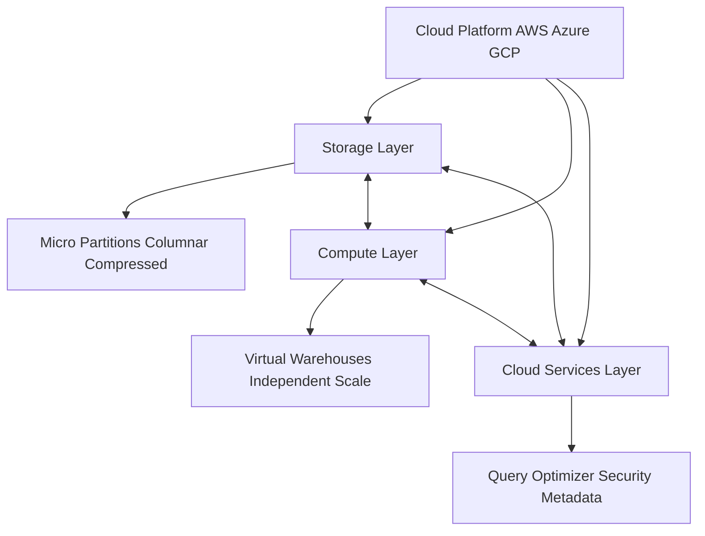

| Layer | Responsibility | Key Characteristics |
|-------|---------------|-------------------|
| Storage | Persistent data storage | Micro partitions columnar format automatic compression immutable blocks |
| Compute | Query and workload execution | Virtual warehouses independent scale auto suspend pay per second |
| Cloud Services | Coordination and management | Authentication query optimization metadata transactions security |

### Snowflake Editions Comparison

| Feature | Standard | Enterprise | Business Critical | VPS |
|---------|----------|------------|-------------------|-----|
| Core SQL and data operations | Yes | Yes | Yes | Yes |
| Automatic encryption | Yes | Yes | Yes | Yes |
| Time Travel window | 1 day | 1 to 90 days | 1 to 90 days | 1 to 90 days |
| Multi-cluster warehouses | No | Yes | Yes | Yes |
| Row and column level security | No | Yes | Yes | Yes |
| Customer managed encryption keys | No | No | Yes | Yes |
| Private network connectivity | No | No | Yes | Yes |
| HIPAA PHI compliance support | No | No | Yes | Yes |
| Automated disaster recovery failover | No | No | Yes | Yes |
| Dedicated isolated hardware | No | No | No | Yes |
| Marketplace access | Yes | Yes | Yes | No |

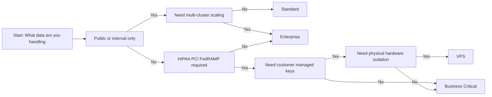

### Pricing Overview US East AWS

| Edition | Price Per Credit | Storage Cost | Best For |
|---------|-----------------|--------------|----------|
| Standard | 2.00 USD | 23.00 USD per TB per month | Learning small projects proof of concept |
| Enterprise | 3.00 USD | 23.00 USD per TB per month | Production workloads growing teams |
| Business Critical | 4.00 USD | 23.00 USD per TB per month | Regulated industries sensitive data |
| VPS | Contact sales | Contact sales | Maximum isolation requirements |

## 1.2 Snowflake Interfaces and Tools

### Interface Comparison

| Interface | Primary Use Case | Strengths | Limitations |
|-----------|-----------------|-----------|-------------|
| Snowsight Web UI | Quick queries data preview admin tasks | Browser based no install visual feedback sharing | Poor offline support weak git integration |
| SnowSQL CLI | Automation CI/CD server scripts | Scriptable version control friendly headless | No visual editor harder to debug large files |
| IDE Extensions VS Code JetBrains | Daily coding git workflows debugging | Syntax highlighting git integration local testing | Requires local config depends on API limits |
| JDBC ODBC Drivers | BI tools Tableau Power BI Excel | Broad tool support enterprise integration | Not for interactive querying or script development |
| Python Connector | Data science ETL Snowpark development | Rich ecosystem pandas sklearn integration | Requires programming knowledge not for non technical users |
| REST API | Custom integrations serverless functions | Programmatic control async execution | High setup complexity not for interactive use |
| Partner Connect | One click setup for Fivetran dbt Looker | Fast integration pre configured connectors | Limited customization advanced tuning requires manual setup |

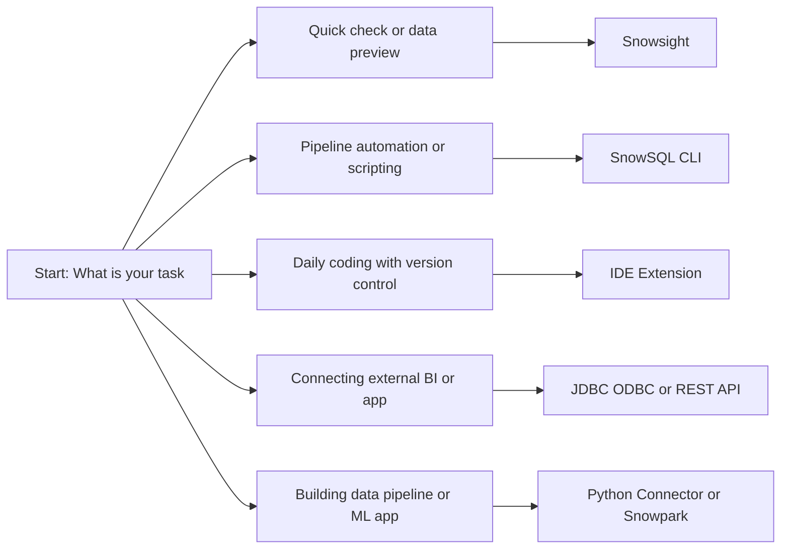

### Snowsight Web UI Capabilities

| Feature | Description | Use Case |
|---------|-------------|----------|
| SQL Worksheets | Write and run queries with syntax highlighting | Ad hoc analysis query testing |
| Data Browser | Navigate databases schemas tables in tree view | Data exploration object discovery |
| Query History | View past queries performance metrics rerun options | Debugging cost analysis optimization |
| Dashboards | Build visual reports with charts and filters | Sharing insights with stakeholders |
| Admin Console | Manage users roles warehouses monitor usage | Account administration governance |
| Data Sharing | Create secure shares for internal or external consumers | Collaborative analytics data products |
| Marketplace Access | Browse and query third party data without copying | Data enrichment external data sourcing |

### SnowSQL CLI Command Patterns

| Command Pattern | Example | When To Use |
|-----------------|---------|-------------|
| Single query | snow sql -q "select current_timestamp();" | Quick validation without files |
| File execution | snow sql -f migration.sql | Schema changes batch transforms |
| Stage upload | snow stage put ./data.csv @raw_stage | Push files for COPY INTO |
| Stage listing | snow stage list @raw_stage | Verify files before loading |
| Profile switching | snow sql --profile prod | Run same script across environments |
| Data export | snow sql -q "select * from t" --format csv > out.csv | Pull data for local analysis |
| Variable substitution | snow sql -q "select * from users where region = &region" -v region=US | Parameterize scripts for reuse |

## 1.3 Snowflake Object Hierarchy and Types

### Object Hierarchy

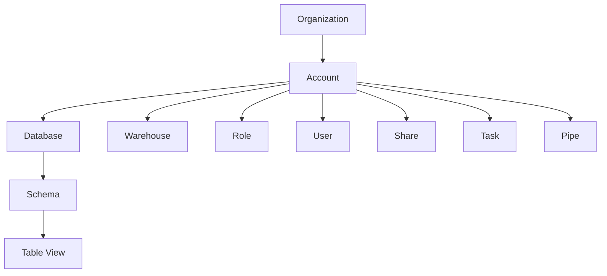

### Account Level Objects

| Object Type | Purpose | Key Properties | Management Scope |
|-------------|---------|---------------|-----------------|
| Users | People or services that log in | Username auth method default role status | Account level |
| Roles | Collections of privileges | Role name parent roles granted privileges | Account level |
| Warehouses | Compute clusters for queries | Size auto suspend auto resume scaling policy | Account level |
| Databases | Top level containers for data | Name retention period replication config | Account level |
| Schemas | Sub containers inside databases | Name transient setting data retention | Database level |
| Integrations | Connections to external systems | Type storage notification api auth config | Account level |
| Shares | Secure data sharing configurations | Provider account consumer list included objects | Account level |
| Tasks | Scheduled SQL or script execution | Schedule warehouse dependencies state | Account level |
| Pipes | Automated data loading from stages | Source stage COPY command error handling | Account level |

### Role Hierarchy Pattern

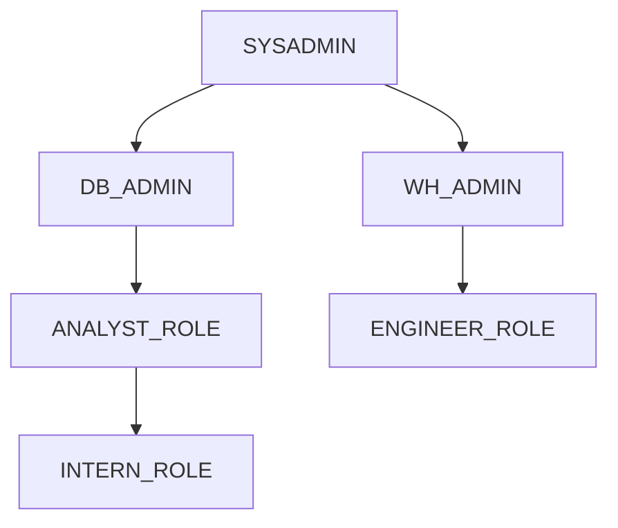

| Role Pattern | When To Use | Example |
|--------------|-------------|---------|
| Functional roles | Team based access control | ANALYST_ROLE ENGINEER_ROLE |
| Environment roles | Separate dev test prod | DEV_ROLE PROD_ROLE |
| Project roles | Short term initiatives | PROJECT_ALPHA_ROLE |
| Service roles | Automation and pipelines | ETL_SERVICE_ROLE |

### Warehouse Configuration Properties

| Property | What It Controls | Recommended Setting |
|----------|-----------------|-------------------|
| Size | Compute power and memory | Match to workload complexity XSmall to 6XLarge |
| Auto suspend | Idle time before stopping billing | 60 seconds for dev 300 seconds for prod |
| Auto resume | Start automatically on query | True for interactive False for scheduled only |
| Min clusters | Minimum active clusters | 1 for most workloads |
| Max clusters | Maximum clusters for scaling | 3 to 6 for variable demand workloads |
| Scaling policy | When to add remove clusters | Economy for cost sensitive Standard for user facing |
| Statement timeout | Max query runtime before cancel | 300 seconds default 1800 for heavy transforms |

## 1.4 Virtual Warehouses

### Warehouse Types

| Type | Hardware | Best For | Not Ideal For |
|------|----------|----------|---------------|
| Standard Gen 2 | Modern CPU more RAM per core faster I/O | SQL queries BI reporting general ETL | Heavy Python or Java workloads |
| Standard Gen 1 | Legacy CPU less RAM per core | Legacy systems during migration | Any new workload |
| Snowpark Optimized | Memory tuned for language runtimes | Python Java UDFs ML inference | Pure SQL analytics |
| Multi-Cluster | Multiple independent clusters | High concurrency dashboards team reporting | Single long running query |

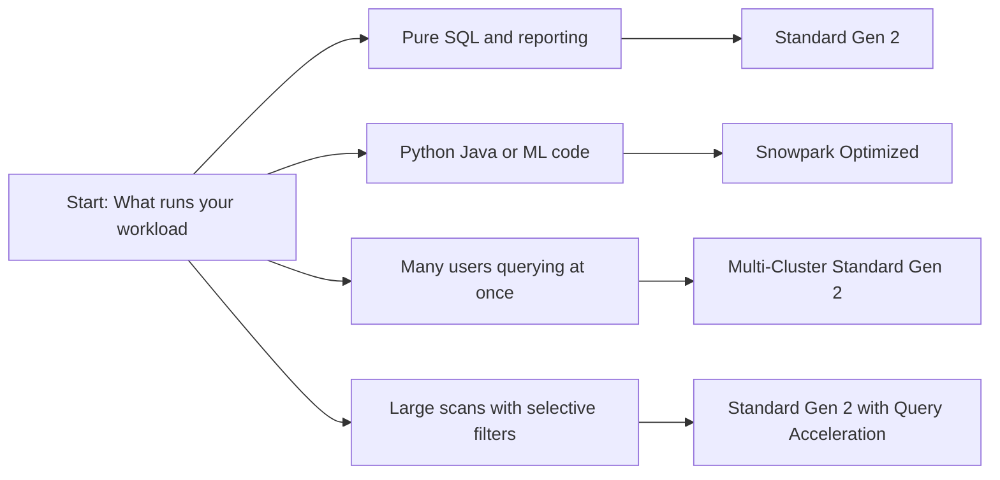

### Scaling Policies Comparison

| Policy | Adds Cluster When | Removes Cluster When | Cost Impact | User Impact |
|--------|------------------|---------------------|-------------|-------------|
| Economy | Queries wait in queue for about 2 minutes | Load drops below min for 5 minutes | Lower conservative | Brief wait during sudden spikes |
| Standard | Queue starts forming before users wait | Load stays low for 10 minutes | Higher proactive | Smooth experience no visible queue |

### Auto Suspend and Workload Patterns

| Workload Type | Query Pattern | Recommended Auto Suspend | Recommended Auto Resume |
|---------------|---------------|-------------------------|------------------------|
| Ad hoc analysis | Random queries minutes apart | 60 seconds | True |
| Dashboard refresh | Queries every 5 to 15 minutes | 300 seconds | True |
| ETL batch job | Many queries in short window then silence | 0 during job 60 after | True during job window |
| Data science exploration | Long running queries irregular gaps | 300 to 600 seconds | True |
| Scheduled tasks | Queries at known times only | 60 seconds | False control via scheduler |
| 24/7 service API | Continuous low volume queries | Disabled or 3600 seconds | True |

### Warehouse Sizing Guide

| Size | Credits Per Hour | Compute Power | Best For |
|------|-----------------|---------------|----------|
| XSmall | 1 | 1x baseline | Learning testing tiny queries |
| Small | 2 | 2x baseline | Light analytics development |
| Medium | 4 | 4x baseline | Regular reporting moderate data |
| Large | 8 | 8x baseline | Complex transforms bigger datasets |
| XLarge | 16 | 16x baseline | Heavy ETL concurrent dashboards |
| 2XLarge to 6XLarge | 32 to 128 | 32x to 128x baseline | Enterprise batch massive parallel |

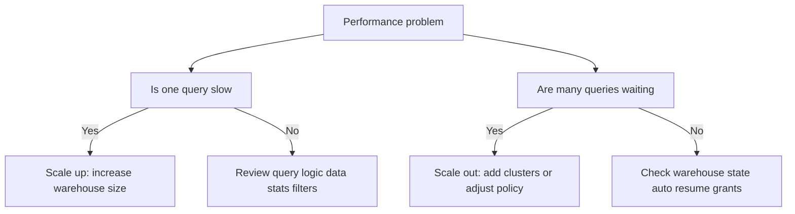

## 1.5 Snowflake Storage Concepts

### Storage Fundamentals

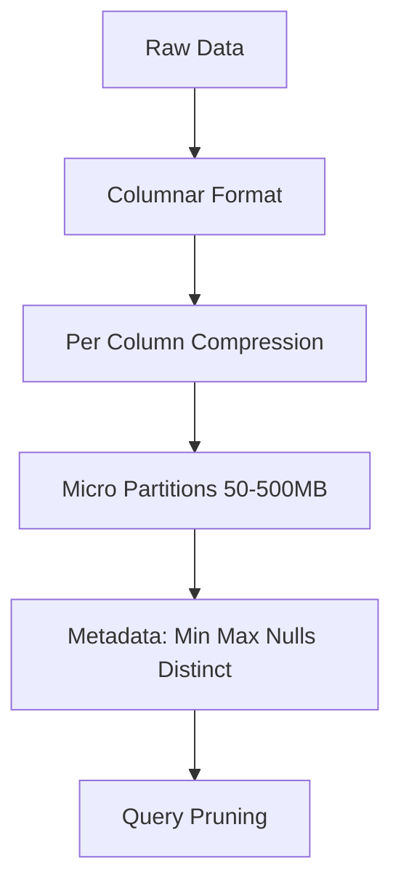

| Concept | What It Is | Why It Matters |
|---------|-----------|----------------|
| Micro partitions | Small immutable blocks of columnar data 50 to 500 MB uncompressed | Enables fast pruning efficient updates and time travel |
| Columnar storage | Data stored by column not by row | Read only columns you need skip the rest |
| Automatic compression | Best algorithm per column applied on ingest | Reduces storage cost and I/O without configuration |
| Clustering metadata | Min max null count distinct count per column per micro partition | Lets Snowflake skip irrelevant data during queries |
| Time Travel | Access to historical data for configurable window | Recover from mistakes audit changes reproduce results |
| Fail Safe | Protected recovery period after Time Travel ends | Emergency only recovery for compliance and disaster |

### Time Travel and Fail Safe

| Edition | Time Travel Window | Fail Safe Period | Access Method |
|---------|-------------------|-----------------|---------------|
| Standard | 1 day fixed | 7 days | SELECT with AT or BEFORE clause |
| Enterprise and above | 1 to 90 days configurable | 7 days | Same plus programmatic API access |

| Action | Syntax Example |
|--------|---------------|
| Query as of timestamp | SELECT * FROM table AT TIMESTAMP TO_TIMESTAMP_TZ '2024-01-15 10:00:00 UTC' |
| Query as of offset | SELECT * FROM table BEFORE OFFSET 60 MINUTE |
| Query as of statement | SELECT * FROM table AT STATEMENT '4f2a1b3c-0000-1234-abcd-5678ef901234' |
| Undelete table | UNDELETE TABLE table WITH TIMESTAMP TO_TIMESTAMP_TZ '2024-01-15 10:00:00 UTC' |

### Table Types Comparison

| Type | Data Location | Time Travel | Fail Safe | DML Support | Best For |
|------|--------------|-------------|-----------|-------------|----------|
| Permanent | Snowflake storage | 1 to 90 days | 7 days | Full INSERT UPDATE DELETE MERGE | Production data that must be recovered |
| Temporary | Snowflake storage | 0 to 1 day | None | Full but session scoped | Session specific intermediate results |
| Transient | Snowflake storage | 0 to 1 day | None | Full INSERT UPDATE DELETE MERGE | ETL staging or rebuilt aggregates |
| Dynamic | Snowflake storage | Inherits from base | Inherits from base | Via automatic refresh | Automated incremental pipelines |
| External | Your cloud storage | Not supported | Not supported | Read only | Query raw files without loading |
| Apache Iceberg | Your cloud storage | Via snapshots | Via catalog | Full ACID transactions | Multi engine access and governance |

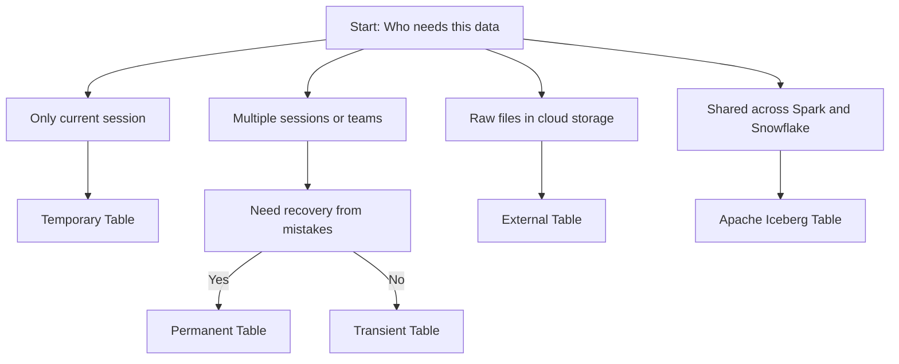

### View Types Comparison

| Type | What It Holds | When Compute Happens | Storage Cost | Best For |
|------|--------------|---------------------|--------------|----------|
| Standard | Saved query definition | At query time | None | Logic reuse light transforms ad hoc reports |
| Materialized | Physical copy of results | During background refresh | You pay for stored rows | Heavy dashboards repeated slow queries |
| Secure | Saved query with access rules | At query time plus policy check | None | Sharing sensitive data hiding logic row masking |

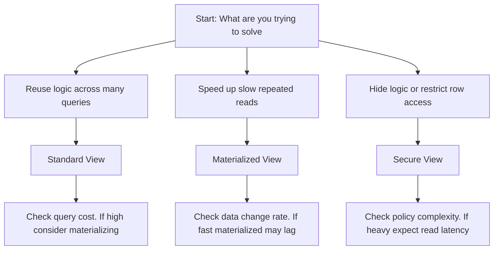

### Storage Cost Components

| Billing Component | How It Is Measured | Typical Rate US East AWS |
|------------------|-------------------|-------------------------|
| Compressed storage | Average bytes stored per day including micro partitions | 23.00 USD per TB per month |
| Time Travel storage | Historical micro partitions retained within configured window | Same rate as compressed storage |
| Fail Safe storage | Protected recovery data after Time Travel ends | Same rate as compressed storage |
| Data transfer | Bytes moved out of Snowflake to external destinations | Varies by cloud provider and region |

## 1.6 AI ML and Application Development Features

### AI and ML Services Overview

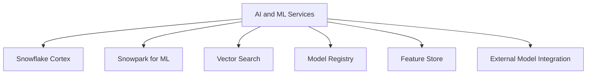

| Service | What It Does | Best For | Not Ideal For |
|---------|-------------|----------|---------------|
| Snowflake Cortex | Pre built AI functions for text and images | Summarization sentiment analysis embeddings | Custom model training from scratch |
| Snowpark for ML | Run Python ML code directly in Snowflake | Training custom models building pipelines | Simple SQL aggregations |
| Vector Search | Store and query embeddings for semantic matching | RAG apps recommendations similarity search | Exact match lookups |
| Model Registry | Track versions metadata and lineage of models | Team collaboration model governance | One off experiments with no reuse |
| Feature Store | Share and reuse engineered features across teams | Consistent features for training and inference | Ad hoc analysis with no reuse |
| External Model Integration | Call models hosted outside Snowflake | Using proprietary or third party models | Low latency real time inference |

### Snowflake Cortex Functions

| Function | Input | Output | Example Use |
|----------|-------|--------|-------------|
| COMPLETE | Prompt text | Generated text | Draft responses write SQL explain concepts |
| EXTRACT_ANSWER | Question and context | Short answer | Q and A over documents |
| SUMMARIZE | Long text | Short summary | Condense reports or support tickets |
| SENTIMENT | Text | Positive neutral negative score | Analyze customer feedback |
| TRANSLATE | Text and target language | Translated text | Localize content for global teams |
| EMBED_TEXT_1024 | Text | 1024 dimension vector | Semantic search RAG apps |
| RECOGNIZE_IMAGE | Image URL | Labels and descriptions | Tag images for search |
| DETECT_LANG | Text | Language code | Route content to correct pipeline |

```sql
-- Example: Summarize and score sentiment in one query
SELECT
  ticket_id,
  feedback_text,
  SNOWFLAKE.CORTEX.SUMMARIZE(feedback_text) as summary,
  SNOWFLAKE.CORTEX.SENTIMENT(feedback_text) as sentiment_score
FROM support_tickets
WHERE created_date > DATEADD(day, -7, CURRENT_DATE);
```

### Snowpark for ML Capabilities

| Capability | What It Enables | Why It Matters |
|------------|----------------|----------------|
| DataFrame API | Chain transformations like filter join aggregate in Python or Scala | Write code that reads like SQL but with programmatic control |
| In database execution | Code runs where data lives no egress | Faster cheaper safer than moving data to external platform |
| Package support | Use pandas numpy scikit learn xgboost lightgbm | No need to rewrite entire ML stack |
| Local testing | Run code against small local data before deploying | Catch errors early without burning production credits |
| Pushdown optimization | Snowpark translates code to SQL where possible | Get SQL performance with Python flexibility |
| Model registry integration | Register trained models with version and metadata | Track what works and reproduce results later |

```python
# Example: Train and register a churn model with Snowpark
from snowflake.snowpark import Session
from sklearn.ensemble import RandomForestClassifier

def train_churn_model(session: Session):
    # Load data from Snowflake
    df = session.table("analytics.customer_features").to_pandas()
    
    # Prepare features and target
    X = df[["tenure_months", "monthly_charges", "support_tickets"]]
    y = df["churned"]
    
    # Train model
    model = RandomForestClassifier(n_estimators=100, random_state=42)
    model.fit(X, y)
    
    # Register model in Snowflake Model Registry
    session.ml.register_model(
        model=model,
        model_name="churn_predictor",
        version="v1.2",
        description="Random forest churn model",
        input_schema="tenure_months FLOAT, monthly_charges FLOAT",
        output_schema="churn_score FLOAT"
    )
    
    return model
```

### Vector Search and Embeddings

| Feature | What It Does | Why It Matters |
|---------|-------------|----------------|
| VECTOR data type | Store fixed length numeric arrays | Native support for embeddings without BLOB workarounds |
| Cosine distance function | Compute similarity between vectors | Enables semantic search not just keyword match |
| Cortex embedding functions | Generate embeddings with one SQL call | No need to manage external embedding service |
| Vector index preview | Speed up nearest neighbor search | Reduce latency for large embedding tables |
| Combine with SQL filters | Filter by metadata then rank by similarity | Get relevant results that also meet business rules |

```sql
-- Example: Semantic search with vector similarity and metadata filter
WITH query_embedding AS (
  SELECT SNOWFLAKE.CORTEX.EMBED_TEXT_1024('snowflake-arctic-embed', 'fast running shoes') AS vec
)
SELECT
  product_id,
  product_name,
  1 - VECTOR_COSINE_SIMILARITY(q.vec, p.embedding) AS similarity
FROM products p
CROSS JOIN query_embedding q
WHERE category = 'footwear'
  AND in_stock = TRUE
ORDER BY similarity DESC
LIMIT 10;
```

### Application Development Features

| Feature | What It Does | Best For | Not Ideal For |
|---------|-------------|----------|---------------|
| Streamlit in Snowflake | Build interactive Python apps with no frontend code | Internal dashboards prototypes data explorers | High traffic public apps custom UI requirements |
| Native Apps Framework | Package and distribute apps with code data and logic | ISVs multi tenant apps governed internal tools | One off scripts with no distribution need |
| External Functions | Call external APIs from SQL with secure integration | Enrich data with third party services trigger workflows | Low latency real time user facing calls |
| UDFs and Stored Procedures | Reuse custom logic in SQL with Python Java JavaScript | Encapsulate complex logic for reuse across teams | Simple expressions that fit in one SQL line |
| Snowflake Notebooks | Browser based IDE for Python and SQL exploration | Prototyping data science iterative analysis | Production scheduling or user facing dashboards |

### Streamlit in Snowflake Setup

```python
# Example: Simple sales dashboard with caching and parameters
import streamlit as st
import snowflake.snowpark as snowpark

@st.cache_data
def load_sales_data(region_filter):
    session = snowflake.session.get_active_session()
    df = session.table("analytics.monthly_sales")
    if region_filter != "All":
        df = df.filter(snowpark.col("region") == region_filter)
    return df.to_pandas()

def main():
    st.title("Sales Explorer")
    
    region = st.selectbox("Filter by region", ["All", "North", "South", "East", "West"])
    df = load_sales_data(region)
    
    st.line_chart(df.set_index("month")["revenue"])
    st.dataframe(df)
    
    if st.button("Download CSV"):
        st.download_button("Click to download", df.to_csv(), "sales.csv")
```

| Practice | Why It Works |
|----------|-------------|
| Cache expensive queries with st.cache_data | Avoids rerunning the same query on every user interaction |
| Parameterize filters with st.selectbox | Lets users explore without editing code or SQL |
| Separate data and UI logic | Easier to test reuse and maintain the code |
| Handle errors with try except and st.error | Prevents app crashes and guides users when data is missing |
| Set role permissions before sharing | Prevents users from seeing data they should not access |

### Decision Framework for App Development

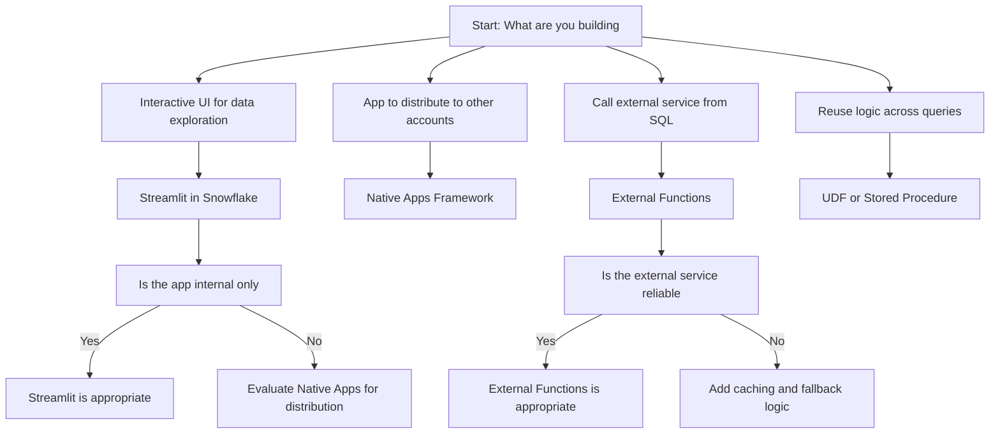

## Cross Domain Best Practices

### Cost Management Principles

| Practice | Implementation | Expected Impact |
|----------|---------------|-----------------|
| Right size warehouses | Start small scale up only when metrics show need | 30 to 60 percent compute savings |
| Set auto suspend appropriately | 60 seconds for dev 300 seconds for prod | Eliminate idle billing |
| Use transient tables for temporary data | CREATE TRANSIENT TABLE instead of TABLE | No Time Travel or Fail Safe storage costs |
| Shorten Time Travel for non prod | ALTER DATABASE SET DATA_RETENTION_TIME_IN_DAYS = 1 | Reduce historical storage by up to 90 percent |
| Tag workloads for attribution | Set query_tag with team project environment | Enable targeted optimization and chargeback |
| Monitor usage with ACCOUNT_USAGE views | Query WAREHOUSE_METERING_HISTORY TABLE_STORAGE_METRICS | Catch cost surprises before they impact budget |

### Security and Governance Principles

| Practice | Implementation | Why It Matters |
|----------|---------------|----------------|
| Grant privileges to roles not users | GRANT USAGE ON WAREHOUSE TO ROLE not USER | Easier to audit and update when team changes |
| Use row level security for sensitive data | Apply masking policies and secure views | Ensures users only see data they are authorized to see |
| Separate dev test prod with accounts or databases | Isolate environments with different retention and access | Prevent accidental changes to production data |
| Attach resource monitors to production warehouses | Set credit quota and alert thresholds | Prevents runaway spending from unexpected workloads |
| Document access policies and data lineage | Central wiki or config repo with ownership metadata | Helps teammates understand and maintain security posture |

### Performance Optimization Principles

| Practice | Implementation | When It Helps |
|----------|---------------|---------------|
| Filter early in query logic | Apply WHERE clauses before joins or aggregations | Reduces data scanned and improves pruning efficiency |
| Use clustering keys on large filtered tables | CLUSTER BY on columns used in frequent filters | Improves pruning for selective queries on large tables |
| Enable query acceleration for large scans | Set at warehouse level for eligible workloads | Offloads scan work to serverless compute for net savings |
| Cache repeated results in apps | Use st.cache_data in Streamlit or materialized views | Avoids recomputing the same answer for repeated requests |
| Separate interactive from batch workloads | Use different warehouses for dashboards and ETL | Prevents resource contention and unpredictable performance |

### Data Organization Principles

| Practice | Implementation | Benefit |
|----------|---------------|---------|
| Use databases to separate business domains | Create FINANCE_DB MARKETING_DB OPERATIONS_DB | Clear ownership and access control boundaries |
| Use schemas to separate data lifecycle stages | Use RAW CLEANED REPORTING schemas inside each database | Organize data by freshness and trust level |
| Name objects with purpose and freshness | Use naming like events_raw_daily user_facts_hourly | Avoid confusion about data source and recency |
| Tag objects for cost attribution | Add tags like team analytics project monthly_report | Track spend by team project or environment |
| Document table purpose and retention | Add table comment with owner and expected lifespan | Helps teammates understand when to archive or drop |

## Key Takeaways

- Snowflake separates storage compute and cloud services. Each scales independently. You pay only for what you use.
- Editions add capabilities incrementally. Start with Standard. Upgrade when compliance or scale requirements demand it.
- Virtual warehouses control compute cost and performance. Size for the workload. Suspend when idle. Scale out for concurrency not slow queries.
- Storage is columnar compressed and partitioned automatically. You control cost through retention settings and data organization.
- Table types match data lifecycle. Permanent for critical data. Transient for temporary. Temporary for session only.
- View types balance compute timing and security. Standard for reuse. Materialized for speed. Secure for protection.
- AI and ML services bring code to data. Cortex for common tasks. Snowpark for custom models. Vector search for semantic matching.
- App development features keep data in Snowflake. Streamlit for internal tools. Native Apps for distribution. External Functions for API integration.
- Cost follows compute and storage. Measure before you scale. Right size before you optimize. Tag everything for attribution.
- Security is a configuration not an afterthought. Grant by role. Mask sensitive data. Isolate environments. Monitor access.

Think of Snowflake like a modular workshop:
- Storage is your warehouse. Items arrive sorted labeled and compressed automatically.
- Compute is your power tools. Pick the right size for the job. Turn them off when not in use.
- Cloud services is your foreman. Coordinates security optimization and metadata without your direct management.
- Editions are your tool tiers. Start with basics. Add specialized tools when the work requires them.
- AI and ML are your power assistants. Handle common tasks automatically. Bring your own logic when needed.
- Apps are your workbenches. Build where the materials live. Do not carry heavy items back and forth.

Match the tool to the task. Measure the work. Optimize what matters. Document your choices. Save cost without sacrificing outcome.
