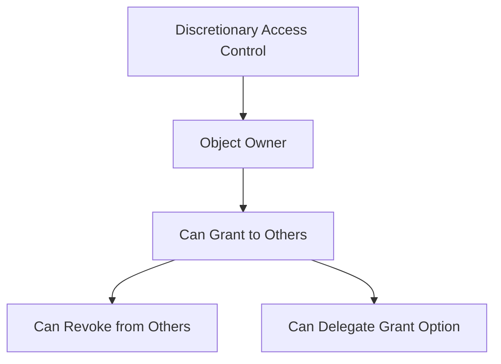
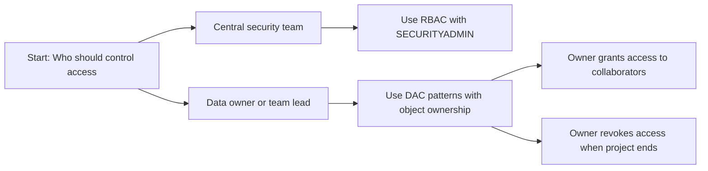
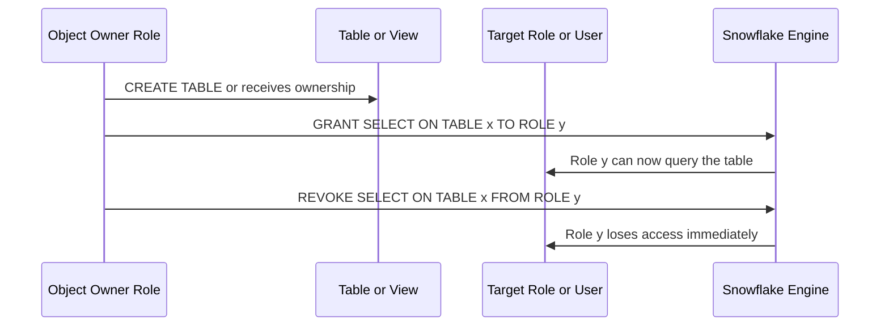
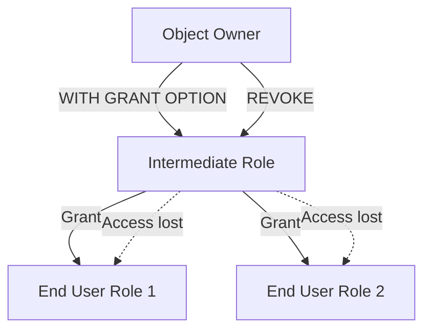
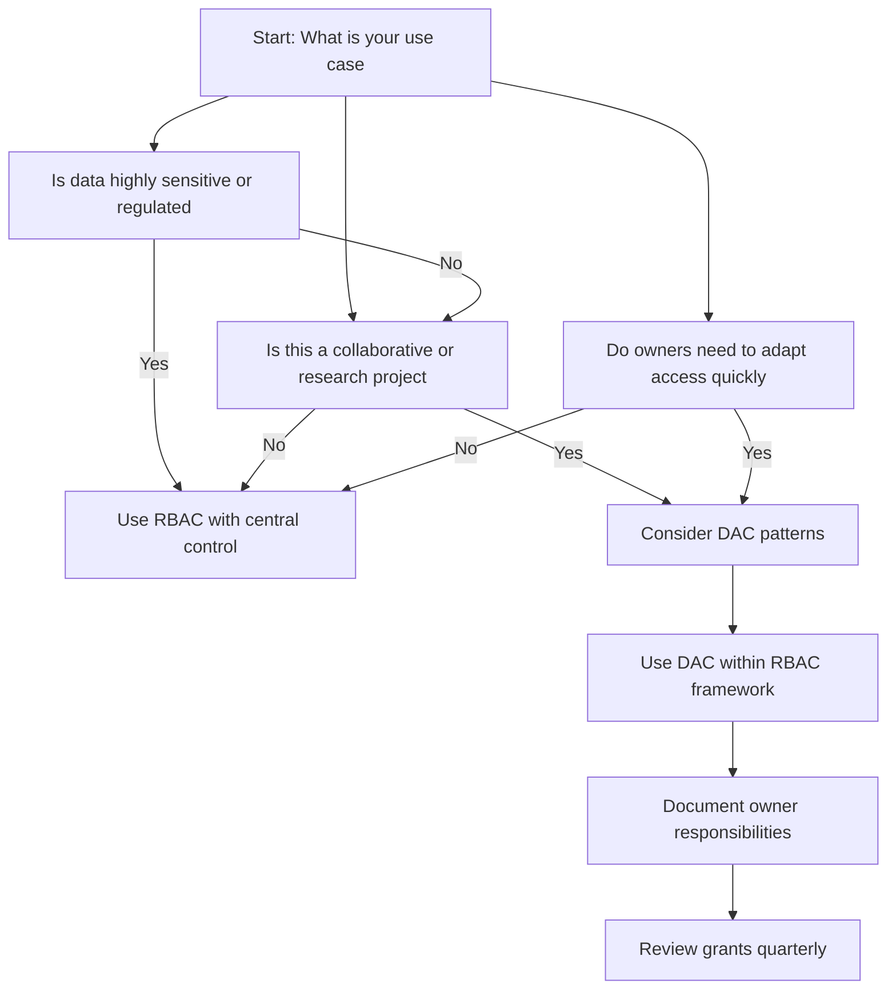
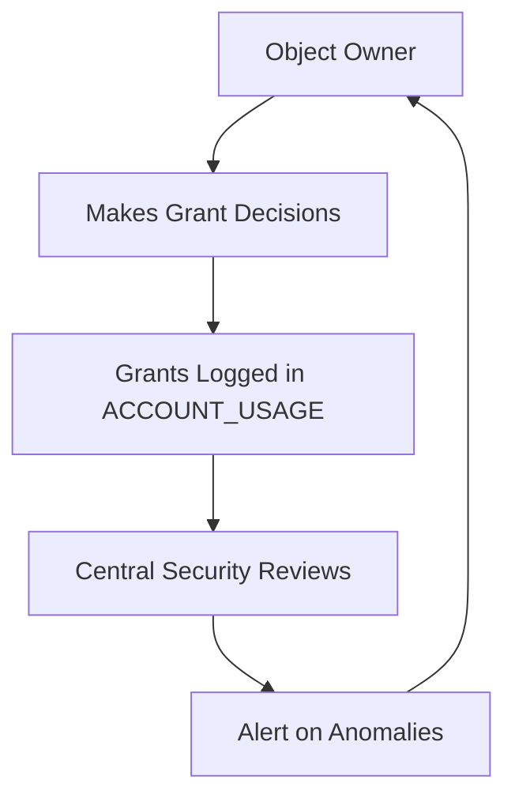
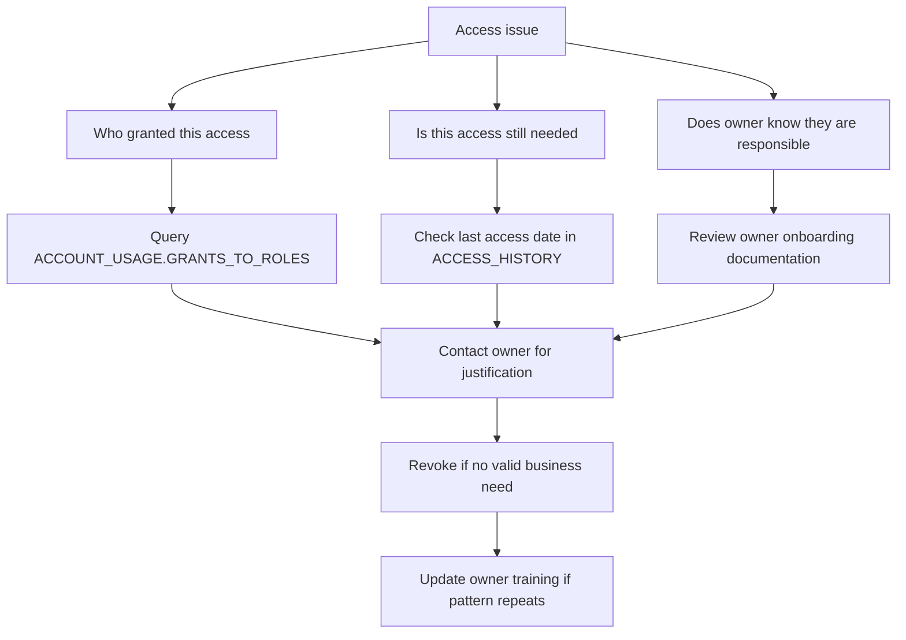
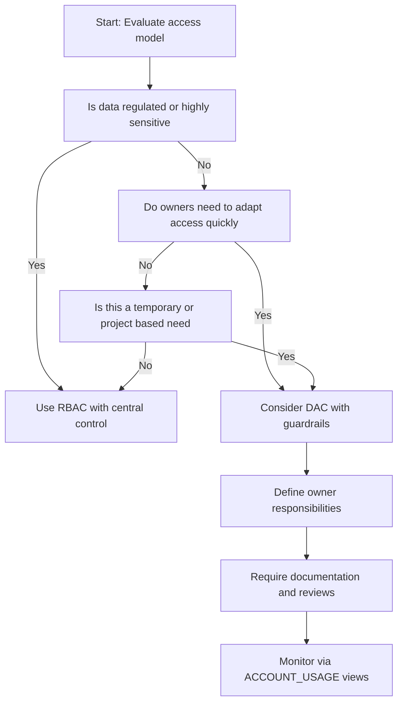

# Discretionary Access Control DAC in Snowflake



## What DAC Actually Is

| Concept | What It Means in Snowflake | Simple Explanation |
|---------|---------------------------|------------------|
| Object owner | The role that created the object or was granted ownership | Whoever owns the table decides who can use it |
| Grant privilege | Owner can give access to other roles or users | Like lending your key to a trusted person |
| Grant option | Owner can let others grant access too | Like giving someone the power to lend your key |
| Revoke privilege | Owner can take back access anytime | Like changing the lock if you need to |
| Ownership transfer | Owner can give ownership to another role | Like handing over the deed to a house |

- DAC puts control in the hands of the object owner not a central administrator
- The owner decides who gets access. The owner decides when to take it back
- This is different from RBAC where a security admin controls all access centrally
- Snowflake supports both. You can use DAC patterns within an RBAC framework



## How DAC Works in Snowflake

### Object Ownership and Grant Flow



| Action | SQL Example | Who Can Do It |
|--------|-------------|---------------|
| Create object | CREATE TABLE sales AS SELECT ... | Any role with CREATE TABLE privilege on schema |
| Grant access | GRANT SELECT ON TABLE sales TO ROLE analyst | Object owner or role with GRANT OPTION |
| Grant with delegation | GRANT SELECT ON TABLE sales TO ROLE analyst WITH GRANT OPTION | Object owner only |
| Revoke access | REVOKE SELECT ON TABLE sales FROM ROLE analyst | Object owner or SECURITYADMIN |
| Transfer ownership | ALTER TABLE sales SET OWNER = new_owner_role | Current owner or SYSADMIN |

### Grant Option and Delegation

```sql
-- Owner grants access and allows recipient to grant further
GRANT SELECT ON TABLE customer_data TO ROLE partner_analyst WITH GRANT OPTION;

-- Now partner_analyst can grant to others
GRANT ROLE partner_analyst TO USER external_consultant;
GRANT SELECT ON TABLE customer_data TO ROLE external_firm;

-- Original owner can still revoke from anyone in the chain
REVOKE SELECT ON TABLE customer_data FROM ROLE external_firm;
```

| Grant Pattern | When To Use | Risk Level |
|--------------|-------------|------------|
| Direct grant | One team needs access to one object | Low simple to track |
| Grant with option | Team needs to share with their contractors | Medium harder to audit full chain |
| Chain delegation | Multiple levels of external sharing | High easy to lose track of who has access |
| Revoke at root | Owner revokes from intermediate role | Medium all downstream access removed automatically |



## DAC vs RBAC Key Differences

| Aspect | Discretionary Access Control | Role Based Access Control |
|--------|-----------------------------|---------------------------|
| Who decides access | Object owner | Security administrator |
| Where policy lives | With each object | In central role definitions |
| Flexibility | High owner can adapt quickly | Lower changes require admin review |
| Audit complexity | Harder access scattered across owners | Easier all grants in central roles |
| Best for | Collaborative projects research teams | Production systems regulated data |
| Risk | Owners may over grant or forget to revoke | Admins may become bottleneck |



## Practical DAC Patterns in Snowflake

### Pattern: Project Based Ownership

```sql
-- Project lead role owns project objects
CREATE ROLE project_alpha_owner;

-- Project lead creates tables
SET ROLE = project_alpha_owner;
CREATE TABLE project_alpha.results (id NUMBER, metric FLOAT);

-- Project lead grants to team members
GRANT SELECT ON TABLE project_alpha.results TO ROLE project_alpha_team;
GRANT INSERT ON TABLE project_alpha.results TO ROLE project_alpha_engineers;

-- When project ends revoke all or transfer ownership
REVOKE SELECT ON TABLE project_alpha.results FROM ROLE project_alpha_team;
```

| Step | Purpose | Why It Works |
|------|---------|--------------|
| Create owner role | Isolates project control from central admin | Project lead manages access without ticket to security team |
| Owner creates objects | Ownership tied to project role not individual | Access persists if person leaves project |
| Owner grants to team | Team gets only what project needs | Least privilege enforced at project level |
| Revoke or transfer at end | Clean up or hand off when project completes | Prevents orphaned access after project ends |

### Pattern: Data Domain Ownership

```sql
-- Finance team owns finance data objects
CREATE ROLE finance_data_owner;
GRANT USAGE ON SCHEMA finance.raw TO ROLE finance_data_owner;

-- Finance owner creates and manages tables
SET ROLE = finance_data_owner;
CREATE TABLE finance.raw.transactions (...);

-- Finance owner grants to analysts
GRANT SELECT ON TABLE finance.raw.transactions TO ROLE finance_analyst;

-- Finance owner can apply masking for sensitive columns
CREATE MASKING POLICY finance.ssn_mask AS (val STRING) RETURNS STRING ->
  CASE WHEN CURRENT_ROLE() = 'finance_data_owner' THEN val ELSE '***-**-****' END;

ALTER TABLE finance.raw.transactions MODIFY COLUMN ssn SET MASKING POLICY finance.ssn_mask;
```

| Benefit | How DAC Enables It |
|---------|-------------------|
| Domain expertise | Finance team knows which columns are sensitive |
| Fast iteration | No waiting for central admin to update masking policies |
| Accountability | Clear owner responsible for data protection |
| Flexibility | Owner can adjust access as business needs change |

### Pattern: External Collaboration with Controlled Delegation

```sql
-- Internal owner creates shareable view
CREATE ROLE internal_data_owner;
SET ROLE = internal_data_owner;

CREATE SECURE VIEW shared.customer_metrics AS
SELECT customer_id, region, SUM(revenue) as total
FROM raw.sales GROUP BY customer_id, region;

-- Grant with option to trusted partner manager role
GRANT SELECT ON VIEW shared.customer_metrics TO ROLE partner_manager WITH GRANT OPTION;

-- Partner manager can now grant to their team
GRANT ROLE partner_manager TO USER partner_lead;
GRANT SELECT ON VIEW shared.customer_metrics TO ROLE partner_analysts;

-- Internal owner retains ultimate control
REVOKE SELECT ON VIEW shared.customer_metrics FROM ROLE partner_analysts;
```

| Control Mechanism | What It Prevents |
|------------------|-----------------|
| SECURE VIEW | Partner cannot see underlying table structure or logic |
| WITH GRANT OPTION limited to one level | Prevents unlimited delegation chain |
| Owner retains revoke power | Can cut off access at any point |
| View instead of table | Exposes only aggregated data not raw records |

## DAC Governance and Guardrails

### Owner Responsibilities Checklist

| Responsibility | How To Enforce | Why It Matters |
|---------------|---------------|----------------|
| Document who has access | Require comments on GRANT statements | Creates audit trail for reviews |
| Review grants quarterly | Schedule TASK to query GRANTS and alert on stale access | Catches forgotten permissions before they become risk |
| Revoke when project ends | Add grant expiration date in comment and review | Prevents access creep after work completes |
| Use least privilege | Grant only required actions not full access | Reduces impact if recipient account is compromised |
| Report to central security | Export grant history to shared location | Enables org wide visibility and compliance |

```sql
-- Example: Query grants made by a specific owner role
SELECT
  grantee_name,
  privilege,
  granted_on,
  name as object_name,
  granted_by,
  created_on
FROM SNOWFLAKE.ACCOUNT_USAGE.GRANTS_TO_ROLES
WHERE granted_by = 'PROJECT_ALPHA_OWNER'
  AND created_on > DATEADD(month, -6, CURRENT_TIMESTAMP)
ORDER BY created_on DESC;
```

### Central Oversight for DAC



| Oversight Practice | Implementation | Benefit |
|-------------------|---------------|---------|
| Monitor ACCOUNT_USAGE views | Query GRANTS_TO_ROLES and ACCESS_HISTORY weekly | Detect unusual grant patterns or access spikes |
| Set resource monitors | Attach to warehouses used by DAC owners | Prevent cost overruns from uncontrolled queries |
| Require grant comments | Enforce via policy or code review | Creates documentation for audits and reviews |
| Periodic access reviews | Quarterly report of all DAC grants to security team | Ensures owners are following least privilege |
| Automated revocation | TASK that revokes grants older than X days without renewal | Enforces time bound access automatically |

```sql
-- Example: Alert on grants without comments (potential oversight gap)
SELECT
  grantee_name,
  privilege,
  granted_on,
  name as object_name
FROM SNOWFLAKE.ACCOUNT_USAGE.GRANTS_TO_ROLES
WHERE granted_by IN (
  SELECT role_name FROM SNOWFLAKE.ACCOUNT_USAGE.ROLES
  WHERE role_name LIKE '%_OWNER'
)
  AND comment IS NULL
  AND created_on > DATEADD(month, -1, CURRENT_TIMESTAMP);
```

## Common DAC Pitfalls and Fixes

| Pitfall | What Happens | How To Fix |
|---------|--------------|------------|
| Owner leaves without transferring ownership | Objects become orphaned access hard to manage | Require ownership transfer as part of offboarding |
| Grant option creates uncontrolled chain | Hard to track who ultimately has access | Limit delegation to one level require central approval for further |
| Owner grants too broadly | Recipients get more access than needed | Train owners on least privilege provide grant templates |
| No documentation of grant rationale | Audit cannot determine why access was given | Require comment field on all grants with business justification |
| Forgetting to revoke after project ends | Access persists indefinitely | Add expiration date in comment schedule quarterly review task |
| Mixing DAC and RBAC without clarity | Confusion about who controls what | Document which objects use DAC pattern and which use RBAC |



## When To Use DAC Patterns

| Scenario | DAC Appropriate | Why |
|----------|----------------|-----|
| Research project with evolving data needs | Yes | Owners can adapt access as analysis changes |
| External collaboration with trusted partners | Yes | Owners manage partner access without central bottleneck |
| Data domain owned by business team | Yes | Domain experts best positioned to judge access needs |
| Regulated data with strict compliance | No | Central RBAC provides clearer audit trail and control |
| Production systems with many dependent services | No | RBAC reduces risk of accidental over grant |
| Temporary access for contractors | Yes with guardrails | DAC enables fast grant and revoke with owner oversight |



## Best Practices for DAC in Snowflake

- Start with RBAC as your foundation. Use DAC patterns only where flexibility is required
- Document owner responsibilities in writing. Make it clear what owners must do
- Require comments on all grants. Business justification should be recorded
- Review grants quarterly. Owners should confirm access is still needed
- Limit grant option delegation. One level is usually enough prevent chains
- Monitor with ACCOUNT_USAGE views. Central security should have visibility
- Automate revocation where possible. Use TASK to remove stale access
- Train owners on least privilege. Provide templates and examples
- Test with representative accounts. Verify access works as intended before deploying
- Plan for owner transitions. Ownership transfer should be part of role changes

```sql
-- Example: Template for DAC grant with documentation
-- Grant: SELECT on sales_summary to marketing_team
-- Reason: Q3 campaign analysis project
-- Expires: 2024-12-31
-- Owner: marketing_data_owner
-- Reviewed: quarterly by security team

GRANT SELECT ON TABLE analytics.sales_summary TO ROLE marketing_team
COMMENT = 'Q3 campaign analysis project expires 2024-12-31 owner marketing_data_owner';
```

## Key Principles to Remember

- DAC puts control with the owner. That is its strength and its risk
- Ownership is a responsibility not just a privilege. Owners must document review and revoke
- Least privilege still applies. DAC does not mean grant everything
- Central oversight still matters. Security team should monitor DAC grants
- Documentation is non negotiable. If it is not written down it did not happen
- Automation helps. Use TASK and alerts to enforce review cycles
- Test before you trust. Verify access patterns with real accounts not assumptions

## Bottom Line

- DAC in Snowflake means object owners control who can access their objects
- It is useful for collaborative projects external partnerships and domain owned data
- It is risky if owners are not trained or if there is no central oversight
- Use DAC within an RBAC framework not as a replacement for it
- Document every grant. Review every quarter. Revoke when no longer needed
- Monitor with ACCOUNT_USAGE views. Catch problems before they become incidents
- Start small. Prove the pattern with one project before expanding

Think of DAC like lending a tool from your workshop:
- You own the tool. You decide who can borrow it
- You can say yes to a trusted colleague. You can say no to anyone
- You can ask for it back anytime. You can set a return date
- But if you lend it to someone who lends it to someone else you may lose track
- And if you leave the company without handing over your tools they become orphaned

Use DAC like you would lend a valuable tool:
- Lend only to people who need it
- Set a clear return date
- Keep a written record of who has what
- Check in regularly to see if they still need it
- Take it back when the job is done

Control with care. Document with discipline. Review with regularity. That is how DAC works well in Snowflake.
