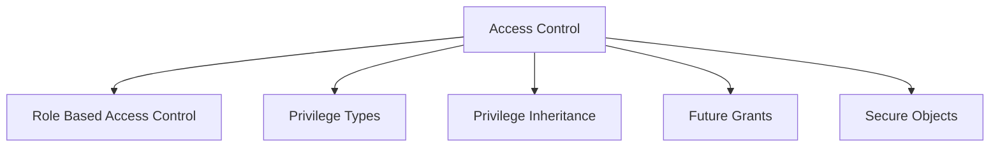
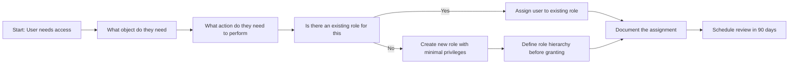
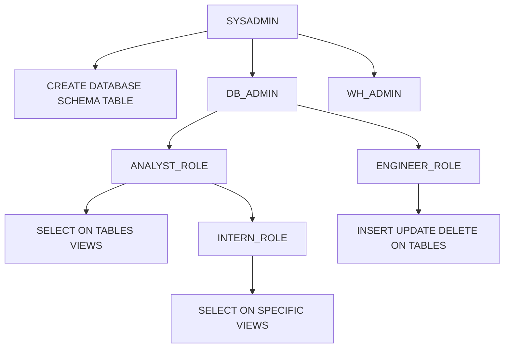
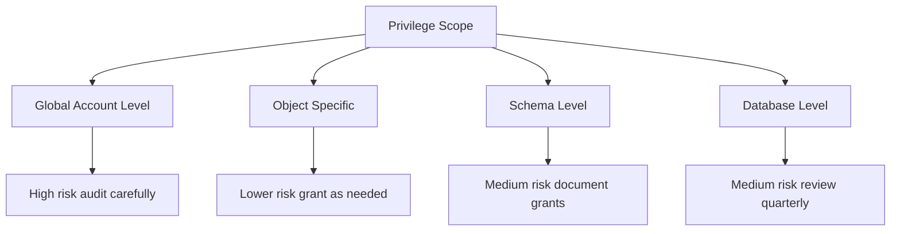
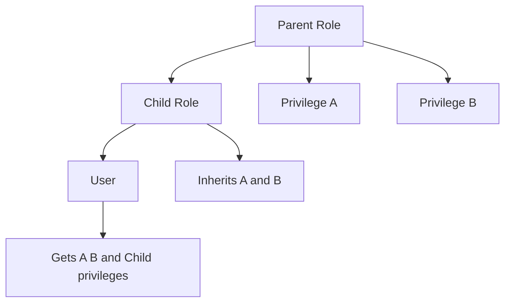
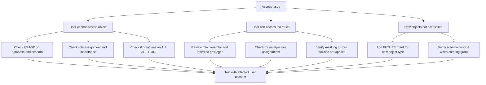
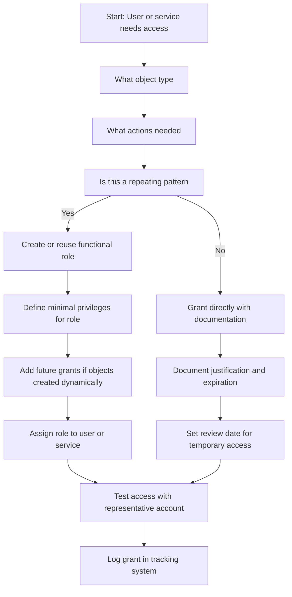

# Access Control in Snowflake



## Core Principles

| Principle | What It Means | Why It Matters |
|-----------|--------------|----------------|
| Least privilege | Grant only what is required for the task | Reduces blast radius if credentials are compromised |
| Grant to roles not users | Assign privileges to roles then assign roles to users | Easier to audit update and reuse access patterns |
| Separate duties | Different roles for different functions | Prevents single person from having too much power |
| Default deny | No access unless explicitly granted | Forces intentional permission decisions |
| Inheritance flows down | Parent roles pass privileges to child roles | Simplifies management but requires careful design |



## Role Based Access Control RBAC

### Role Hierarchy Structure



### System Defined Roles

| Role | Purpose | Key Privileges | Who Should Have It |
|------|---------|---------------|-------------------|
| SYSADMIN | Create and manage databases schemas objects | CREATE DATABASE CREATE SCHEMA CREATE TABLE | Platform engineers data platform team |
| SECURITYADMIN | Manage users roles grants | CREATE ROLE GRANT ROLE CREATE USER | Security team identity administrators |
| USERADMIN | Manage user accounts and passwords | CREATE USER ALTER USER RESET PASSWORD | HR IT helpdesk user provisioning team |
| ACCOUNTADMIN | Full account access including billing | All privileges including ORGADMIN | Very limited senior admins only |
| PUBLIC | Default role for all users | USAGE on public schema of each database | All users but grant minimal additional privileges |

### Custom Role Patterns

| Pattern | Structure | Use Case |
|---------|-----------|----------|
| Functional roles | ANALYST_ROLE ENGINEER_ROLE SCIENTIST_ROLE | Team based access to specific data domains |
| Environment roles | DEV_ROLE TEST_ROLE PROD_ROLE | Isolate access between development and production |
| Project roles | PROJECT_ALPHA_ROLE PROJECT_BETA_ROLE | Short term initiatives with defined end dates |
| Data domain roles | FINANCE_DATA_ROLE MARKETING_DATA_ROLE | Access control by business unit or data owner |
| Service roles | ETL_SERVICE_ROLE BI_SERVICE_ROLE | Non human accounts for automation and pipelines |

```sql
-- Create functional role with least privilege
CREATE ROLE ANALYST_ROLE;

-- Grant access to specific database and schema
GRANT USAGE ON DATABASE analytics TO ROLE ANALYST_ROLE;
GRANT USAGE ON SCHEMA analytics.reporting TO ROLE ANALYST_ROLE;

-- Grant select on existing tables
GRANT SELECT ON ALL TABLES IN SCHEMA analytics.reporting TO ROLE ANALYST_ROLE;

-- Grant select on future tables automatically
GRANT SELECT ON FUTURE TABLES IN SCHEMA analytics.reporting TO ROLE ANALYST_ROLE;

-- Grant role to user
GRANT ROLE ANALYST_ROLE TO USER analyst_jane;
```

## Privilege Types and Scope

### Object Level Privileges

| Object Type | Key Privileges | Typical Grant Pattern |
|------------|---------------|---------------------|
| Database | USAGE CREATE SCHEMA MONITOR | GRANT USAGE ON DATABASE x TO ROLE y |
| Schema | USAGE CREATE TABLE MONITOR | GRANT USAGE ON SCHEMA x TO ROLE y |
| Table | SELECT INSERT UPDATE DELETE TRUNCATE REFERENCES | GRANT SELECT ON TABLE x TO ROLE y |
| View | SELECT REFERENCES | GRANT SELECT ON VIEW x TO ROLE y |
| Function | USAGE EXECUTE | GRANT USAGE ON FUNCTION x TO ROLE y |
| Stage | USAGE READ WRITE | GRANT READ ON STAGE x TO ROLE y |
| Warehouse | USAGE MONITOR OPERATE | GRANT USAGE ON WAREHOUSE x TO ROLE y |
| Role | USAGE | GRANT ROLE x TO ROLE y or USER z |

### Global Privileges

| Privilege | Scope | Risk Level | When To Grant |
|-----------|-------|-----------|---------------|
| CREATE DATABASE | Account | High | Platform team only |
| CREATE ROLE | Account | High | Security admin only |
| CREATE USER | Account | Medium | User provisioning team |
| EXECUTE TASK | Account | Medium | Automation service accounts |
| IMPORT SHARE | Account | Medium | Data sharing administrators |
| APPLY MASKING POLICY | Account | Medium | Security or data governance team |
| APPLY ROW ACCESS POLICY | Account | Medium | Security or data governance team |
| OVERRIDE SHARE RESTRICTIONS | Account | Critical | Almost never grant |



## Privilege Inheritance Rules



| Inheritance Rule | What Happens | Example |
|-----------------|--------------|---------|
| Role to role | Child role gets all privileges of parent | GRANT ROLE ANALYST_ROLE TO ROLE SENIOR_ANALYST_ROLE |
| Role to user | User gets all privileges of assigned role | GRANT ROLE ANALYST_ROLE TO USER analyst_jane |
| Multiple roles | User gets union of all assigned role privileges | User with ANALYST_ROLE and ENGINEER_ROLE gets both sets |
| Schema to object | Grants on schema do not auto apply to objects | Must grant on table separately or use future grants |
| Database to schema | USAGE on database does not grant USAGE on schemas | Must grant USAGE on each schema explicitly |

```sql
-- Example: Role hierarchy with inherited privileges
CREATE ROLE DATA_USER_ROLE;
GRANT USAGE ON DATABASE analytics TO ROLE DATA_USER_ROLE;
GRANT USAGE ON SCHEMA analytics.reporting TO ROLE DATA_USER_ROLE;
GRANT SELECT ON ALL TABLES IN SCHEMA analytics.reporting TO ROLE DATA_USER_ROLE;

CREATE ROLE SENIOR_ANALYST_ROLE;
GRANT ROLE DATA_USER_ROLE TO ROLE SENIOR_ANALYST_ROLE;
GRANT INSERT ON TABLE analytics.reporting.metrics TO ROLE SENIOR_ANALYST_ROLE;

-- Senior analysts get SELECT from parent plus INSERT on specific table
GRANT ROLE SENIOR_ANALYST_ROLE TO USER senior_analyst_bob;
```

## Future Grants Pattern

| Grant Type | What It Covers | When To Use |
|-----------|---------------|-------------|
| ON FUTURE TABLES | Tables created after grant statement | New pipelines that will create tables dynamically |
| ON FUTURE VIEWS | Views created after grant statement | BI teams that create views for reporting |
| ON FUTURE FUNCTIONS | Functions created after grant statement | Data science teams deploying UDFs |
| ON FUTURE FILE FORMATS | File formats created after grant statement | ETL teams managing ingestion configurations |
| ON FUTURE STAGES | Stages created after grant statement | Teams managing data landing zones |

```sql
-- Grant select on all current and future tables in a schema
GRANT SELECT ON ALL TABLES IN SCHEMA analytics.reporting TO ROLE ANALYST_ROLE;
GRANT SELECT ON FUTURE TABLES IN SCHEMA analytics.reporting TO ROLE ANALYST_ROLE;

-- Grant usage on all current and future stages
GRANT USAGE ON ALL STAGES IN SCHEMA raw.landing TO ROLE ETL_ROLE;
GRANT USAGE ON FUTURE STAGES IN SCHEMA raw.landing TO ROLE ETL_ROLE;

-- Important: Future grants apply only to objects created AFTER the grant
-- Objects created before need explicit grant or ALL grant
```

| Common Mistake | What Happens | How To Fix |
|---------------|--------------|------------|
| Using only FUTURE grants | Existing objects remain inaccessible | Add ALL grant before FUTURE grant |
| Granting FUTURE at wrong level | Grants apply to wrong schema or database | Verify schema context before running grant |
| Forgetting to grant USAGE on parent | Cannot access object even with object privilege | Grant USAGE on database and schema first |
| Over granting with FUTURE | New objects get more access than intended | Use narrow scope and review grants quarterly |

## Secure Objects and Access Control

### Secure Views

```sql
-- Create a secure view that hides underlying logic
CREATE SECURE VIEW analytics.customer_summary AS
SELECT
  customer_id,
  region,
  SUM(order_total) as lifetime_value,
  COUNT(order_id) as order_count
FROM raw.orders
GROUP BY customer_id, region;

-- Grant access to the view not the base table
GRANT SELECT ON VIEW analytics.customer_summary TO ROLE ANALYST_ROLE;

-- Users can query the view but cannot see the underlying table structure
-- or bypass the aggregation logic
```

| Feature | What It Does | Why Use It |
|---------|-------------|------------|
| SECURE keyword | Hides view definition from users without ownership | Protects business logic and sensitive join conditions |
| Column projection | View exposes only selected columns | Limits data exposure without masking each column |
| Aggregation | View pre aggregates sensitive details | Users see summaries not individual records |
| Row filtering | View includes WHERE clause for row level security | Enforces access rules at the view layer |

### Row Access Policies

```sql
-- Create row access policy based on role
CREATE OR REPLACE ROW ACCESS POLICY regional_access AS (region STRING) RETURNS BOOLEAN ->
  CASE
    WHEN CURRENT_ROLE() IN ('ADMIN_ROLE', 'EXEC_ROLE') THEN TRUE
    WHEN CURRENT_ROLE() = 'SALES_ROLE' THEN region = CURRENT_USER_REGION()
    WHEN CURRENT_ROLE() = 'PARTNER_ROLE' THEN region IN ('North', 'South')
    ELSE FALSE
  END;

-- Apply policy to table
ALTER TABLE sales ADD ROW ACCESS POLICY regional_access ON (region);

-- Policy evaluates at query time based on caller role
-- Same query returns different rows for different roles
```

| Policy Pattern | Use Case | Implementation Tip |
|---------------|----------|-------------------|
| Role based filtering | Different teams see different data subsets | Use CURRENT_ROLE() in policy logic |
| Attribute based | Filter by user attribute like region or department | Join to user metadata table in policy |
| Time based | Restrict access to recent data only | Add date comparison in policy condition |
| Combination | Multiple conditions with AND OR logic | Test all role combinations before deploying |

### Column Masking Policies

```sql
-- Create masking policy for sensitive data
CREATE OR REPLACE MASKING POLICY email_mask AS (val STRING) RETURNS STRING ->
  CASE
    WHEN CURRENT_ROLE() IN ('HR_ROLE', 'ADMIN_ROLE') THEN val
    WHEN CURRENT_ROLE() = 'SUPPORT_ROLE' THEN REGEXP_REPLACE(val, '.+@', '***@')
    ELSE '***@***.***'
  END;

-- Apply to multiple columns across tables
ALTER TABLE customers MODIFY COLUMN email SET MASKING POLICY email_mask;
ALTER TABLE users MODIFY COLUMN contact_email SET MASKING POLICY email_mask;

-- Same policy enforces consistent masking across all bound columns
```

| Masking Pattern | Example Logic | When To Use |
|----------------|---------------|-------------|
| Full hide | Return '***' for unauthorized roles | Highly sensitive data like SSN or health info |
| Partial mask | Show last 4 digits of phone or account | Data needed for identification but not full exposure |
| Hash or token | Return hash of value for analytics | Enable grouping without exposing raw values |
| Conditional | Different mask levels for different roles | Tiered access model with multiple clearance levels |

## Grant Management Best Practices

### Grant Documentation Pattern

```sql
-- Add comments to roles and grants for audit trail
CREATE ROLE ANALYST_ROLE COMMENT = 'Read access to reporting schema for business analysts';

GRANT USAGE ON DATABASE analytics TO ROLE ANALYST_ROLE
  COMMENT = 'Granted 2024-01-15 by platform_team for Q1 reporting project';

GRANT SELECT ON ALL TABLES IN SCHEMA analytics.reporting TO ROLE ANALYST_ROLE
  COMMENT = 'Auto granted via future grants policy reviewed quarterly';
```

| Practice | Implementation | Benefit |
|----------|---------------|---------|
| Comment all roles | Add COMMENT to CREATE ROLE statements | Makes access reviews faster and more accurate |
| Document grant rationale | Include who why and when in grant comments | Provides audit trail for compliance requirements |
| Use naming conventions | Role names like ANALYST_READ_ONLY or ETL_WRITE | Makes purpose clear without reading documentation |
| Group related grants | Put related grants in same script or migration | Easier to review revoke or replicate |
| Version control grants | Store DDL in Git with change history | Track who changed what and when |

### Grant Review and Cleanup

```sql
-- Find roles with no assigned users
SELECT role_name
FROM SNOWFLAKE.ACCOUNT_USAGE.GRANTS_TO_USERS
WHERE grantee_name NOT IN (
  SELECT DISTINCT role_name
  FROM SNOWFLAKE.ACCOUNT_USAGE.GRANTS_TO_ROLES
)
AND role_name NOT IN ('SYSADMIN', 'SECURITYADMIN', 'USERADMIN', 'ACCOUNTADMIN');

-- Find unused grants by checking access history
SELECT granted_role, object_name, COUNT(*) as access_count
FROM SNOWFLAKE.ACCOUNT_USAGE.ACCESS_HISTORY
WHERE start_time > DATEADD(month, -3, CURRENT_TIMESTAMP)
GROUP BY granted_role, object_name
HAVING COUNT(*) = 0;
```

| Review Task | Frequency | Action If Findings |
|------------|-----------|-------------------|
| Roles with no users | Quarterly | Revoke or document why role exists without users |
| Grants to PUBLIC role | Monthly | Revoke unless explicitly required for application |
| Over privileged service accounts | Monthly | Reduce to minimum required privileges |
| Stale future grants | Quarterly | Review if schema still needs automatic grants |
| Cross environment grants | Monthly | Ensure dev roles cannot access prod objects |

## Common Access Control Pitfalls

| Pitfall | What Happens | How To Avoid |
|---------|--------------|--------------|
| Granting to PUBLIC role | All users get access including future users | Never grant sensitive privileges to PUBLIC |
| Using ACCOUNTADMIN for daily work | Too much power increases risk of accidental damage | Create limited roles for operational tasks |
| Forgetting USAGE on parent objects | Grant SELECT on table but not USAGE on schema | Always grant USAGE on database and schema first |
| Over using SYSADMIN | Too many users can create objects anywhere | Create functional roles with narrow scope |
| Not testing role combinations | User with multiple roles gets unexpected access | Test with representative user accounts before deploying |
| Skipping future grants | New objects require manual grant every time | Use FUTURE grants for predictable object creation patterns |
| Ignoring inheritance | Child role gets more access than intended | Document role hierarchy and review grants after changes |



## Decision Framework for Access Design



| Question | If Yes | If No |
|----------|--------|-------|
| Is this a team or function | Create functional role | Consider direct grant with documentation |
| Will new objects be created | Add future grants | Grant on ALL existing objects |
| Does access cross environments | Create separate roles per environment | Single role may be sufficient |
| Is data sensitive | Apply masking or row policies | Standard grants may be sufficient |
| Is this for automation | Use service account with narrow role | Interactive user role pattern |

## Key Principles to Remember

- Grant to roles not users. Roles are reusable. Users change. Roles persist.
- Least privilege is not a suggestion. It is the baseline. Start with nothing. Add only what is required.
- USAGE is required on parent objects. You cannot access a table without USAGE on its schema and database.
- Future grants apply only to objects created after the grant. Existing objects need explicit grants.
- Inheritance is powerful but dangerous. Document your role hierarchy. Test with real users.
- Secure views and policies enforce rules at query time. They do not replace proper grants.
- Comments are your audit trail. Document who why and when for every significant grant.
- Review access regularly. Roles accumulate. People change jobs. Access should change too.

## Bottom Line

- Access control in Snowflake is role based. Design roles before granting privileges.
- Start with least privilege. Grant only what is required. Revoke when no longer needed.
- Use future grants for predictable patterns. Use explicit grants for one off access.
- Document everything. Comments and version control make audits and reviews possible.
- Test with real accounts. Assumptions about inheritance and scope often fail in practice.
- Review quarterly. Access drifts over time. Regular reviews catch problems before they become incidents.
- Security is a process. Not a configuration. Not a product. A continuous practice of review and adjustment.

Think of access control like keys to a building:
- Roles are your key rings. Group keys by job function not by person.
- Privileges are individual keys. Each opens one door. Do not give master keys unless required.
- Inheritance is like a manager key ring. It contains all the keys of the team plus more.
- Future grants are like automatic key copies. New doors get keys for the right people.
- Secure views are like one way glass. People see what they need without accessing the source.
- Masking policies are like redacted documents. Same document different visibility based on clearance.
- Audit logs are like key card records. Who entered where and when. Review them regularly.

Design your access like you design your building. Clear paths for who needs to go where. Locked doors for what must be protected. Records of who accessed what. Review and adjust as the organization changes.
