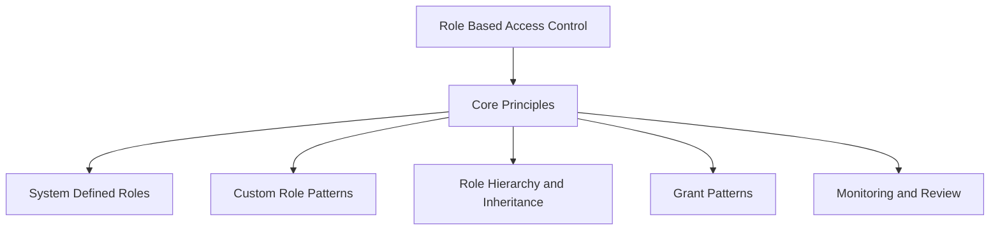
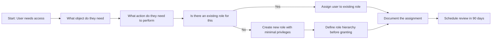
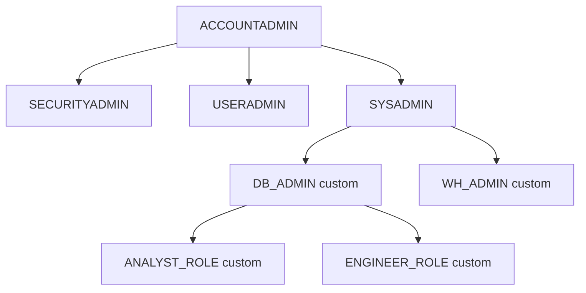
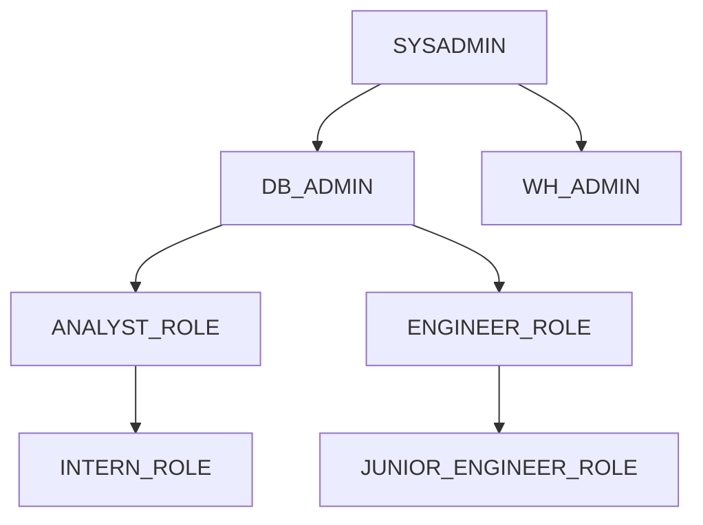
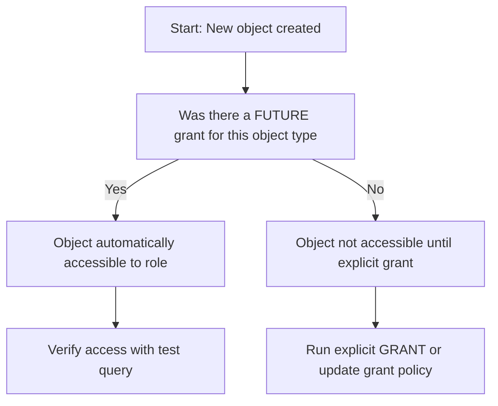
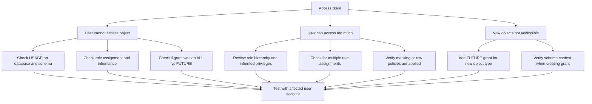
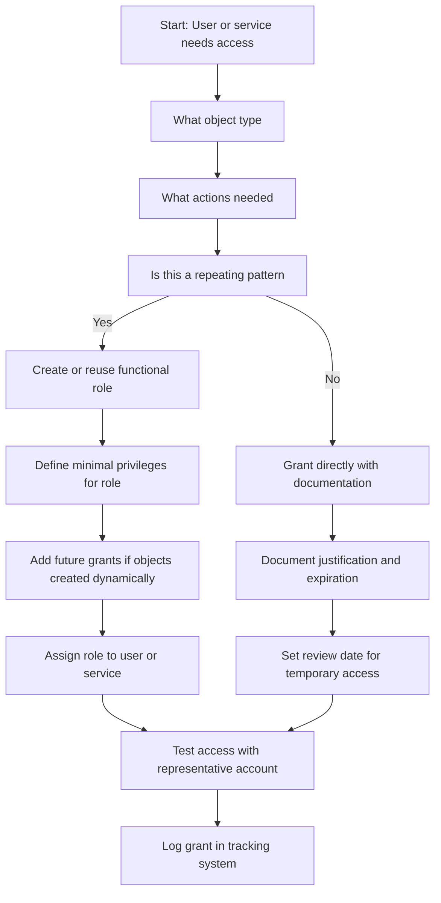

# Role Based Access Control RBAC in Snowflake



## Core Principles of RBAC

| Principle | What It Means | Why It Matters |
|-----------|--------------|----------------|
| Grant to roles not users | Assign privileges to roles then assign roles to users | Easier to audit update and reuse access patterns |
| Least privilege | Grant only what is required for the task | Reduces blast radius if credentials are compromised |
| Separate duties | Different roles for different functions | Prevents single person from having too much power |
| Default deny | No access unless explicitly granted | Forces intentional permission decisions |
| Inheritance flows down | Parent roles pass privileges to child roles | Simplifies management but requires careful design |



- You are probably tempted to grant access directly to users. Do not. Users change roles. Users leave. Roles persist.
- You are probably tempted to grant more access than needed just in case. Do not. Start with nothing. Add only what is required.
- You are probably tempted to let everyone use SYSADMIN for convenience. Do not. Create functional roles with narrow scope.
- RBAC is not a one time setup. It is a continuous practice of review and adjustment.

## System Defined Roles

| Role | Purpose | Key Privileges | Who Should Have It |
|------|---------|---------------|-------------------|
| SYSADMIN | Create and manage databases schemas objects | CREATE DATABASE CREATE SCHEMA CREATE TABLE | Platform engineers data platform team |
| SECURITYADMIN | Manage users roles grants | CREATE ROLE GRANT ROLE CREATE USER | Security team identity administrators |
| USERADMIN | Manage user accounts and passwords | CREATE USER ALTER USER RESET PASSWORD | HR IT helpdesk user provisioning team |
| ACCOUNTADMIN | Full account access including billing | All privileges including ORGADMIN | Very limited senior admins only |
| PUBLIC | Default role for all users | USAGE on public schema of each database | All users but grant minimal additional privileges |



| Common Mistake | What Happens | How To Fix |
|---------------|--------------|------------|
| Giving users ACCOUNTADMIN for daily work | Too much power increases risk of accidental damage | Create limited operational roles for day to day tasks |
| Leaving PUBLIC role with broad access | All users including future users get unintended access | Revoke unnecessary grants from PUBLIC immediately |
| Using SYSADMIN for everything | Too many users can create objects anywhere | Create functional roles with narrow scope |
| Not documenting system role usage | Audit cannot determine who has what access | Add comments to role assignments and review quarterly |

## Custom Role Design Patterns

### Functional Roles Pattern

```sql
-- Create role for business analysts
CREATE ROLE ANALYST_ROLE
  COMMENT = 'Read access to reporting schema for business analysts';

-- Grant minimal required privileges
GRANT USAGE ON DATABASE analytics TO ROLE ANALYST_ROLE;
GRANT USAGE ON SCHEMA analytics.reporting TO ROLE ANALYST_ROLE;
GRANT SELECT ON ALL TABLES IN SCHEMA analytics.reporting TO ROLE ANALYST_ROLE;
GRANT SELECT ON FUTURE TABLES IN SCHEMA analytics.reporting TO ROLE ANALYST_ROLE;

-- Assign role to users
GRANT ROLE ANALYST_ROLE TO USER analyst_jane;
GRANT ROLE ANALYST_ROLE TO USER analyst_bob;
```

| Role Name Pattern | Purpose | Example Grants |
|------------------|---------|---------------|
| ANALYST_ROLE | Read only access to reporting data | SELECT on tables and views |
| ENGINEER_ROLE | Read write access for data pipelines | SELECT INSERT UPDATE on staging tables |
| SCIENTIST_ROLE | Access for ML and exploration | SELECT on features EXECUTE on functions |
| ADMIN_ROLE | Operational tasks for a domain | USAGE MONITOR on warehouses and schemas |

### Environment Roles Pattern

```sql
-- Create environment specific roles
CREATE ROLE DEV_ROLE;
CREATE ROLE TEST_ROLE;
CREATE ROLE PROD_ROLE;

-- Grant access to respective environments
GRANT USAGE ON DATABASE analytics_dev TO ROLE DEV_ROLE;
GRANT USAGE ON DATABASE analytics_test TO ROLE TEST_ROLE;
GRANT USAGE ON DATABASE analytics_prod TO ROLE PROD_ROLE;

-- Prevent cross environment access
-- Do not grant PROD_ROLE to users who only need DEV_ROLE
```

| Environment | Role Pattern | Key Restriction |
|------------|-------------|----------------|
| Development | DEV_ROLE | Cannot access test or prod databases |
| Testing | TEST_ROLE | Can access dev for reference but not prod |
| Production | PROD_ROLE | Requires additional approval and MFA |
| Disaster Recovery | DR_ROLE | Read only access to prod replicas |

### Project Based Roles Pattern

```sql
-- Create role for specific project
CREATE ROLE PROJECT_ALPHA_ROLE
  COMMENT = 'Access for Project Alpha team expires 2024-12-31';

-- Grant time bound access
GRANT USAGE ON DATABASE project_alpha TO ROLE PROJECT_ALPHA_ROLE;
GRANT SELECT ON ALL TABLES IN SCHEMA project_alpha.raw TO ROLE PROJECT_ALPHA_ROLE;

-- Assign to project team members
GRANT ROLE PROJECT_ALPHA_ROLE TO USER alice;
GRANT ROLE PROJECT_ALPHA_ROLE TO USER bob;

-- Schedule review or automatic revocation
-- Use TASK or external scheduler to revoke after project end
```

| Use Case | Role Design | Governance Control |
|----------|------------|-------------------|
| Short term initiative | PROJECT_NAME_ROLE with expiration comment | Quarterly review or automatic revocation |
| External collaboration | PARTNER_NAME_ROLE with limited scope | Secure views and row access policies |
| Cross functional team | CROSS_FUNC_NAME_ROLE with union of privileges | Document which privileges come from which domain |

## Role Hierarchy and Inheritance



| Inheritance Rule | What Happens | Example |
|-----------------|--------------|---------|
| Role to role | Child role gets all privileges of parent | GRANT ROLE ANALYST_ROLE TO ROLE SENIOR_ANALYST_ROLE |
| Role to user | User gets all privileges of assigned role | GRANT ROLE ANALYST_ROLE TO USER analyst_jane |
| Multiple roles | User gets union of all assigned role privileges | User with ANALYST_ROLE and ENGINEER_ROLE gets both sets |
| Schema to object | Grants on schema do not auto apply to objects | Must grant on table separately or use future grants |
| Database to schema | USAGE on database does not grant USAGE on schemas | Must grant USAGE on each schema explicitly |

```sql
-- Example: Building a role hierarchy
CREATE ROLE DATA_USER_ROLE
  COMMENT = 'Base role for all data consumers';

GRANT USAGE ON DATABASE analytics TO ROLE DATA_USER_ROLE;
GRANT USAGE ON SCHEMA analytics.reporting TO ROLE DATA_USER_ROLE;
GRANT SELECT ON ALL TABLES IN SCHEMA analytics.reporting TO ROLE DATA_USER_ROLE;

CREATE ROLE SENIOR_ANALYST_ROLE
  COMMENT = 'Senior analysts with additional write access';

-- Inherit base privileges
GRANT ROLE DATA_USER_ROLE TO ROLE SENIOR_ANALYST_ROLE;

-- Add additional privileges
GRANT INSERT ON TABLE analytics.reporting.metrics TO ROLE SENIOR_ANALYST_ROLE;

-- Assign to users
GRANT ROLE SENIOR_ANALYST_ROLE TO USER senior_analyst_bob;
```

| Design Decision | Impact | Recommendation |
|----------------|--------|---------------|
| Deep hierarchy | Easier to manage but harder to audit | Limit to 3 levels maximum |
| Wide hierarchy | More roles but clearer separation | Use functional naming to avoid confusion |
| Cross inheritance | Role gets privileges from multiple parents | Document clearly and test with real accounts |
| Circular references | Role A grants to B and B grants to A | Avoid completely causes unpredictable behavior |

## Grant Patterns and Best Practices

### The USAGE Requirement

```sql
-- Incorrect: Granting SELECT on table without USAGE on parent
GRANT SELECT ON TABLE analytics.reporting.sales TO ROLE analyst_role;
-- This will fail or not work as expected

-- Correct: Grant USAGE on database and schema first
GRANT USAGE ON DATABASE analytics TO ROLE analyst_role;
GRANT USAGE ON SCHEMA analytics.reporting TO ROLE analyst_role;
GRANT SELECT ON TABLE analytics.reporting.sales TO ROLE analyst_role;
```

| Privilege | Required Parent Grants | Common Mistake |
|-----------|----------------------|----------------|
| SELECT on table | USAGE on database USAGE on schema | Forgetting schema level USAGE |
| INSERT on table | USAGE on database USAGE on schema | Assuming table grant includes parent access |
| EXECUTE on function | USAGE on database USAGE on schema | Not granting schema USAGE first |
| READ on stage | USAGE on database USAGE on schema | Overlooking parent object requirements |

### Future Grants Pattern

```sql
-- Grant on existing objects
GRANT SELECT ON ALL TABLES IN SCHEMA analytics.reporting TO ROLE analyst_role;

-- Grant on objects created in the future
GRANT SELECT ON FUTURE TABLES IN SCHEMA analytics.reporting TO ROLE analyst_role;

-- Important: Future grants apply only to objects created AFTER the grant statement
-- Objects created before need explicit grant or ALL grant
```

| Grant Type | What It Covers | When To Use |
|-----------|---------------|-------------|
| ON ALL TABLES | Tables that exist when grant runs | Initial setup or bulk permission updates |
| ON FUTURE TABLES | Tables created after grant runs | New pipelines that create tables dynamically |
| ON ALL AND FUTURE | Both existing and new tables | Most common pattern for team access |
| ON SPECIFIC TABLE | One named table only | One off access for specific use case |



### Grant Documentation Pattern

```sql
-- Add comments to roles and grants for audit trail
CREATE ROLE ANALYST_ROLE
  COMMENT = 'Read access to reporting schema for business analysts';

GRANT USAGE ON DATABASE analytics TO ROLE ANALYST_ROLE
  COMMENT = 'Granted 2024-01-15 by platform_team for Q1 reporting project';

GRANT SELECT ON ALL TABLES IN SCHEMA analytics.reporting TO ROLE ANALYST_ROLE
  COMMENT = 'Auto granted via future grants policy reviewed quarterly';
```

| Practice | Implementation | Benefit |
|----------|---------------|---------|
| Comment all roles | Add COMMENT to CREATE ROLE statements | Makes access reviews faster and more accurate |
| Document grant rationale | Include who why and when in grant comments | Provides audit trail for compliance requirements |
| Use naming conventions | Role names like ANALYST_READ_ONLY or ETL_WRITE | Makes purpose clear without reading documentation |
| Group related grants | Put related grants in same script or migration | Easier to review revoke or replicate |
| Version control grants | Store DDL in Git with change history | Track who changed what and when |

## Monitoring and Review Practices

### Querying Grant Information

```sql
-- Find all roles assigned to a specific user
SELECT granted_role
FROM SNOWFLAKE.ACCOUNT_USAGE.GRANTS_TO_USERS
WHERE grantee_name = 'ANALYST_JANE'
  AND deleted_on IS NULL;

-- Find all privileges granted to a specific role
SELECT privilege, granted_on, name as object_name
FROM SNOWFLAKE.ACCOUNT_USAGE.GRANTS_TO_ROLES
WHERE grantee_name = 'ANALYST_ROLE'
  AND deleted_on IS NULL;

-- Find roles with no assigned users
SELECT role_name
FROM SNOWFLAKE.ACCOUNT_USAGE.ROLES
WHERE role_name NOT IN (
  SELECT DISTINCT granted_role
  FROM SNOWFLAKE.ACCOUNT_USAGE.GRANTS_TO_USERS
  WHERE deleted_on IS NULL
)
  AND role_name NOT IN ('SYSADMIN', 'SECURITYADMIN', 'USERADMIN', 'ACCOUNTADMIN');
```

| View | What It Tracks | Retention | Key Use Case |
|------|---------------|-----------|--------------|
| GRANTS_TO_USERS | Role assignments to users | Until revoked | Audit who has what roles |
| GRANTS_TO_ROLES | Privilege grants to roles | Until revoked | Review role permissions |
| ACCESS_HISTORY | Object level access by users roles | 365 days | Detect unusual access patterns |
| LOGIN_HISTORY | User login attempts and outcomes | 365 days | Monitor authentication events |

### Automated Review Patterns

```sql
-- Create task to review stale grants quarterly
CREATE OR REPLACE TASK review_stale_grants
  WAREHOUSE = admin_wh
  SCHEDULE = 'USING CRON 0 0 1 */3 *'  -- First day of each quarter
AS
  -- Find grants not used in last 90 days
  SELECT
    g.grantee_name,
    g.privilege,
    g.name as object_name,
    MAX(a.start_time) as last_access
  FROM SNOWFLAKE.ACCOUNT_USAGE.GRANTS_TO_ROLES g
  LEFT JOIN SNOWFLAKE.ACCOUNT_USAGE.ACCESS_HISTORY a
    ON g.name = a.object_name
  WHERE g.deleted_on IS NULL
    AND a.start_time < DATEADD(day, -90, CURRENT_TIMESTAMP)
  GROUP BY g.grantee_name, g.privilege, g.name
  HAVING MAX(a.start_time) IS NULL OR MAX(a.start_time) < DATEADD(day, -90, CURRENT_TIMESTAMP);
```

| Review Task | Frequency | Action If Findings |
|------------|-----------|-------------------|
| Roles with no users | Quarterly | Revoke or document why role exists without users |
| Grants to PUBLIC role | Monthly | Revoke unless explicitly required for application |
| Over privileged service accounts | Monthly | Reduce to minimum required privileges |
| Stale future grants | Quarterly | Review if schema still needs automatic grants |
| Cross environment grants | Monthly | Ensure dev roles cannot access prod objects |

## Common RBAC Pitfalls and Fixes

| Pitfall | What Happens | How To Fix |
|---------|--------------|------------|
| Granting to PUBLIC role | All users get access including future users | Never grant sensitive privileges to PUBLIC |
| Using ACCOUNTADMIN for daily work | Too much power increases risk of accidental damage | Create limited roles for operational tasks |
| Forgetting USAGE on parent objects | Grant SELECT on table but not USAGE on schema | Always grant USAGE on database and schema first |
| Over using SYSADMIN | Too many users can create objects anywhere | Create functional roles with narrow scope |
| Not testing role combinations | User with multiple roles gets unexpected access | Test with representative user accounts before deploying |
| Skipping future grants | New objects require manual grant every time | Use FUTURE grants for predictable object creation patterns |
| Ignoring inheritance | Child role gets more access than intended | Document role hierarchy and review grants after changes |



## Decision Framework for Role Design



| Question | If Yes | If No |
|----------|--------|-------|
| Is this a team or function | Create functional role | Consider direct grant with documentation |
| Will new objects be created | Add future grants | Grant on ALL existing objects |
| Does access cross environments | Create separate roles per environment | Single role may be sufficient |
| Is data sensitive | Apply masking or row policies | Standard grants may be sufficient |
| Is this for automation | Use service account with narrow role | Interactive user role pattern |

## Key Principles to Remember

- Grant to roles not users. Roles are reusable. Users change. Roles persist.
- Least privilege is not a suggestion. It is the baseline. Start with nothing. Add only what is required.
- USAGE is required on parent objects. You cannot access a table without USAGE on its schema and database.
- Future grants apply only to objects created after the grant. Existing objects need explicit grants.
- Inheritance is powerful but dangerous. Document your role hierarchy. Test with real users.
- Comments are your audit trail. Document who why and when for every significant grant.
- Review access regularly. Roles accumulate. People change jobs. Access should change too.
- Security is a process. Not a configuration. Not a product. A continuous practice of review and adjustment.

## Bottom Line

- RBAC in Snowflake means you control access through roles not individual users
- Start with system roles. Add custom roles only when you have a clear pattern
- Design your hierarchy before you grant. Changing it later is hard
- Document everything. Comments and version control make audits possible
- Test with real accounts. Assumptions about inheritance often fail in practice
- Review quarterly. Access drifts over time. Regular reviews catch problems early
- Least privilege is not optional. It is the foundation of secure access control

Think of RBAC like organizing a library:
- Roles are your membership cards. Each card type gets different borrowing privileges
- Privileges are the books you can check out. Not everyone gets access to every book
- Hierarchy is like a senior membership that includes all junior privileges plus more
- Future grants are like automatic enrollment when new books arrive in your category
- Review is like checking who still has books overdue. Revoke access when no longer needed

Design your access like you design your library. Clear categories. Appropriate privileges. Regular check ins. That is how RBAC works well in Snowflake.
