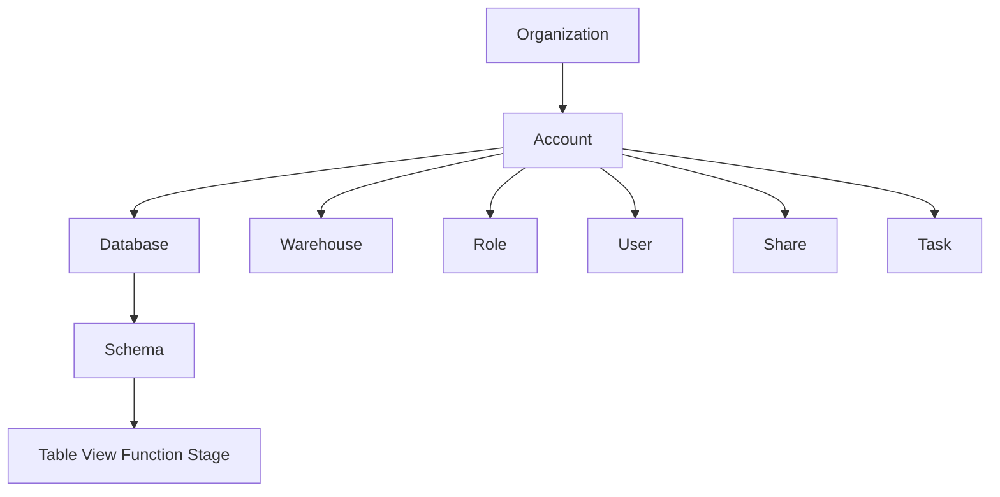
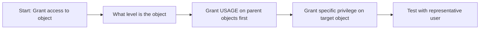
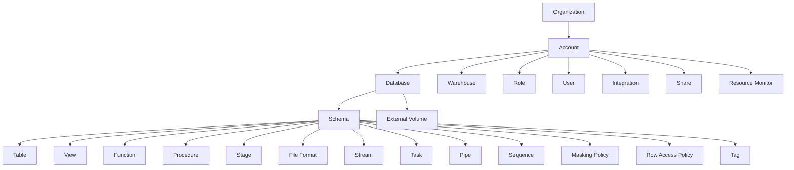
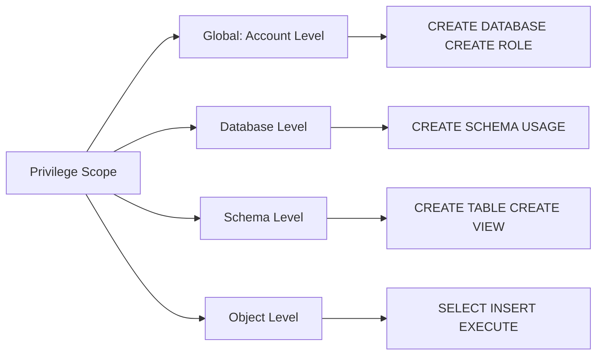
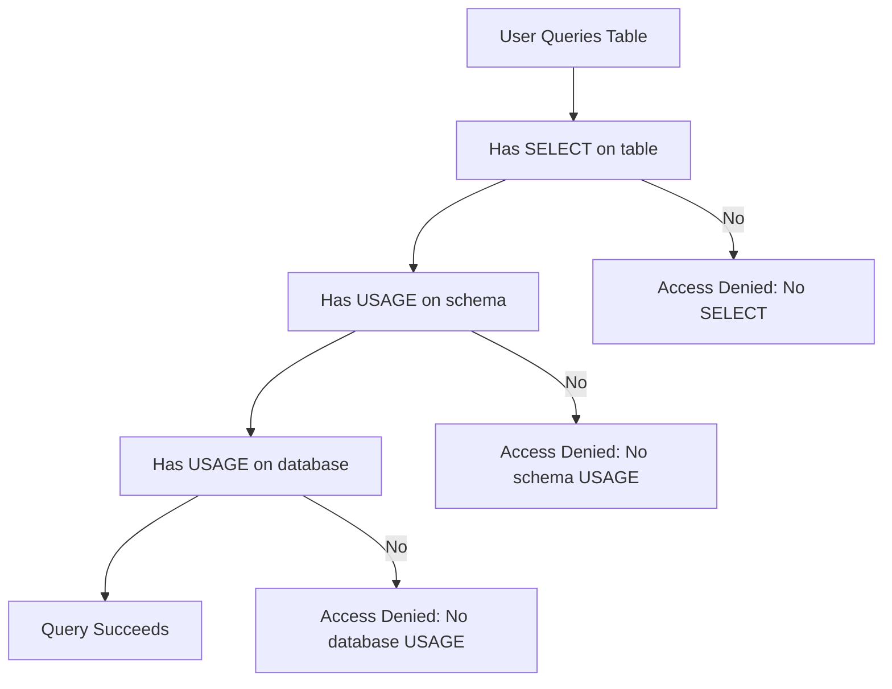
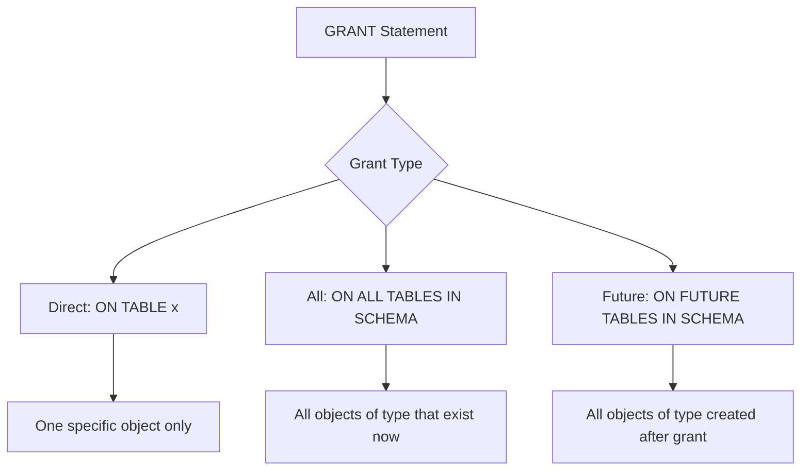
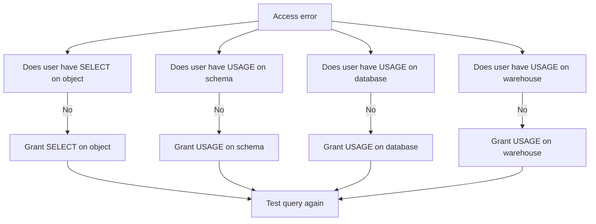
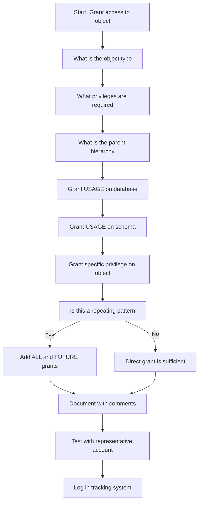

# Securable Object Hierarchy in Snowflake



## What Is a Securable Object

| Term | Simple Definition | Example |
|------|-----------------|---------|
| Securable object | Anything you can grant access to | Table view function database warehouse role |
| Privilege | A specific action you can allow | SELECT INSERT USAGE CREATE |
| Grant | The act of giving a privilege to a role or user | GRANT SELECT ON TABLE x TO ROLE y |
| Hierarchy | The parent child relationship between objects | Database contains schema. Schema contains table |

- Not everything in Snowflake is securable. Only objects that hold data or control access can have grants
- You cannot grant access to a table without granting access to its parent schema and database
- Privileges do not automatically flow down. You must grant at each level explicitly or use future grants
- Understanding the hierarchy prevents access errors and security gaps



## The Full Hierarchy Tree



## Privilege Scope by Hierarchy Level

| Level | Object Types | Key Privileges | Grant Scope |
|-------|-------------|---------------|-------------|
| Organization | Organization account | ORGADMIN privileges | Cross account management |
| Account | Account itself | CREATE DATABASE CREATE ROLE MONITOR USAGE | Account wide |
| Database | Database | USAGE CREATE SCHEMA MONITOR | All schemas in database |
| Schema | Schema | USAGE CREATE TABLE CREATE VIEW CREATE FUNCTION | All objects in schema |
| Object | Table View Function Stage | SELECT INSERT EXECUTE READ WRITE | Specific object only |



## The USAGE Requirement: Most Common Mistake



| Scenario | What You Granted | What You Forgot | Result |
|----------|-----------------|-----------------|--------|
| Grant SELECT on table only | GRANT SELECT ON TABLE sales TO ROLE analyst | USAGE on schema and database | Query fails with access error |
| Grant USAGE on database only | GRANT USAGE ON DATABASE analytics TO ROLE analyst | USAGE on schema and SELECT on table | Query fails cannot access specific object |
| Grant full chain correctly | GRANT USAGE ON DB GRANT USAGE ON SCHEMA GRANT SELECT ON TABLE | Nothing | Query succeeds |

```sql
-- Correct pattern for granting table access
GRANT USAGE ON DATABASE analytics TO ROLE analyst_role;
GRANT USAGE ON SCHEMA analytics.reporting TO ROLE analyst_role;
GRANT SELECT ON TABLE analytics.reporting.sales TO ROLE analyst_role;

-- Or grant on all objects in schema at once
GRANT USAGE ON DATABASE analytics TO ROLE analyst_role;
GRANT USAGE ON SCHEMA analytics.reporting TO ROLE analyst_role;
GRANT SELECT ON ALL TABLES IN SCHEMA analytics.reporting TO ROLE analyst_role;
GRANT SELECT ON FUTURE TABLES IN SCHEMA analytics.reporting TO ROLE analyst_role;
```

## Privilege Inheritance Rules

| Rule | What Happens | Example |
|------|-------------|---------|
| No automatic downward inheritance | Grant on database does not grant on schemas or tables | Must grant at each level explicitly |
| Role inheritance flows down | Child role gets all privileges of parent role | GRANT ROLE analyst TO ROLE senior_analyst |
| Future grants apply forward | ON FUTURE grants cover objects created after grant | New tables automatically accessible |
| ALL grants cover existing | ON ALL grants cover objects that exist now | Bulk grant to current objects |
| Revoke breaks the chain | REVOKE at any level removes that access immediately | REVOKE USAGE ON SCHEMA blocks all objects in it |



```sql
-- Timeline example of ALL vs FUTURE grants

-- Time T1: Create grant on existing tables
GRANT SELECT ON ALL TABLES IN SCHEMA raw.landing TO ROLE etl_role;
-- etl_role can now query: orders_2023 customers_2023

-- Time T2: Create new table
CREATE TABLE raw.landing.orders_2024 AS SELECT ...;
-- etl_role CANNOT query orders_2024 yet

-- Time T3: Add future grant
GRANT SELECT ON FUTURE TABLES IN SCHEMA raw.landing TO ROLE etl_role;
-- Now etl_role CAN query orders_2024 and any future tables
```

## Securable Object Types by Category

### Data Objects

| Object | Parent | Key Privileges | Typical Grant Pattern |
|--------|--------|---------------|---------------------|
| Table | Schema | SELECT INSERT UPDATE DELETE TRUNCATE REFERENCES | GRANT SELECT ON TABLE x TO ROLE y |
| View | Schema | SELECT REFERENCES | GRANT SELECT ON VIEW x TO ROLE y |
| Secure View | Schema | SELECT REFERENCES | Same as view but definition hidden |
| External Table | Schema | SELECT | GRANT SELECT ON EXTERNAL TABLE x TO ROLE y |
| Dynamic Table | Schema | SELECT | GRANT SELECT ON DYNAMIC TABLE x TO ROLE y |

### Compute and Execution Objects

| Object | Parent | Key Privileges | Typical Grant Pattern |
|--------|--------|---------------|---------------------|
| Warehouse | Account | USAGE MONITOR OPERATE | GRANT USAGE ON WAREHOUSE x TO ROLE y |
| Function | Schema | USAGE EXECUTE | GRANT USAGE ON FUNCTION x TO ROLE y |
| Procedure | Schema | EXECUTE | GRANT EXECUTE ON PROCEDURE x TO ROLE y |
| Task | Schema | EXECUTE MONITOR OPERATE | GRANT EXECUTE ON TASK x TO ROLE y |
| Pipe | Schema | EXECUTE MONITOR | GRANT EXECUTE ON PIPE x TO ROLE y |

### Data Management Objects

| Object | Parent | Key Privileges | Typical Grant Pattern |
|--------|--------|---------------|---------------------|
| Stage | Schema | USAGE READ WRITE | GRANT READ ON STAGE x TO ROLE y |
| File Format | Schema | USAGE | GRANT USAGE ON FILE FORMAT x TO ROLE y |
| Stream | Schema | SELECT MONITOR | GRANT SELECT ON STREAM x TO ROLE y |
| Sequence | Schema | USAGE SELECT | GRANT USAGE ON SEQUENCE x TO ROLE y |

### Governance Objects

| Object | Parent | Key Privileges | Typical Grant Pattern |
|--------|--------|---------------|---------------------|
| Masking Policy | Schema | APPLY OVERRIDE | GRANT APPLY ON MASKING POLICY x TO ROLE y |
| Row Access Policy | Schema | APPLY | GRANT APPLY ON ROW ACCESS POLICY x TO ROLE y |
| Tag | Schema | APPLY | GRANT APPLY ON TAG x TO ROLE y |
| Share | Account | USAGE | GRANT USAGE ON SHARE x TO ROLE y |

## Grant Patterns That Work

### Pattern: Full Schema Access for Team

```sql
-- Grant a team full access to a schema for development
GRANT USAGE ON DATABASE dev_db TO ROLE dev_team;
GRANT USAGE ON SCHEMA dev_db.staging TO ROLE dev_team;

-- Grant all current and future object privileges
GRANT CREATE TABLE ON SCHEMA dev_db.staging TO ROLE dev_team;
GRANT CREATE VIEW ON SCHEMA dev_db.staging TO ROLE dev_team;
GRANT SELECT INSERT UPDATE DELETE ON ALL TABLES IN SCHEMA dev_db.staging TO ROLE dev_team;
GRANT SELECT INSERT UPDATE DELETE ON FUTURE TABLES IN SCHEMA dev_db.staging TO ROLE dev_team;
```

| Step | Purpose | Why It Works |
|------|---------|--------------|
| Grant USAGE on database | Allows role to see and use the database | Required parent privilege |
| Grant USAGE on schema | Allows role to see and use the schema | Required parent privilege |
| Grant CREATE privileges | Allows team to build new objects | Enables development workflow |
| Grant DML on ALL and FUTURE | Allows read write on current and new tables | Prevents grant gaps as schema evolves |

### Pattern: Read Only Access for Analysts

```sql
-- Grant analysts read only access to reporting schema
GRANT USAGE ON DATABASE analytics TO ROLE analyst_role;
GRANT USAGE ON SCHEMA analytics.reporting TO ROLE analyst_role;
GRANT SELECT ON ALL TABLES IN SCHEMA analytics.reporting TO ROLE analyst_role;
GRANT SELECT ON ALL VIEWS IN SCHEMA analytics.reporting TO ROLE analyst_role;
GRANT SELECT ON FUTURE TABLES IN SCHEMA analytics.reporting TO ROLE analyst_role;
GRANT SELECT ON FUTURE VIEWS IN SCHEMA analytics.reporting TO ROLE analyst_role;
```

| Consideration | Implementation | Benefit |
|--------------|---------------|---------|
| No write access | Grant SELECT only not INSERT UPDATE | Prevents accidental data modification |
| Future grants included | Add ON FUTURE for tables and views | New reports automatically accessible |
| Schema level not table level | Grant on schema not individual tables | Easier to manage as schema grows |

### Pattern: Service Account for ETL Pipeline

```sql
-- Create narrow role for ETL service
CREATE ROLE etl_service_role
  COMMENT = 'Write access to staging schema for ETL pipeline';

-- Grant minimal required privileges
GRANT USAGE ON DATABASE raw TO ROLE etl_service_role;
GRANT USAGE ON SCHEMA raw.landing TO ROLE etl_service_role;
GRANT READ ON STAGE raw.landing.files TO ROLE etl_service_role;
GRANT INSERT ON TABLE raw.landing.events TO ROLE etl_service_role;
GRANT USAGE ON WAREHOUSE etl_wh TO ROLE etl_service_role;

-- Assign to service account only
GRANT ROLE etl_service_role TO USER etl_pipeline_svc;
```

| Principle | Implementation | Why It Matters |
|-----------|---------------|----------------|
| Least privilege | Grant only INSERT not UPDATE DELETE | Reduces blast radius if credentials leak |
| No interactive access | Assign only to service account not humans | Prevents misuse of automated credentials |
| Warehouse isolation | Dedicated warehouse for ETL | Prevents ETL jobs from blocking user queries |

## Common Hierarchy Pitfalls

| Pitfall | What Happens | How To Fix |
|---------|--------------|------------|
| Granting object privilege without parent USAGE | Query fails with obscure access error | Always grant USAGE on database and schema first |
| Using ONLY FUTURE grants | Existing objects remain inaccessible | Add ALL grant before FUTURE grant |
| Granting at wrong schema level | Grants apply to wrong objects | Verify current schema context before running grant |
| Forgetting warehouse USAGE | User can see data but cannot run queries | GRANT USAGE ON WAREHOUSE x TO ROLE y |
| Over granting with PUBLIC role | All users get unintended access | Revoke sensitive grants from PUBLIC immediately |
| Not testing with real account | Assumptions about access fail in practice | Test grants with representative user before deploying |



## Querying the Hierarchy for Audits

```sql
-- Find all privileges granted to a role with object hierarchy
SELECT
  g.privilege,
  g.granted_on,
  g.name as object_name,
  g.grantee_name,
  d.database_name,
  s.schema_name
FROM SNOWFLAKE.ACCOUNT_USAGE.GRANTS_TO_ROLES g
LEFT JOIN SNOWFLAKE.ACCOUNT_USAGE.DATABASES d ON g.name = d.database_name
LEFT JOIN SNOWFLAKE.ACCOUNT_USAGE.SCHEMATA s ON g.name = s.schema_name
WHERE g.grantee_name = 'ANALYST_ROLE'
  AND g.deleted_on IS NULL;

-- Find objects without expected grants
SELECT
  t.table_name,
  t.schema_name,
  t.database_name
FROM SNOWFLAKE.ACCOUNT_USAGE.TABLES t
WHERE t.deleted_on IS NULL
  AND NOT EXISTS (
    SELECT 1
    FROM SNOWFLAKE.ACCOUNT_USAGE.GRANTS_TO_ROLES g
    WHERE g.name = t.table_name
      AND g.granted_on = 'TABLE'
      AND g.grantee_name = 'ANALYST_ROLE'
      AND g.deleted_on IS NULL
  );
```

| View | What It Shows | Key Use Case |
|------|--------------|--------------|
| GRANTS_TO_ROLES | Privileges granted to roles | Audit role permissions |
| GRANTS_TO_USERS | Roles assigned to users | Audit user access |
| DATABASES | All databases in account | Inventory and hierarchy mapping |
| SCHEMATA | All schemas with parent database | Schema level access review |
| TABLES | All tables with schema and database | Object level access audit |
| ACCESS_HISTORY | Who accessed what and when | Detect unusual patterns |

## Best Practices for Hierarchy Management

- Always grant USAGE on parent objects first. Database then schema then object.
- Use ALL and FUTURE grants together. Cover existing and new objects in one policy.
- Document grant rationale in comments. Include who why and when for every significant grant.
- Test with representative accounts. Verify access works before assuming it does.
- Review grants quarterly. Access drifts over time. Catch problems before incidents.
- Separate environments with separate databases. Prevent dev roles from accessing prod.
- Use naming conventions for roles. ANALYST_READ_ONLY is clearer than ROLE_12345.
- Version control your grants. Store DDL in Git with change history and approvals.

```sql
-- Example: Documented grant script with hierarchy
-- Purpose: Grant analyst read access to Q4 reporting schema
-- Owner: data_platform_team
-- Date: 2024-01-15
-- Review: Quarterly by security team

GRANT USAGE ON DATABASE analytics TO ROLE analyst_role
  COMMENT = 'Q4 reporting access granted 2024-01-15 by data_platform_team';

GRANT USAGE ON SCHEMA analytics.q4_reports TO ROLE analyst_role
  COMMENT = 'Schema access for Q4 reporting dashboard';

GRANT SELECT ON ALL TABLES IN SCHEMA analytics.q4_reports TO ROLE analyst_role
  COMMENT = 'Read access to existing Q4 tables';

GRANT SELECT ON FUTURE TABLES IN SCHEMA analytics.q4_reports TO ROLE analyst_role
  COMMENT = 'Auto access to new Q4 tables created by pipelines';
```

## Decision Framework for Grant Design



| Question | If Yes | If No |
|----------|--------|-------|
| Is this a team or function | Create functional role | Consider direct grant with documentation |
| Will new objects be created | Add ALL and FUTURE grants | Direct grant on specific object |
| Does access cross environments | Create separate grants per environment | Single grant may be sufficient |
| Is data sensitive | Apply masking or row policies | Standard grants may be sufficient |

## Key Principles to Remember

- Hierarchy matters. You cannot access a child without access to its parents.
- USAGE is the gateway privilege. Without it nothing below works.
- Grants do not auto inherit down. You must grant at each level.
- Role inheritance flows down. Child roles get parent privileges.
- Future grants cover what comes next. ALL grants cover what exists now.
- Test before you trust. Verify access with real accounts not assumptions.
- Document everything. Comments and version control enable audits.
- Review regularly. Access changes over time. Catch drift before it becomes risk.

## Bottom Line

- The securable object hierarchy is the map of what you can protect in Snowflake
- Understanding parent child relationships prevents access errors and security gaps
- USAGE on database and schema is required before any object level grant works
- ALL and FUTURE grants together cover both current and new objects
- Document test and review. Access control is a practice not a one time setup
- Start with least privilege. Add access only when justified. Remove when no longer needed

Think of the hierarchy like a building with rooms and items:
- The account is the building. You need a badge to enter.
- The database is a floor. You need floor access to walk there.
- The schema is a room on that floor. You need room access to enter.
- The table is a file cabinet in that room. You need cabinet access to open it.
- The privilege is the key. SELECT opens to read. INSERT opens to add.

You cannot open the cabinet without entering the room. You cannot enter the room without reaching the floor. You cannot reach the floor without entering the building. Grant access at each level. Test the path. Document who has which keys. Review regularly. That is how the hierarchy works in Snowflake.
