# Authentication Methods: MFA SSO OAuth in Snowflake

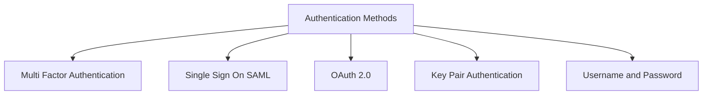

## Authentication Method Comparison

| Method | Setup Effort | Security Level | Best For | Not Good For |
|--------|-------------|---------------|----------|--------------|
| Username and Password | Low | Medium | Learning personal use quick tests | Production automation service accounts |
| Key Pair | Medium | High | ETL pipelines scripts service accounts | Interactive human users |
| OAuth 2.0 | High | High | Web apps mobile apps API access | One off scripts ad hoc queries |
| SSO with SAML | High | High | Corporate employees with IdP | External users without IdP access |
| External Browser | Low | Medium | Interactive CLI or notebook use | Headless automation scheduled jobs |

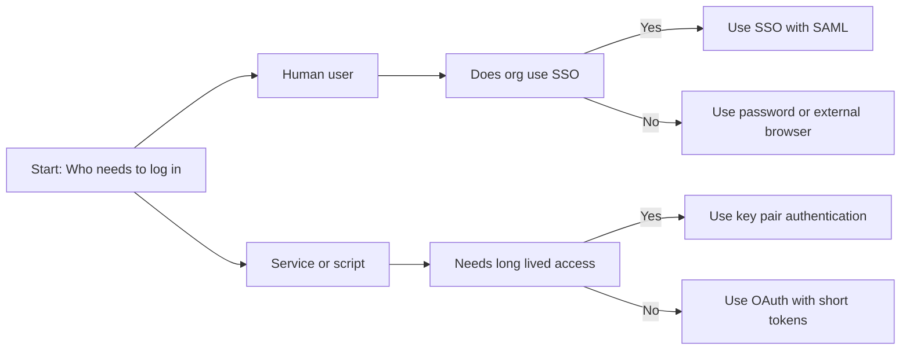

## Multi Factor Authentication MFA

### What MFA Does

| Concept | Simple Explanation |
|---------|------------------|
| First factor | Something you know like a password |
| Second factor | Something you have like a phone or token |
| MFA | Requires both factors to log in |
| MFA caching | Remembering MFA for a time window |

### MFA Methods in Snowflake

| Method | How It Works | Security Level | User Experience |
|--------|-------------|---------------|----------------|
| Duo Push | Push notification to phone app | High | Tap approve on phone |
| Okta Verify | App notification or code | High | Open app and approve |
| Google Authenticator | Time based code from app | Medium High | Type 6 digit code |
| SMS code | Text message with code | Medium | Type code from text |
| Email code | Email with verification code | Low Medium | Type code from email |

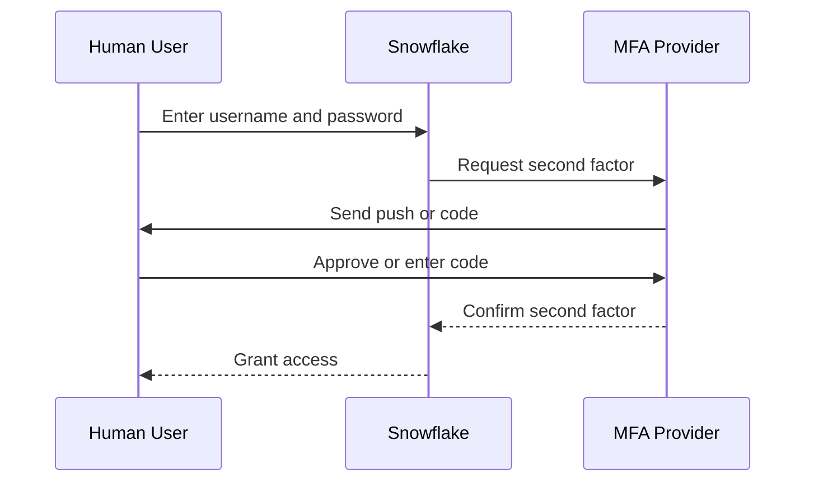

### Enforcing MFA

```sql
-- Require MFA for specific user
ALTER USER analyst_jane SET MFA_ENROLLMENT = REQUIRED;

-- Disable MFA caching for sensitive roles
ALTER ACCOUNT SET ALLOW_CLIENT_MFA_CACHING = FALSE;

-- Check MFA status for all users
SELECT name, mfa_enrollment, last_success_login
FROM SNOWFLAKE.ACCOUNT_USAGE.USERS
WHERE mfa_enrollment IS NOT NULL;
```

### MFA Best Practices

- Require MFA for all interactive users. Passwords alone are not enough
- Use app based MFA not SMS. SMS can be intercepted via SIM swap attacks
- Do not cache MFA for admin roles. Force re authentication for privileged actions
- Monitor MFA failures. Look for brute force patterns in LOGIN_HISTORY
- Document recovery steps. Users need a path if they lose their MFA device

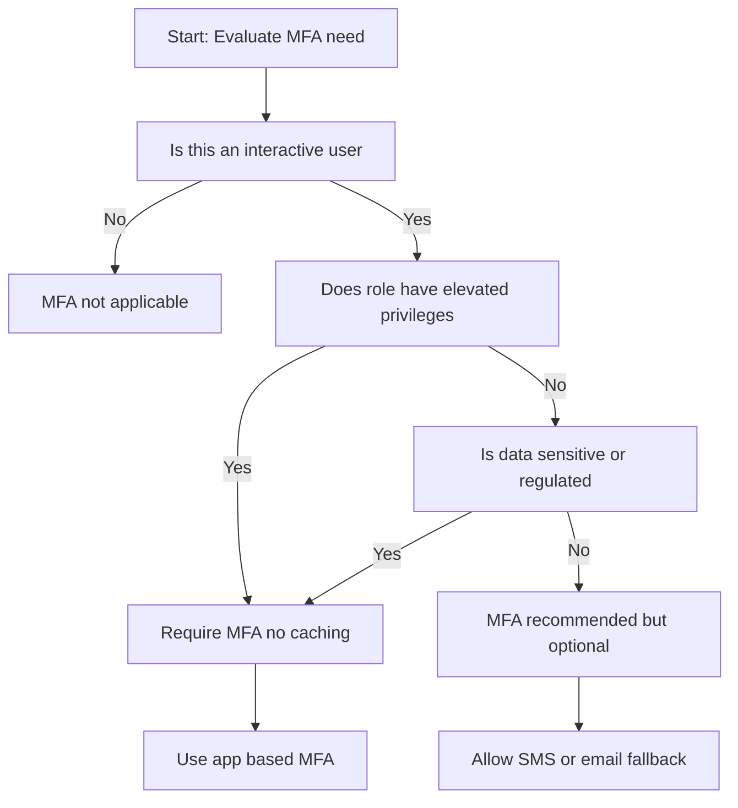

## Single Sign On SSO with SAML

### What SSO Does

| Concept | Simple Explanation |
|---------|------------------|
| Identity Provider IdP | Central system that verifies user identity |
| SAML | Standard protocol for sharing authentication |
| SSO | Log in once access many systems |
| Assertion | Signed message from IdP confirming identity |

### How SSO Flow Works

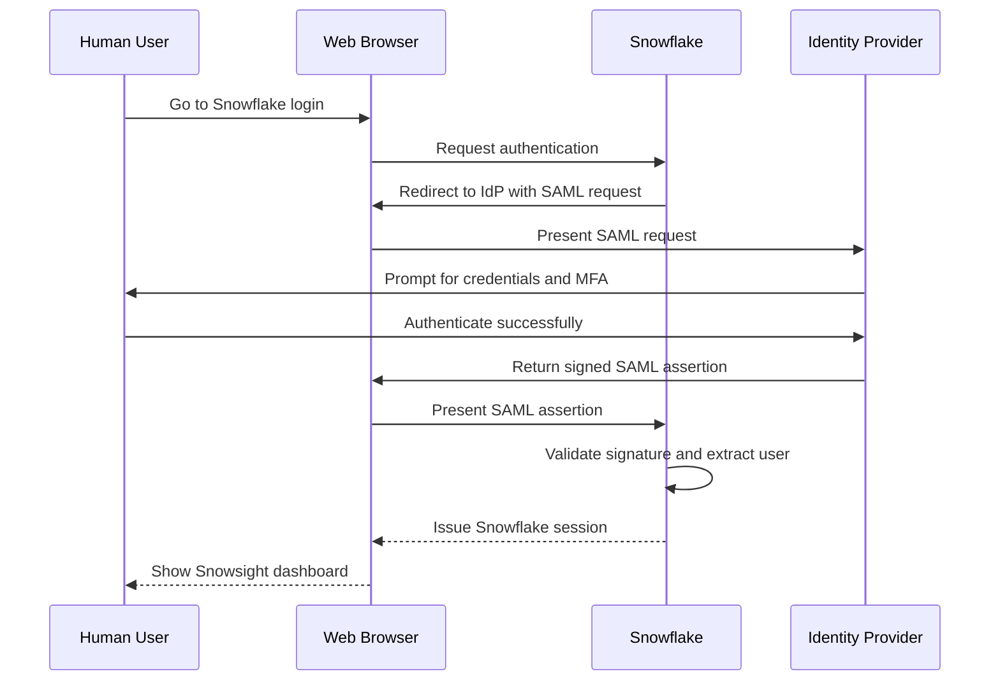

### Configuration Steps

```sql
-- Create SAML security integration
CREATE OR REPLACE SECURITY INTEGRATION my_sso_integration
  TYPE = SAML2
  ENABLED = TRUE
  SAML2_ISSUER = 'https://idp.example.com/saml'
  SAML2_SSO_URL = 'https://idp.example.com/sso'
  SAML2_PROVIDER = 'CUSTOM'
  SAML2_X509_CERT = 'MIIDXTCCAkWgAwIBAgIJ...'
  SAML2_SP_ISSUER = 'snowflake_account';

-- Get Snowflake metadata for IdP configuration
SELECT SYSTEM$GENERATE_SAML_SP_METADATA('my_sso_integration');
```

### User and Role Mapping

| IdP Attribute | Snowflake Field | Example |
|--------------|----------------|---------|
| NameID | User login name | jane.doe@company.com |
| Email | User email | jane.doe@company.com |
| Groups | Roles to assign | analytics_team engineering_team |
| FirstName | User first name | Jane |
| LastName | User last name | Doe |

```sql
-- Example: IdP sends group analytics_team
-- Snowflake maps to role ANALYST_ROLE via SCIM provisioning

-- Check user attributes from SSO
SELECT name, email, displayed_name
FROM SNOWFLAKE.ACCOUNT_USAGE.USERS
WHERE authentication_method = 'SAML2';
```

### When To Use SSO

| Scenario | Use SSO | Why |
|----------|---------|-----|
| Corporate employees with IdP | Yes | Centralized identity and MFA |
| External contractors without IdP | No | They cannot authenticate via your IdP |
| Mixed internal and external users | Maybe | Use SSO for internal password for external |
| Compliance requiring MFA | Yes | MFA enforced at IdP level |
| Small team without IdP | No | Password or external browser is simpler |

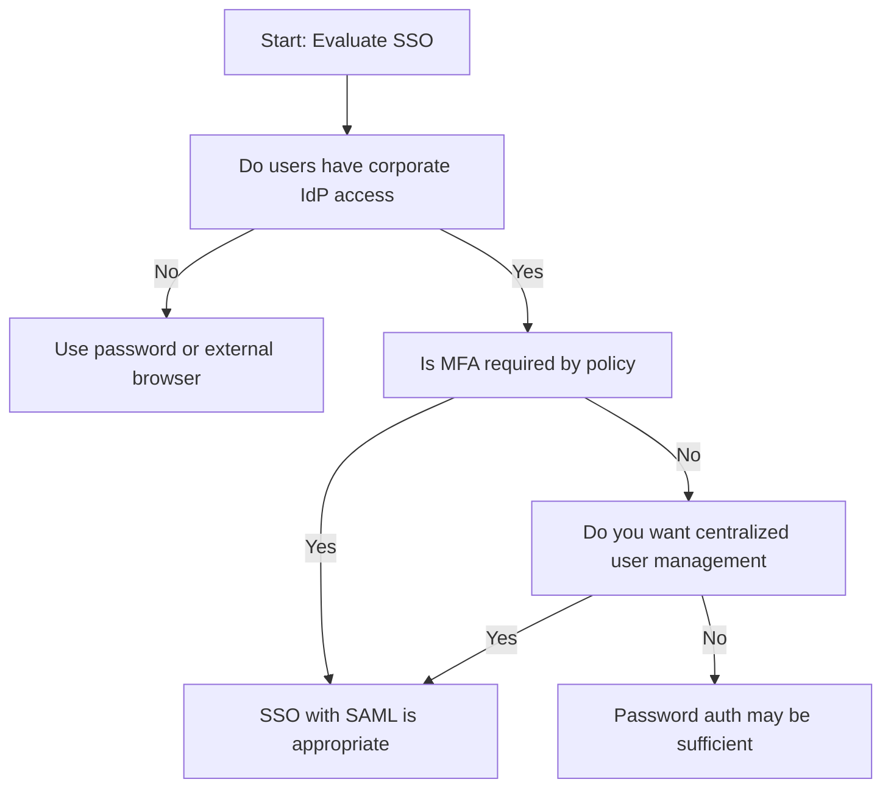

## OAuth 2.0 Authentication

### What OAuth Does

| Concept | Simple Explanation |
|---------|------------------|
| Access token | Short lived credential for API calls |
| Refresh token | Long lived token to get new access tokens |
| Client credentials | App authenticates itself without user |
| Authorization code | User approves app access via redirect |

### OAuth Flow Types

| Flow | When To Use | Key Characteristic |
|------|-------------|-------------------|
| Authorization Code | User interactive web apps | Redirects user to IdP for login |
| Client Credentials | Service to service calls | App authenticates itself no user context |
| Refresh Token | Long running user sessions | Use refresh token to get new access token |
| JWT Bearer | Assertion based authentication | App signs JWT to prove identity |

### How OAuth Flow Works

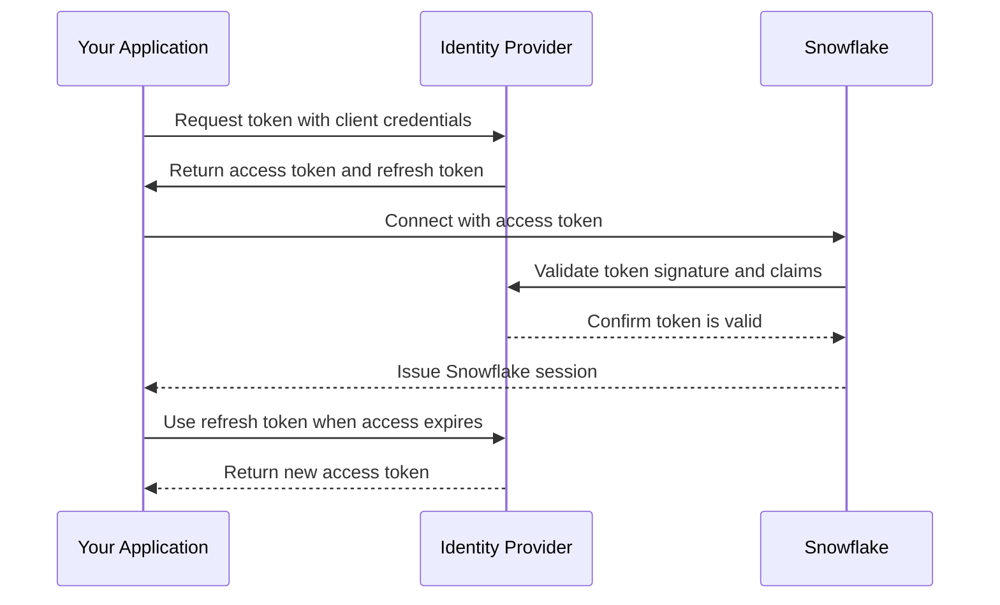

### Configuration Steps

```sql
-- Create OAuth security integration
CREATE OR REPLACE SECURITY INTEGRATION my_oauth_integration
  TYPE = OAUTH
  ENABLED = TRUE
  OAUTH_CLIENT = CUSTOM
  OAUTH_REDIRECT_URI = 'https://your-app.com/callback'
  OAUTH_ISSUE_REFRESH_TOKENS = TRUE
  OAUTH_REFRESH_TOKEN_VALIDITY = 7776000;

-- Get client credentials for your app
SELECT SYSTEM$SHOW_OAUTH_CLIENT_SECRETS('my_oauth_integration');
```

### Connecting with OAuth

```python
# Python connector example
import snowflake.connector

conn = snowflake.connector.connect(
    user='api_user',
    account='myaccount',
    authenticator='oauth',
    token='your_access_token_here'
)

# Handle token refresh in production code
# When access token expires use refresh token to get new one
```

### When To Use OAuth

| Scenario | Use OAuth | Why |
|----------|-----------|-----|
| Web app with user login | Yes | Standard flow for browser based apps |
| Mobile app connecting to Snowflake | Yes | Handles token refresh automatically |
| Microservice calling Snowflake API | Yes | Client credentials flow for service auth |
| One off script or ad hoc query | No | Overhead not justified for simple use |
| Internal tool with few users | Maybe | Password or key pair may be simpler |

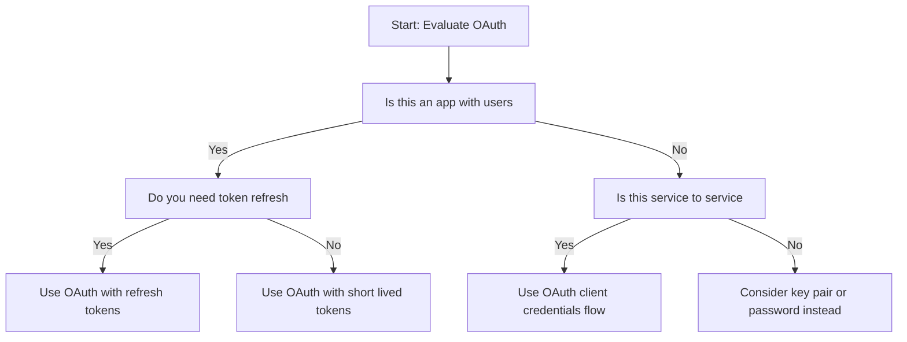

## Key Pair Authentication Quick Reference

### Setup Steps

```bash
# Generate RSA key pair
openssl genrsa -out rsa_key.pem 2048
openssl rsa -in rsa_key.pem -pubout -out rsa_key_pub.pem

# Extract public key for Snowflake remove headers
cat rsa_key_pub.pem | grep -v "BEGIN\|END" | tr -d '\n'

# Assign public key to user
ALTER USER etl_service SET RSA_PUBLIC_KEY = 'MIIBIjANBgkq...';

# Connect with private key
snowsql -a myaccount -u etl_service --private-key-path rsa_key.pem
```

### Key Rotation Pattern

```sql
-- Add new key while keeping old one active
ALTER USER etl_service SET RSA_PUBLIC_KEY_2 = 'NEW_PUBLIC_KEY_HERE';

-- Update clients to use new private key

-- Remove old key after confirmation
ALTER USER etl_service UNSET RSA_PUBLIC_KEY;
ALTER USER etl_service SET RSA_PUBLIC_KEY = RSA_PUBLIC_KEY_2;
ALTER USER etl_service UNSET RSA_PUBLIC_KEY_2;
```

| Practice | Why It Matters |
|----------|---------------|
| Use 2048 or 4096 bit keys | Shorter keys are vulnerable to brute force |
| Store private keys in vault | Never commit keys to code repos |
| Rotate keys every 90 days | Limits exposure if a key is compromised |
| Use RSA_PUBLIC_KEY_2 for rotation | Enables zero downtime key updates |
| Audit key usage with LOGIN_HISTORY | Detect unusual authentication patterns |

## External Browser Authentication

### How It Works

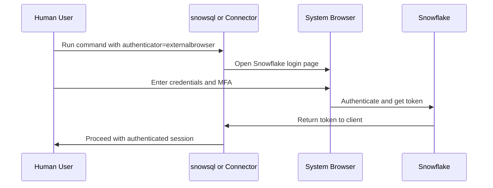

### Usage Examples

```bash
# With snowsql
snowsql -a myaccount -u analyst_jane --authenticator externalbrowser

# With Python connector
import snowflake.connector
conn = snowflake.connector.connect(
    user='analyst_jane',
    account='myaccount',
    authenticator='externalbrowser'
)
```

| Benefit | Why It Matters |
|---------|---------------|
| No password in config | Credentials entered interactively not stored |
| MFA support | Works with Snowflake native MFA |
| Simple setup | No IdP or key management required |
| Works with SSO | Can redirect to IdP if configured |

### When To Use External Browser

| Scenario | Use External Browser | Why |
|----------|---------------------|-----|
| Interactive CLI or notebook use | Yes | Simple secure login without config |
| Headless automation | No | Requires human interaction to authenticate |
| Users with MFA enabled | Yes | Supports MFA flow naturally |
| Quick testing or demos | Yes | Fast setup without complex config |
| Production scheduled jobs | No | Cannot run unattended |

## Monitoring and Auditing Authentication

### Query Login History

```sql
-- Find failed login attempts in last 24 hours
SELECT
  EVENT_TIMESTAMP,
  USER_NAME,
  CLIENT_IP,
  ERROR_MESSAGE,
  AUTHENTICATION_METHOD
FROM SNOWFLAKE.ACCOUNT_USAGE.LOGIN_HISTORY
WHERE SUCCESS = 'NO'
  AND EVENT_TIMESTAMP > DATEADD(hour, -24, CURRENT_TIMESTAMP)
ORDER BY EVENT_TIMESTAMP DESC;

-- Track MFA enrollment status
SELECT
  name as user_name,
  mfa_enrollment,
  last_success_login,
  disabled
FROM SNOWFLAKE.ACCOUNT_USAGE.USERS
WHERE mfa_enrollment IS NOT NULL;
```

### Key Metrics to Watch

| Metric | Where To Find | Alert Threshold |
|--------|--------------|-----------------|
| Failed login attempts | LOGIN_HISTORY | More than 5 failures per hour per user |
| MFA enrollment rate | USERS view | Less than 90 percent of interactive users |
| Unusual login locations | LOGIN_HISTORY CLIENT_IP | Logins from new countries or IP ranges |
| Service account login patterns | LOGIN_HISTORY filtered by user type | Logins outside expected schedule |
| Token refresh failures | Query history with OAuth errors | Spike in authentication errors |

## Common Pitfalls and Fixes

| Mistake | What Happens | How To Fix |
|---------|--------------|------------|
| Storing passwords in scripts | Credentials leak via version control or logs | Use key pair or OAuth for automation |
| Not rotating keys | Compromised key grants long term access | Set 90 day rotation schedule use RSA_PUBLIC_KEY_2 |
| Allowing MFA caching for admin roles | Stolen session token grants prolonged access | Set ALLOW_CLIENT_MFA_CACHING = FALSE for privileged roles |
| Using SMS MFA for sensitive accounts | SIM swap attacks bypass SMS | Require app based MFA like Duo or Google Authenticator |
| Not monitoring LOGIN_HISTORY | Breaches go undetected | Set up alerts for failed logins or unusual IPs |
| Configuring SSO without testing | Users locked out after cutover | Test with pilot group before full rollout |
| Forgetting token refresh in OAuth code | App stops working when token expires | Implement refresh token logic in authentication flow |

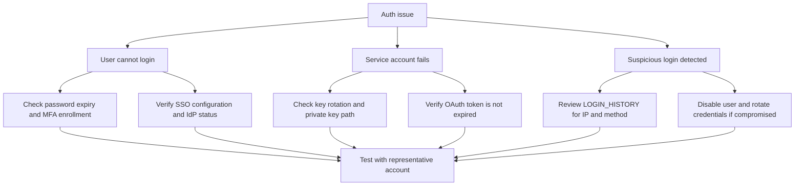

## Decision Framework

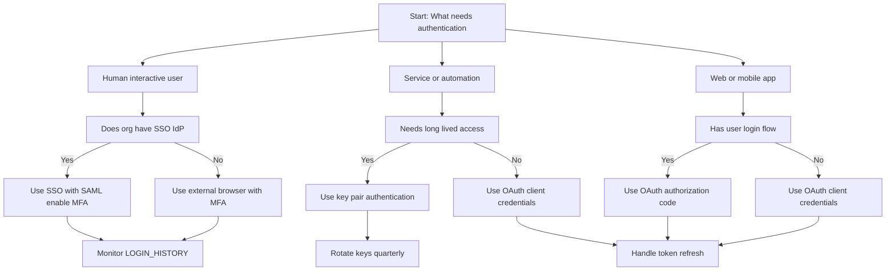

## Best Practices Summary

- Match auth method to user type. Humans need simple. Services need secure. Apps need standard
- Require MFA for all interactive users. App based MFA is more secure than SMS
- Use SSO for corporate users. Centralized identity reduces overhead and improves security
- Use key pair for service accounts. No passwords to manage keys can be rotated securely
- Use OAuth for apps. Standard protocol handles tokens and refresh automatically
- Rotate credentials regularly. Passwords every 90 days. Keys every 90 days. Tokens as designed
- Monitor authentication events. Detect brute force or unusual patterns early
- Restrict by network policy. Limit login sources to known trusted IPs
- Document authentication choices. Future you needs to know why a method was selected
- Test before rollout. Pilot with small group before full deployment

## Bottom Line

- Authentication is your first line of defense. Get it right or everything else is weaker
- MFA is not optional for interactive access. Stolen passwords are too common
- SSO simplifies login for corporate users. One identity many systems
- OAuth is the standard for apps. Handles tokens and refresh automatically
- Key pairs are best for automation. Secure scriptable rotatable
- Monitor and alert. You cannot fix what you do not see
- Rotate and review. Credentials age. Access patterns change

Think of authentication like keys to a building:
- Passwords are like simple keys. Easy to copy easy to lose
- MFA is like badge plus PIN. Two factors harder to fake
- SSO is like a master badge from your employer. One login many doors
- OAuth is like a temporary guest pass. Expires automatically
- Key pairs are like encrypted key cards. Secure and rotatable

Pick the right key for the right door. Simple keys for low risk areas. Badges and codes for sensitive rooms. Temporary passes for visitors. And always check who used which key and when. That is how authentication works in Snowflake.
