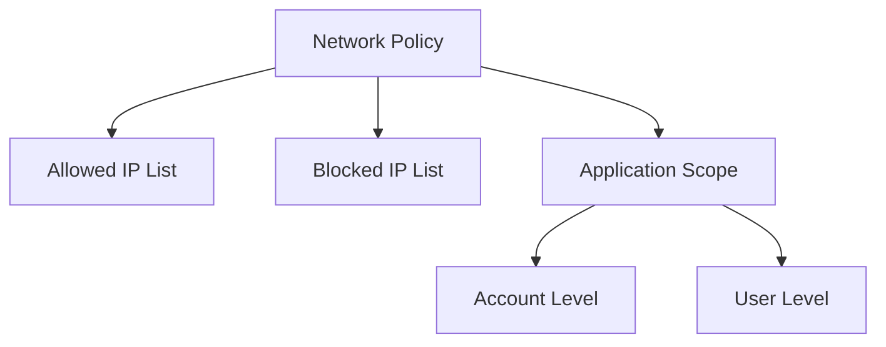
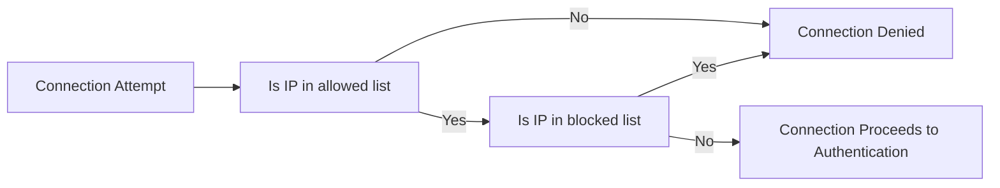
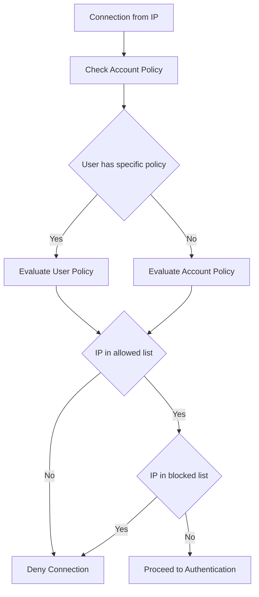
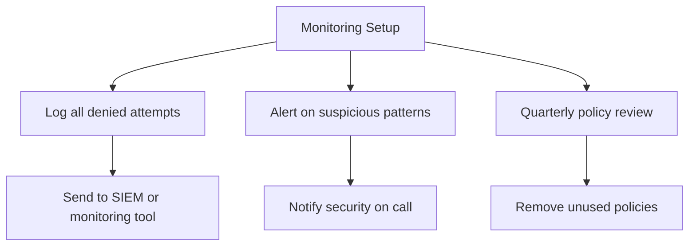
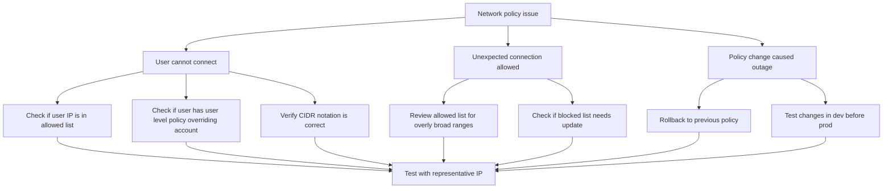
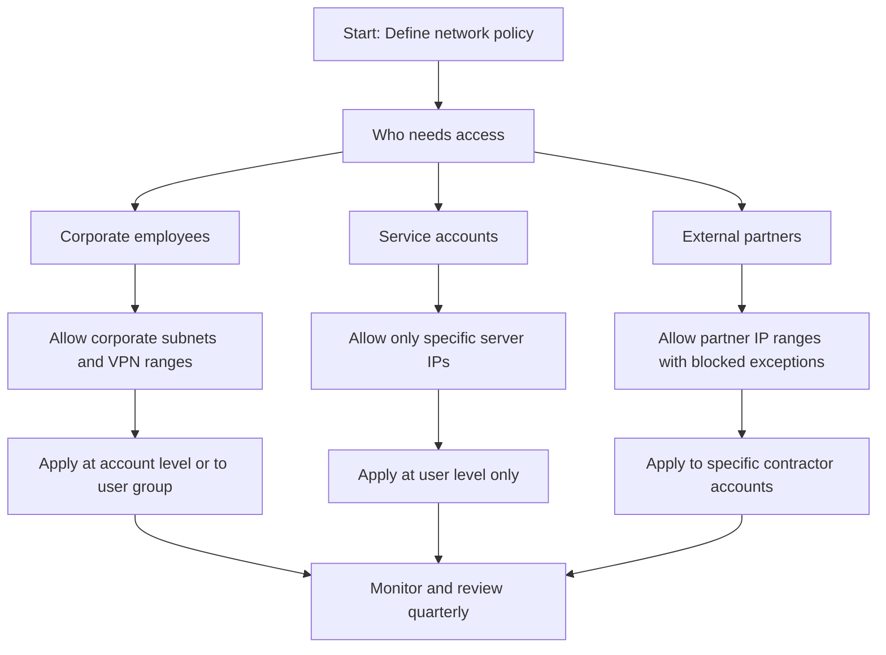
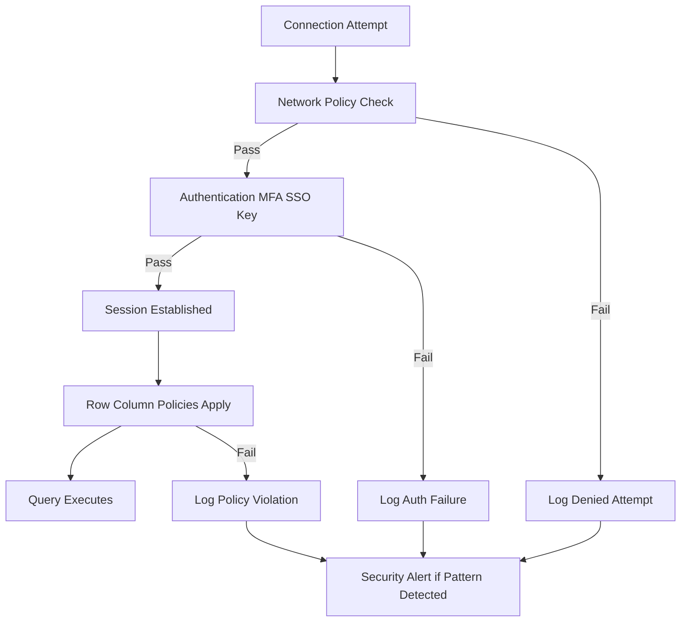
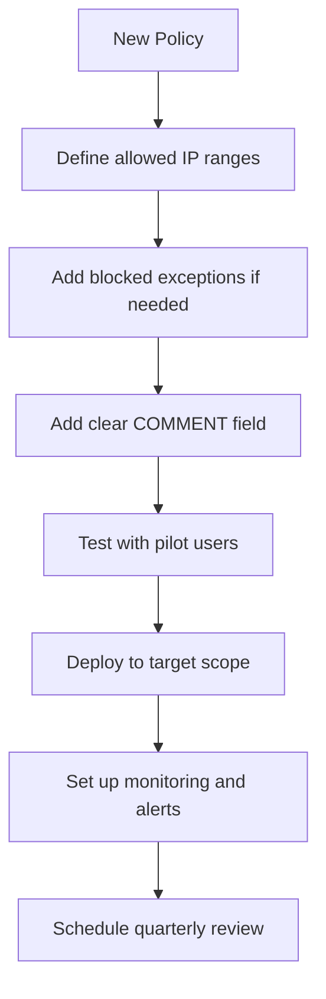

# Network Policies in Snowflake



## What Network Policies Do

| Concept | Simple Explanation |
|---------|------------------|
| Network policy | A rule that says which IP addresses can connect to Snowflake |
| Allowed IP list | IP ranges that are permitted to connect |
| Blocked IP list | IP ranges that are explicitly denied even if in allowed list |
| CIDR notation | Format for specifying IP ranges like 192.168.1.0/24 |
| Application scope | Whether policy applies to account or specific user |

- Network policies control where connections can originate from
- They do not control what users can do after they connect
- They are a perimeter control not a data access control
- Think of them like a bouncer at the door checking IDs before letting anyone in



## CIDR Notation Quick Reference

| CIDR Block | IP Range | Number of Addresses | Typical Use |
|-----------|----------|-------------------|-------------|
| 192.168.1.0/32 | Single IP 192.168.1.1 | 1 | Specific server or workstation |
| 192.168.1.0/24 | 192.168.1.0 to 192.168.1.255 | 256 | Office subnet or VPC subnet |
| 10.0.0.0/8 | 10.0.0.0 to 10.255.255.255 | 16 million | Entire corporate private network |
| 203.0.113.0/24 | 203.0.113.0 to 203.0.113.255 | 256 | Partner or vendor network |
| 0.0.0.0/0 | All IP addresses | Unlimited | Use only in blocked list to deny all |

- CIDR notation can be confusing. Test your ranges before deploying
- A /32 is one specific IP. A /24 is a typical subnet. A /8 is a huge range
- When in doubt start narrow and expand only if needed
- Use blocked list to make exceptions within allowed ranges

## Creating and Managing Network Policies

### Basic Policy Creation

```sql
-- Create policy allowing corporate network only
CREATE OR REPLACE NETWORK POLICY corporate_only
  ALLOWED_IP_LIST = ('192.168.1.0/24', '10.0.0.0/8')
  COMMENT = 'Allow connections from corporate networks only';

-- Apply to entire account
ALTER ACCOUNT SET NETWORK_POLICY = corporate_only;

-- Apply to specific user instead
ALTER USER etl_service SET NETWORK_POLICY = corporate_only;
```

### Policy with Blocked Exceptions

```sql
-- Allow broad range but block specific suspicious IPs
CREATE OR REPLACE NETWORK POLICY allow_with_exceptions
  ALLOWED_IP_LIST = ('203.0.113.0/24')
  BLOCKED_IP_LIST = ('203.0.113.50/32', '203.0.113.99/32')
  COMMENT = 'Allow partner network but block known bad actors';
```

### Multiple Policies for Different Users

```sql
-- Policy for corporate users
CREATE OR REPLACE NETWORK POLICY corporate_users
  ALLOWED_IP_LIST = ('192.168.0.0/16', '10.0.0.0/8');

-- Policy for ETL service accounts
CREATE OR REPLACE NETWORK POLICY etl_servers
  ALLOWED_IP_LIST = ('10.10.10.5/32', '10.10.10.6/32');

-- Apply policies to appropriate users
ALTER USER analyst_jane SET NETWORK_POLICY = corporate_users;
ALTER USER etl_service SET NETWORK_POLICY = etl_servers;
```

| Action | SQL Command | Effect |
|--------|------------|--------|
| Create policy | CREATE OR REPLACE NETWORK POLICY name | Defines new rule set |
| Apply to account | ALTER ACCOUNT SET NETWORK_POLICY = name | All users inherit this policy |
| Apply to user | ALTER USER name SET NETWORK_POLICY = policy | Overrides account policy for this user |
| Remove from user | ALTER USER name UNSET NETWORK_POLICY | User falls back to account policy |
| Delete policy | DROP NETWORK POLICY name | Removes policy entirely |

## How Policy Evaluation Works



| Rule | What Happens |
|------|-------------|
| User policy exists | User policy overrides account policy completely |
| IP not in allowed list | Connection denied immediately |
| IP in allowed and blocked | Blocked list wins connection denied |
| No policy set | Any IP can attempt connection subject to auth |
| Empty allowed list | No IPs allowed policy effectively blocks all |

## Common Policy Patterns

### Pattern: Corporate Only Access

```sql
-- Allow only known corporate networks
CREATE OR REPLACE NETWORK POLICY corporate_access
  ALLOWED_IP_LIST = (
    '192.168.1.0/24',    -- Office subnet 1
    '192.168.2.0/24',    -- Office subnet 2
    '10.0.0.0/8',        -- Corporate VPN range
    '203.0.113.100/32'   -- Approved partner IP
  )
  COMMENT = 'Restrict access to corporate and approved partner networks';

ALTER ACCOUNT SET NETWORK_POLICY = corporate_access;
```

| Use Case | Why This Pattern Works |
|----------|----------------------|
| Regulated data environment | Limits attack surface to known networks |
| Preventing credential misuse | Stolen credentials useless from outside network |
| Compliance requirements | Meets audit requirements for network controls |

### Pattern: Service Account Isolation

```sql
-- Restrict ETL service to specific server IPs
CREATE OR REPLACE NETWORK POLICY etl_isolation
  ALLOWED_IP_LIST = (
    '10.10.10.5/32',   -- Primary ETL server
    '10.10.10.6/32'    -- Backup ETL server
  )
  COMMENT = 'ETL service accounts can only connect from designated servers';

-- Apply only to service accounts not humans
ALTER USER etl_pipeline SET NETWORK_POLICY = etl_isolation;
ALTER USER data_loader SET NETWORK_POLICY = etl_isolation;
```

| Benefit | Implementation Detail |
|---------|---------------------|
| Prevents credential theft | Keys stolen from repo useless without server IP |
| Clear audit trail | Any login from unexpected IP triggers alert |
| Easy to revoke | Remove IP from list to cut off access instantly |

### Pattern: Contractor or Partner Access

```sql
-- Allow specific external partner with tight controls
CREATE OR REPLACE NETWORK POLICY partner_access
  ALLOWED_IP_LIST = ('198.51.100.0/24')
  BLOCKED_IP_LIST = ('198.51.100.200/32')  -- Known bad actor in partner range
  COMMENT = 'Partner access with exception for suspicious IP';

-- Apply only to contractor accounts
ALTER USER contractor_alice SET NETWORK_POLICY = partner_access;
ALTER USER contractor_bob SET NETWORK_POLICY = partner_access;
```

| Consideration | How To Handle |
|--------------|---------------|
| Partner changes IPs | Update policy and document change |
| Temporary access needed | Add expiration date in comment review quarterly |
| Multiple partners | Create separate policy per partner for clarity |

### Pattern: Development vs Production

```sql
-- Dev policy: more permissive for flexibility
CREATE OR REPLACE NETWORK POLICY dev_access
  ALLOWED_IP_LIST = ('192.168.0.0/16', '10.0.0.0/8', '172.16.0.0/12')
  COMMENT = 'Dev access from any private network';

-- Prod policy: strict and narrow
CREATE OR REPLACE NETWORK POLICY prod_access
  ALLOWED_IP_LIST = ('10.10.10.0/24', '203.0.113.50/32')
  COMMENT = 'Prod access from jump hosts and approved IPs only';

-- Apply based on user role not person
ALTER USER dev_analyst SET NETWORK_POLICY = dev_access;
ALTER USER prod_admin SET NETWORK_POLICY = prod_access;
```

| Environment | Policy Philosophy | Example Allowed Range |
|------------|------------------|---------------------|
| Development | Flexible for productivity | Broad private ranges |
| Testing | Moderate controls | Specific test subnets |
| Production | Strict for security | Jump hosts and approved IPs only |
| Disaster Recovery | Same as production | Replicate prod policy |

## Monitoring and Auditing Network Policy Activity

### Query Connection Attempts

```sql
-- Find denied connection attempts in last 24 hours
SELECT
  EVENT_TIMESTAMP,
  USER_NAME,
  CLIENT_IP,
  ERROR_MESSAGE,
  REPORTED_CLIENT_TYPE
FROM SNOWFLAKE.ACCOUNT_USAGE.LOGIN_HISTORY
WHERE SUCCESS = 'NO'
  AND ERROR_MESSAGE LIKE '%network policy%'
  AND EVENT_TIMESTAMP > DATEADD(hour, -24, CURRENT_TIMESTAMP)
ORDER BY EVENT_TIMESTAMP DESC;

-- List all network policies and their assignments
SELECT
  p.name as policy_name,
  p.allowed_ip_list,
  p.blocked_ip_list,
  p.comment,
  u.name as assigned_user
FROM SNOWFLAKE.ACCOUNT_USAGE.NETWORK_POLICIES p
LEFT JOIN SNOWFLAKE.ACCOUNT_USAGE.USERS u
  ON p.name = u.network_policy
WHERE p.deleted_on IS NULL;
```

### Key Metrics to Track

| Metric | Where To Find | Alert Threshold |
|--------|--------------|-----------------|
| Denied connection attempts | LOGIN_HISTORY with network policy errors | More than 10 per hour from same IP |
| Policy changes | ACCOUNT_USAGE query history for ALTER statements | Any change outside change window |
| Users without policies | USERS view where NETWORK_POLICY is null | Interactive users in prod without policy |
| Overly broad policies | NETWORK_POLICIES view with large CIDR blocks | Any policy with /8 or 0.0.0.0/0 in allowed list |
| Stale policies | Policies not referenced by any user or account | Policies unused for 90 days |



## Common Pitfalls and How To Avoid Them

| Mistake | What Happens | How To Fix |
|---------|--------------|------------|
| Setting policy before testing | Legitimate users locked out | Test with pilot group before account wide rollout |
| Using 0.0.0.0/0 in allowed list | Policy does nothing allows everything | Remove or move to blocked list if intent is to deny all |
| Forgetting blocked list precedence | Thinking allowed list overrides blocked | Remember blocked list always wins test with edge cases |
| Applying account policy to service accounts | Service accounts inherit overly broad rules | Assign specific narrow policies to service accounts |
| Not documenting policy purpose | Future admin cannot understand why policy exists | Add clear COMMENT field with business justification |
| Allowing dynamic IPs without planning | Remote workers cannot connect from home | Include VPN range or use Zscaler or similar for dynamic IPs |
| Not reviewing policies quarterly | Stale IPs remain allowed creating risk | Schedule quarterly review task to audit policy assignments |



## Best Practices for Network Policy Management

- Start narrow and expand only if needed. It is easier to add IPs than to remove access after a breach
- Test policies before deploying. Use a pilot group to verify legitimate users can connect
- Document every policy. Add COMMENT with business justification and owner
- Separate policies by use case. Corporate users service accounts and partners need different rules
- Review quarterly. IP ranges change. People change roles. Policies should too
- Monitor denied attempts. Set up alerts for repeated failures from same IP
- Use blocked list for exceptions. Allow broad range then block specific bad actors
- Automate policy updates. Use infrastructure as code to manage policy definitions
- Train your team. Make sure admins understand CIDR notation and policy evaluation order
- Plan for remote work. Include VPN ranges or use zero trust network access solutions

```sql
-- Example: Well documented policy with review date
CREATE OR REPLACE NETWORK POLICY finance_team_access
  ALLOWED_IP_LIST = (
    '192.168.10.0/24',   -- Finance office subnet
    '10.20.0.0/16'        -- Finance VPN range
  )
  BLOCKED_IP_LIST = ()
  COMMENT = 'Finance team access. Owner: security_team. Review date: 2024-06-01. Purpose: Restrict finance data access to approved networks per SOX requirements';
```

## Decision Framework for Network Policy Design



| Question | If Yes | If No |
|----------|--------|-------|
| Is this for interactive users | Allow broader ranges like /24 or /16 | Use narrow /32 for specific servers |
| Is this for automation | Restrict to known server IPs only | Consider broader ranges for flexibility |
| Do IPs change frequently | Include VPN range or use ZTNA solution | Static IPs can use /32 notation |
| Is data highly sensitive | Use narrow allowed list with blocked exceptions | Standard policy may be sufficient |
| Is this temporary access | Add expiration in comment schedule review | Permanent access follows standard process |

## Integration with Other Security Controls

| Control | How It Works With Network Policies | Combined Benefit |
|---------|-----------------------------------|-----------------|
| MFA | Network policy controls where MFA can be attempted | Defense in depth: wrong location or wrong credentials both fail |
| Key pair auth | Network policy restricts where keys can be used | Stolen keys useless without correct source IP |
| SSO | Network policy limits where IdP redirects can originate | Prevents phishing from unauthorized networks |
| Resource monitors | Network policy controls access resource monitor controls spend | Limits both who can connect and what they can cost |
| Row access policies | Network policy controls connection row policy controls data | Perimeter and data level controls together |



## Quick Reference: Policy Configuration Checklist



| Step | Command or Action | Verification |
|------|------------------|--------------|
| Define allowed IPs | List CIDR blocks in ALLOWED_IP_LIST | Confirm ranges match actual network topology |
| Add blocked exceptions | List specific IPs in BLOCKED_IP_LIST | Test that blocked IPs cannot connect |
| Document purpose | Add COMMENT with owner and review date | Ensure comment is searchable and clear |
| Test before deploy | Apply to pilot user first | Verify legitimate users can connect |
| Deploy to scope | ALTER ACCOUNT or ALTER USER | Confirm policy is active for target users |
| Monitor activity | Query LOGIN_HISTORY for denied attempts | Set up alert for suspicious patterns |
| Schedule review | Add calendar reminder or TASK | Ensure policy is reviewed before expiration |

## Key Principles to Remember

- Network policies control where not what. They restrict connection sources not data access
- Blocked list always wins. An IP in both allowed and blocked will be denied
- User policy overrides account policy. A user with specific policy ignores account settings
- CIDR notation matters. Test your ranges before deploying to avoid accidental lockouts
- Document everything. Future you needs to know why a policy exists and who owns it
- Review regularly. IP ranges change. People change roles. Policies should too
- Monitor denied attempts. Repeated failures from same IP may indicate attack
- Start narrow. It is easier to add access than to remove it after a breach

## Bottom Line

- Network policies are your perimeter control. They decide who can knock on the door
- They work best when combined with other controls like MFA and key pair auth
- Start with narrow allowed lists. Expand only when legitimate users cannot connect
- Document and review. Policies without owners become security debt
- Monitor and alert. You cannot fix what you do not see
- Test before deploying. Pilot groups catch issues before they affect everyone

Think of network policies like a guest list at an event:
- The allowed list is your invitation list. Only these people can approach the door
- The blocked list is your do not admit list. Even with an invitation these people are turned away
- The bouncer checks both lists before letting anyone in
- Once inside authentication decides if they are who they claim to be
- And once authenticated data policies decide what they can see or do

Build your guest list carefully. Invite only who you need. Block who you must. And always check who tried to get in and when. That is how network policies work in Snowflake.
